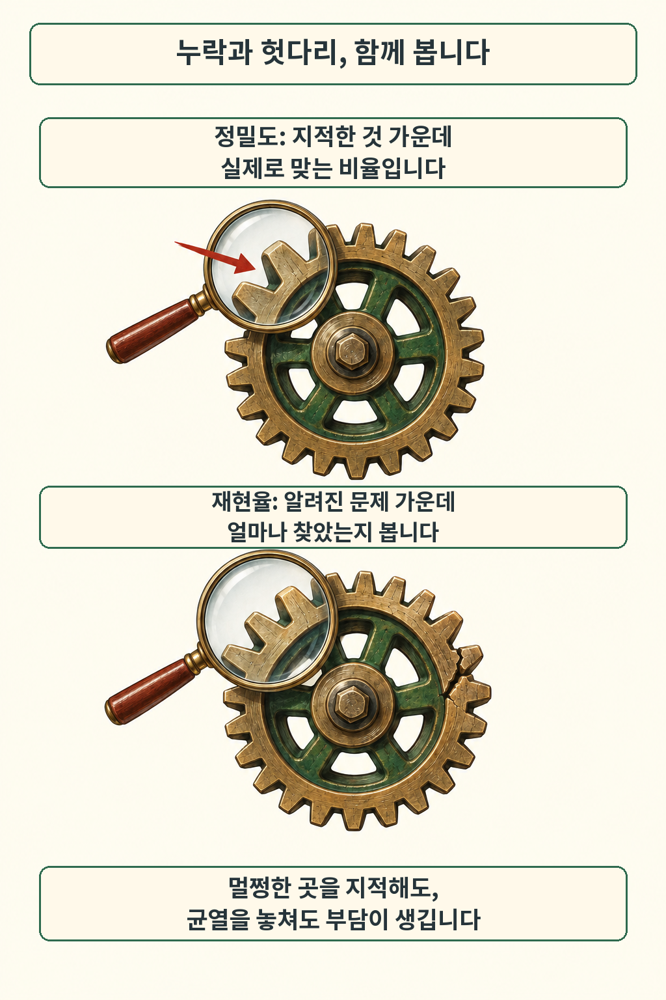
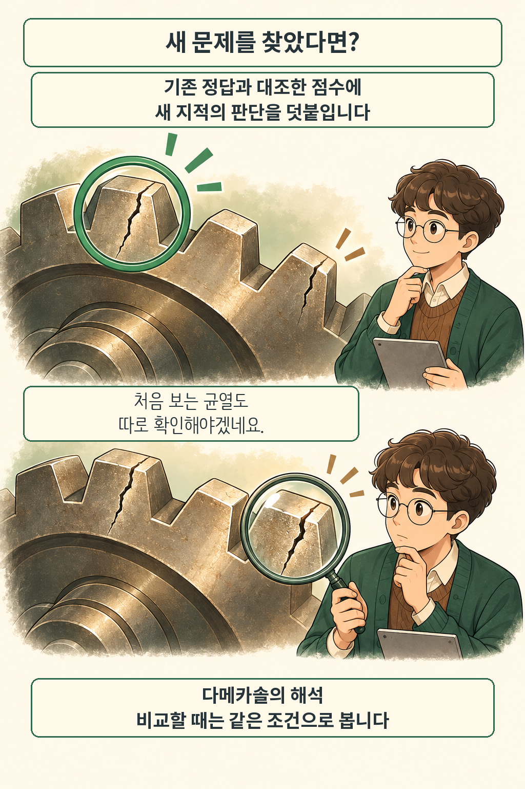

글·해설: 다메카솔

발행·확인: 2026-10-06

**GitHub은 2026년 10월 5일 AI 코드 리뷰 평가용 ReviewBench를 연구 프리뷰로 공개했다고 발표했습니다.** 정밀도와 재현율을 함께 보고, 기존 정답에 없던 새 지적도 별도로 판단하는 벤치마크입니다. [GitHub 공식 발표](https://github.blog/ai-and-ml/github-copilot/reviewbench-an-open-benchmark-for-ai-code-review/)

## 멀쩡한 톱니를 지적하고, 균열은 놓친다면

그림 위쪽에서는 멀쩡한 톱니를 의심하고, 아래쪽에서는 시야 밖의 균열을 놓칩니다. 두 실수의 비용은 다릅니다. 앞의 실수는 확인하는 사람의 시간을 쓰게 하고, 뒤의 실수는 고칠 문제를 남겨 둡니다. 톱니는 설명용 비유이며 실제 평가 문제나 측정 비율을 그린 것은 아닙니다.

정밀도는 지적한 것 중 맞는 비율, 재현율은 알려진 문제 중 찾은 비율입니다. GitHub은 실제 PR 분포를 참고한 공개 PR 219개에 사람·모델·정적 분석이 찾은 지적을 모으고, 중복을 합쳐 공통 기준으로 판단했다고 설명합니다. [구성 방법](https://github.blog/ai-and-ml/github-copilot/reviewbench-an-open-benchmark-for-ai-code-review/)

리뷰 댓글이 많아졌다는 정보만으로는 어느 쪽이 나아졌는지 알기 어렵습니다. 저는 평가 결과를 읽을 때 먼저 무엇을 정답으로 인정했는지, 놓친 문제는 무엇인지부터 보겠습니다. 리뷰 요청 경로를 연결하는 작업은 [Copilot 코드 리뷰 API 안내](/posts/github-copilot-review-api-balanced/)에서 따로 다뤘습니다.

## 정답 목록에도 없던 균열을 찾았다면

새 지적은 한 번 더 판단합니다. ReviewBench의 Grounded 지표는 기존 정답 집합과 대조하고, Augmented 지표는 일치하지 않는 지적도 심사합니다. GitHub은 새 발견에 따라 Augmented 재현율의 분모가 에이전트마다 달라져, 시스템 간 대표 비교에는 Grounded 재현율을 쓴다고 설명합니다. [지표의 차이](https://github.blog/ai-and-ml/github-copilot/reviewbench-an-open-benchmark-for-ai-code-review/)

그림에서는 이미 표시한 균열 옆에 다른 균열이 보입니다. 검사자는 새 자국이 실제 결함인지 살펴야 합니다. 기존 표시와 다르다는 이유만으로 버리거나, 새로 찾았다는 이유만으로 인정하면 비교가 흔들리기 때문입니다. 코드 리뷰에서도 평가 기준을 함께 읽어야 할 이유를 보여 주는 장면입니다.

## 다메카솔의 해석: 점수 옆에 비교 조건을 둡니다

저는 리뷰 도구를 비교할 때 같은 문제 집합과 같은 판단 기준을 먼저 맞추겠습니다. 그 위에서 중요한 결함의 누락과 불필요한 지적에 드는 확인 시간을 함께 보려 합니다. 어떤 실수가 더 부담스러운지는 팀의 코드와 검토 방식에 달려 있습니다.

이번 글은 GitHub 발표를 읽고 평가 방식을 해설한 글입니다. 직접 벤치마크를 실행하거나 도구 순위를 재현하지 않았습니다. 실제 검토 과정의 대기 시간은 [PR 리뷰 단계별 지표](/posts/github-copilot-pr-review-stage-metrics/)처럼 별도의 관찰도 필요합니다. 제가 이 발표에서 주목한 부분은 새 결함을 발견할 여지를 남기면서도 비교 기준을 분리했다는 점입니다.

## 출처

- [GitHub, ReviewBench 공개 발표 — 2026-10-05](https://github.blog/ai-and-ml/github-copilot/reviewbench-an-open-benchmark-for-ai-code-review/)
- [발표에서 연결한 ReviewBench 사이트](https://review-bench.ai/) — 공개 상태와 기능 설명은 GitHub 발표 기준입니다.

이 글의 본문과 이미지는 생성형 AI로 제작했습니다. 기획과 편집 기준은 다메카솔이 정했습니다.
