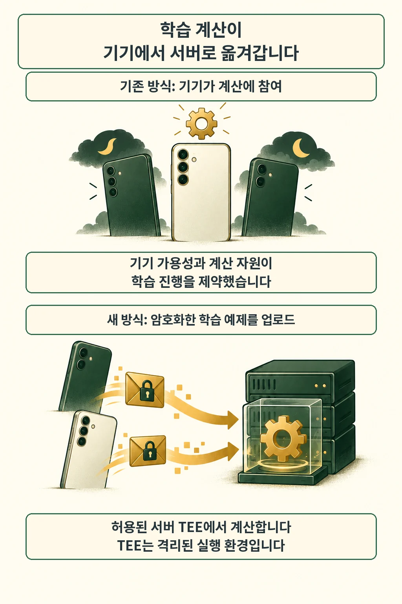

글·해설: 다메카솔

발행·확인: 2026-10-03

Google은 2026년 10월 2일 **서버의 격리된 실행 환경에서 학습하는 새 연합학습 구조**를 공개했습니다. 영어·일본어 다음 단어 예측 모델을 Gboard에 적용했다는 발표입니다. 기기가 암호화한 학습 예제를 서버로 보내므로, 이번 소식에서 살펴볼 지점은 데이터가 이동한 뒤의 접근 통제입니다. [Google 공식 발표](https://research.google/blog/toward-provably-private-learning-from-federated-data/)

## 기기가 켜져 있을 때만 계산하던 제약을 줄입니다

연구진은 기존 방식에서 기기 가용성과 계산 자원이 학습 진행에 제약을 주었다고 설명합니다. 새 구조에서는 먼저 데이터를 모은 뒤 서버 자원을 활용해 계산할 수 있습니다. 논문 저자들은 참여 기기의 범위와 학습 속도·정확도가 개선됐다고 보고했습니다. 이 글은 해당 결과를 직접 재현하지 않았으며, 모든 모델에서 같은 개선이 난다고 확장하지 않습니다. [논문 v4 초록](https://arxiv.org/abs/2609.31494v4)

달라진 데이터 경로도 함께 봐야 합니다. 기기는 **학습 예제 자체를 암호화해서 업로드**하고, 접근 정책으로 처리 가능한 프로그램을 묶습니다. 서버에서 계산한다는 이점과 그 계산을 누가 어떤 조건으로 수행하는지는 별도의 설계 문제입니다.

## 복호화 키를 받는 코드에 조건을 겁니다

키 관리 서비스인 KMS는 요청한 실행 환경의 증거가 접근 정책에 맞을 때 키를 건넵니다. 여기서 TEE는 서버 운영 환경과 구분되는 격리된 실행 영역이고, 원격 증명은 그 안에서 실행하는 코드를 확인하는 수단입니다. 공개 CFC 저장소는 데이터를 허용된 처리 경로에 결합하는 설계를 설명합니다. [구현 설명](https://github.com/google-parfait/confidential-federated-compute)

각 장치는 다른 지점을 보호합니다.

| 장치 | 이 구조에서 맡는 역할 |
| --- | --- |
| 암호화와 접근 정책 | 업로드한 데이터를 허용된 처리와 연결 |
| TEE와 원격 증명 | 실행 환경과 코드를 확인한 뒤 키 전달 |
| 차등 프라이버시 | 공개 모델에 개인 데이터가 미치는 영향을 정해진 조건 아래 제한 |

Google 설명에 따르면 운영자는 지표와 차등 프라이버시를 적용한 모델 가중치를 봅니다. 공개 투명성 로그로 허용 작업을 살펴보고, 공개된 구성 요소의 재현 가능한 빌드로 코드와 실행 바이너리의 연결을 확인하는 경로도 마련했습니다. 검증에 필요한 자료를 공개했다는 설명과 누군가 실제 감사를 끝냈다는 사실은 구분해야 합니다.

## 적용된 범위와 남은 한계

현재 적용 사례는 Google이 발표한 Gboard 다음 단어 예측 모델입니다. CFC 코드는 공개돼 있지만 저장소에는 공식 지원 Google 제품이 아니라는 설명이 있습니다. 이를 곧바로 사용할 수 있는 상용 학습 서비스로 소개할 근거는 부족합니다.

보호 수준에는 현 세대 TEE의 가정과 부채널 한계가 남습니다. 부채널은 실행 시간이나 자원 사용처럼 본래 출력 밖의 관찰을 통해 정보를 추측하는 경로입니다. Google도 더 강한 하드웨어 보호와 소프트웨어의 완전한 정확성 증명을 향후 방향으로 제시했습니다. 제목의 ‘검증’은 이 조건을 포함한 보장 범위로 읽어야 합니다. [현재 한계와 향후 연구](https://research.google/blog/toward-provably-private-learning-from-federated-data/)

## 다메카솔의 해석: 데이터 경로와 검증 경로를 함께 봅니다

저는 이번 변화에서 계산 위치와 검증 책임을 함께 옮겼다는 점에 주목합니다. 백엔드 설계 검토에서도 저장 시 암호화만 확인하면 처리 중의 접근 권한이 빠지기 쉽습니다. 키를 받을 수 있는 코드와 외부로 공개되는 결과까지 따라가야 데이터 처리의 경계가 드러납니다.

운영 비용도 그 경계와 연결됩니다. 허용 코드를 바꾸면 접근 정책과 검증 자료가 함께 바뀌어야 하므로, 배포 검토에 코드·정책·실행 증거의 대응 관계를 포함하는 편이 좋겠습니다. 이는 공개 설계에서 도출한 제 해석이며, 이 시스템을 직접 배포하거나 보안 감사를 수행한 경험에 근거한 평가는 아닙니다.

서버 자원을 활용하면서도 외부에서 처리 조건을 확인할 길을 남긴다는 방향은 의미가 있습니다. 그 가치를 판단할 기준은 ‘서버로 보냈다’는 사실 하나보다 **누가 무엇을 열어 보고, 어떤 결과만 내보내며, 그 조건을 어떻게 확인하는가**에 있다고 봅니다.

## 출처

- [Google Research 발표, 2026-10-02](https://research.google/blog/toward-provably-private-learning-from-federated-data/)
- [연구진 논문 v4, 2026-09-30](https://arxiv.org/abs/2609.31494v4)
- [Google Confidential Federated Compute 공개 코드와 설명](https://github.com/google-parfait/confidential-federated-compute)

세 자료는 Google 연구·구현 계열의 1차 자료입니다. 독립 기관의 성능 검증으로 제시하지 않습니다.

이 글의 본문과 이미지는 생성형 AI로 제작했습니다. 기획과 편집 기준은 다메카솔이 정했습니다.
