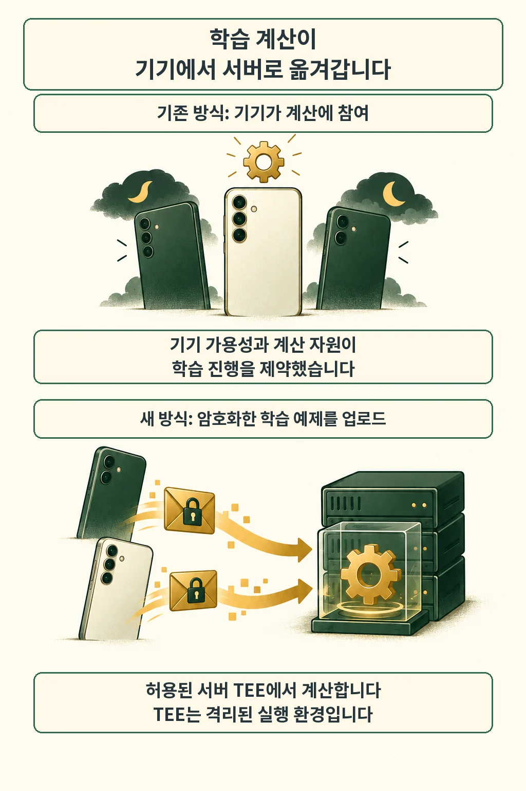

글·해설: 다메카솔

발행·확인: 2026-10-03

Google은 2026년 10월 2일 **서버의 격리된 실행 환경(TEE)에서 학습을 수행하는 새로운 연합학습 구조**를 공개하고, 이를 Gboard의 영어·일본어 다음 단어 예측 모델에 적용했다고 발표했습니다. 사용자 기기가 암호화한 학습 예제를 서버로 보내 처리하는 방식이라, 데이터가 이동한 뒤의 접근 통제와 검증 경로가 어떻게 설계됐는지가 핵심입니다. ([Google 공식 발표](https://research.google/blog/toward-provably-private-learning-from-federated-data/))

## 기기가 켜져 있을 때만 계산하던 제약을 줄입니다

기존 온디바이스 연합학습에서는 사용자 스마트폰이 충전 중이거나 유휴 상태일 때만 기기 안에서 계산을 수행할 수 있어, 참여 기기 범위와 학습 속도에 제약이 따랐습니다. 새 구조에서는 기기가 **학습 예제 자체를 암호화해 업로드**하고, 서버 자원을 활용해 대규모 계산을 진행합니다. 논문 저자들은 이를 통해 참여 기기 범위와 학습 속도·정확도가 개선됐다고 보고했습니다. ([논문 v4 초록](https://arxiv.org/abs/2609.31494v4))

물론 계산 위치가 기기에서 서버로 옮겨간 만큼, 서버 운영자를 포함한 그 누구도 개별 원본 데이터를 임의로 열어 볼 수 없도록 강제하는 장치가 함께 따라붙어야 합니다.

## 복호화 키를 받는 코드에 조건을 겁니다

기기가 데이터를 업로드할 때는 어떤 프로그램만 이 데이터를 처리할 수 있는지 정의한 접근 정책을 함께 묶습니다. 키 관리 서비스(KMS)는 요청을 보낸 서버의 격리 실행 영역(TEE)과 그 안에서 돌아가는 코드의 원격 증명(remote attestation) 증거가 접근 정책과 일치할 때만 복호화 키를 내어줍니다. ([구현 설명](https://github.com/google-parfait/confidential-federated-compute))

| 보호 장치 | 이 구조에서 맡는 역할 |
| --- | --- |
| 암호화와 접근 정책 | 기기가 업로드한 데이터를 사전에 허용된 처리 파이프라인과 결합 |
| TEE와 원격 증명 | 격리된 실행 환경과 실행 바이너리를 검증한 뒤에만 복호화 키 전달 |
| 차등 프라이버시 | 외부로 나오는 모델 가중치에 개별 사용자 데이터가 미치는 영향을 제한 |

Google의 설명에 따르면 서버 운영자도 격리 영역 바깥에서는 집계 지표와 차등 프라이버시가 적용된 모델 가중치만 볼 수 있습니다. 또한 공개 투명성 로그(transparency log)와 오픈소스 구성 요소의 재현 가능한 빌드를 통해, 공개된 소스 코드와 실제로 실행된 바이너리가 일치하는지 외부에서 대조할 수 있는 경로를 마련했습니다.

## 적용 범위와 남아 있는 한계

현재 발표된 상용 적용 사례는 Gboard의 영어·일본어 다음 단어 예측 모델입니다. 기반이 되는 Confidential Federated Compute(CFC) 코드가 저장소에 공개돼 있지만, 공식 지원되는 범용 클라우드 상품이 아니라는 안내가 붙어 있어 누구나 즉시 가져다 쓰는 관리형 서비스와는 구분해야 합니다.

보안 가정에도 경계가 있습니다. 이 구조의 기밀성은 현 세대 하드웨어 TEE의 신뢰 가정에 의존하며, 실행 시간이나 메모리 접근 패턴 등 본래 출력 바깥의 신호로 정보를 추측하는 부채널(side-channel) 공격 한계가 남아 있습니다. Google 역시 더 강력한 하드웨어 보호와 소프트웨어의 형식적 정확성 증명을 향후 과제로 제시했으므로, ‘검증 가능한 프라이버시’라는 표현도 이러한 가정과 증명 범위 안에서 읽어야 합니다. ([현재 한계와 향후 연구](https://research.google/blog/toward-provably-private-learning-from-federated-data/))

## 다메카솔의 해석: 데이터 경로와 검증 경로를 함께 봅니다

이번 아키텍처에서 눈여겨볼 부분은 **계산 위치를 서버로 옮기면서 검증의 단위도 ‘저장 시 암호화 여부’에서 ‘실행 중인 코드와 출력 조건’으로 옮겼다**는 점입니다. 백엔드 시스템을 설계할 때도 데이터베이스 암호화만 확인하고 애플리케이션 메모리에 복호화된 뒤의 처리 경로를 놓치기 쉬운데, 어떤 바이너리만 키를 받을 수 있고 어떤 집계 결과만 격리 영역 밖으로 나갈 수 있는지까지 묶어야 데이터 경계가 완성됩니다.

운영 관점에서는 허용된 처리 코드를 업데이트할 때마다 접근 정책과 재현 빌드 해시, 원격 증명 기준값이 함께 맞물려 돌아가야 하므로 배포 파이프라인의 관리 복잡도도 함께 고려해야 합니다. 단순히 “서버로 데이터를 보냈다”는 사실 하나보다, **누가 복호화 키를 받을 수 있고 외부에서 그 실행 증거를 어떻게 대조할 수 있는가**가 아키텍처 신뢰도를 가르는 기준이 됩니다.

## 출처

- [Google Research 발표, 2026-10-02](https://research.google/blog/toward-provably-private-learning-from-federated-data/)
- [연구진 논문 v4, 2026-09-30](https://arxiv.org/abs/2609.31494v4)
- [Google Confidential Federated Compute 공개 코드와 설명](https://github.com/google-parfait/confidential-federated-compute)

세 자료 모두 Google 연구·구현 팀의 1차 자료이며, 이 글에서 별도의 재현 실험이나 독립 보안 감사를 수행하지는 않았습니다. 이 글의 본문과 이미지는 생성형 AI로 제작했습니다. 기획과 편집 기준은 다메카솔이 정했습니다.
