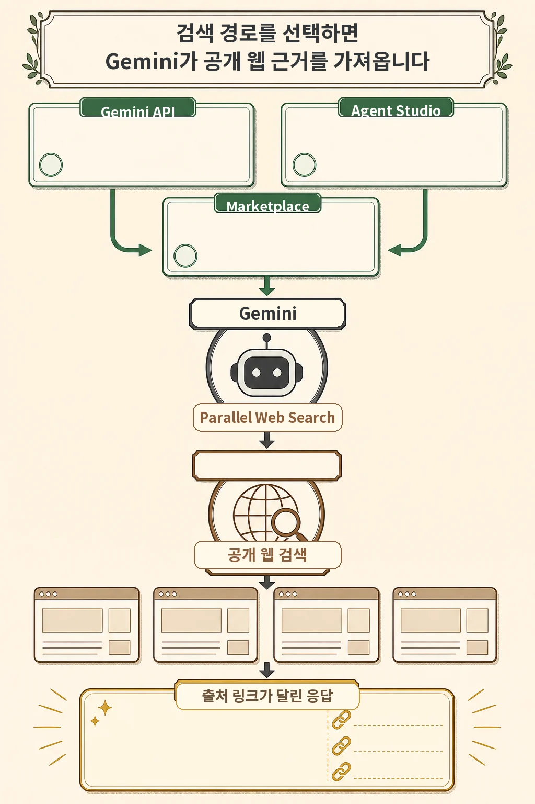
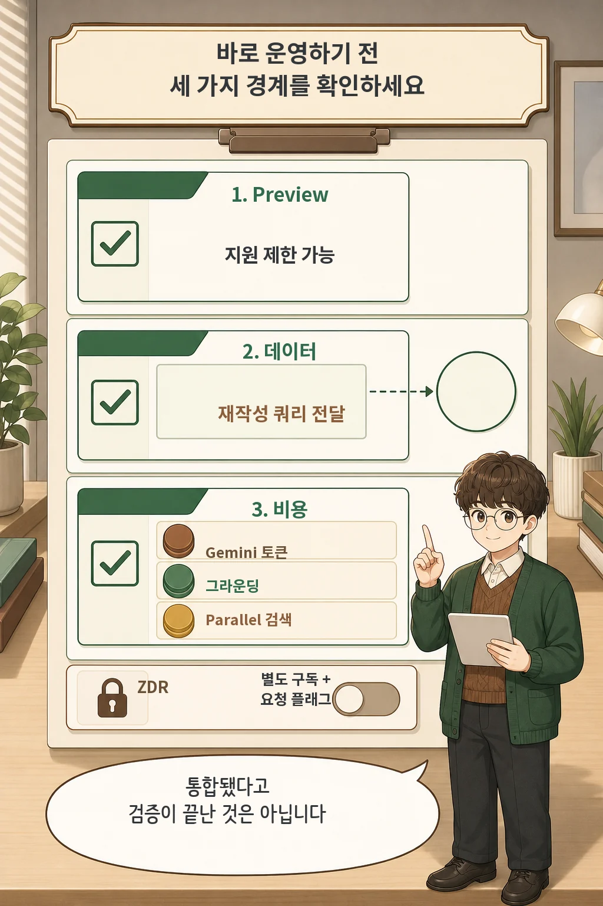

에이전트가 최신 웹 정보를 찾도록 외부 검색 API를 붙이는 일은 검색 품질뿐 아니라 계약, 데이터 전달, 비용까지 함께 설계해야 하는 작업입니다. Google은 2026년 7월 16일 **Parallel Web Search를 Gemini Enterprise Agent Platform의 네이티브 웹 그라운딩 옵션으로 추가**했습니다. 다만 현재 상태는 Preview이며, 운영 전에는 데이터와 과금 조건을 따로 확인해야 합니다.

글·해설: 다메카솔

## 핵심 내용

- Gemini API에서 호출하고 Agent Studio에서 선택할 수 있으며 Google Cloud Marketplace를 통해 구독할 수 있습니다.
- 검색 결과는 공개 웹 근거와 원문 출처 링크를 응답에 연결하는 데 쓰입니다.
- 현재 Preview이자 별도 제공 상품입니다.
- 파생·재작성된 검색 쿼리가 Parallel로 전달될 수 있고, ZDR은 전용 구독과 요청 설정이 필요합니다.
- Gemini 토큰, 그라운딩, Parallel 검색 API가 각각 비용 요소가 될 수 있습니다.

이번 변화의 핵심은 Gemini 모델 자체가 바뀐 것이 아니라, 에이전트가 참고할 **웹 검색 제공자 선택지가 늘어난 것**입니다.

## Gemini API·Agent Studio·Marketplace에서 연결한다

Google의 발표와 공식 문서에 따르면 이용 경로는 두 가지입니다. Google Cloud Marketplace에서 Grounding with Parallel Web Search를 구독하거나, 기존 Parallel API 키를 REST 요청에 넣을 수 있습니다. 기능은 Gemini API에서 호출할 수 있고 Agent Studio의 파트너 그라운딩 메뉴에서도 선택할 수 있습니다.

Parallel Web Search는 공개 웹 데이터를 검색해 Gemini 응답에 출처 인용 정보를 붙이는 역할을 합니다. Google은 이를 통해 더 최신이고 검증 가능한 응답을 만들 수 있다고 설명합니다. 이 표현은 제품 제공자의 설명입니다. 검색이 연결됐다고 해서 모든 답변의 사실성이 자동 보장되는 것은 아니므로, 실제 서비스에서는 반환된 출처와 인용 범위를 다시 확인해야 합니다.

Google은 발표에서 검색 결과를 프로그램으로 추출·캐시하고, 내부 데이터셋을 보강하거나 다른 LLM으로 후처리할 수 있다는 점도 강조합니다. 이는 단일 채팅 기능보다 데이터 파이프라인과 멀티 에이전트 구조에 가까운 활용 범위를 뜻합니다.

## Preview, 데이터 전달, 비용은 별도 확인이 필요하다

공식 문서에서 이 기능은 **Preview**이자 Google Cloud 계약상 **Separate Offering**으로 분류됩니다. Pre-GA 기능은 제한된 지원이 적용될 수 있으므로, 핵심 운영 경로에 넣기 전에 작은 트래픽으로 실패 조건과 대체 경로를 확인하는 편이 안전합니다.

데이터 처리 경계도 중요합니다. Google Cloud 문서는 원래 사용자 프롬프트에서 파생되거나 재작성된 쿼리 같은 일부 데이터가 검색 처리를 위해 Parallel Web Search로 전달된다고 명시합니다. 민감한 업무라면 어떤 입력이 검색 쿼리로 바뀌는지, 해당 데이터가 외부 검색에 전달되어도 되는지 먼저 분류해야 합니다.

Zero Data Retention은 기본값이 아닙니다. 공식 문서 기준으로 ZDR 전용 Marketplace 상품을 구독하고 API 요청에서 `enable_zero_data_retention`을 `true`로 설정해야 합니다. 자체 Parallel API 키를 쓰는 방식과 Marketplace 구독 방식은 약관과 청구 경로도 다릅니다.

비용은 한 줄로 끝나지 않습니다. 공식 문서는 다음 항목에 비용이 발생할 수 있다고 안내합니다.

1. Gemini 프롬프트·추론·출력 토큰
2. Gemini의 데이터 그라운딩
3. Parallel Web Search API

정확한 금액은 선택한 Gemini 모델, Marketplace 상품 또는 Parallel 계약, 요청 규모에 따라 달라질 수 있으므로 실제 가격표를 기준으로 계산해야 합니다.

## 2026년 7월 17일 확인한 지원 모델

공식 문서가 현재 열거하는 지원 모델은 다음과 같습니다.

- Gemini 2.5 Flash
- Gemini 2.5 Flash-Lite
- Gemini 2.5 Pro
- Gemini 3.1 Pro Preview
- Gemini 3.1 Flash Lite
- Gemini 3.5 Flash

지원 목록은 Preview 기간에 바뀔 수 있습니다. 구현 시 모델 ID를 코드에 고정하기 전에 최신 공식 문서를 다시 확인하세요.

## 다메카솔의 해석: 연결보다 검증 절차가 먼저다

네이티브 통합은 에이전트가 웹 근거를 얻는 연결 단계를 줄여 줍니다. 하지만 운영 적합성까지 자동으로 해결하지는 않습니다. 최소한 다음 다섯 항목을 작은 테스트에서 확인하는 것이 좋습니다.

- 선택한 Gemini 모델이 현재 지원되는가
- 어떤 입력이 검색 쿼리로 바뀌어 외부로 전달되는가
- ZDR이 필요한 데이터인가
- 토큰·그라운딩·검색 API 비용을 합산했는가
- 인용 링크가 실제 주장과 맞는지 검증하는가

## 출처

- [Google Developers Blog — Expanding Choice in Gemini Enterprise Agent Platform: Introducing Grounding with Parallel Web Search](https://developers.googleblog.com/en/expanding-choice-in-gemini-enterprise-agent-platform-introducing-grounding-with-parallel-web-search/)
- [Google Cloud Documentation — Grounding with Parallel Web Search](https://docs.cloud.google.com/gemini-enterprise-agent-platform/models/grounding/grounding-with-parallel)
- [Google Cloud Documentation — Grounding overview](https://docs.cloud.google.com/gemini-enterprise-agent-platform/models/grounding/overview)

이 글의 만화 이미지는 AI로 생성했습니다.
