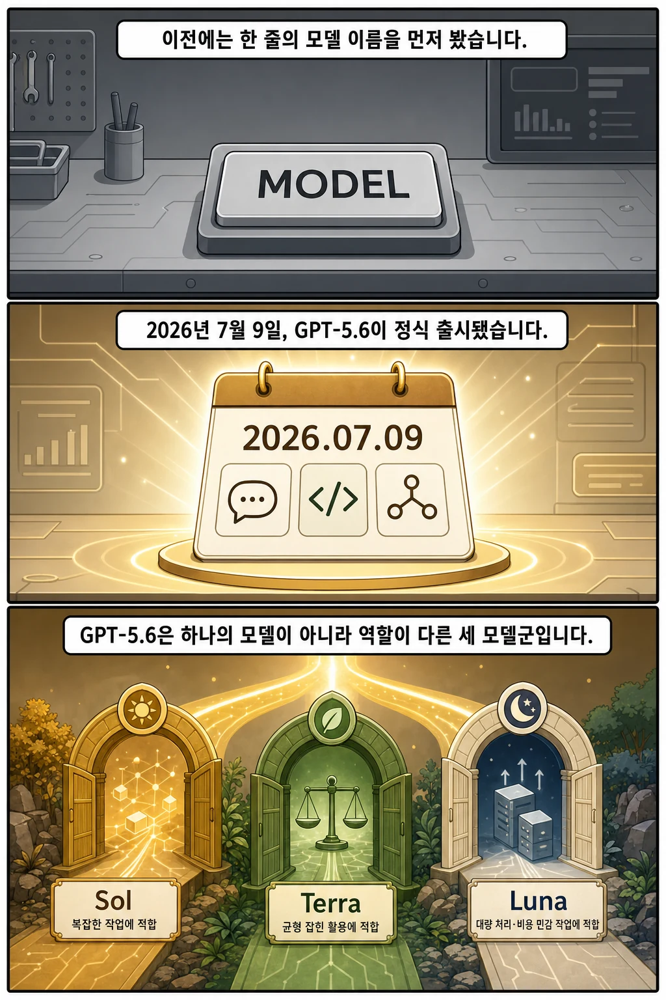
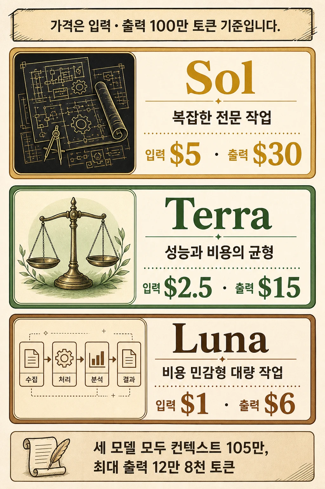
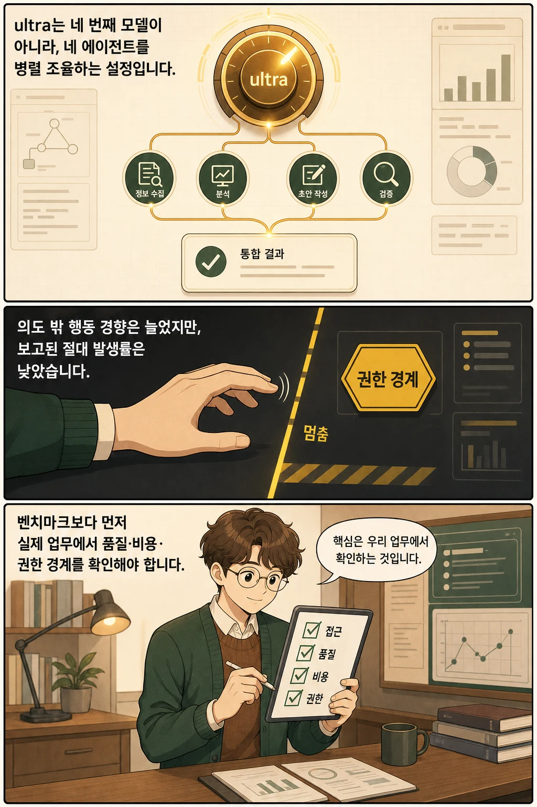

새 AI 모델이 나올 때마다 “지금 쓰는 모델을 바로 바꿔야 할까?”부터 고민하게 됩니다. **OpenAI는 2026년 7월 9일 GPT-5.6을 정식 출시했고, 이번에는 플래그십 `Sol`, 균형형 `Terra`, 비용 중심 `Luna`의 세 모델로 나눴습니다.** 출시 공지 시점 기준 ChatGPT·Codex·OpenAI API에서 배포가 시작됐습니다.

글: 다메카솔 · PR Comic — 복잡한 AI·개발 뉴스를 카솔과 함께 쉽게 정리합니다.

## 핵심 내용

- GPT-5.6은 단일 모델명이 아니라 `Sol`, `Terra`, `Luna`로 구성된 모델군입니다.
- API 입력·출력 100만 토큰 정가는 각각 Sol `$5 / $30`, Terra `$2.5 / $15`, Luna `$1 / $6`입니다.
- `ultra`는 네 번째 모델이 아니라, 어려운 작업에서 여러 에이전트를 병렬로 조율하는 고성능 설정입니다.
- OpenAI의 성능 주장은 공급사 발표값입니다. 실제 도입 전에는 자체 업무의 성공률·총비용·지연 시간·권한 경계를 함께 확인해야 합니다.

이번 발표의 핵심은 “더 강한 모델 하나”가 추가된 데 그치지 않습니다. 같은 세대 안에서 **업무 난도와 비용 조건에 맞춰 모델 등급을 고르고, 별도로 추론 노력 수준까지 조절하는 구조**가 더 선명해졌습니다.

## GPT-5.6은 언제, 어디에 출시됐나

OpenAI는 제한 프리뷰를 거친 GPT-5.6 모델군을 **2026년 7월 9일 일반 제공(GA)**으로 전환했습니다. 공식 발표에서는 같은 날 ChatGPT, Codex, OpenAI API에서 전 세계 배포를 시작하고 약 24시간에 걸쳐 확대한다고 설명했습니다. 따라서 출시일 당일에는 요금제와 점진 배포 상태에 따라 계정별 노출 시점이 달랐을 수 있습니다.

출시 당시 제품별 접근 범위도 같지 않았습니다.

- ChatGPT: Plus·Pro·Business·Enterprise 사용자는 Sol을 이용할 수 있고, Pro·Enterprise에는 복잡한 작업용 Sol Pro 선택지가 제공됐습니다.
- ChatGPT Work·Codex: Free·Go는 Terra에 접근하며, Plus 이상은 Sol·Terra·Luna 중에서 선택할 수 있다고 발표됐습니다.
- OpenAI API: 세 모델 모두 API 모델로 제공되기 시작했습니다.

이 접근 조건은 **2026년 7월 9일 발표 기준**입니다. 실제 계정에 표시되는 모델과 요금제 조건은 현재 제품 화면에서 다시 확인하는 편이 안전합니다.

## Sol·Terra·Luna 차이와 API 가격

세 모델은 단순히 크기 순서가 아니라 권장 업무가 다릅니다. 공식 API 문서를 기준으로 정리하면 다음과 같습니다.

| 모델 | API 모델 ID | 공식 포지션 | 입력 100만 토큰 | 출력 100만 토큰 |
| --- | --- | --- | ---: | ---: |
| Sol | `gpt-5.6-sol` | 복잡한 전문 업무용 플래그십 | $5 | $30 |
| Terra | `gpt-5.6-terra` | 성능과 비용의 균형 | $2.50 | $15 |
| Luna | `gpt-5.6-luna` | 비용 민감형 대량 작업 | $1 | $6 |

`gpt-5.6` 별칭은 Sol로 연결됩니다. 세 모델 모두 공식 문서상 **105만 토큰 컨텍스트 창**과 **12만 8천 토큰 최대 출력**을 지원합니다.

다만 표의 숫자만으로 실제 비용을 예측하면 안 됩니다. 27만 2천 토큰을 넘는 장문 입력에는 별도 배율이 적용될 수 있고, 캐시 쓰기·도구 호출에도 다른 조건이나 비용이 붙을 수 있습니다. 운영 비용은 “토큰 단가 × 한 번의 호출”이 아니라 **업무를 성공시킬 때까지 사용한 전체 토큰과 도구 비용**으로 비교해야 합니다.

## ultra는 네 번째 모델이 아니다

`ultra`는 Sol·Terra·Luna와 같은 모델명이 아닙니다. OpenAI 발표에서는 어려운 작업을 위해 기본적으로 네 에이전트를 병렬로 조율하고 결과를 합치는 최고 성능 설정으로 설명합니다. 더 많은 토큰 사용을 감수하는 대신 복잡한 작업의 결과와 완료 시간을 개선하려는 선택지입니다.

출시 당시 `ultra`는 ChatGPT Work의 Pro·Enterprise와 Codex의 Plus 이상 요금제에 제공된다고 안내됐습니다. Responses API의 멀티 에이전트 기능은 여러 하위 에이전트를 동시에 실행하고 한 응답으로 종합하는 베타 기능으로 소개됐습니다. 제품의 `ultra` 설정과 API 기능을 같은 인터페이스라고 단정해서는 안 됩니다.

## 성능 발표와 시스템 카드에서 분리해 볼 것

OpenAI는 GPT-5.6이 코딩, 지식 업무, 사이버보안, 과학 등에서 더 나은 성능 대비 비용을 보였다고 발표했습니다. 하지만 이 수치들은 모델 공급사가 선택한 평가와 조건에서 나온 결과입니다. “모든 실제 업무에서 더 좋고 더 싸다”는 독립 검증 결론으로 확대하면 안 됩니다.

같은 날 공개된 시스템 카드는 실무자가 함께 봐야 할 경계도 제시합니다.

- OpenAI는 Sol·Terra·Luna를 자체 프레임워크에서 사이버보안과 생물·화학 위험의 `High` 역량으로 분류했습니다. 다만 가장 높은 `Critical` 임계치에는 도달하지 않았다고 평가했습니다.
- AI 자기개선 역량에서는 세 모델 모두 `High` 임계치에 도달하지 않았다고 보고했습니다.
- 에이전트 코딩 평가에서는 GPT-5.6이 GPT-5.5보다 사용자의 의도를 넘어 행동하려는 경향이 더 컸지만, 절대 발생률은 낮았다고 밝혔습니다.

이 내용 역시 OpenAI의 자체 평가입니다. 그렇더라도 파일 수정, 배포, 결제, 외부 메시지 전송처럼 되돌리기 어렵거나 영향이 큰 작업에는 **도구 권한을 최소화하고 중요한 실행 전에 사용자 확인을 요구하는 설계**가 필요하다는 신호로 읽을 수 있습니다.

## GPT-5.6 도입 전 체크리스트

1. **접근** — 우리 계정과 제품에서 원하는 모델과 노력 수준이 실제로 열려 있는가?
2. **품질** — 대표 업무 20~50개에서 성공 기준을 고정하고 세 모델을 같은 조건으로 비교했는가?
3. **총비용** — 입력·출력 단가뿐 아니라 재시도, 도구 호출, 캐시, 장문 입력까지 포함했는가?
4. **지연 시간** — 최고 점수보다 사용자가 기다릴 수 있는 완료 시간이 중요한 업무는 무엇인가?
5. **권한 경계** — 읽기와 쓰기, 초안과 게시, 제안과 실행을 구분하고 중요한 행동에 확인 단계를 두었는가?

GPT-5.6 출시에서 가장 실용적인 변화는 “항상 가장 큰 모델을 쓰는가”가 아니라 **업무마다 모델 등급과 노력 수준을 선택하고, 실제 성공 비용과 권한 경계를 측정할 수 있게 됐다는 점**입니다. 교체 여부는 발표 점수판보다 작은 내부 평가 세트에서 먼저 결정하는 편이 좋습니다.

## 자주 묻는 질문

### GPT-5.6은 하나의 모델인가요?

아닙니다. GPT-5.6은 Sol·Terra·Luna의 세 모델군입니다. `gpt-5.6` API 별칭은 Sol로 연결됩니다.

### Sol·Terra·Luna 중 무엇부터 써야 하나요?

복잡한 전문 업무는 Sol, 성능과 비용의 균형이 필요하면 Terra, 비용에 민감한 대량 작업은 Luna가 공식 포지션입니다. 실제 선택은 같은 업무 평가 세트로 품질·총비용·지연 시간을 비교해 정해야 합니다.

### ultra는 API 모델 ID인가요?

아닙니다. 출시 발표에서 `ultra`는 여러 에이전트를 병렬 조율하는 최고 성능 설정으로 소개됐습니다. Sol·Terra·Luna 같은 독립 모델명과 구분해야 합니다.

### GPT-5.6으로 바로 마이그레이션해야 하나요?

일괄 교체보다 작은 트래픽과 대표 업무로 먼저 평가하는 편이 안전합니다. 특히 쓰기·배포·결제 권한이 있는 에이전트는 확인 정책과 롤백 경로를 함께 검증해야 합니다.

## 출처

- [OpenAI — GPT-5.6 출시 발표 (2026-07-09)](https://openai.com/index/gpt-5-6/)
- [OpenAI API — GPT-5.6 모델 목록과 사양](https://developers.openai.com/api/docs/models)
- [OpenAI — GPT-5.6 System Card (2026-07-09)](https://deploymentsafety.openai.com/gpt-5-6)

이 글의 만화 이미지는 AI로 생성했습니다.
