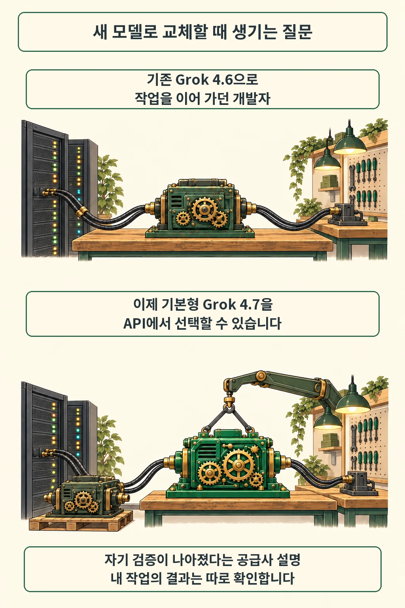

새 모델을 서비스에 붙이려면 이름 다음으로 호출 경로부터 확인해야 합니다. SpaceXAI는 2026년 9월 21일 [Grok 4.7](https://x.ai/news/grok-4-7)을 공개했고, 기본형을 xAI API에서 제공한다고 안내했습니다. 함께 소개한 Fast는 Cursor와 Grok Build 전용입니다. 9월 22일 공식 발표와 개발자 문서를 대조해 제공 범위와 과금 조건을 정리했습니다.

글·해설: 다메카솔

Updated: 2026-09-22

## API에서는 기본형 Grok 4.7을 선택합니다

모델 식별자는 `grok-4.7`입니다. [공식 개발자 문서](https://docs.x.ai/developers/grok-4-7)는 xAI API, Grok Build, Cursor와 모델 게이트웨이를 이용 경로로 안내합니다. 기존 모델 호출을 자동으로 바꿔 준다는 설명은 확인하지 못했으므로, 그림의 엔진 교체는 개발자가 모델 선택을 바꾼다는 개념으로 읽으면 됩니다.

회사는 더 큰 기반 모델과 긴 강화학습으로 장시간 코딩 과제, 자기 검증과 문맥 관리를 개선했다고 설명합니다. Grok 4.6과 같은 가격·속도로 제공한다는 설명도 공급사 발표에 속합니다. 제가 확인한 범위는 공개 문서까지이며, 실제 과제의 정확도나 실행 시간을 직접 측정하지 않았습니다.

앞서 다룬 [Grok 4.6의 GitHub Copilot 합류](/posts/grok-4-6-github-copilot-availability/)는 다른 제공 경로에 관한 소식입니다. 그때의 조직 설정이나 제공 범위를 이번 Grok 4.7에 그대로 옮겨 적용할 근거는 없습니다.

## Fast는 Cursor와 Grok Build에서 제공합니다

Fast를 내 서버에서 API로 호출할 수 있을까요? 9월 22일 확인한 [공식 문서](https://docs.x.ai/developers/grok-4-7)는 Fast를 더 빠른 인프라에서 실행하는 같은 모델로 설명하면서, Cursor·Grok Build 전용이며 공개 xAI API에서는 제공하지 않는다고 명시합니다. Grok Build의 무료 등급에서도 제외됩니다.

선택지가 갈립니다. 자사 서비스의 API 연결을 검토한다면 기본형을, 지원되는 코딩 도구 안에서 응답 속도를 비교하려면 Fast의 이용 조건을 확인해야 합니다. 회사의 성능·안전장치 개선 주장은 이 제공 범위와 별도로 평가할 대상입니다. 이번 글에서는 독립 검증 없이 벤치마크 수치를 성능 보장으로 옮기지 않았습니다.

## 문맥 창과 기본 단가를 함께 읽기

[모델 사양](https://docs.x.ai/developers/models/grok-4.7)에 적힌 문맥 창은 50만 토큰입니다. 긴 문맥을 담는 용량과 낮은 단가의 적용 구간을 구분해야 비용을 예상하기 쉽습니다. [9월 21일 릴리스 노트](https://docs.x.ai/developers/release-notes)는 기본형 가격을 프롬프트 길이에 따라 나눕니다.

| 기본형 프롬프트 길이 | 입력 | 캐시 입력 | 출력 |
| --- | --- | --- | --- |
| 20만 토큰 미만 | $2 | $0.50 | $6 |
| 20만 토큰 초과 | $4 | $1 | $12 |

2026년 9월 22일 확인한 미국 달러 기준이며, 각 칸은 해당 종류의 100만 토큰당 단가입니다. 원문의 미만·초과 표기만으로 정확히 20만 토큰인 경계의 처리까지 확정하지 않았습니다. Fast의 토큰 단가는 기본형의 두 배라고 안내하지만, 표 자체는 공개 API 기본형 가격입니다. 도구 비용, 지역 엔드포인트와 이용 서비스의 플랜 조건은 별도로 확인해야 합니다.

기본형은 텍스트와 이미지를 받아 텍스트를 출력합니다. 추론 강도는 `low`, `medium`, `high`, `xhigh`를 지원하고 기본값은 `high`입니다. 모델을 비교할 때는 이 설정과 입력 길이도 함께 기록해야 같은 조건의 결과인지 판단할 수 있습니다.

## 다메카솔의 해석: 한 작업이 끝날 때까지 비교하기

저라면 모델 교체 전에 작은 회귀 과제를 고정하겠습니다. 예를 들어 동일한 버그 수정 과제에 같은 파일과 도구 권한을 주고, 테스트 통과 여부·완료까지 걸린 시간·총 사용량을 함께 남기는 방식입니다. 이는 운영 관점의 제안이며 실제 Grok 4.7 테스트 결과는 아닙니다. 출력이 빨라져도 수정과 재시도가 늘면 작업 전체의 비용은 달라지므로, 완료된 결과를 기준으로 비교하는 편이 제 판단입니다.

다중 턴 연동에는 확인할 항목이 하나 더 있습니다. 공식 문서에 따르면 `grok-4.7`의 Responses API는 `include`에 없어도 `reasoning.encrypted_content`를 반환하며, 다음 요청의 `input`에 추론 항목을 변경 없이 전달해야 합니다. Chat Completions는 변경되지 않았다고 설명합니다. 응답의 텍스트만 추려 다음 호출에 넣는 어댑터라면 이 항목의 보존 여부를 검토할 이유가 생깁니다.

첫 비교는 작게 시작해도 됩니다. 같은 과제를 기본형으로 끝까지 실행해 기록한 뒤, Fast를 제공하는 도구에서도 동등한 조건을 만들 수 있는지 살펴보면 속도와 연결 환경의 영향을 나눠 볼 수 있습니다.

## 출처

- [SpaceXAI — Introducing Grok 4.7](https://x.ai/news/grok-4-7): 2026년 9월 21일 발표. 학습·성능·안전장치 개선은 회사 주장으로 표기했습니다.
- [SpaceXAI Docs — Grok 4.7 overview](https://docs.x.ai/developers/grok-4-7): 기본형·Fast 제공 경로와 다중 턴 요청 안내.
- [SpaceXAI Docs — Grok 4.7 model](https://docs.x.ai/developers/models/grok-4.7): 문맥 창, 입출력과 추론 강도.
- [SpaceXAI Docs — Release Notes](https://docs.x.ai/developers/release-notes): 9월 21일 API 공개 및 가격 구간. 모든 자료는 9월 22일 확인했으며 같은 공급사의 자료입니다. 정확한 공개 시각은 원문에 제시되지 않았습니다.

이 글의 본문과 이미지는 생성형 AI로 제작했습니다. 기획과 편집 기준은 다메카솔이 정했습니다.
