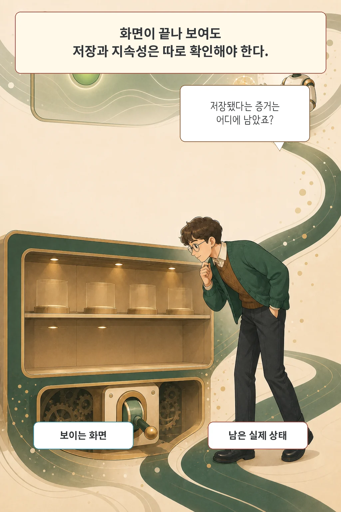
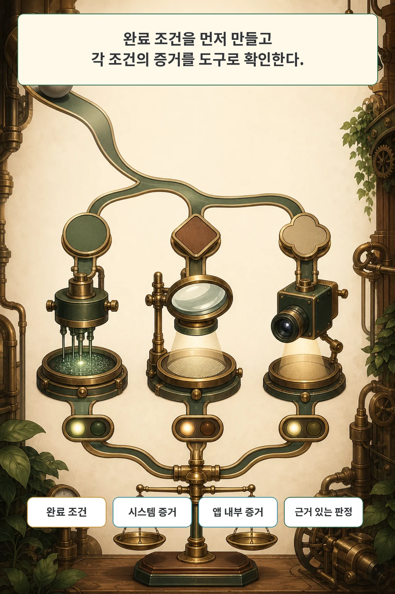
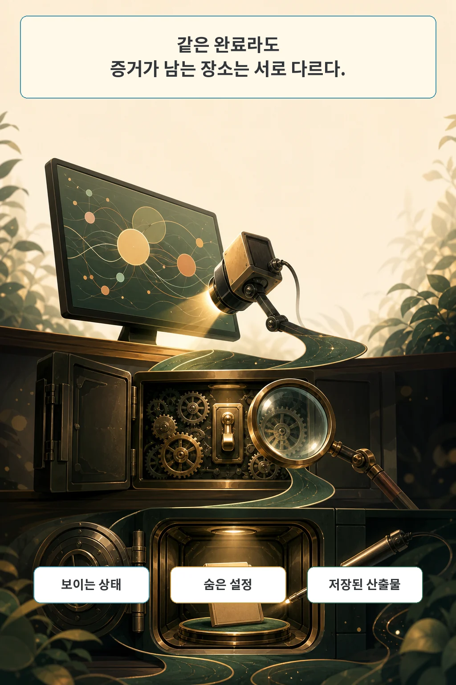
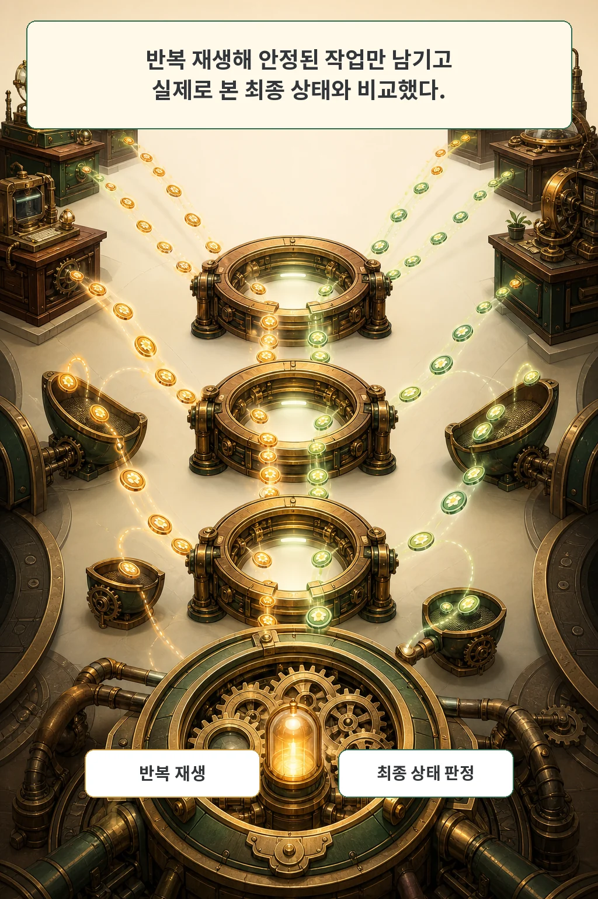
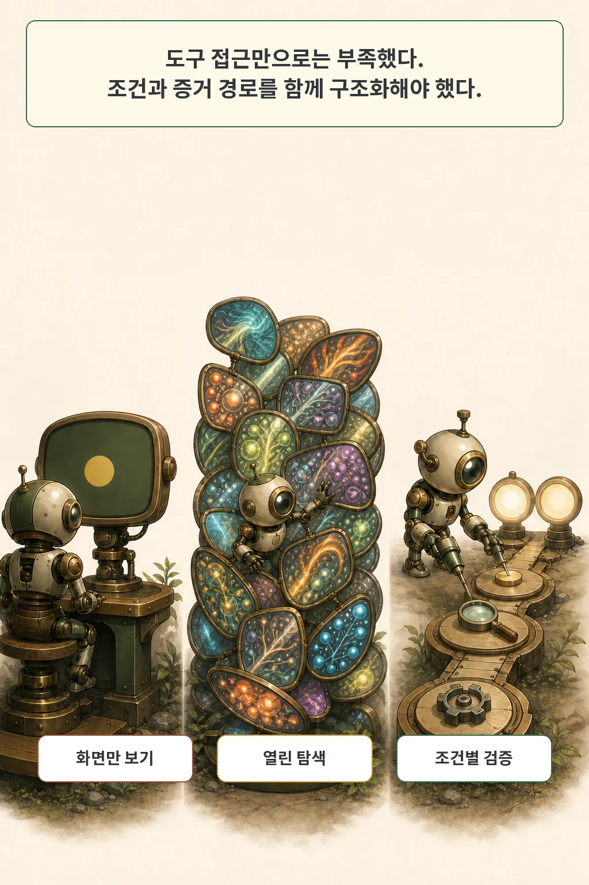
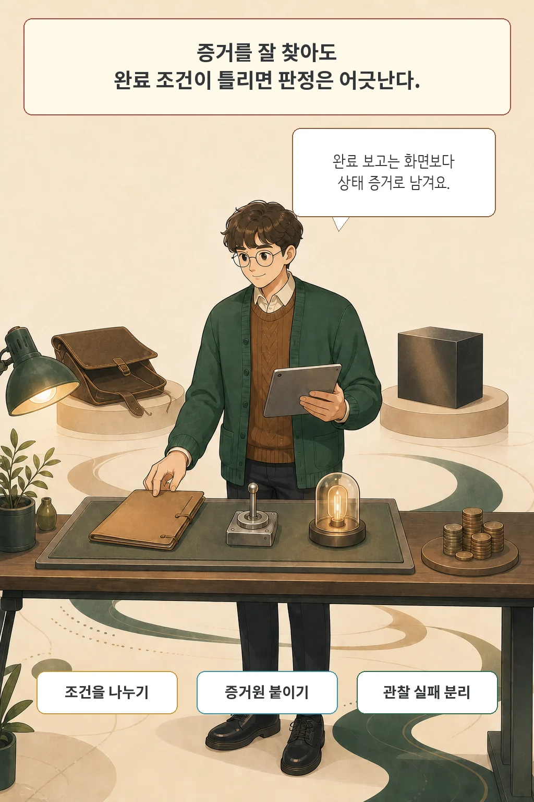

완료 화면은 완료 증거가 아닙니다. **Interactive Reward Agent: GUI Task Evaluation via Environment-State Verification**는 GUI AI 에이전트가 일을 끝냈는지 판단할 때 최종 스크린샷만 보지 말고, 저장된 파일·지속 설정·애플리케이션 상태를 직접 확인하자고 제안합니다.

저자들이 만든 Interactive Reward Agent(IRA)는 작업 지시를 완료 조건으로 먼저 나눕니다. 그다음 시스템, 애플리케이션, GUI 도구 가운데 조건에 맞는 수단을 골라 실제 최종 상태에서 증거를 모읍니다. 이 글은 그 구조와 벤치마크 결과, 비용, 남은 오류를 분리해 읽습니다.

글·해설: 다메카솔

## 화면이 멀쩡해도 저장은 실패할 수 있다

최종 스크린샷은 그 순간 보이는 픽셀을 증명합니다. 파일이 지정한 경로에 저장됐는지, 설정이 재시작 뒤에도 남는지, 다른 애플리케이션에 결과가 전달됐는지는 별도 상태입니다. 화면이 최신 상태가 아닐 수도 있습니다.

논문의 스프레드시트 사례에서는 명령줄로 값이 바뀌었지만 화면이 갱신되지 않았습니다. 화면만 본 평가기는 실패로 판단했고, IRA는 파일을 열어 저장된 값을 확인했습니다. VLC 사례에서는 현재 창의 모양만으로 설정의 지속성을 알 수 없어서 config 값을 읽었습니다.

이 차이는 실행 능력과 평가 능력을 갈라 놓습니다. 에이전트가 정답 행동을 했더라도 평가기가 증거를 못 보면 보상이 틀어지고, 틀린 행동을 그럴듯한 화면으로 마치면 거짓 성공이 됩니다.

## 완료 조건을 먼저 쪼갠다

IRA의 첫 단계는 바로 성공 여부를 맞히는 일이 아닙니다. 작업 지시와 초기·최종 화면을 읽어 반드시 만족해야 할 조건을 먼저 제안합니다. 예를 들어 “프레젠테이션을 이미지로 내보내 바탕화면에 저장하라”는 지시라면 출력 파일의 존재, 형식, 내용이 조건이 됩니다.

각 조건에는 독립적인 verification loop가 붙습니다. IRA는 지금 가진 증거를 보고 다음 도구를 고르고, 관찰 결과가 부족하면 다른 증거원을 찾습니다. 파일과 명령 출력은 시스템 도구, 문서 내부 구조는 애플리케이션 도구, 눈에 보이는 상태는 GUI 도구로 확인합니다.

논문은 조건별로 명시적 환경 상태 증거가 모였을 때만 성공을 줍니다. 만족한 조건의 비율이 scalar reward가 되고, 실험의 이진 평가는 그 값이 0.8을 넘을 때 성공으로 분류했습니다. 이 threshold는 시스템 구조의 보편 법칙이 아니라 이번 평가 프로토콜의 선택입니다.

## 증거는 세 군데에 흩어진다

저자들은 GUI-RewardBench의 증거 유형을 세 갈래로 나눴습니다. visible state는 화면에서 직접 확인할 수 있습니다. hidden state는 환경 설정, 기본 앱, preference file처럼 UI 뒤에 남습니다. artifact verification은 문서, 스프레드시트, 프레젠테이션, 이미지, PDF 같은 산출물의 실제 내용을 읽어야 합니다.

321개 trajectory 가운데 artifact verification이 192개로 가장 많았습니다. hidden state는 89개, visible state는 40개였습니다. 즉 이 벤치마크의 다수 과제는 마지막 화면 한 장만으로 결론을 내리기 어렵도록 구성됐습니다.

도구를 많이 주면 문제가 저절로 풀리는 것도 아닙니다. 어떤 조건에 어느 증거원이 가장 결정적인지 골라야 합니다. GUI를 헤매다가 상태를 못 찾은 일을 곧바로 task failure로 바꾸면, 관찰 실패와 실행 실패가 섞입니다.

## 벤치마크는 실제로 본 상태에 맞춰 판정했다

연구진은 327개 후보 trajectory를 여러 가상 머신에서 세 번씩 재생했습니다. 최종 상태가 불안정한 6개를 제외하고 321개를 남겼으며, 범위는 10개 Ubuntu 데스크톱 애플리케이션 범주입니다. 짧은 작업부터 80단계를 넘는 작업까지 포함합니다.

평가기는 같은 작업 지시와 같은 recorded trajectory를 받았습니다. live replay에는 UI drift, 비동기 애플리케이션 동작, 네트워크 변동, evaluator interaction이 끼어들 수 있습니다. 그래서 연구진은 각 평가가 끝난 뒤 task-specific script를 실행해 그 평가기가 실제로 본 최종 상태의 ground-truth label을 다시 계산했습니다.

이 설계는 현실적인 흔들림을 지우지 않고 비교 기준을 맞춥니다. 반면 Ubuntu 환경과 선택한 앱·도구에 집중하므로 다른 운영체제나 기업용 소프트웨어까지 같은 결과를 보장하지는 않습니다.

## 상호작용보다 검증 구조가 중요했다

가장 강한 passive baseline인 DistRL은 GUI-RewardBench에서 정확도 78.8%, F1 76.7%를 기록했습니다. GPT-5.5 기반 IRA는 정확도 86.9%, F1 84.9%였습니다. 같은 backbone을 맞춘 비교에서 정확도 차이는 6.2~9.1 percentage point였습니다.

두 GPT 기반 IRA는 평균 약 3.3 verification step을 썼습니다. 대신 token 사용량은 passive VLM보다 컸고 분포의 꼬리도 길었습니다. 추가 비용은 파일 내용, 저장된 설정, 애플리케이션 상태처럼 정적인 화면에서 복구할 수 없는 증거를 얻는 데 쓰였습니다.

ablation이 더 중요한 경계를 보여 줍니다. GUI interaction만 허용했을 때 Qwen3.6 평가기의 precision은 올랐지만 recall은 크게 떨어졌습니다. 완료 조건을 먼저 정의하고 도구 선택을 구조화한 IRA는 세 backbone 모두에서 precision-recall trade-off를 개선했습니다. 접근 권한보다 탐색 순서와 판정 기준이 함께 필요했다는 결과입니다.

## 학습 보상으로 쓸 수 있는지 확인했다

저자들은 검증 결과를 평가에서 끝내지 않고 GUI agent의 reinforcement learning reward로 사용했습니다. 같은 OSWorld task에서 ground-truth script reward로 학습한 설정의 success rate는 34.9%, IRA reward를 쓴 설정은 34.0%였습니다. 자동 생성 task와 IRA reward를 결합한 설정은 33.5%였습니다.

사람과의 비교도 별도로 진행했습니다. 자동 생성한 855개 지시 중 100개를 뽑아 GPT-5.5 기반 IRA 판정과 human annotation을 비교했을 때 observed agreement는 94.0%, Cohen's kappa는 0.84였습니다. 이 표본은 아홉 애플리케이션 범주에서 나왔고, Chrome 표본은 한 class만 있어 kappa를 계산할 수 없었습니다.

두 결과는 “사람이나 script를 완전히 대체했다”는 증거가 아닙니다. 동일한 연구 환경 안에서 IRA reward가 script reward에 가까운 downstream result를 냈고, 제한된 표본에서 사람 판정과 높은 agreement를 보였다는 뜻입니다.

## 조건이 틀리면 증거가 있어도 오판한다

IRA의 대표 오류는 증거 부족보다 completion condition 정렬에서 나타났습니다. 보호 기능의 세부 등급을 잘못 잡거나, 기능적으로 어두운 테마를 이름 그대로 해석해 실패로 보거나, 이미지를 뒤집은 흔적만 확인하고 저장 여부를 놓쳤습니다.

interactive evaluator가 조사 과정에서 환경을 바꿀 수도 있습니다. 논문은 read-only 도구와 GUI·명령 실행을 구분하지만, 후자는 새 state transition을 만들 수 있습니다. 긴 token tail과 도구 호출 비용도 운영 예산에 넣어야 합니다.

공식 저장소는 2026년 7월 29일 확인한 commit `a67e756929d45a776a03aa11e589b8c077de9c97`에서 IRA 구현과 321개 benchmark JSON을 공개했습니다. README는 raw replay cache, 대형 output, debug report, experiment result directory를 제외했다고 밝힙니다. 저장소에는 아직 license가 선언되지 않았으므로 코드를 재사용할 때 권한을 추정해서는 안 됩니다.

## 다메카솔의 해석: 완료 보고를 상태 증거로 바꾼다

저라면 자동화 완료 조건부터 세 줄로 씁니다.

1. **무엇이 참이어야 하나**: 파일 존재, 저장된 설정값, 레코드 상태처럼 결과를 원자 조건으로 나눕니다.
2. **어디서 확인할 수 있나**: 화면, 파일, API, 데이터베이스, 설정 저장소 가운데 가장 결정적인 증거원을 붙입니다.
3. **확인하지 못했을 때 무엇이라 부르나**: 실행 실패와 관찰 실패를 분리해 기록합니다.

스크린샷은 여전히 유용합니다. 레이아웃, 보이는 오류, 사용자가 마주할 화면을 확인하는 데 강합니다. 지속성과 산출물 정확성까지 한 장이 대신 증명한다고 기대하는 순간 문제가 생깁니다.

이 논문이 남긴 실무 질문은 단순합니다. 에이전트가 “끝났습니다”라고 말했을 때, 그 문장이 가리키는 상태를 다시 찾을 수 있는가. 자동화의 신뢰성은 답변의 자신감보다 그 증거 경로에서 시작합니다.

## 논문 정보

| 항목 | 내용 |
| --- | --- |
| 제목 | Interactive Reward Agent: GUI Task Evaluation via Environment-State Verification |
| 저자 | Chenrui Shi 외 7명 |
| arXiv v1 제출 | 2026-07-28 16:01:38 UTC |
| 분야 | cs.AI |
| 벤치마크 | 321 stable GUI trajectories, 10 Ubuntu desktop categories |
| 공식 저장소 | Kendrick-Stein/InteractiveRewardAgent-OfficialRepo, commit a67e7569… |

## 출처

- [논문 초록과 메타데이터, arXiv:2607.25904](https://arxiv.org/abs/2607.25904)
- [논문 원문 PDF](https://arxiv.org/pdf/2607.25904)
- [arXiv HTML 원문](https://arxiv.org/html/2607.25904v1)
- [저자 공식 프로젝트 페이지](https://kendrick-stein.github.io/InteractiveRewardAgent-OfficialRepo/)
- [공식 코드·벤치마크 저장소](https://github.com/Kendrick-Stein/InteractiveRewardAgent-OfficialRepo)
- [관련 글: 컴퓨터 사용 AI 에이전트가 화면 좌표 대신 의미를 누르는 법](/posts/tactile-computer-use-agents/)

이 글의 본문과 이미지는 생성형 AI로 제작했습니다. 기획과 편집 기준은 다메카솔이 정했습니다.

Updated: 2026-07-29
