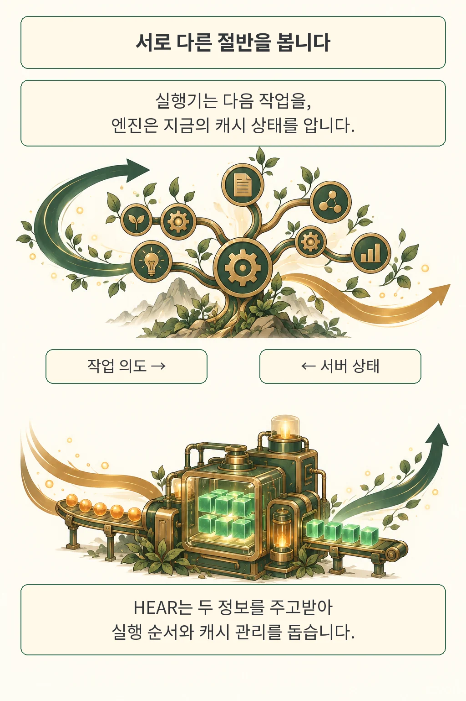
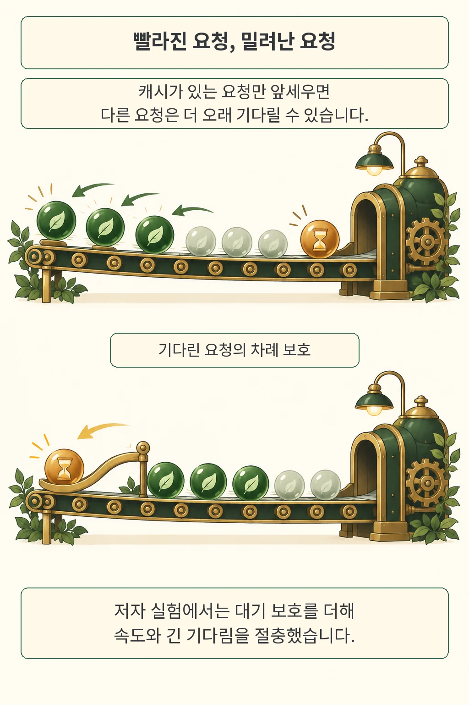
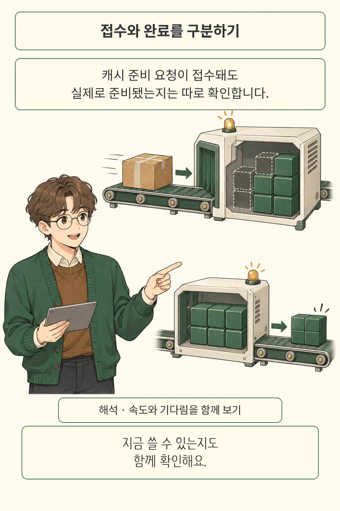

검색 도구의 응답을 기다렸다가 AI 에이전트가 다시 말을 이어 갑니다. 방금 읽은 문맥인데도 첫 글자가 나오기까지 오래 걸린다면, 그 사이 서버가 계산해 둔 캐시를 비웠을 수 있습니다. 실행기는 곧 같은 문맥을 쓸 줄 알았지만 서버는 그 계획을 몰랐던 겁니다. **HEAR 연구진은 작업 계획과 추론 서버의 현재 상태를 양방향으로 전달해, 요청 순서와 캐시 관리를 함께 조정하는 방법을 제안합니다.**

*글·해설: 다메카솔*

원문 확인·작성: 2026년 10월 6일

이번에 읽은 논문은 하얼빈공업대 선전의 Jiaqi Zhao 등이 쓴 **Can Agent Harnesses and Inference Engines Hear Each Other? The HEAR Protocol for Agentic LLM Serving**입니다. 2026년 10월 5일 제출된 arXiv v1을 기준으로 설명합니다. 위 상황은 논문의 문제를 풀어 쓴 예시이며, 제가 운영 장애를 겪었다는 기록은 아닙니다.

## 다음 작업을 아는 쪽과 캐시를 보는 쪽

작업을 이어 붙이는 실행기와 모델을 계산하는 서버는 서로 다른 정보를 봅니다. 여기서 **하네스(harness)**는 어떤 도구를 부르고 어느 작업의 결과를 기다릴지 관리하는 실행기입니다. 추론 엔진은 들어온 요청을 묶어 모델을 돌리면서 메모리와 대기열을 관리합니다. 모델이 입력을 읽으며 계산한 중간 상태인 **KV 캐시**도 이쪽에 있습니다.

재사용할 캐시가 남아 있으면 같은 입력 구간을 다시 계산하는 부담을 줄일 수 있습니다. 그런데 실행기는 어떤 문맥을 곧 다시 쓸지 알아도 실제 캐시가 남았는지 모를 수 있고, 서버는 캐시 상태를 알아도 다음 도구 호출 뒤의 작업 계획은 모를 수 있습니다. **각자 가진 정보만으로는 빈틈이 생깁니다.** 백엔드 관점에서는 작업 스케줄러와 자원 관리자가 서로의 상태를 얼마나 공유하느냐는 문제로 읽힙니다.

HEAR는 오가는 정보의 의미를 정합니다. 실행기는 작업의 준비 여부와 다음 사용 의도를 설명하고, 필요한 대기 보호나 캐시 준비를 요청합니다. 엔진은 현재 캐시·대기열과 지원 기능을 알려 주고, 요청을 실제로 어떻게 처리했는지 돌려줍니다. 모든 엔진에 동일한 기능을 강제하는 패킷 규격이라기보다, **설명·제어·상태·결과를 구분하는 공통 계약**에 가깝습니다.

무엇을 먼저 실행할지는 이 정보를 사용하는 정책이 결정합니다. HEAR 자체가 하나의 고정 스케줄링 알고리즘인 것은 아닙니다. 순서를 바꾸더라도 먼저 끝나야 할 작업의 의존관계는 지켜야 하며, 서버가 지원하는 제어 범위도 확인해야 합니다. 그림의 나무와 기계는 정보가 나뉜 구조를 표현한 비유입니다.

앞서 다룬 [ContextRender](/posts/contextrender-execution-reuse/)가 반복 실행에서 재사용할 부분을 찾는 문제였다면, 이번 질문은 **그 재사용 계획을 현재 서버 상태와 어떻게 맞출 것인가**에 있습니다.

## 캐시를 잘 쓰면 모두가 덜 기다릴까요?

캐시가 남은 요청부터 처리하면 전체 작업이 빨라져도, 캐시가 없는 요청의 차례는 계속 밀릴 수 있습니다. 저자들의 SCBench 실험에서 이 절충이 드러납니다. 요청이 도착한 순서대로 처리하는 FCFS와 캐시 우선 처리, 여기에 대기 보호를 더한 구성을 비교했습니다.

이 실험은 **Qwen3-8B, RTX PRO 6000 한 대, 96 GiB의 L2 KV 캐시** 조건입니다. SCBench에는 실제 요청 시각이 없어서 연구진이 세션 도착과 사용자 생각 시간을 구성하고, 한 번 기록한 경로를 모든 방법에 똑같이 재생했습니다. 생각 시간은 평균 5초·표준편차 1초의 분포를 사용했습니다. 운영 중인 서비스의 실제 사용자 대기 시간으로 곧바로 옮겨 읽을 수 있는 수치는 아닙니다.

| 같은 SCBench 재생 조건 | 전체 배치 완료 | 첫 토큰 대기 중앙값 | 첫 토큰 최대 대기 |
| --- | ---: | ---: | ---: |
| 도착 순서대로 처리 | 481초 | 63.1초 | 79.0초 |
| 캐시 우선 처리 | 224초 | 4.6초 | 93.9초 |
| 캐시 우선 + Guard-40 | 299초 | 28.3초 | 65.0초 |

*원문 Table 3. 전체 배치 완료는 모든 사용자의 여러 차례 대화를 끝내는 데 걸린 시간이며, 첫 토큰 대기는 답변의 첫 토큰이 나오기까지의 시간입니다.*

캐시 우선 처리만으로 전체 완료는 481초에서 224초로 줄었지만, 가장 오래 기다린 요청은 79.0초에서 93.9초로 늘었습니다. 빠른 평균 뒤에 더 오래 기다리는 요청이 남는 셈입니다. Guard-40을 더하면 배치 완료는 299초가 되는 대신 최대 대기가 65.0초로 줄었습니다. 논문 앞부분의 **1.61배 가속**은 이 보호 구성의 배치 완료시간을 FCFS와 비교한 값입니다.

Guard-40은 40초 넘게 기다린 요청을 이후 캐시 우선 요청이 계속 앞지르지 못하도록 보호합니다. 모든 응답이 40초 안에 나온다는 약속과는 다릅니다. 표의 최대 대기 65.0초를 함께 보면 그 차이가 분명해집니다. 그림의 구슬은 요청 순서를 설명하며, 개수는 실험 표본이나 성능 비율을 뜻하지 않습니다.

실제 운영 기록에서 가져온 Mooncake 경로에서도 부하에 따라 유리한 정책이 달랐습니다. 연구진은 같은 15분 구간에 시작한 세션 중 50%·75%·100%를 선택해, Qwen3-8B와 H100 한 대에서 재생했습니다. 여기서 부하는 GPU 사용률이 아니라 선택한 세션의 비율입니다. 100% 조건에서는 세션 재사용 예측·캐시 우선·대기 보호를 모두 합친 구성의 처리량이 분당 108.9회로, FCFS의 122.7회보다 낮았습니다. 기능을 모두 켜는 선택도 해당 부하에서는 손해였습니다.

## 실행 방식을 고르는 시점도 다릅니다

같은 정보 교환 계약을 더 느린 주기의 설정 선택에도 쓸 수 있습니다. 저자들은 주 에이전트와 문서를 읽는 역할에 어떤 추론 방식을 배정할지 개발 단계에서 측정해 고정했습니다. 요청마다 모든 후보를 새로 시험하는 방식은 아닙니다.

GLM-4.7-Flash를 사용하고 두 역할을 별도 H100에 배치한 실험에서, BrowseComp-Plus 208문제의 선택 구성은 주 역할 vLLM·읽기 역할 H2O였습니다. 전체 시간은 모두 vLLM을 쓴 비교 구성의 5.69시간에서 4.62시간으로 줄었습니다. DeepResearchBench 100개 과제에서는 OmniKV·H2O 구성이 선택돼 5.93시간에서 2.42시간으로 줄었습니다. 두 결과는 각각의 벤치마크 안에서 같은 입력·예산·하드웨어 조건을 비교한 저자 보고입니다.

평균 품질 하락이 관찰되지 않았다는 설명에도 범위가 있습니다. 대응 비교의 신뢰구간은 품질 차이 0을 포함했고, DeepResearchBench의 대응 분석은 모든 구성에서 유효 점수를 받은 공통 89개를 사용했습니다. BrowseComp-Plus의 심사 모델은 같지만 구성별 심사 GPU는 달랐습니다. 따라서 이 결과가 모든 작업에서 품질이 동일하게 유지된다는 보장이 되지는 않습니다.

저자가 연결한 코드 저장소는 확인 당시 이 환경에서 **403 응답**을 반환했습니다. 공개 PDF와 HTML은 읽었으나 코드·데이터를 확인하거나 실험을 독립 재현하지는 못했습니다. 접근 실패만으로 저장소 자체가 없다고 판단하지 않았습니다. 또 이 연구는 추론 효율을 다루며, 모델 답변의 안전성이나 정확성 전반을 해결하는 연구는 아닙니다.

## 다메카솔의 해석: 완료를 확인할 수 있는 최적화

저는 이 논문에서 속도 수치만큼 **접수와 완료를 나누는 계약**에 주목합니다. 캐시를 준비해 달라는 요청이 접수됐어도 아직 준비 중일 수 있습니다. 방금 본 캐시 상태도 다음 실행 시점까지 보장되는 예약은 아닙니다. 오래된 관측을 현재 상태처럼 쓰면, 최적화가 기대했던 조건부터 어긋날 수 있습니다.

실무에 적용한다면 요청 ID와 문맥 버전을 붙여 관측 시각, 준비 요청의 상태, 실행 시 실제 재사용 여부를 연결해 보겠습니다. 그 기록이 있어야 캐시 적중률이 떨어졌을 때 계획이 달라졌는지, 캐시가 먼저 비워졌는지, 준비가 늦었는지 구분하기 쉽습니다. 이는 HEAR의 의미 구분에서 제가 끌어낸 운영 설계 해석이며, 이 구성을 직접 도입해 얻은 성과는 아닙니다.

지표도 함께 봐야 합니다. 전체 완료시간이나 처리량이 좋아졌을 때 오래 기다린 요청의 지연도 살피고, 대기 보호 조건을 바꿨을 때 두 값이 어떻게 움직이는지 비교하겠습니다. 상태 교환에는 권한과 테넌트 격리도 필요합니다. 서버가 보여 주는 실행 정보의 범위까지 설계에 포함해야 한다는 뜻입니다.

[에이전트 평가에서 설정을 함께 기록해야 하는 이유](/posts/agent-evaluation-system-configuration/)와도 이어집니다. **저는 작업 계획, 실제 서버 상태, 기다림의 한계를 함께 설명할 수 있는 최적화가 운영에 더 유용하다고 봅니다.** HEAR는 이 세 가지를 연결하는 경계를 구체적으로 보여 줍니다.

## 출처

- [HEAR 논문 정보와 제출 이력](https://arxiv.org/abs/2610.06597v1)
- [HEAR 원문 PDF](https://arxiv.org/pdf/2610.06597v1): 프로토콜은 3절, 캐시 실험은 4.2절, 역할별 구성은 4.3절, 재생·설정 조건은 부록 A, 품질 분석은 부록 B.4를 참고했습니다.
- [저자가 연결한 코드 저장소](https://anonymous.4open.science/r/hear-3D1E/): 2026년 10월 6일 이 환경에서 접근 제한 응답을 확인했습니다.

이 글의 본문과 이미지는 생성형 AI로 제작했습니다. 기획과 편집 기준은 다메카솔이 정했습니다.
