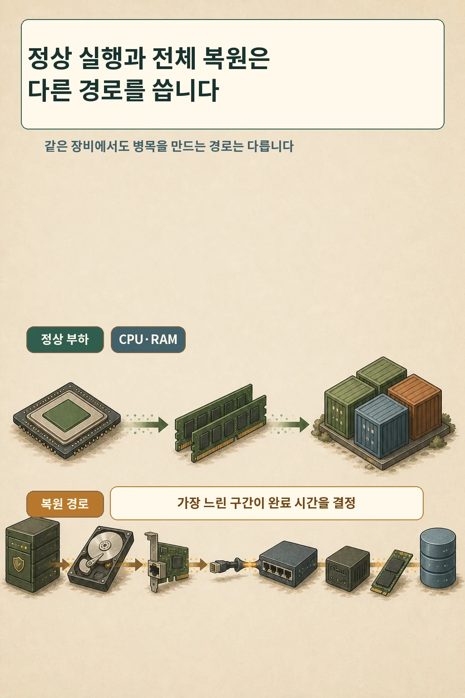
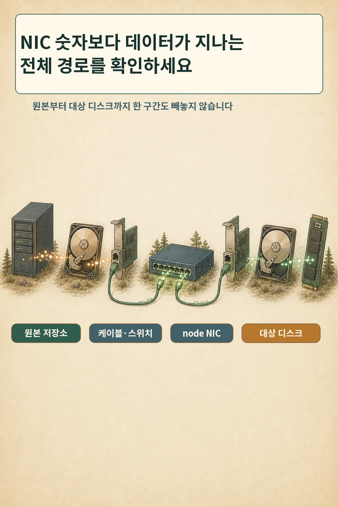
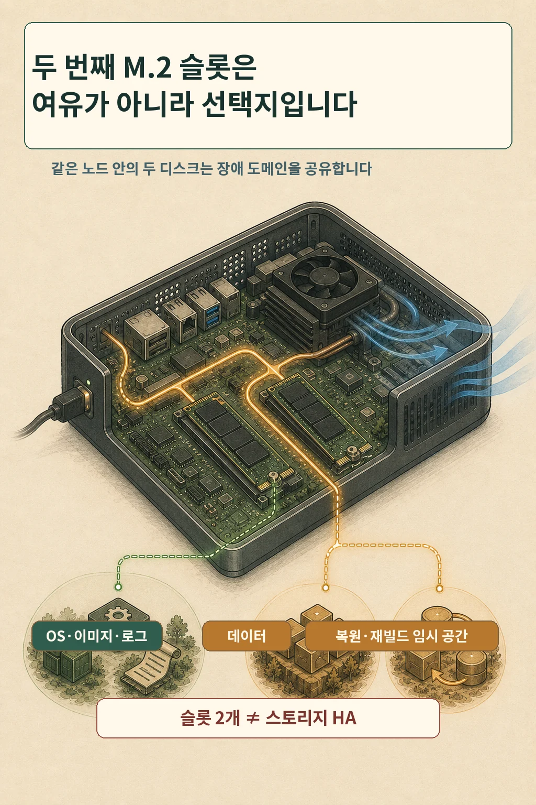
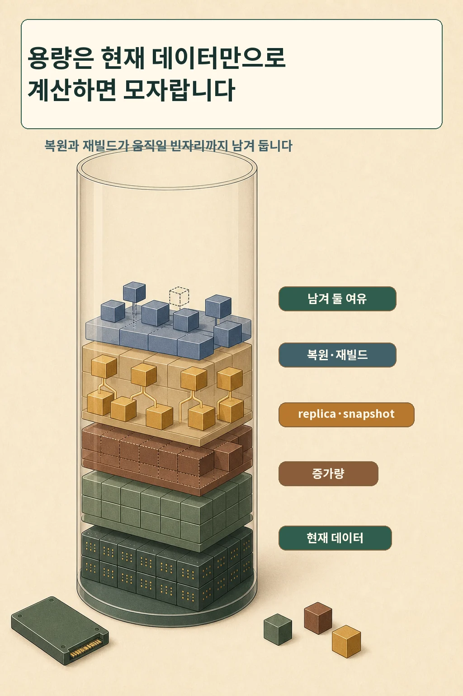

---
title: "홈랩 미니PC 고르는 법: CPU·RAM보다 NIC와 M.2 슬롯을 먼저 볼 때"
description: "CPU와 RAM의 기준선을 통과한 뒤, 홈랩 미니PC의 NIC·스위치·M.2 확장성과 복원 경로를 어떻게 비교할지 실제 구축 경험으로 정리합니다."
date: 2026-07-25
category: infrastructure
tags:
  - 홈랩
  - 미니PC
  - Kubernetes
  - 2.5GbE
  - NVMe
  - Longhorn
author: 다메카솔
creator_name: 다메카솔
content_lifecycle: draft
editorial_verdict: pending
publication_state: draft
---

# 홈랩 미니PC 고르는 법: CPU·RAM보다 NIC와 M.2 슬롯을 먼저 볼 때

글·해설: 다메카솔

미니PC를 비교하면 가장 먼저 CPU 세대와 RAM 최대 용량이 눈에 들어옵니다. 저도 처음에는 그 숫자부터 봤습니다. 이유도 분명했습니다. Synology NAS에 학습용 k3s를 올려 운영할 때 RAM 32GB는 충분했지만 CPU 코어가 부족해 Airflow 작업이 반복해서 실패했기 때문입니다. 소음 때문에 NAS를 밤에 끄면 메타데이터 DB와 S3 호환 오브젝트 스토리지도 함께 멈췄습니다.

이 경험이 가르쳐 준 것은 “CPU와 RAM만 보면 된다”가 아니었습니다. **내 워크로드가 막힌 지점과 24시간 운영을 가로막는 경로를 먼저 찾아야 한다**는 것이었습니다. CPU 기준선을 정한 뒤 다음 후보를 비교해 보니, 오래 남는 제약은 교체하기 어려운 NIC와 디스크 확장성이었습니다.

## CPU·RAM은 기준선이고, 복원은 다른 질문입니다

K3s 공식 문서의 최소 CPU·RAM 수치는 K3s 자체를 위한 기준선입니다. 실제 워크로드가 사용할 자원은 별도로 더해야 합니다. 같은 문서가 데이터스토어 성능을 따로 강조하고 SSD를 권장하는 이유도 여기에 있습니다.

따라서 첫 질문은 여전히 CPU와 RAM입니다.

- 평상시 서비스와 배치 작업이 요구하는 코어 수는 얼마인가?
- 메모리 피크와 노드 장애 시 재배치 여유는 얼마인가?
- RAM과 저장장치를 나중에 교체하거나 증설할 수 있는가?

하지만 기준선을 통과한 후보를 비교할 때는 질문이 달라집니다. 전체 복원, replica 재구축, 이미지 대량 pull 같은 작업은 CPU·RAM 표만으로 설명되지 않습니다.

## 복원 시간은 NIC 이름이 아니라 전체 경로가 결정합니다

복원 데이터는 한 번에 목적지로 순간 이동하지 않습니다.

`원본 저장소 → 원본 디스크 → 원본 NIC → 케이블·스위치 → 노드 NIC → 대상 디스크 → 압축 해제·DB 적용`

이 경로에서 가장 느린 단계가 완료 시간을 붙잡습니다. 2.5GbE 포트가 있어도 원본 NAS가 1GbE에 묶여 있거나, 스위치가 1GbE이거나, 대상 SSD의 지속 쓰기가 느리거나, DB 적용 단계가 CPU를 오래 점유하면 링크의 표기 속도만큼 빨라지지 않습니다.

작성자 환경의 초기 WiFi 리허설에서는 84GB 데이터베이스를 복원하는 데 88분이 걸렸습니다. 유선 2.5GbE 전환 후 35~55분이라는 숫자는 당시의 예상 범위였고, 같은 조건으로 다시 잰 결과는 아닙니다. 실측과 추정을 섞으면 구매 판단이 벤치마크처럼 과장됩니다.

목표부터 정하면 비교가 쉬워집니다.

`필요한 평균 지속 처리량 = 복원할 바이트 수 ÷ 목표 시간(초)`

이 계산은 후보를 거르는 출발점일 뿐입니다. 마지막 판단은 실제 백업 원본과 같은 복원 절차를 반복해 잰 완료 시간으로 해야 합니다.

## 듀얼 NIC는 속도 두 배가 아니라 설계 선택지입니다

NIC가 두 개면 관리 트래픽과 스토리지 트래픽을 분리하거나, 서로 다른 네트워크에 연결하거나, 향후 장애 대응 방식을 설계할 여지가 생깁니다. 그러나 포트가 두 개라는 사실만으로 다음이 자동으로 생기지는 않습니다.

- 링크 집성이나 두 배 처리량
- 서로 다른 스위치·전원까지 포함한 경로 이중화
- 설정 없이 작동하는 자동 장애 전환

두 포트를 같은 스위치와 같은 전원에 꽂으면 여전히 많은 실패 지점을 공유합니다. 구매표에는 “NIC 2개” 대신 **각 포트 속도, 스위치 지원, 케이블 규격, 분리할 트래픽, 공유하는 장애 도메인**을 함께 적는 편이 정확합니다.

Longhorn의 현재 모범 사례 문서는 프로덕션 환경에서 전용 스토리지 네트워크를 권장합니다. 그 문서의 최적 기준은 홈랩의 최소 조건과 같지 않습니다. 제 환경의 2.5GbE 선택은 비용과 복원 목표 사이의 실용적 결정이지, Longhorn 프로덕션 권고를 충족했다는 선언이 아닙니다.

## 두 번째 M.2 슬롯은 여유가 아니라 선택지입니다

두 번째 M.2 슬롯이 있으면 처음부터 모두 채우지 않아도 됩니다. 오히려 나중의 선택을 남겨 둔다는 데 가치가 있습니다.

- OS·컨테이너 이미지·로그가 있는 루트 디스크와 데이터 디스크 분리
- 용량이 부족해졌을 때 데이터 이동 없이 디스크 추가
- 복원이나 재빌드 중 임시 작업 공간 확보
- 스토리지 워크로드의 간섭을 줄이기 위한 배치 변경

다만 슬롯 두 개는 RAID도, 복제도, 백업도 아닙니다. 두 SSD는 같은 메인보드, 전원, 냉각, 노드 장애를 공유합니다. 노드가 사라지면 두 디스크가 함께 사라질 수 있습니다.

슬롯 개수만 확인해서도 안 됩니다. M.2 2280 물리 규격인지, NVMe와 SATA 중 무엇을 지원하는지, 다른 장치와 PCIe 레인을 공유하는지, 두 번째 슬롯에서 부팅할 수 있는지, 방열판을 장착할 공간이 있는지, SSD 교체를 위해 장비를 얼마나 분해해야 하는지를 모델별 설명서에서 확인해야 합니다.

## 디스크 용량에는 ‘작업할 빈자리’가 필요합니다

쿠버네티스 노드의 로컬 디스크는 애플리케이션 데이터만 담지 않습니다. 컨테이너 이미지, 쓰기 가능 레이어, 로그, 캐시와 임시 데이터도 공간을 사용합니다. Longhorn을 쓰면 실제 사용량, 예약 공간, 스케줄 가능 공간, replica와 snapshot이 서로 다른 방식으로 용량에 영향을 줍니다. snapshot 삭제나 재빌드 같은 작업도 임시 여유 공간을 요구할 수 있습니다.

구매 전 용량표에는 최소한 다음 항목이 있어야 합니다.

1. 현재 데이터
2. 다음 검토 시점까지의 증가량
3. replica가 차지할 공간
4. snapshot의 변경 블록
5. 복원·재빌드 중 필요한 임시 공간
6. 운영 중 남겨 둘 여유 공간

이 항목이 모든 Copy-on-Write·씬 프로비저닝 시스템에서 단순히 더해지는 것은 아닙니다. 그래서 계산표는 상한을 세우는 도구로 쓰고, 실제 사용량과 snapshot 증가량을 계속 측정해야 합니다.

## 제가 M5 Ultra를 고를 때 실제로 본 것

새 홈랩에는 GMKtec M5 Ultra 3대를 사용했습니다. 실제 구성은 각 장비 8코어 16스레드, RAM 32GB, NVMe 512GB였습니다. 제조사 페이지에서 확인한 선택지는 듀얼 2.5G LAN과 M.2 2280 슬롯 두 개였습니다.

이 사양은 “가장 좋은 미니PC”의 근거가 아닙니다. 이전 NAS에서 확인한 CPU 병목을 넘기고, 유선 복원 경로를 만들고, 스토리지 분리와 확장 가능성을 남기는 제 환경의 결정이었습니다. 현재 판매가와 재고도 이 글의 판단 근거에서 제외했습니다.

후보를 비교할 때는 아래 표처럼 최고 수치보다 **바꾸기 어려운 부분**을 먼저 적는 편이 유용했습니다.

| 질문 | 확인할 항목 | 통과 기준 예시 |
|---|---|---|
| 정상 부하를 견디는가 | 코어·스레드, RAM 피크, 증설 가능성 | 기존 병목과 장애 시 여유를 함께 충족 |
| 목표 시간 안에 복원되는가 | 원본·대상 디스크, NIC, 스위치, 케이블, DB 적용 | 동일 절차 리허설이 목표 시간 안에 완료 |
| 네트워크를 바꿀 수 있는가 | 포트 수·속도, 스위치 호환, 트래픽 분리 | 계획한 경로가 실제 장비 전체에서 이어짐 |
| 디스크를 분리·확장할 수 있는가 | 슬롯 수, 규격, 프로토콜, 레인, 냉각 | OS·데이터·임시 작업 공간 계획을 수용 |
| 고장 뒤 교체하기 쉬운가 | SSD·RAM 접근성, 예비 부품, 재설치 절차 | 한 대를 잃어도 정해 둔 시간 안에 복구 |
| 24시간 운영 가능한가 | 전력, 소음, 온도, 팬 청소와 배치 | 집에서 지속할 수 있는 운영 기준 충족 |

## 구매 전 마지막 다섯 문장

아래 문장을 숫자로 채울 수 없다면 제품 페이지를 더 보는 것보다 작은 복원 실험을 먼저 해 보는 편이 낫습니다.

1. 내 평상시 워크로드의 CPU·RAM 기준선은 `___`다.
2. `___GB`를 `___분` 안에 복원해야 한다.
3. 데이터는 `원본 → ___ → ___ → 대상` 경로를 지난다.
4. OS·데이터·복원 임시 공간을 `___개` 디스크에 이렇게 나눈다.
5. 성장·replica·snapshot·재빌드를 제외하고도 `___%`를 비워 둔다.

CPU와 RAM은 구매의 출발점입니다. 그러나 홈랩을 오래 운영하게 만드는 것은 높은 숫자 하나보다, **실패했을 때 데이터가 돌아오는 경로와 나중에 바꿀 수 있는 선택지**입니다.

## 자주 묻는 질문

### 홈랩이면 무조건 2.5GbE가 필요한가요?

아닙니다. 데이터가 작고 복원 목표가 느슨하며 원본 저장소와 스위치가 모두 1GbE라면 2.5GbE NIC만 추가해도 체감이 작을 수 있습니다. 복원할 양과 목표 시간을 먼저 계산하고 전체 경로가 그 속도를 지원하는지 확인하세요.

### 듀얼 NIC면 한 포트가 끊겨도 자동으로 살아남나요?

포트 수만으로는 그렇지 않습니다. 운영체제와 네트워크 설정, 스위치 구성, 서로 다른 전원·경로까지 설계해야 합니다. 같은 스위치에 연결된 두 포트는 그 스위치 장애를 함께 겪습니다.

### M.2 슬롯 두 개면 Longhorn에 충분한가요?

슬롯 수는 시작점일 뿐입니다. 디스크 성능과 지연시간, 루트 디스크와의 분리, 노드 간 네트워크, 여유 공간, replica 정책과 실제 복원 리허설을 함께 봐야 합니다.

### RAM을 나중에 늘릴 수 있다면 CPU는 조금 낮아도 되나요?

워크로드에 따라 다릅니다. 제 이전 NAS처럼 RAM이 남아도 CPU 코어가 병목이면 작업은 계속 실패할 수 있습니다. 먼저 실제 CPU 사용량과 대기열, 실패 패턴을 확인하고 기준선을 정하세요.

## 출처와 범위

- [K3s Requirements](https://docs.k3s.io/installation/requirements)
- [Kubernetes: Local ephemeral storage](https://kubernetes.io/docs/concepts/storage/ephemeral-storage/)
- [GMKtec NucBox M5 Ultra 공식 사양](https://www.gmktec.com/products/gmktec-nucbox-m5-ultra-amd-ryzen-7-7730u-mini-pc)
- [Longhorn 1.12.0 Best Practices](https://longhorn.io/docs/1.12.0/best-practices/)
- [Longhorn 1.12.0 Node Space Usage](https://longhorn.io/docs/1.12.0/nodes-and-volumes/nodes/node-space-usage/)
- [Longhorn 1.12.0 Volume Size](https://longhorn.io/docs/1.12.0/nodes-and-volumes/volumes/volume-size/)

이 글의 장비 구성과 복원 시간은 작성자 홈랩 기록에 근거합니다. 84GB·88분은 해당 WiFi 환경의 실측이고, 유선 전환 후 35~55분은 당시 추정치입니다. 장비 가격과 재고는 다루지 않았으며 특정 모델을 보편적으로 추천하지 않습니다.

이미지 제작에 생성형 AI를 사용했고, 공개 문구는 별도로 확정해 합성·검수했습니다.
