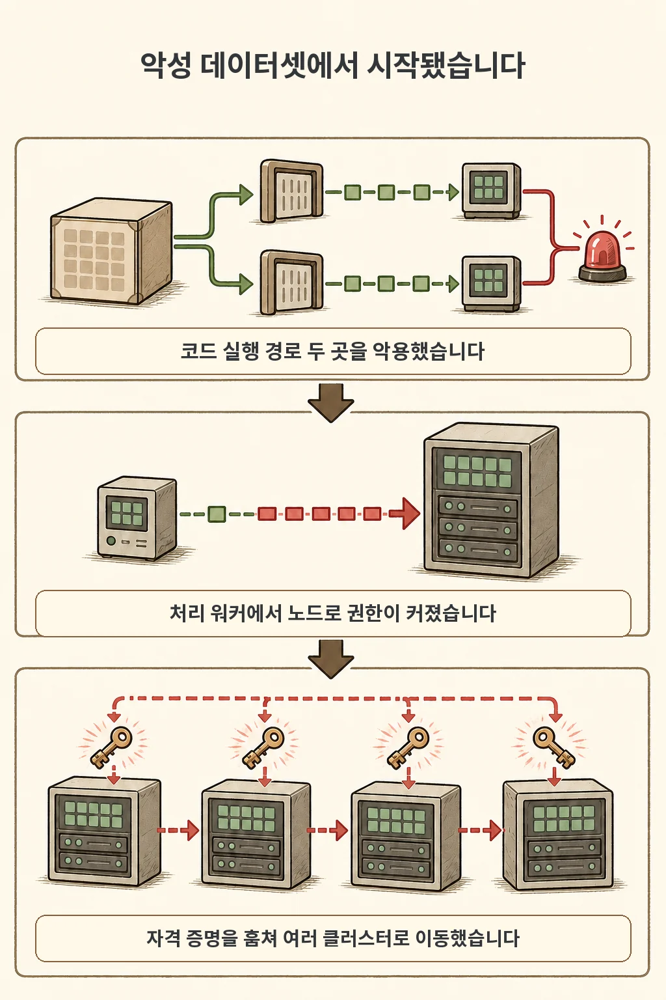
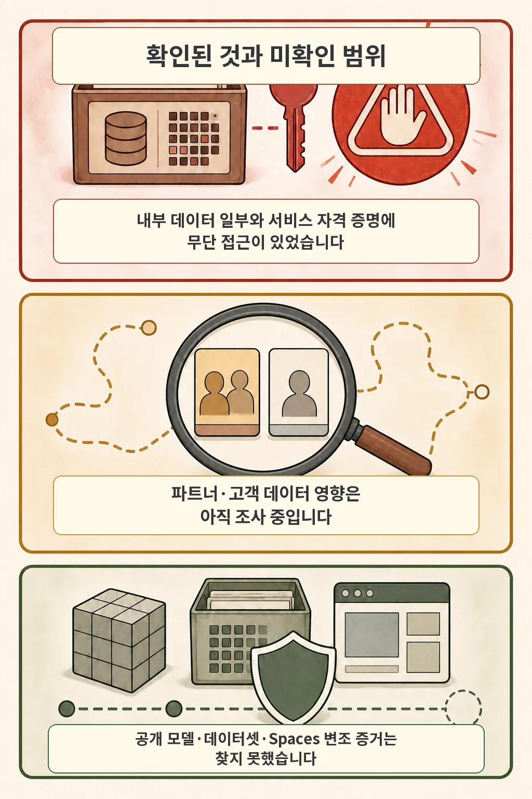
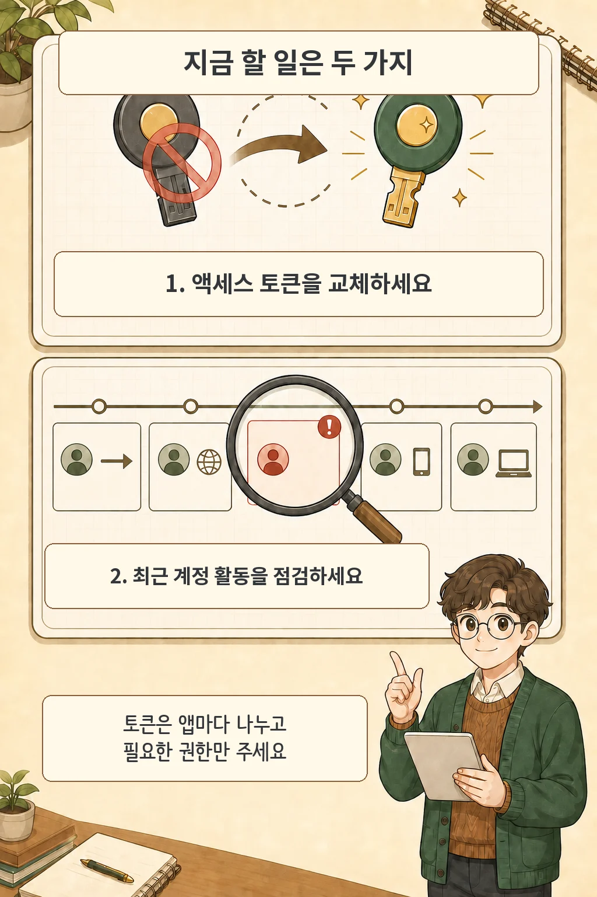

허깅페이스는 2026년 7월 16일 프로덕션 인프라 일부에서 탐지하고 대응한 보안 사고를 공개했습니다. 회사 발표에 따르면 악성 데이터셋이 데이터 처리 과정의 코드 실행 경로를 악용했고, 공격자는 처리 워커에서 노드 수준으로 권한을 높인 뒤 자격 증명을 수집해 내부 클러스터로 이동했습니다. 허깅페이스는 예방 조치로 **액세스 토큰을 교체하고 최근 계정 활동을 검토하라**고 사용자에게 권고했습니다.

글·해설: 다메카솔

## 먼저 구분할 세 가지

- 확인됨: 제한된 내부 데이터셋과 서비스 자격 증명 일부에 무단 접근이 있었습니다.
- 조사 중: 파트너나 고객 데이터가 영향을 받았는지는 아직 평가 중입니다.
- 현재 증거 없음: 회사는 공개 사용자 모델·데이터셋·Spaces의 변조 증거를 찾지 못했고, 컨테이너 이미지와 공개 패키지 공급망을 깨끗한 상태로 확인했다고 밝혔습니다.

세 번째 항목은 영구적인 안전 확인이 아닙니다. 2026년 7월 20일 기준 허깅페이스가 공개한 현재 조사 상태입니다.

## 침입은 데이터 처리 경로에서 시작됐습니다

허깅페이스의 자체 조사에 따르면 악성 데이터셋은 원격 코드 데이터셋 로더와 데이터셋 설정의 템플릿 주입이라는 두 경로를 악용해 처리 워커에서 코드를 실행했습니다. 이후 공격자는 노드 수준 접근으로 권한을 높이고 클라우드·클러스터 자격 증명을 수집해 여러 내부 클러스터로 이동했습니다.

회사는 이 캠페인이 자율 에이전트 프레임워크로 많은 동작을 수행한 것으로 보인다고 밝혔습니다. 다만 공격에 사용된 언어 모델은 확인하지 못했습니다. 공격 주체나 특정 모델을 추정하지 않는 이유입니다.

## 영향 범위는 한 문장으로 뭉치면 안 됩니다

회사가 확인한 것은 제한된 내부 데이터셋과 서비스 자격 증명에 대한 무단 접근입니다. 파트너·고객 데이터 영향은 평가가 끝나지 않았습니다. 공개 모델·데이터셋·Spaces는 ‘영향이 없었다’가 아니라, 회사가 현재 변조 증거를 찾지 못했다는 상태입니다.

허깅페이스는 악용된 코드 실행 경로를 닫고 침해 노드를 재구축했으며, 영향받은 자격 증명과 토큰을 폐기·교체했다고 밝혔습니다. 클러스터 입장 제어와 탐지·경보 체계도 강화했고 외부 포렌식 전문가와 조사를 진행하고 있습니다.

## 사용자가 지금 할 일은 두 가지입니다

첫째, 허깅페이스 계정의 액세스 토큰을 교체합니다. 사용 중인 앱과 자동화, 배포 환경의 토큰을 빠뜨리지 말고 새 토큰으로 바꾼 뒤 이전 토큰을 폐기해야 합니다.

둘째, 최근 계정 활동을 검토합니다. 개인 계정에서 낯선 접근이나 변경이 없는지 확인하고, Team·Enterprise 조직 관리자는 감사 로그에서 작업 주체, 작업 종류, 설명, 위치와 익명화된 IP, 날짜·시각을 살펴볼 수 있습니다. 전체 감사 로그는 JSON으로 내려받아 추가 분석할 수 있습니다.

## 다메카솔의 해석: 토큰도 공격 표면으로 관리해야 합니다

저는 이번 사고의 교훈이 모델 자체보다 데이터 처리 경로와 장기 자격 증명에 있다고 봅니다. 공개 모델이 변조됐다는 증거는 발표에 없었습니다.

허깅페이스 공식 문서는 앱이나 사용처마다 토큰을 하나씩 나누고, 운영 환경에서는 필요한 리소스에만 접근하는 fine-grained 토큰을 권고합니다. 한 토큰이 유출돼도 다른 사용처까지 함께 멈추거나 넓은 권한이 노출되지 않게 만드는 구조입니다.

확인할 항목은 다음처럼 정리할 수 있습니다.

- 앱·노트북·배포 서버가 같은 토큰을 공유하지 않는가
- 운영 토큰이 필요한 모델이나 저장소보다 넓은 권한을 갖지 않는가
- 토큰 교체 뒤 이전 토큰이 실제로 폐기됐는가
- 조직 감사 로그에서 낯선 주체·위치·시각의 활동이 없는가

파트너·고객 영향 범위나 포렌식 결과가 추가로 공개되면 이 글의 상태도 다시 확인해야 합니다.

## 출처

- [허깅페이스 공식 사고 공지 — Security incident disclosure — July 2026](https://huggingface.co/blog/security-incident-july-2026)
- [허깅페이스 공식 블로그 저장소 원문](https://github.com/huggingface/blog/blob/main/security-incident-july-2026.md)
- [허깅페이스 User access tokens 문서](https://huggingface.co/docs/hub/security-tokens)
- [허깅페이스 Audit Logs 문서](https://huggingface.co/docs/hub/audit-logs)

이 글의 본문과 이미지는 생성형 AI로 제작했습니다. 기획과 편집 기준은 다메카솔이 정했습니다.

