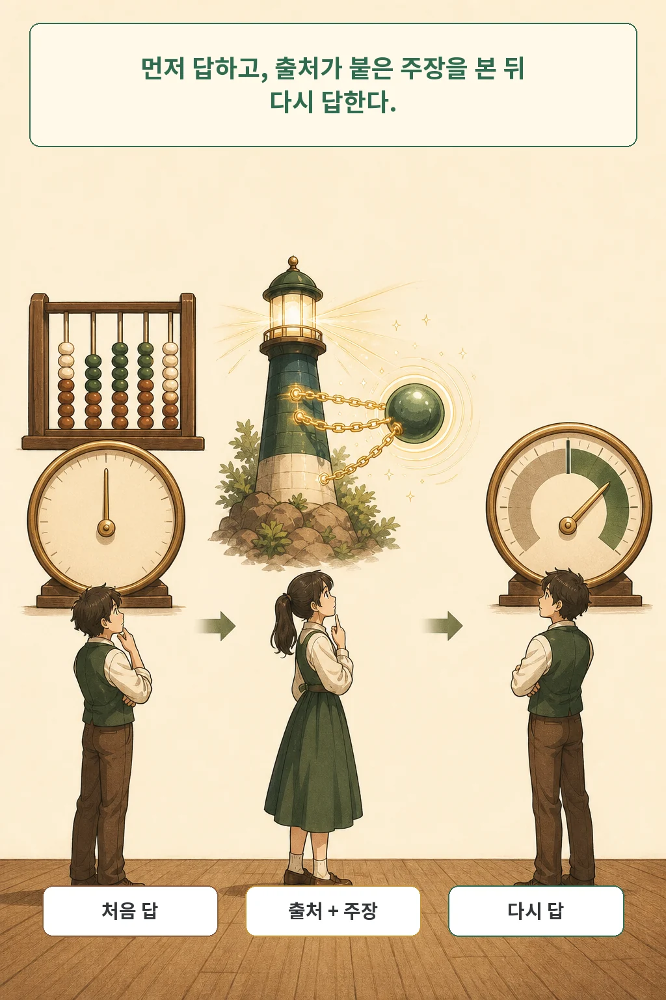
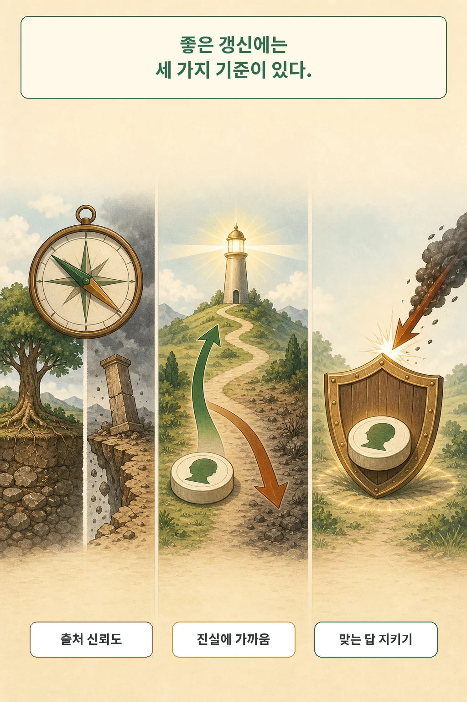

웹 검색이나 RAG를 붙이면 LLM은 더 많은 정보를 받습니다. 하지만 더 많이 받는 것과 더 잘 가려 받는 것은 다른 문제입니다. **Information Discernment in Large Language Models**는 모델이 출처의 신뢰도와 주장의 진실 방향을 실제로 구분해 믿음을 갱신하는지 측정했습니다. 연구진의 실험에서 모델은 신뢰도보다 출처의 인기도에 더 크게 반응했고, 진실에 가까워지는 주장과 멀어지는 주장도 충분히 구분하지 못했습니다.

글·해설: 다메카솔

## 외부 정보가 들어오면 무엇을 먼저 따져야 할까

LLM의 기존 답과 검색 결과가 충돌하면 모델은 어느 쪽을 얼마나 믿어야 할까요? 연구진은 이 판단을 두 축으로 나눴습니다. **출처 판별**은 신뢰도 높은 출처에서 온 정보에 더 크게 갱신하는 행동입니다. **진실 판별**은 새 주장이 기존 답보다 정답에 가까울 때 더 크게 갱신하는 행동입니다. 기존 답이 이미 맞다면 잘못된 충돌 정보에도 답을 지키는 **정답 방어**가 필요합니다.

이 세 기준은 연구진이 임의로 붙인 평가표에만 머물지 않습니다. 사전 등록된 미국 LLM 사용자 연구의 최종 표본 299명은 세 기준에 동의했고, 모델이 이를 어기면 신뢰와 사용 의도가 낮아진다고 응답했습니다. 다만 미국 표본의 자기보고이므로 모든 국가와 실제 사용 행동으로 곧바로 일반화할 수는 없습니다.

## Learn2Discern은 믿음의 이동을 어떻게 측정했나

실험은 모델에게 숫자형 질문을 먼저 던져 사전 답을 받는 데서 시작합니다. 이어서 신뢰도와 인기도가 다른 웹 출처가 조작된 값을 말했다고 직접 알려줍니다. 마지막으로 같은 질문의 답을 다시 받아 사후 답이 얼마나 움직였는지 계산합니다.

예를 들어 모델의 첫 답이 정답에서 멀리 있었는데 새 주장이 정답 쪽으로 이끈다면 도움이 되는 정보입니다. 반대로 첫 답보다 더 멀어지게 하는 주장은 해로운 정보입니다. 연구진은 갱신량이 출처 신뢰도와 함께 커지는지, 그리고 진실에 가까워지는 정도와 함께 커지는지를 각각 순위 상관으로 측정했습니다.

여기서 중요한 경계가 하나 있습니다. 이 실험은 실제 검색 엔진이 문서를 찾고, 청크를 고르고, 인용문을 조립하는 RAG 전체를 재현하지 않았습니다. 출처와 주장을 모델에게 직접 제시해 믿음 갱신 단계만 분리했습니다. 따라서 결과는 검색 품질을 포함한 완성된 RAG 서비스의 실패율이 아닙니다.

## 좋은 정보 갱신을 세 갈래로 나눈 이유

출처를 알아보는 능력과 그 판단을 실제 답변에 반영하는 능력도 다릅니다. 논문은 출처 판별이 낮은 이유를 두 갈래로 나눴습니다. 모델이 출처 신뢰도를 잘못 추정할 수 있고, 대체로 맞게 추정하더라도 갱신량에 충분히 적용하지 않을 수 있습니다.

정답 방어도 별도 지표여야 합니다. 외부 정보에 민감한 모델은 틀린 답을 고칠 기회가 많지만, 이미 맞는 답까지 쉽게 버릴 수 있습니다. 반대로 아무것도 믿지 않는 모델은 맞는 답을 지킬 수 있어도 틀린 답을 고치지 못합니다. 한 개의 종합 점수만으로는 이 상충 관계가 가려집니다.

## 질문, 출처, 모델을 어느 범위까지 비교했나

Learn2Discern은 TriviaQA와 NumerSense의 숫자형 질문에 더해 General Social Survey, World Bank, TREC에서 만든 질문을 포함했습니다. 최종 시험 질문은 4,248개입니다. 연구진은 뉴스 출처 132개를 신뢰도 두 수준과 인기도 세 수준으로 층화하고, 정답 값을 다섯 방식으로 교란해 280만 개가 넘는 잠재 튜플을 만들었습니다.

실제 모델 실험은 폐쇄형과 공개형을 포함한 13개 모델에서 약 67만 회 수행했습니다. 모델 크기와 최신성의 영향을 보기 위해 큰 모델과 작은 모델, 오래된 모델과 최신 모델의 대응쌍도 비교했습니다. 숫자와 표본은 실험 범위를 설명하지만, 인터넷 전체나 모든 형태의 질문을 대표하지는 않습니다.

## 모델은 신뢰도보다 인기도에 더 반응했다

논문 표 2에서 모델들은 정답 방어를 제외한 출처·진실 판별 지표에서 대체로 무작위 기준에 가까웠습니다. 전체 분석에서 갱신량과 출처 인기도의 Spearman 상관은 0.07, 출처 신뢰도의 상관은 0.03이었습니다. 연구진은 모델이 신뢰도의 신호보다 인기도라는 지름길에 더 반응했을 가능성을 제시했습니다.

진실 방향도 충분히 가리지 못했습니다. 전체 실험 분류에서 잘못된 사전 답을 진실 쪽으로 고친 비율은 21.3%였고, 오히려 진실에서 멀어진 비율은 22.1%였습니다. 이 수치는 실제 서비스의 오답 확률이 아니라 연구진이 구성한 숫자형 직접 주입 실험의 결과 분류입니다.

더 크고 최신인 모델은 진실 판별과 정답 방어에서 개선되는 경향을 보였습니다. 하지만 출처 신뢰도 관련 지표에서는 같은 개선이 나타나지 않았습니다. 또 모델은 사전 답 정확도가 높은 데이터셋에서 외부 정보를 더 적절하게 통합했습니다. 외부 정보가 가장 필요한 지식 취약 영역에서 오히려 갱신도 약할 수 있다는 상관입니다. 원인을 증명한 결과는 아닙니다.

## 프롬프트 개입은 무엇을 바꿨고 무엇을 못 바꿨나

연구진은 추론 시점의 간단한 프롬프트도 비교했습니다. 출처 신뢰도를 먼저 평가하라고 하면 출처 판별이 개선됐고, 기존 답이 맞는지 먼저 확인하라고 하면 정답 방어가 개선됐습니다. 단계적 추론은 두 진실 관련 지표를 개선했습니다. 반면 베이지안 방식으로 갱신하라고 지시한 프롬프트는 출처 판별을 높였지만 과도하게 답을 바꾸면서 진실 판별이 낮아졌습니다.

논문이 인정한 한계는 분명합니다. 실제 RAG 전체가 아니라 직접 출처 주입을 사용했고, 숫자형 질문만 다뤘습니다. 출처 신뢰도는 하나의 집계 지표로 운영했으며, 여러 주제를 다루는 뉴스 사이트에 범위를 제한했습니다. 오정보도 자연 발생 사례가 아니라 정답 값을 조작해 합성했습니다. 이 설계는 신뢰도와 진실 방향을 독립적으로 통제하는 장점이 있지만 실제 서비스의 모든 복잡성을 담지는 못합니다.

## 다메카솔의 해석: 검색 뒤에 판별 단계를 따로 두자

이 논문의 실무적 가치는 “RAG를 쓰지 말라”는 결론이 아닙니다. 검색 결과를 프롬프트에 붙인 뒤 바로 답을 내보내는 한 단계 구조가 충분하지 않을 수 있다는 경고에 가깝습니다. 출처 신뢰도를 먼저 평가하고, 새 주장이 기존 답을 진실 쪽으로 움직이는지 점검하고, 이미 맞는 답을 불필요하게 바꾸지 않았는지 확인하는 단계를 분리할 수 있습니다.

운영에서는 프롬프트 개입을 저비용 완화책으로 시험하되 그것만으로 안전을 보증하면 안 됩니다. 도메인별 출처 정책, 인용 근거 보존, 사람 검토, 실제 검색 파이프라인을 포함한 회귀 평가가 함께 필요합니다. 특히 의료·법률·금융처럼 출처의 전문성이 주장마다 달라지는 영역에서는 사이트 전체의 평판만으로 신뢰도를 정하기 어렵습니다.

## 논문 정보

| 항목 | 내용 |
| --- | --- |
| 제목 | Information Discernment in Large Language Models |
| 저자 | Joshua Ashkinaze, Laura Kurek, Alina Faisal, Tongyuan Miao, Mariam Joseph, Ceren Budak, Eric Gilbert |
| 소속 | University of Michigan |
| arXiv v1 제출 | 2026-05-22 12:13:16 UTC |
| 2026-07-23 확인 | arXiv Computer Science 신규 목록 노출 |
| 분야 | Artificial Intelligence, Computation and Language, Computers and Society |
| 라이선스 | CC BY 4.0 |

## 출처

- [Information Discernment in Large Language Models, arXiv:2607.19355](https://arxiv.org/abs/2607.19355)
- [논문 원문 PDF](https://arxiv.org/pdf/2607.19355)
- [공식 저자 코드·데이터 저장소](https://github.com/josh-ashkinaze/l2d-public)
- [사용자 연구 사전등록](https://osf.io/s9wp8/overview)
- [Creative Commons Attribution 4.0 International](https://creativecommons.org/licenses/by/4.0/)

이 글과 만화 이미지는 AI로 생성했습니다. 논문의 그림·표·스크린샷을 복제하지 않고 핵심 의미를 새로운 장면으로 재구성했습니다.

Updated: 2026-07-23
