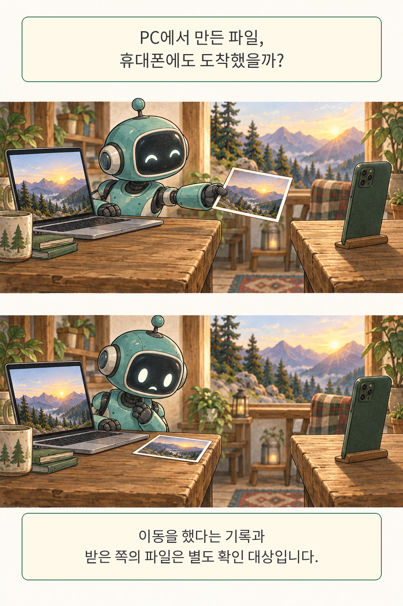
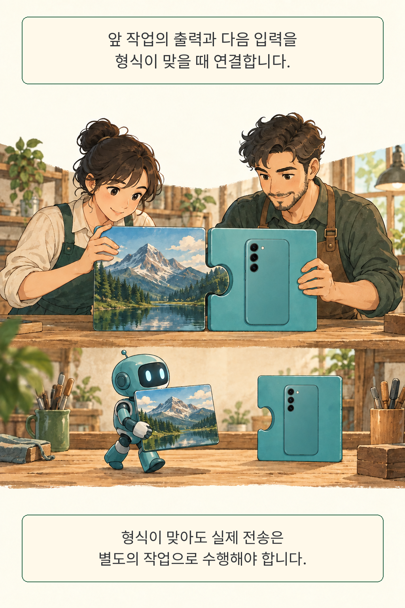
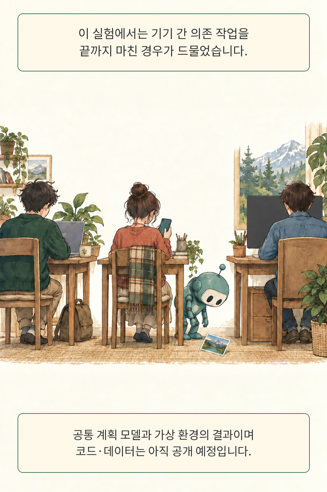

합성 작업 150개 가운데 끝까지 성공한 것은 12개였습니다. 본문 실험에서 가장 높은 전체 성공률을 기록한 HOLO2 구성도 8.0%에 머물렀습니다. 개별 조작이 꽤 능숙해 보여도, 여러 환경을 이어 맡기면 일이 완성되는 비율은 훨씬 낮았습니다. **JarvisGUI**는 Android·Windows·Ubuntu를 오가며 중간 결과를 이어 쓰는 GUI 에이전트의 능력을 이처럼 전체 작업 단위로 시험한 연구입니다.

글·해설: 다메카솔

## 핵심 내용

- JarvisGUI는 작업의 출력과 다음 입력을 형식에 따라 연결하고, 실제 출력값으로 후속 지시와 평가 조건을 구성합니다.
- 본문은 공통 계획 모델 Qwen3-VL-Plus에 여섯 GUI 모델을 연결한 실험입니다. 모델을 단독 실행한 제품 순위와는 조건이 다릅니다.
- 기기 간 의존 과제는 구성별 50개이며, 전체 성공률은 0~2%였습니다.
- 완료 판정에는 최종 파일 내용이나 환경 상태를 검사합니다. 일부 조작 성공만으로 전체 작업을 통과시키지 않습니다.
- 공식 저장소는 확인 시점에 README만 공개했습니다. 아래 수치는 저자 보고이며, 재현 실행은 수행하지 않았습니다.

## 전송했다고 생각한 순간, 다음 작업이 막혔다

PC에서 편집한 사진을 휴대폰으로 옮겨 열어야 한다면, 다음 조작은 휴대폰에 그 사진이 있다는 조건에 달려 있습니다. 파일이 출발지에만 남았다면 앱을 정확히 눌러도 목표를 달성하기 어렵습니다. 도착 여부가 먼저입니다.

저자들이 제시한 실패 사례에서는 에이전트가 파일을 Android로 전송했다고 추론했지만 실제로는 Chrome만 열고 더 진행하지 않았습니다. 이름 변경이나 전송처럼 빠뜨린 단계를 완료한 것으로 간주하면, 뒤의 계획은 존재하지 않는 상태를 바탕으로 이어집니다. 논문 5.3절과 부록 D.2가 보여 주는 구체적인 실패 유형입니다.

만화의 사진 전달은 이 차이를 보이기 위한 재작화입니다. 종이 사진과 책상 사이의 틈은 파일과 기기 사이 인계를 표현하며, 실제 통신 방식이나 논문의 화면을 복제한 장면은 아닙니다. 화면에서 대상을 찾는 방법은 앞서 다룬 [Tactile의 접근성 기반 컴퓨터 조작](/posts/tactile-computer-use-agents/)과 연결되지만, 이번 질문은 그 조작의 결과를 다른 기기까지 이어 갈 수 있는가입니다.

## 출력과 입력의 형식을 맞춰 작업을 엮었다

서로 이어질 작업을 만들려면 무엇을 내보내고 무엇을 받는지부터 정해야 합니다. JarvisGUI는 작업마다 입력 슬롯, 출력 슬롯, 자연어 지시 틀, 평가 함수, 실행 플랫폼을 지정합니다. 앞 작업의 출력 타입이 다음 작업의 입력 타입과 호환되면 연결 후보가 됩니다. 예를 들어 구체적인 스프레드시트 파일 타입을 더 일반적인 파일 입력에 넘기는 식입니다.

연결 뒤에는 값이 움직입니다. 앞 단계에서 나온 실제 값을 다음 지시와 평가 함수에 반영하므로, 처음부터 모든 파일 이름과 결과를 고정한 시나리오와 차이가 있습니다. 다른 기기로 파일을 옮겨야 하는 연결에는 전송 보조 작업도 끼워 넣습니다. 타입이 맞는다는 사실은 전송 성공을 대신하지 않습니다.

저자들은 원자 과제 118개와 합성 과제 150개를 구성했습니다. 합성 과제는 한 기기 안에서 순서가 이어지는 작업, 여러 기기에서 각각 수행하는 독립 작업, 여러 기기의 결과가 서로 필요한 의존 작업으로 나뉘며 각 50개입니다. 이 구분 덕분에 기기가 여러 개라는 부담과 앞 결과를 기다려야 하는 부담을 따로 살펴볼 수 있습니다. 과제 집합 자체도 서로 다르므로 차이 전체를 기기 수만의 인과 효과로 읽는 데에는 한계가 있습니다.

## 받은 쪽의 실제 상태를 검사해야 전체 완료가 된다

“완료했습니다”라는 문장이 최종 판정을 맡는다면 앞의 오류가 그대로 통과하기 쉽습니다. 이 연구의 평가 함수는 최종 환경에서 파일 내용이나 DOM 같은 관찰 가능한 대상을 프로그램으로 검사합니다. 구성 작업 각각에 필요한 모든 조건을 만족해야 전체 성공으로 집계합니다.

부분 성공도 따로 측정합니다. TSR은 전체 과제의 성공 비율이고, SSR은 하위 작업의 완료 정도입니다. 둘을 섞으면 몇 단계를 수행한 시스템이 전체 요청도 끝낸 것처럼 보이기 쉽습니다. 이 글의 비교표는 TSR과 전체 성공 건수를 사용합니다.

SSR은 원문 안에서도 추가 확인이 필요했습니다. 식 3은 과제별 하위 작업 완료 비율의 평균으로 정의하지만, 부록 표 9는 성공한 하위 작업 수를 전체 442개로 나눈 건수와 함께 표시합니다. 과제마다 하위 작업 수가 다르면 두 집계는 달라질 수 있습니다. 공개 데이터가 없어 이 차이를 대조하지 못했으며, SSR을 근거로 추가 결론을 내리는 일은 보류했습니다.

## 기기 간 의존 과제의 성공은 최대 한 건이었다

여섯 구성 모두 기기 간 의존 작업 50개 중 성공률이 0~2%였습니다. 최고값도 50번 가운데 한 번에 해당합니다. 개별 화면 조작의 성과와 인계를 포함한 전체 완수 사이의 간격이 크게 드러납니다.

아래는 arXiv v1의 표 3·9 중 전체 성공 지표를 옮긴 것입니다. 계획은 공통으로 **Qwen3-VL-Plus**가 맡고, 표의 GUI 모델은 클릭 위치 등 구체적인 행동 대상을 정하는 Grounder 역할로 연결됩니다. 따라서 수치는 이 계획·조작 구성과 논문의 가상 환경에 묶여 있습니다.

| GUI 모델 구성 | 원자 과제 전체 성공, 118개 | 합성 과제 전체 성공, 150개 | 기기 간 의존 과제 TSR, 50개 |
| --- | ---: | ---: | ---: |
| UI-Venus-Ground 7B | 44/118 (37.3%) | 2/150 (1.3%) | 0.0% |
| UI-TARS-1.5 7B | 44/118 (37.3%) | 9/150 (6.0%) | 0.0% |
| MAI-UI 8B | 34/118 (28.8%) | 6/150 (4.0%) | 0.0% |
| GUI-OWL 32B | 46/118 (39.0%) | 11/150 (7.3%) | 2.0% |
| Qwen3-VL-Instruct 30B-A3B | 42/118 (35.6%) | 6/150 (4.0%) | 0.0% |
| HOLO2 30B-A3B | 50/118 (42.4%) | 12/150 (8.0%) | 2.0% |

*출처: JarvisGUI v1, 표 3·9. 저자 보고값이며 서로 다른 과제 집합의 결과입니다. 부록 표 9의 HOLO2 합성 과제 TSR 95% 부트스트랩 구간은 4.0~12.7%입니다. 이 구간은 과제 재표집 기준이며 모델을 여러 번 실행했을 때의 변동 범위를 뜻하지 않습니다.*

계획 모델을 바꾸면 얼마나 달라졌을까요? 부록 A.7의 HOLO2 구성에서 Kimi K2.6을 계획 모델로 사용하자 합성 과제 전체 성공률은 8.0%에서 11.3%로 올랐습니다. 기기 간 의존 과제는 두 구성 모두 2.0%였습니다. 저자들이 시험한 추가 구성에서도 인계가 필요한 과제의 어려움은 남았습니다.

실패 원인에 관한 서술은 저자들의 사례 분석입니다. 전송 누락, 잘못된 플랫폼 선택, 중간 파일 위치에 대한 오판이 반복됐다는 관찰은 유용하지만, 각 요인의 독립적인 기여를 실험으로 분리한 증거와는 범위가 다릅니다. 이 결과를 모든 GUI 에이전트나 실제 서비스의 고정 성공률로 확대할 근거는 부족합니다.

### 공개 자료로 확인할 수 있는 범위

공식 저장소의 `48c1c5666848699dbb1e28b83b48e92fa7e1de4b` 커밋에는 README 한 파일만 있었습니다. 2026년 9월 10일 확인 당시 코드와 데이터는 추후 공개 예정이라고 안내합니다. 이번 검토는 원문·표·공식 저장소 범위 확인까지이며, 모델 호출이나 벤치마크 재실행은 포함하지 않았습니다.

재현 환경에도 조건이 붙습니다. 저자들은 Docker와 KVM을 사용하는 가상 머신 자원에 의존한다고 밝혔습니다. 접근성 중심 시나리오, 실제 하드웨어 상황, 비용과 시뮬레이션 제약에 따른 범위도 제한됩니다. 논문 메타데이터에는 EMNLP 2026 Main 채택이 기재돼 있으며, 여기서는 2026년 9월 9일 제출된 arXiv v1을 기준으로 읽었습니다.

## 다메카솔의 해석: 인계 완료를 하나의 상태로 남기자

저는 기기 사이의 인계를 별도 상태 전이로 설계하겠습니다. 파일을 보내는 단계와 받은 쪽이 그 파일을 사용할 준비가 된 단계 사이에 확인 지점을 두는 방식입니다. 파일 식별자, 목적지 경로, 수신 확인, 검증 시점을 함께 남기면 후속 작업이 무엇을 믿고 시작했는지 추적하기 쉬워집니다.

이 판단은 분산 작업의 의존성 관리와 맞닿아 있습니다. 송신 측 로그만으로 목적지 상태를 추정하면 장애가 난 지점을 찾기 어렵습니다. 목적지에서 파일의 존재와 필요한 내용을 확인한 뒤 다음 작업에 넘기고, 확인 실패 시에는 그 인계 단계에서 멈추게 하면 실패 범위가 드러납니다. 상태가 불명확한 재시도에서는 이미 끝난 조작을 중복 수행할 가능성도 점검해야 합니다. [한국 공공 API의 다단계 호출 연구](/posts/korean-public-api-tool-chains/)에서 다룬 앞 결과와 다음 입력의 연결을 GUI로 넓혀 볼 지점입니다.

검사를 늘리면 호출 비용과 대기 시간이 듭니다. 파일을 공유하는 방식, 검사할 내용, 실패 후 재개 위치에 따라 적절한 확인 수준도 달라집니다. 위 설계는 논문이 개선 효과를 측정한 처방이 아니라, 관찰된 실패를 바탕으로 제가 택한 운영 방향입니다.

자동화 데모에서 다음으로 보고 싶은 장면은 목적지 파일을 실제로 여는 순간입니다. 그 한 장면이 붙으면, 사용자는 에이전트가 무엇을 끝냈는지 훨씬 구체적으로 판단할 수 있습니다.

## 출처

- Zixiang Chen 외, [JarvisGUI: Towards Cross-Device GUI Agents with Dynamic Task Composition](https://arxiv.org/abs/2609.10451), arXiv:2609.10451v1. 제출: 2026-09-09 16:59:59 UTC.
- [v1 원문 PDF](https://arxiv.org/pdf/2609.10451v1): 3~5절, 표 2·3, 한계, 부록 A.7의 표 8·9와 D.2의 실패 사례.
- [저자 공식 저장소, 확인한 커밋](https://github.com/BUAA-IRIP-LLM/JarvisGUI/tree/48c1c5666848699dbb1e28b83b48e92fa7e1de4b): README만 공개, 코드·데이터 공개 예정.

작성·자료 확인: 2026-09-10. 만화는 논문의 의미를 새로 그렸으며 원문 그림과 화면을 사용하지 않았습니다.

이 글의 본문과 이미지는 생성형 AI로 제작했습니다. 기획과 편집 기준은 다메카솔이 정했습니다.
