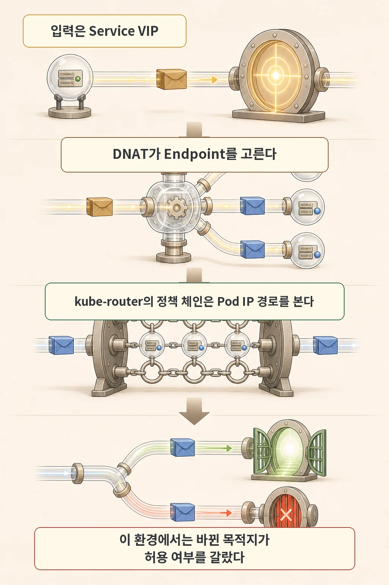
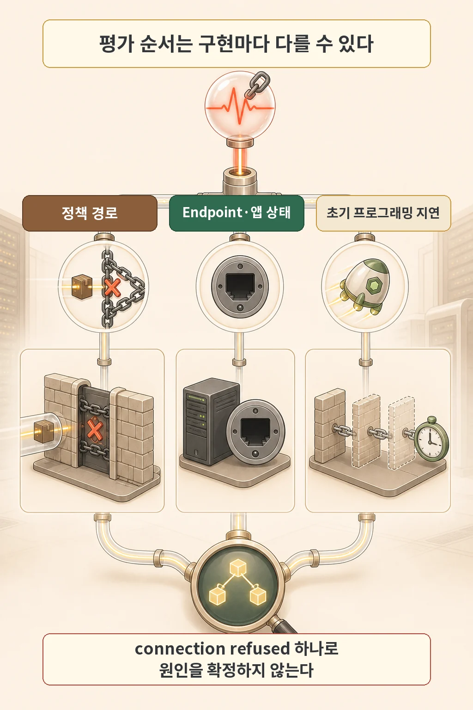

글·해설: 다메카솔

동일한 파드에서 동일한 쿠버네티스 Service 도메인을 호출했는데, **어떤 때는 정상적으로 연결되고 바로 다음 호출에서는 `Connection Refused`가 발생**하는 기괴한 현상을 겪어보신 적 있으신가요?

네트워크 정책(NetworkPolicy) YAML을 아무리 쳐다봐도 Service VIP와 포트는 완벽하게 `allow` 처리되어 있는데도 말이죠.

이 문제의 범인은 바로 **"쿠버네티스 iptables의 DNAT(Destination NAT) 주소 변환과 NetworkPolicy 방화벽 규칙 평가의 선후 관계"**에 있었습니다. 방화벽이 검사하는 주소는 우리가 선언한 'Service 가상 IP(VIP)'가 아니라, **'DNAT을 거쳐 최종 변환된 실제 파드/노드의 엔드포인트 IP'**였기 때문입니다.

이번 글에서는 홈랩 k3s 클러스터에서 간헐적 연결 거부 장애를 추적하고 해결했던 실전 트러블슈팅 경험을 공유합니다.

## 두 번 중 한 번만 실패하는 기괴한 네트워크 장애


CI 러너 파드가 사내 이미지 레지스트리 서비스(`registry.default.svc`)로 이미지를 푸시할 때 간헐적으로 빌드가 깨지는 현상이 발생했습니다.

테스트 파드에서 반복 호출을 날려보니 충격적인 결과가 나왔습니다:
- 12번의 호출 중 **정확히 6번은 성공(200 OK), 6번은 즉시 `Connection Refused`**로 거부되었습니다.

단 한 번의 요청 성공만 보고 "네트워크 정책이 잘 뚫렸네" 하고 넘어가기 십상이지만, 뒤에서는 트래픽이 50% 확률로 드롭되고 있었던 것입니다.

## Service VIP는 껍데기일 뿐: iptables DNAT의 실체



쿠버네티스의 Service ClusterIP(예: `10.43.0.50`)는 물리적으로 존재하는 실제 인터페이스가 아닙니다. 리눅스 커널의 iptables(또는 IPVS) 룰에 의해 등록된 가상 IP일 뿐입니다.

패킷이 Service VIP로 향하면 커널은 다음 과정을 거칩니다:
1. **DNAT(목적지 주소 변환)**: Service VIP를 백엔드에 매달려 있는 실제 파드 IP 목록(`EndpointSlice`) 중 하나로 확률적으로 치환합니다. (예: Pod-A `10.42.1.15` 또는 Pod-B `10.42.2.20`)
2. **NetworkPolicy 방화벽 평가**: CNI 플러그인(kube-router/Calico 등)이 패킷을 검사합니다.

이때 핵심은 **"NetworkPolicy가 패킷을 검사할 때는 이미 목적지 IP가 Service VIP가 아니라 실제 Pod IP로 바뀌어 있다"**는 사실입니다.

만약 NetworkPolicy에 Service VIP 대역만 열어두고 실제 백엔드 파드 셀렉터(`podSelector`)나 노드 IP를 열어주지 않았다면, **패킷이 특정 노드나 외부 엔드포인트로 라우팅되는 순간 방화벽에 걸려 `Connection Refused(REJECT)`로 튕겨 나가게 됩니다.**

## Connection Refused 3단계 감별법



쿠버네티스에서 연결 거부 에러가 떴을 때 다음 순서로 원인을 분리해야 합니다:

### 1단계: 엔드포인트 생존 확인
```bash
// Service에 연결된 실제 백엔드 IP 목록 조회
kubectl get endpointslice -l kubernetes.io/service-name=<서비스명> -o wide
```
백엔드 파드가 준비(`Ready`) 상태인지, 컨테이너 프로세스가 실제로 해당 포트(`targetPort`)를 열고 Listen 중인지 확인합니다.

### 2단계: 반복 호출을 통한 패킷 경로 추적
```bash
// 출발 파드 내부에서 연속 호출 테스트
kubectl exec -it <출발파드> -- sh -c \
  'for i in $(seq 1 10); do curl -s -o /dev/null -w "%{http_code}\n" http://<서비스명>:<포트>; done'
```
특정 엔드포인트로 튈 때만 실패하는지 확인합니다.

### 3단계: 노드 레벨 방화벽 체인 및 ipset 검증
```bash
// 노드에 직접 접속하여 CNI 방화벽 룰과 차단 로그 확인
sudo iptables-save -t filter | grep -E 'KUBE-ROUTER|KUBE-POD-FW'
sudo ipset list
```

## 안전하고 올바른 NetworkPolicy 작성법


동적으로 IP가 바뀌는 쿠버네티스 환경에서는 절대 파드 IP를 하드코딩해서 정책을 뚫으면 안 됩니다:

| 통신 대상 종류 | 권장하는 정책 표현 | 피해야 할 안티패턴 |
| :--- | :--- | :--- |
| **클러스터 내부 파드** | `namespaceSelector` + `podSelector` 조합 | 파드 IP를 `ipBlock.cidr`로 직접 지정 |
| **클러스터 외부 / 노드 IP** | 최소화된 서브넷 단위 `ipBlock.cidr` | 귀찮다고 `0.0.0.0/0` 전체 허용 |
| **Service 포트 매핑** | 컨테이너의 실제 `targetPort` 기준 매칭 | Service의 가상 `port`만 선언 |

```yaml
#--- 올바른 NetworkPolicy 작성 예시 ---
apiVersion: networking.k8s.io/v1
kind: NetworkPolicy
metadata:
  name: allow-to-registry
spec:
  podSelector:
    matchLabels:
      app: ci-runner
  policyTypes:
    - Egress
  egress:
    - to:
        - namespaceSelector:
            matchLabels:
              kubernetes.io/metadata.name: infra
          podSelector:
            matchLabels:
              app: image-registry
      ports:
        - protocol: TCP
          port: 5000
```

## 다메카솔의 해석: 1번의 성공에 속지 않는 방어적 엔지니어링

시니어 엔지니어로서 네트워크 트러블슈팅을 다룰 때 가장 경계해야 할 것은 **"한 번 잘 되니까 정상이다"라는 섣부른 낙관론**입니다.

1. **엔드포인트 분산에 따른 경로 검증**: 라운드로빈 로드밸런싱 환경에서는 최소 N회 이상의 반복 테스트를 수행하여 모든 백엔드 경로가 균일하게 통과하는지 검증해야 합니다.
2. **CNI와 iptables의 패킷 수명주기 이해**: 쿠버네티스의 추상화 계층(Service, Ingress) 아래에서 리눅스 커널이 패킷을 어떻게 조작(DNAT, SNAT)하는지 이해해야 신속한 장애 진단이 가능합니다.
3. **네트워크 정책 적용 후 양방향 검증**: 허용하려던 정상 트래픽이 통과하는지뿐만 아니라, **차단되어야 할 비인가 트래픽이 확실하게 드롭되는지(Negative Test)**까지 확인해야 진정한 보안이 완성됩니다.

## 함께 읽을 네트워크/인프라 글

- [홈랩 쿠버네티스 구축기: CoreDNS 부트스트랩 루프 트러블슈팅](/posts/dns-bootstrap-loop/)
- [K3s etcd 쿼럼 원리와 3노드 HA 아키텍처](/posts/three-node-etcd-quorum-context/)

## 출처

- [Kubernetes Documentation — Network Policies](https://kubernetes.io/docs/concepts/services-networking/network-policies/)
- [Kubernetes Documentation — Virtual IPs and Service Proxies](https://kubernetes.io/docs/reference/networking/virtual-ips/)
- [kube-router Official GitHub Repository](https://github.com/cloudnativelabs/kube-router)

이 글의 본문과 이미지는 생성형 AI로 제작했습니다. 기획과 편집 기준은 다메카솔이 정했습니다.
