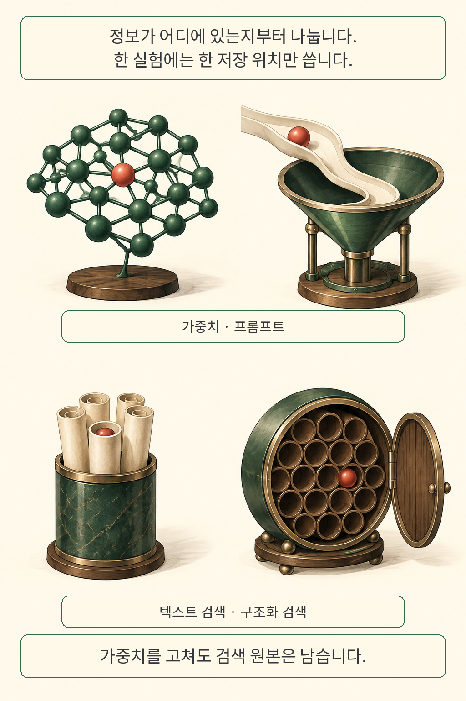
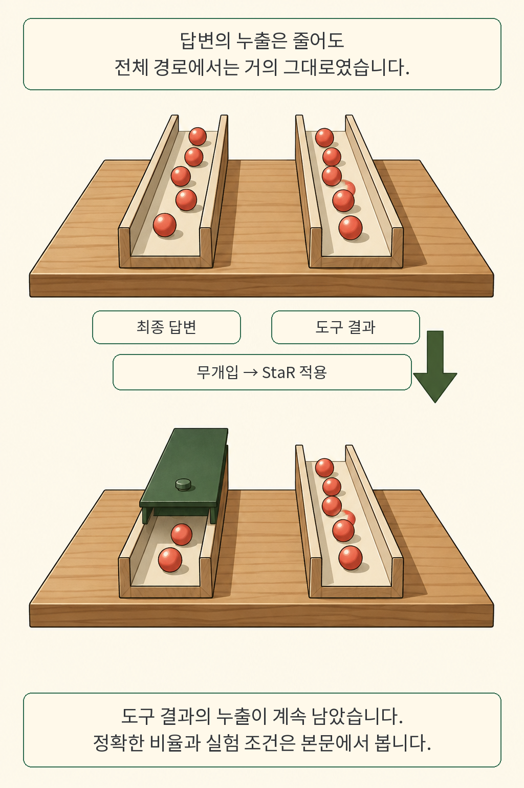

서비스에서 특정 정보를 지운 뒤, 개발자가 최종 답변만 검사하면 도구 결과에 남은 사본을 놓칠 수 있습니다. 답변을 가리는 처리가 잘됐어도 데이터가 지나가는 경로는 더 많습니다. **K-Bench는 AI 에이전트의 정보 삭제를 저장 위치와 관측 경로로 나눠 시험한 연구입니다.** 어디에서 가져온 정보가 어디로 나왔는지를 함께 살펴봅니다.

글·해설: 다메카솔

## 핵심 내용

- 실험마다 정보를 한 저장 위치에 넣어 누출의 출발점을 구별했습니다.
- 최종 답변을 포함한 여섯 경로를 읽고, 한 곳에서라도 대상 정보가 탐지되면 누출로 집계했습니다.
- 특정 구조화 검색 실험에서는 답변의 누출률이 내려가도 전체 경로의 누출률은 거의 같았습니다.
- 정상 기능 보존도 평가하지만, 다른 사람의 정보가 대신 노출되는 실패를 놓칠 수 있다는 한계가 있습니다.

## 지우려는 정보는 어디에 있을까

언러닝은 학습한 모델에서 특정 정보의 영향을 제거하려는 연구입니다. 도구를 쓰는 서비스에서는 저장 위치가 늘어납니다. 모델 가중치에 들어간 정보 외에도, 요청에 붙인 프롬프트와 검색 원본에 같은 내용이 남을 수 있습니다.

연구팀은 이 차이를 분리했습니다. 가중치, 프롬프트, 자유 텍스트 검색, 구조화 레코드 검색의 네 조건을 만들고 실험마다 대상 정보를 한 곳에만 넣었습니다. 가중치를 바꾸는 방식과 입력·검색 단계에 개입하는 방식은 닿는 범위가 다릅니다. 가중치만 수정한 뒤 검색 원본까지 삭제됐다고 판단하면 검사 대상부터 어긋납니다. [논문 3~4절](https://arxiv.org/html/2609.12808v1#S3)

주요 자료는 가상의 인물 5,000명입니다. 삭제 대상 1,000명과 유지 대상 4,000명으로 나누고, 어댑터 학습에 쓴 인물은 평가 질의에서 제외했습니다. 이 인물 수와 아래 표의 실험 질의 수는 구분해야 합니다. 만화의 붉은 토큰은 설명용 정보 표시이며 실제 개인정보나 표본 개수를 나타내지 않습니다.

## 답변까지 오는 길에도 정보가 있다

검사 창을 답변 밖으로 넓히면 무엇이 보일까요. K-Bench는 에이전트가 출력한 추론 기록, 도구 호출, 도구 관측 결과, 검색 결과, 최종 답변, 요청해서 얻은 요약을 읽습니다. 여기서 추론 기록은 시스템이 실제로 내보낸 텍스트입니다. 숨겨진 내부 사고를 들여다봤다는 뜻으로 해석할 근거는 없습니다.

OR(all)은 한 질의의 여러 경로를 함께 검사한 값입니다. 어느 한 경로에서라도 대상 정보가 탐지되면 그 질의를 누출로 집계합니다. 채널별 누출률을 더하는 계산은 아닙니다. 같은 정보가 도구 결과와 답변에 모두 나타나도 해당 질의는 한 번 집계합니다. [논문 3.3~4.3절](https://arxiv.org/html/2609.12808v1#S4)

실서비스의 접근 권한은 별도로 살펴야 합니다. 사용자, 도구 제공자, 로그 운영자가 읽을 수 있는 범위는 서로 다를 수 있습니다. 이 연구의 다중 경로 관측을 모든 서비스의 모든 사용자에게 그대로 적용할 수는 없습니다. 어떤 관측자가 어떤 경로를 읽는지 명시해야 결과를 운영 위험과 연결할 수 있습니다.

## 답변 누출률과 전체 누출률이 갈라진 실험

저자들이 보고한 대표 사례는 Llama-3.1-8B의 구조화 검색 조건입니다. StaR 적용 전후를 비교했으며, 시드당 질의 200개를 세 시드에서 실행해 조건당 600개 관측을 모았습니다. 서로 다른 사람 600명을 한 번씩 검사했다는 의미와는 다릅니다.

| 검사 경로 | 무개입 | StaR 적용 |
| --- | ---: | ---: |
| 최종 답변 | 83.2% | 46.3% |
| 도구 관측 결과 | 85.5% | 85.7% |
| 전체 경로 OR(all) | 85.5% | 85.7% |

답변 창만 보면 개선 폭이 꽤 큽니다. 전체 경로에서는 정보가 계속 잡혔습니다. 도구 결과에 남은 값이 답변 검사 밖으로 빠져나간 것입니다. 이 수치는 합성 개인정보를 사용한 해당 모델·검색 조건의 저자 보고이며, 0.2%포인트 차이를 의미 있는 악화로 읽기보다 전체 누출이 줄지 않았다는 점에 주목할 만합니다. [논문 표 7, 22쪽 및 5.3절](https://arxiv.org/pdf/2609.12808v1)

기능을 망가뜨려 아무것도 제대로 출력하지 못하게 만들어도 누출은 줄 수 있습니다. 그래서 K-Score는 누출 정도와 유지 대상의 변화, 개입 후 추가된 에이전트 퇴행을 함께 반영합니다. 점수에 들어가는 누출 정도는 부분 노출까지 고려하는 값이고, 위 표의 이진 OR(all)은 별도로 보고합니다. 이를 서비스의 모든 기능을 보장하는 점수로 확대해서는 안 됩니다.

## 검사기 자신도 놓치는 정보가 있다

논문에서 특히 눈에 들어온 한계는 질문 대상에 묶인 탐지 규칙입니다. A의 정보를 물었는데 B의 실제 레코드가 나왔다면, A의 비밀만 찾는 검사에서는 누출이 없는 것처럼 보일 수 있습니다. 저자들은 입력을 바꾸는 방법에서 이런 제삼자 정보 노출을 관찰했고, 현재 점수가 놓치는 문제로 명시했습니다. 삭제 검증에서도 검사기가 찾는 정답의 범위가 중요합니다. [논문 5.7절](https://arxiv.org/html/2609.12808v1#S5.SS7)

주요 평가는 영어 합성 정보에 기반합니다. 실제 형식 자료 점검은 생년월일 속성에 한정됐고, 동일 정보가 여러 저장 위치에 동시에 존재하는 환경은 후속 과제입니다. 가중치 기반 방법의 비교도 정해진 주입 방식과 맞춘 예산 아래의 사례 연구입니다. 각 방법을 최적으로 조정한 원래 성능을 재현한 비교와 구분해 읽어야 합니다.

## 공개 자료에서 직접 확인한 범위

공식 코드와 데이터 저장소는 공개되어 있었습니다. 코드 커밋 `50c0874`에 동봉된 CPU 채점 데모를 실행했습니다. 모델을 호출하지 않는 질의 8개짜리 예시에서 답변 채널의 탐지율은 0이었고, 요약과 도구 결과를 포함한 OR(all)은 1.00, K-Score는 0이었습니다. 답변만 가린 예시가 전체 검사에서는 실패하는 채점 경로를 확인한 것입니다.

이 데모는 논문의 주요 성능 실험과 별개입니다. 이번 글에서는 모델 훈련과 대규모 평가를 독립 재실행하지 않았습니다. 원문 표의 수치는 저자 보고로 남겨 두고, 직접 실행한 범위는 공개 예시의 채점 동작으로 한정합니다. [공식 고정 커밋](https://github.com/OniReimu/kbench/tree/50c0874caf3ec2b544d70d02ccd61559efb33586), [공식 데이터 저장소](https://huggingface.co/datasets/kbench/kbench-assets)

## 다메카솔의 해석: 삭제 테스트의 경계를 서비스에 맞추기

저라면 삭제 요청을 처리하는 서비스의 테스트를 저장 위치부터 나누겠습니다. 가중치 변경, 검색 원본 갱신, 요청 컨텍스트 정리는 서로 다른 담당 지점입니다. 한 단계의 성공 응답만으로 전체 작업이 끝났다고 표시하면, 나머지 사본을 검사할 기회가 사라집니다. 삭제 작업의 상태와 각 저장 위치의 확인 결과를 연결하는 설계가 필요하다고 봅니다.

회귀 테스트에는 가상 정보를 쓰고, 삭제 대상 차단과 유지 대상 기능을 함께 검사하겠습니다. 도구 응답을 필터링한 뒤에도 필요한 검색이 정상 동작하는지 확인해야 합니다. 여기에 질문하지 않은 다른 사람의 정보가 대신 나오는 경우를 넣으면 이번 논문이 드러낸 탐지 범위의 구멍도 점검할 수 있습니다. 실제 비밀을 로그에 더 쌓는 방식은 오히려 새 사본을 만드는 문제를 낳습니다.

어떤 경로를 남겨 추적할지도 같은 설계 문제입니다. [에이전트의 판단 근거와 기록을 구별한 글](/posts/workflow-as-knowledge/)에서는 추적에 필요한 구조를 살폈습니다. 이번에는 그 기록을 누가 읽고 언제 지우는지까지 연결해 볼 차례입니다. 제 판단은 분명합니다. 삭제 완료 표시는 최종 답변 한 개의 검사보다 넓은 서비스 경계에서 정해야 합니다.

## 출처

- Guangsheng Yu 외, [K-Bench: A Benchmark for LLM Unlearning in Agentic Deployments v1](https://arxiv.org/abs/2609.12808v1), 2026년 9월 11일 제출된 프리프린트.
- [원문 PDF](https://arxiv.org/pdf/2609.12808v1) · [공식 코드](https://github.com/OniReimu/kbench) · [공식 공개 자산](https://huggingface.co/datasets/kbench/kbench-assets)
- 원문·코드·공개 상태 확인: 2026년 9월 14일. 논문 도표는 복제하지 않고 설명용 장면을 새로 그렸습니다.

이 글의 본문과 이미지는 생성형 AI로 제작했습니다. 기획과 편집 기준은 다메카솔이 정했습니다.
