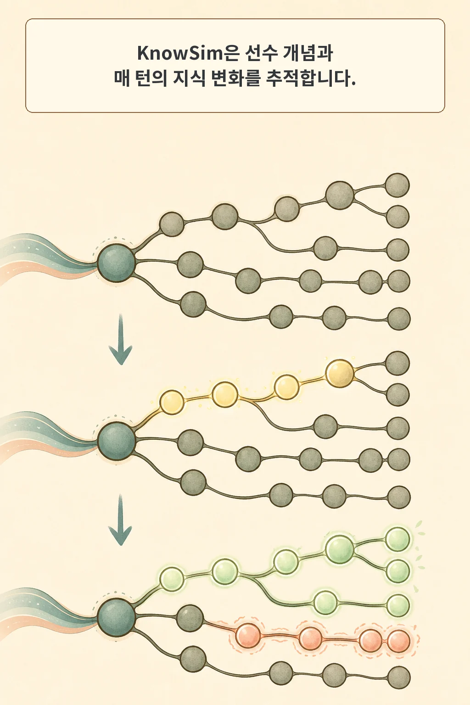
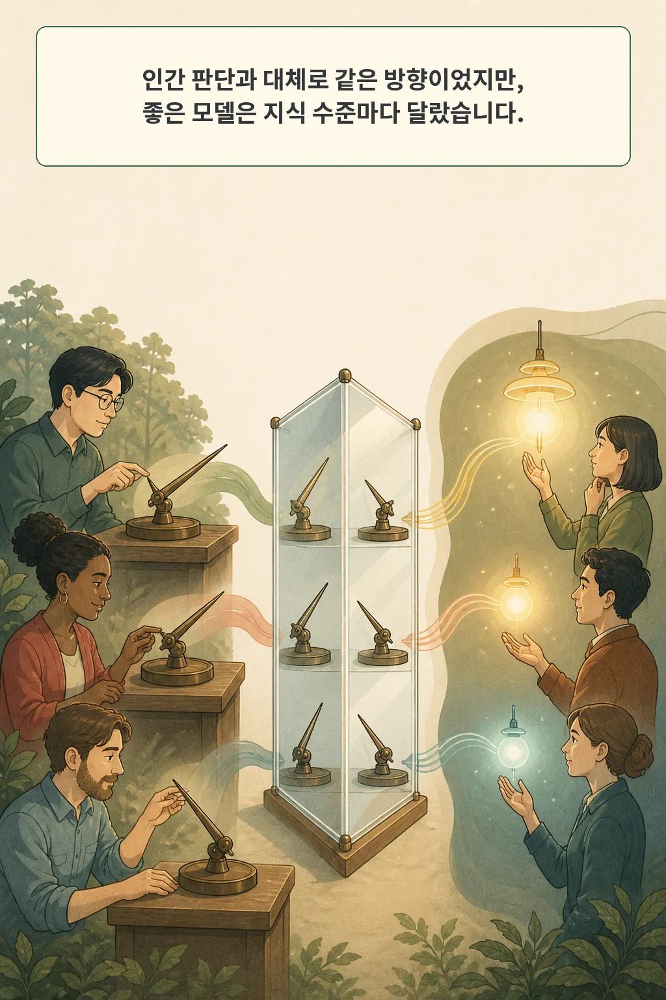

AI가 더 많이 설명하면 사용자가 더 잘 배울 것 같지만, 같은 답변이 초보자에게는 과부하가 되고 숙련자에게는 이미 아는 내용의 반복이 될 수 있습니다. 설명의 품질은 정보량과 현재 지식, 처리 여유가 함께 정합니다. 지금 무엇을 알고 있고, 새 정보를 받아들일 여유가 얼마나 있으며, 대화 중 지식이 어떻게 바뀌는지를 함께 봐야 합니다.

2026년 8월 17일 arXiv에 공개된 **KnowSim: Evaluating Information Calibration in LLM Assistants with User Simulators that Learn**은 이 문제를 `information calibration`, 즉 정보 보정으로 다룹니다. 저자들은 사용자의 지식 상태가 매 턴 변하는 시뮬레이터를 만들고, 인간-AI 대화에서 관찰한 전략 차이와 같은 방향을 잡는지 검증한 뒤 9개 LLM의 설명을 지식 수준별로 비교했습니다.

글·해설: 다메카솔

## 핵심 내용

- KnowSim은 질문을 선수 관계가 있는 개념 그래프로 나누고, 사용자의 개념별 지식 상태를 대화 턴마다 갱신합니다.
- 새 정보인지, 선수 개념으로 이해할 수 있는지, 현재 처리 용량을 넘는지를 함께 보고 지식 증가와 인지 과부하를 계산합니다.
- 245명이 만든 인간-AI 대화 705개와 비교했을 때, 효과가 뚜렷한 조건에서 전략 차이의 방향을 MathQA 73%, ExpertQA 74%로 맞췄습니다.
- 9개 LLM 비교에서는 모든 지식 수준과 지표에서 늘 가장 좋은 단일 모델이 없었습니다.
- 저자들은 이 시뮬레이터가 평가 대리자일 뿐 인간 연구를 대신해서는 안 된다고 명시했습니다.

## 같은 답변이 왜 반대 효과를 낼까

초보자에게는 결론보다 먼저 배워야 할 개념이 있을 수 있습니다. 그 선행 지식 없이 전문 용어와 예외를 한꺼번에 받으면 새 정보가 많아도 흡수하기 어렵습니다. 반대로 숙련자에게 기초 정의부터 길게 반복하면 틀린 설명은 아니어도 새로 얻는 정보가 거의 없습니다.

KnowSim이 겨냥한 정보 보정은 답변을 짧게 만드는 기술과 다릅니다. 좋은 답변은 세 조건을 함께 만족해야 합니다. 사용자에게 새로워야 하고, 이미 아는 선수 개념으로 이해할 수 있어야 하며, 한 번에 처리할 수 있는 범위 안에 들어와야 합니다. 설명의 양·깊이·순서를 현재 지식에 맞춰야 한다는 뜻입니다.

이 관점에서는 평균 만족도 하나로 설명 품질을 판단하기 어렵습니다. 같은 답변이 서로 다른 사용자에게 정반대의 실패를 만들 수 있기 때문입니다. 중요한 질문은 “얼마나 많이 말했는가”가 아니라 “이 사용자가 지금 배울 수 있는 다음 정보였는가”입니다.

## 질문을 선수 개념 그래프로 바꾼다

KnowSim은 한 질문에 필요한 정보를 `Information Unit`, 즉 개념 단위로 나눕니다. 개념들은 독립적인 목록이 아니라 선수 관계를 가진 그래프입니다. 어떤 개념을 이해하려면 먼저 알아야 하는 개념이 무엇인지 연결해 둡니다.

각 개념은 `unaware`, `struggling`, `partial`, `knows_well`의 네 상태 중 하나를 가집니다. 시뮬레이터는 사용자 질문을 만들고 AI 답변을 받은 뒤, 답변이 새 개념을 얼마나 잘 가르쳤는지, 필요한 선수 개념이 준비됐는지, 인지 부하가 처리 용량을 넘었는지를 반영해 상태를 갱신합니다. 이렇게 바뀐 상태가 다음 턴의 질문과 반응에 다시 영향을 줍니다.

평가 지표도 이 궤적에서 나옵니다. 지식 증가(KG)는 대화 뒤 얼마나 배웠는지, 전달 보정(DC)은 현재 상태에 맞는 정보를 줬는지, 인지 과부하(CO)는 처리 용량을 넘겼는지를 봅니다. 상호작용 품질(IQ)은 이 결과를 함께 비교하는 축입니다. 단순히 정답 문장을 포함했는지가 아니라, 사용자가 그 답을 따라가며 실제로 배울 수 있었는지를 평가하려는 구성입니다.

## 인간 대화와 무엇을 비교했나

연구진은 Prolific 참가자 245명에게 세 번씩 AI와 대화하게 해 705개 세션을 모았습니다. 과제는 수학 문제인 MathQA와, 정답의 범위가 더 열린 ExpertQA였습니다. 수학 세션에는 사전·사후 지식 검사가 있었지만 ExpertQA에는 없었습니다. 이 차이 때문에 두 영역의 결과는 같은 종류의 학습 효과로 읽으면 안 됩니다.

실험은 답변 전략과 모델을 바꾸는 네 연구군으로 구성됐습니다. 연구진은 인간 세션에서 조건 A가 조건 B보다 나았는지 방향을 구하고, 여러 사용자 시뮬레이터가 같은 방향을 예측하는지 비교했습니다. 여기서 일치는 조건 간 차이가 어느 쪽인지 잡았다는 뜻입니다. 개별 사용자의 다음 반응을 정확히 맞히는 평가와는 범위가 다릅니다.

효과 크기가 |Cliff's delta| 0.15 이상인 비교에서 KnowSim의 방향 일치율은 MathQA 27/37, 즉 73%, ExpertQA 26/35, 즉 74%였습니다. 두 pooled 검정의 p값은 0.003이었습니다. 공통으로 비교 가능한 상호작용 품질 축에서는 네 연구군을 합친 인간 순위 방향과 77% 일치했다고 저자들은 보고했습니다.

이 수치는 시뮬레이터가 인간을 완전히 재현했다는 증거가 아닙니다. 효과가 비교적 뚜렷한 조건 차이의 방향을 얼마나 잡았는지에 대한 결과입니다. 개인별 행동 예측, 장기 학습, 실제 제품 유지율까지 검증한 것도 아닙니다.

## 좋은 모델은 지식 수준마다 달랐다

저자들은 검증한 KnowSim으로 hosted API의 9개 LLM을 non-thinking 설정에서 비교했습니다. 핵심 결과는 한 모델이 초보자, 중간 수준, 숙련자 모두에게 모든 지표에서 똑같이 좋지 않았다는 것입니다.

초보자 조건에서 DeepSeek V4는 지식 증가 15.5로 가장 높았지만 인지 과부하 0.945로 두 번째로 나빴습니다. 더 많이 가르친 동시에 더 벅찬 설명을 만들었다는 뜻입니다. Gemini 3.1 Pro는 초보자 과부하가 0.875로 가장 낮고 상호작용 품질이 8.39로 가장 높았지만, 초보자 지식 증가에서는 6위였습니다.

숙련자 조건에서는 Gemini 3.1 Pro가 네 지표 평균 순위 1.75로 가장 잘 보정된 모델이었습니다. 초보자에게 가장 많은 지식을 늘린 모델과 숙련자에게 가장 균형 있게 설명한 모델이 달랐습니다. 따라서 “벤치마크 평균 1위 모델”만 고르는 방식으로는 사용자 수준별 실패를 가릴 수 있습니다.

이 결과는 특정 시점의 9개 모델과 두 과제 영역, 논문이 정한 시뮬레이션 조건에 묶여 있습니다. 숫자를 모델의 보편적 성격으로 확대하면 안 됩니다. 더 안전한 결론은 설명 평가를 사용자 지식 수준별로 분해해야 한다는 것입니다.

## 공개 데이터는 있지만 전체 재현을 주장할 수 없다

공식 프로젝트 페이지는 arXiv 논문, GitHub 코드 URL, KnowChat 데이터셋을 연결합니다. 2026년 8월 19일 확인한 KnowChat 저장소는 CC BY-NC 4.0으로 705개 세션을 공개했고, 고정 리비전에는 14개 파일이 있었습니다. 이 글을 준비하며 그 리비전의 파일 목록과 데이터를 보존했습니다.

반면 논문과 프로젝트 페이지가 연결한 `yjo2lee/knowsim` GitHub 저장소는 웹과 GitHub API 모두에서 HTTP 404를 반환했습니다. 공개 인간 대화 자료를 감사할 수는 있지만, 시뮬레이터 실행 코드와 전체 평가 파이프라인은 확보하지 못했습니다. 따라서 이 글은 PDF·TeX·공식 데이터의 주장과 표를 대조했지만 논문 실험을 독립 재현했다고 주장하지 않습니다.

## 시뮬레이터 점수의 경계

논문은 세 가지 중요한 한계를 밝힙니다. 첫째, 좌절과 지루함 같은 동기·감정 역학을 충분히 모델링하지 않습니다. 둘째, 평가 영역은 수학과 ExpertQA 두 종류입니다. 셋째, 실제 서비스에서는 관찰 행동만으로 개인의 초기 지식 상태를 정확히 추정하기 어렵습니다. 여러 LLM 호출이 필요한 계산 비용도 남습니다.

저자들은 윤리 영향에서 KnowSim을 인간 연구를 위한 평가 대리자로 설명하며, 인간 연구의 대체물로 사용해서는 안 된다고 명시했습니다. 시뮬레이터가 인간과 비슷한 조건 순위를 냈더라도, 실제 사람이 좌절해 떠나는지, 설명을 신뢰하는지, 며칠 뒤에도 배운 내용을 기억하는지는 별도의 검증 문제입니다.

## 다메카솔의 해석

제가 실제 AI 제품에 적용한다면 평균 품질 점수 하나를 지식 수준별 대시보드로 나누겠습니다. 초보자·중간 수준·숙련자마다 지식 증가와 과부하를 따로 보고, 같은 모델이라도 설명 길이와 선수 개념 순서를 다르게 실험하겠습니다.

시뮬레이터는 배포 전 많은 후보를 빠르게 거르는 데 쓰고, 최종 결정은 작은 인간 연구와 실제 사용 로그로 확인하겠습니다. 특히 시뮬레이터가 좋아하는 답변과 사용자가 계속 읽는 답변이 어긋날 때는 평균 점수를 높이는 대신 지식 상태 추정과 평가 조건부터 다시 보겠습니다.

여기부터는 논문의 직접 결과가 아니라 운영 설계로 옮긴 제 판단입니다. KnowSim이 주는 가장 유용한 질문은 어떤 모델이 1위인가가 아닙니다. **우리 서비스는 평균 사용자 한 명을 위해 최적화되어 있는가, 아니면 서로 다른 지식 상태를 실제로 보고 있는가?**

## 논문 정보

| 항목 | 내용 |
| --- | --- |
| 제목 | KnowSim: Evaluating Information Calibration in LLM Assistants with User Simulators that Learn |
| 저자 | Yoonjoo Lee, Hyoungwook Jin, Tae Soo Kim, Shaoyang Zhang, Philippe Laban, Q. Vera Liao |
| arXiv v1 제출 | 2026-08-17 21:33:26 UTC |
| 분야 | Artificial Intelligence (cs.AI), Computation and Language (cs.CL), Human-Computer Interaction (cs.HC) |
| 이 글의 분류 | empirical paper |

## 출처

- [KnowSim — arXiv:2608.17150](https://arxiv.org/abs/2608.17150)
- [공식 arXiv PDF](https://arxiv.org/pdf/2608.17150)
- [KnowSim 공식 프로젝트 페이지](https://yoonjoolee.com/knowsim/)
- [저자가 연결한 GitHub 저장소](https://github.com/yjo2lee/knowsim)
- [KnowChat 다중 턴 대화 데이터셋](https://huggingface.co/datasets/yjlee36/knowchat-multi-turn-dialogues)

이 글의 본문과 이미지는 생성형 AI로 제작했습니다. 기획과 편집 기준은 다메카솔이 정했습니다.

논문 그림과 프로젝트 시각물은 복제하지 않고, 검증한 주장만 자체 시각 언어로 재구성했습니다.

Updated: 2026-08-19
