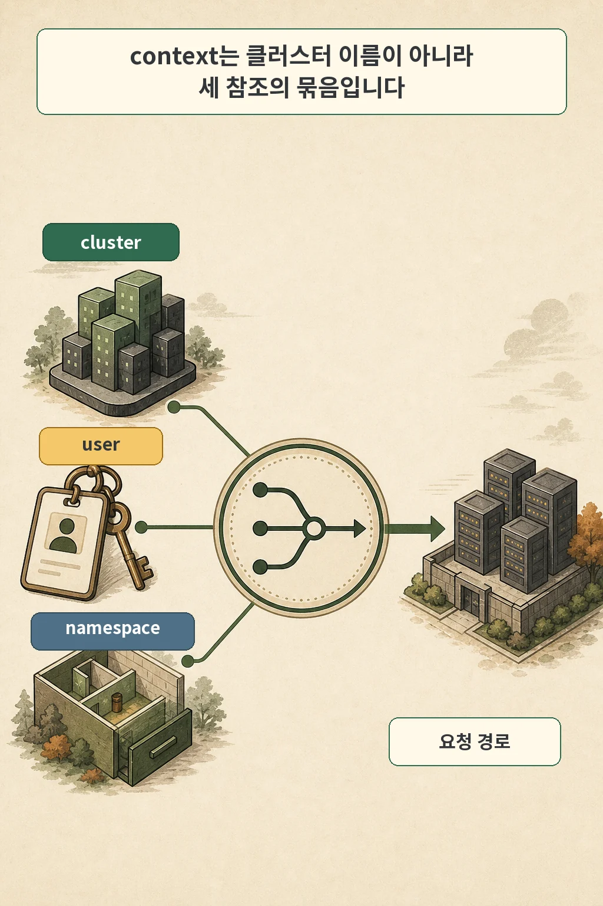
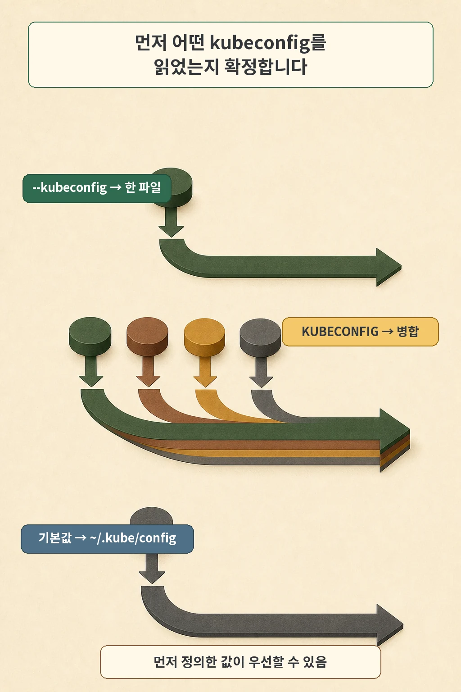
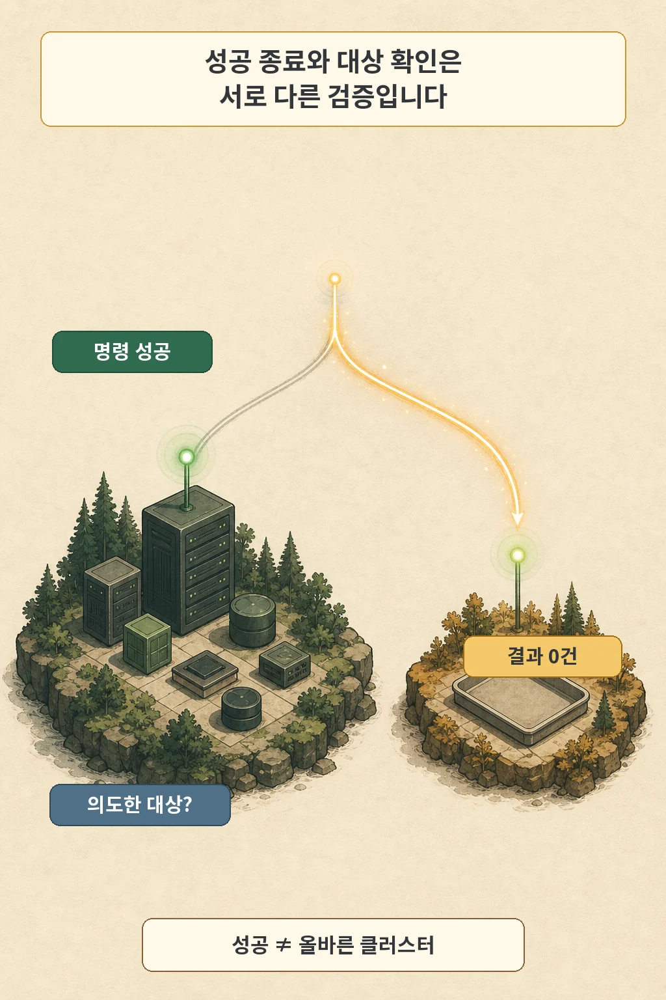
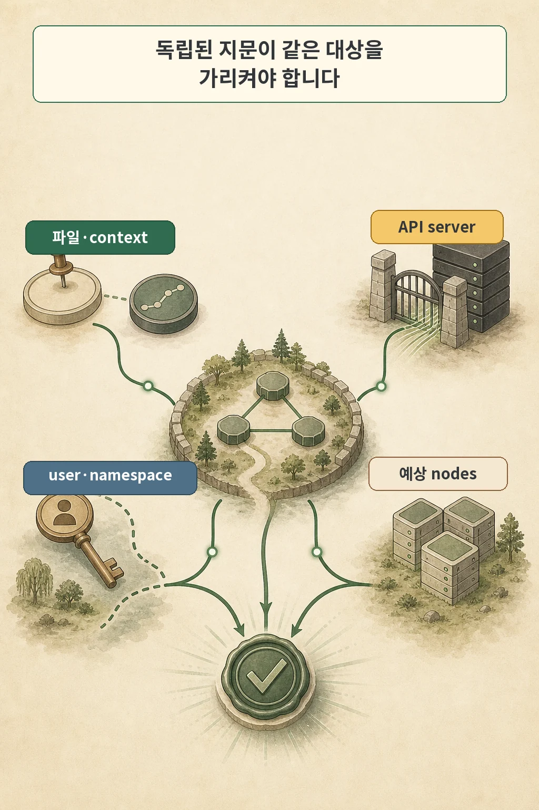

`kubectl get svc -A`가 오류 없이 끝났는데 결과가 비어 있었습니다. 새 홈랩 클러스터에 서비스가 아직 없다고 생각하기 쉬운 장면입니다. 그러나 당시 WSL의 기본 context는 홈랩이 아니라 다른 프로젝트의 로컬 kind 클러스터를 가리키고 있었습니다.

더 위험한 점은 다음 단계였습니다. 조회한 클러스터에서 ServiceAccount JWT를 꺼내 홈랩 Vault의 Kubernetes 인증 입력으로 사용할 계획이었습니다. 실제 반영 전에 잘못된 대상을 알아차려 장애는 없었지만, 정상적인 빈 결과가 잘못된 자격 입력으로 이어질 구조는 이미 만들어져 있었습니다.

이 글의 결론은 간단합니다. **명령의 성공과 대상 클러스터의 확인은 서로 다른 검증입니다.** context 이름만 읽지 말고, 어떤 kubeconfig 파일과 context를 썼는지 고정한 뒤 API server·실효 사용자·namespace·예상 노드를 함께 확인해야 합니다.

글·해설: 다메카솔


## context는 클러스터가 아니라 세 참조의 묶음입니다



kubectl은 kubeconfig에서 API server와 인증 정보를 찾아 Kubernetes API에 요청합니다. 여기서 context는 다음 세 참조를 묶는 이름입니다.

| context 구성 | 답하는 질문 |
| --- | --- |
| `cluster` | 어느 API server와 어떤 TLS 설정을 사용할 것인가 |
| `user` | 어떤 자격과 사용자로 인증할 것인가 |
| `namespace` | namespace를 생략한 요청의 기본 범위는 어디인가 |

`current-context`는 이 묶음 가운데 기본으로 사용할 context 이름입니다. 따라서 이름이 `homelab-prod`라고 적혀 있어도 그 문자열만으로 홈랩을 증명하지는 못합니다. context는 임의로 붙일 수 있는 라벨이고, kubeconfig가 바뀌면 같은 이름이 다른 cluster나 user를 가리킬 수 있습니다.

먼저 사람이 현재 유효 설정을 살펴볼 때는 다음 명령을 사용할 수 있습니다.

```bash
kubectl config get-contexts
kubectl config current-context
kubectl config view --minify
```

`config view --minify`는 current-context에서 쓰지 않는 항목을 제거해 보여 줍니다. 전체 출력에는 endpoint와 사용자 식별자처럼 내부 정보가 포함될 수 있으므로 공개 로그에 그대로 붙이지 않습니다. 특히 `--raw`는 raw byte와 민감 데이터를 표시하는 옵션이므로 일반 점검 명령에 추가하지 않습니다.

## 어떤 kubeconfig를 읽었는지부터 확정합니다



`~/.kube/config`만 확인하고 안심할 수 없는 이유가 있습니다. kubectl이 설정을 고르는 순서는 다음과 같습니다.

1. `--kubeconfig`가 있으면 지정한 파일 하나만 읽고 병합하지 않습니다.
2. 그렇지 않고 `KUBECONFIG` 환경 변수가 있으면 목록에 든 파일을 병합합니다.
3. 둘 다 없으면 기본 파일인 `$HOME/.kube/config`를 읽습니다.

`KUBECONFIG`의 구분자는 Linux·macOS에서는 콜론, Windows에서는 세미콜론입니다. 병합할 때 같은 값이나 map key를 여러 파일이 정의하면 먼저 설정한 파일의 값이 우선할 수 있습니다. 파일 목록의 순서가 실제 `current-context`, cluster, user 연결에 영향을 주는 셈입니다.

context 선택에도 우선순위가 있습니다. 명령에 `--context`를 주면 병합된 설정의 `current-context`보다 우선합니다. 자동화에서 대상 파일과 context를 함께 고정하는 이유입니다.

```bash
KCFG="$HOME/.kube/homelab.yaml"
CTX="homelab-admin"

kubectl --kubeconfig "$KCFG" --context "$CTX" config view --minify
```

위 이름은 형식 예시입니다. 실제 endpoint, context, user와 노드 이름은 공개 저장소나 일반 로그에 남기지 않습니다. 또한 출처를 신뢰할 수 없는 kubeconfig는 단순 데이터 파일로 취급하면 안 됩니다. Kubernetes 공식 문서는 조작된 kubeconfig가 코드 실행이나 파일 노출을 일으킬 수 있으므로 셸 스크립트처럼 검토하라고 경고합니다.

## 빈 결과는 대상 증명이 아닙니다



목록 요청에서 0건은 충분히 정상일 수 있습니다. 새 namespace이거나 selector와 일치하는 객체가 없을 수 있습니다. 문제는 그 결과가 다음 두 문장을 구분하지 못한다는 데 있습니다.

- 선택된 API server가 요청을 정상 처리했고 결과가 0건이다.
- 내가 의도한 클러스터에 결과가 0건이다.

첫 문장이 참이어도 두 번째 문장은 거짓일 수 있습니다. 권한 오류나 연결 오류라면 자동화가 멈추지만, 잘못된 클러스터가 정상적으로 빈 목록을 반환하면 다음 단계가 계속 진행됩니다. 그래서 `exit code 0`은 API 요청 성공의 신호로는 쓸 수 있어도 대상 신원의 신호로는 부족합니다.

0건을 의사결정에 사용하는 작업에는 별도 계약이 필요합니다.

| 작업 | 0건의 의미 | 처리 |
| --- | --- | --- |
| 새 namespace의 초기 확인 | 허용될 수 있음 | 대상 지문 통과 뒤 계속 |
| 배포 전 필수 controller 확인 | 비정상 | 즉시 중단 |
| token을 얻을 ServiceAccount 검색 | 비정상 | 자격 추출 금지 |
| 삭제 대상 조회 | 위험한 모호성 | 대상·namespace 재확인 |

“결과가 비어도 성공”인 조건을 코드에 적지 않았다면, 자동화는 빈 결과를 판단 재료가 아니라 조사 신호로 취급하는 편이 안전합니다.

## 최소 네 가지 지문을 같은 호출에서 확인합니다



쓰기나 자격 추출 전에 확인할 지문은 서로 다른 실패를 잡아야 합니다.

| 지문 | 확인하는 위험 | 예시 명령 |
| --- | --- | --- |
| kubeconfig와 context | 암묵적 기본값·잘못된 병합 | `--kubeconfig`, `--context` 고정 |
| API server | 같은 이름이 다른 endpoint를 가리킴 | `config view --minify`, `cluster-info` |
| 실효 사용자와 namespace | 올바른 서버에 잘못된 권한·범위로 접근 | `auth whoami`, context namespace |
| 예상 노드 | 다른 클러스터가 정상 응답 | `get nodes -o name` |

다음처럼 확인과 조회에 같은 인자 묶음을 사용합니다.

```bash
KCFG="$HOME/.kube/homelab.yaml"
CTX="homelab-admin"
K=(kubectl --kubeconfig "$KCFG" --context "$CTX")

"${K[@]}" config view --minify \
  -o jsonpath='{.current-context}{"\n"}{.clusters[0].cluster.server}{"\n"}{.contexts[0].context.user}{"\n"}{.contexts[0].context.namespace}{"\n"}'
"${K[@]}" cluster-info
"${K[@]}" auth whoami
"${K[@]}" get nodes -o name
```

`auth whoami`는 API server가 SelfSubjectReview로 인식한 실효 사용자 정보를 보여 줍니다. 클러스터 버전이나 권한에 따라 사용할 수 없다면 실패를 무시하지 말고 그 환경의 인증 확인 절차를 정해야 합니다. `cluster-info`와 노드 목록도 내부 endpoint와 호스트명을 드러낼 수 있으므로 CI 로그의 공개 범위를 먼저 확인합니다.

노드 이름의 효용도 환경마다 다릅니다. 세 대가 고정된 홈랩에서는 정확한 노드 집합이 강한 지문입니다. autoscaling과 교체가 잦은 클러스터에서는 정확한 이름 대신 허용된 role·label·개수 범위처럼 변화 가능한 계약을 정의해야 합니다. 한 지문에 모든 환경을 맞추는 것이 아니라, 독립된 단서 여러 개가 같은 대상을 가리키게 만드는 것이 목적입니다.

## fail-closed preflight를 쓰기와 분리합니다


사람이 화면을 보고 “맞아 보인다”고 판단하는 단계는 자동화에서 사라지기 쉽습니다. 위험한 동작 앞에는 불일치하면 종료하는 preflight를 둡니다. 다음은 WSL이나 Bash 기반 CI에서 사용할 수 있는 뼈대입니다.

```bash
set -euo pipefail

: "${KCFG:?set KCFG to one trusted kubeconfig file}"
: "${CTX:?set CTX to the approved context}"
: "${EXPECTED_SERVER:?set EXPECTED_SERVER}"
: "${EXPECTED_NODES_FILE:?set EXPECTED_NODES_FILE}"

K=(kubectl --kubeconfig "$KCFG" --context "$CTX")

actual_server="$("${K[@]}" config view --minify \
  -o jsonpath='{.clusters[0].cluster.server}')"
if [[ "$actual_server" != "$EXPECTED_SERVER" ]]; then
  printf 'target mismatch: API server\n' >&2
  exit 42
fi

actual_nodes="$("${K[@]}" get nodes -o name | LC_ALL=C sort)"
expected_nodes="$(LC_ALL=C sort "$EXPECTED_NODES_FILE")"
if [[ "$actual_nodes" != "$expected_nodes" ]]; then
  printf 'target mismatch: node set\n' >&2
  exit 43
fi

"${K[@]}" get svc -A
```

`EXPECTED_NODES_FILE`에는 자격 값이 아니라 승인한 `node/<name>` 목록만 둡니다. 운영 환경에서 노드가 유동적이면 앞서 설명한 role·label·개수 계약으로 바꿉니다. PowerShell이나 다른 CI에서도 핵심은 같습니다. kubeconfig와 context를 변수로만 확인하고 버리지 말고, 이후 모든 kubectl 호출에 같은 두 인자를 다시 전달합니다.

이 예시는 마지막에 읽기만 수행합니다. token 추출, Secret 변경, 삭제와 배포 같은 실제 상태 변경은 별도 승인 단계로 분리합니다. preflight가 통과했다는 사실이 작업 내용까지 안전하다는 뜻은 아닙니다. 대상 검증과 변경 검토는 서로 다른 관문입니다.

## 운영에서 남길 규칙

1. 자동화는 `--kubeconfig`와 `--context`를 모든 kubectl 호출에 명시합니다.
2. context 이름 하나가 아니라 API server와 실효 사용자·namespace를 함께 확인합니다.
3. 고정 홈랩은 예상 노드 집합을, 동적 클러스터는 role·label·개수 범위를 지문으로 사용합니다.
4. 0건을 정상으로 허용하는 조건과 예상 개수를 작업마다 선언합니다.
5. 조회 결과가 자격 추출·삭제·쓰기의 입력이 되기 전에 fail-closed preflight를 다시 통과합니다.
6. kubeconfig 원문, token, client key와 `--raw` 출력은 일반 로그에 남기지 않습니다.
7. 출처가 불명확한 kubeconfig는 실행 가능한 파일처럼 검토합니다.

이 홈랩에서는 로컬 kubeconfig에 운영 대상을 합치지 않고 SSH로 노드에 접속해 `sudo k3s kubectl`을 사용하는 정책도 택했습니다. 로컬 kind와 홈랩이 섞일 경로를 줄이기 위한 선택이었지만 보편적인 유일 해법은 아닙니다. 별도 kubeconfig 파일, 명시적 context, 권한이 제한된 사용자, CI 실행 환경 분리도 같은 목적을 달성할 수 있습니다.

중요한 것은 context 전환을 잘 외우는 일이 아닙니다. **읽기와 쓰기가 끝날 때까지 동일한 대상 식별자를 호출에 고정하고, 그 대상이 맞지 않으면 성공하지 못하게 만드는 것**입니다.

## 자주 묻는 질문

### `--context`만 붙이면 충분한가요?

실수를 크게 줄이지만 context가 어떤 cluster와 user를 가리키는지는 kubeconfig에 달려 있습니다. 자동화에서는 `--kubeconfig`도 함께 고정하고 API server 같은 독립 지문을 대조하는 편이 안전합니다.

### `kubectl config current-context`가 맞으면 된 것 아닌가요?

그 명령은 현재 context 이름을 보여 줍니다. `KUBECONFIG` 병합 결과와 그 이름이 가리키는 cluster·user·namespace까지 확인해야 실제 요청 경로를 알 수 있습니다.

### `kubectl config view --raw`로 보면 더 정확하지 않나요?

공식 문서상 `--raw`는 raw byte와 민감 데이터를 표시합니다. 일반 점검과 CI 로그에는 사용하지 말고, `--minify`와 필요한 JSONPath 필드만 사용합니다.

### 노드 목록을 볼 권한이 없으면 어떻게 하나요?

권한을 무리하게 넓히기보다 해당 계정이 읽을 수 있는 안정적인 환경 식별자를 별도로 설계해야 합니다. context·endpoint·실효 사용자 확인을 유지하고, 플랫폼 팀이 제공하는 허용된 sentinel이나 metadata 계약을 사용합니다.

### kubeconfig 파일을 하나로 합치면 편하지 않나요?

편의성은 높지만 잘못된 기본 context와 이름 충돌의 영향도 커집니다. 하나로 합치더라도 위험한 자동화는 명시적인 파일·context·지문 검증을 사용합니다.

## 출처

- [Kubernetes: The kubectl command-line tool](https://kubernetes.io/docs/concepts/overview/kubectl/)
- [Kubernetes: kubeconfig v1 API](https://kubernetes.io/docs/reference/config-api/kubeconfig.v1/)
- [Kubernetes: Organizing Cluster Access Using kubeconfig Files](https://kubernetes.io/docs/concepts/configuration/organize-cluster-access-kubeconfig/)
- [Kubernetes: kubectl config view](https://kubernetes.io/docs/reference/kubectl/generated/kubectl_config/kubectl_config_view/)
- [Kubernetes: kubectl config current-context](https://kubernetes.io/docs/reference/kubectl/generated/kubectl_config/kubectl_config_current-context/)
- [Kubernetes: kubectl cluster-info](https://kubernetes.io/docs/reference/kubectl/generated/kubectl_cluster-info/)
- [Kubernetes: Authenticating](https://kubernetes.io/docs/reference/access-authn-authz/authentication/)

기술 설명은 2026년 7월 25일 확인한 Kubernetes 공식 문서를 기준으로 작성했습니다. kubectl 버전과 인증 방식에 따라 사용할 수 있는 명령과 출력이 달라질 수 있으므로 실제 자동화에 적용하기 전 현재 환경에서 읽기 전용으로 시험해야 합니다. 내부 kubeconfig, token, 사설 endpoint와 노드 이름은 공개하지 않았습니다.

이미지는 생성형 AI로 만든 텍스트 없는 원화에 결정적 레터링을 합성해 제작했습니다. 공식 로고·UI·문서 도표·외부 이미지 자산은 사용하지 않았습니다.
