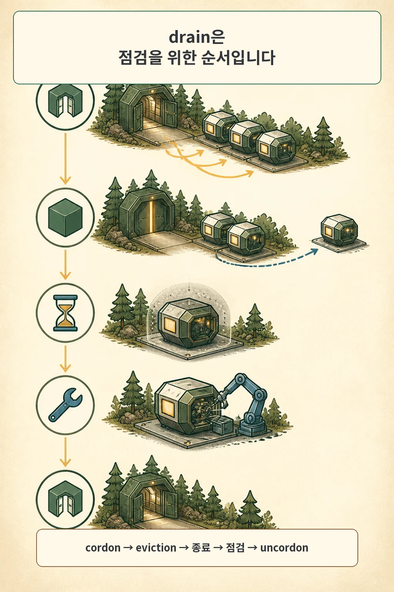

---
title: "kubectl drain이 멈췄을 때 PDB를 우회하기 전에 확인할 것"
description: "drain 정체를 파드 소유자, PDB, 로컬 데이터, 종료 유예로 나누고 force와 eviction 우회 옵션의 차이를 정리합니다."
searchTitle: "kubectl drain 멈춤 PDB 확인 순서"
slug: "kubectl-drain-pdb-checklist"
publishedAt: 2026-08-26
updatedAt: 2026-08-26
track: tech_column
subtype: how_to
category: infrastructure
tags:
  - "Kubernetes"
  - "운영 자동화 안전"
  - "고가용성"
audience: developer
readerOutcome: "drain 정체를 원인별로 진단하고 --disable-eviction의 영향 범위를 확인한 뒤에만 중단을 승인한다."
contentFormats:
  - article
  - comic
  - diagram
  - checklist
freshnessStatus: current
reviewedAt: 2026-08-09
reviewAfter: 2027-02-09
cover: "./cover.webp"
coverAlt: "남성 카솔이 멈춘 drain 흐름과 네 갈래 진단 경로를 살피는 표지"
sourceUrl: "https://kubernetes.io/docs/reference/kubectl/generated/kubectl_drain/"
featured: false
draft: true
---

글·해설: 다메카솔

`kubectl drain`이 같은 파드 이름을 반복해 보여 주면 강한 옵션부터 붙이고 싶어집니다. 그 전에 멈춘 이유를 네 갈래로 나누면, 필요한 옵션과 감수하는 위험이 달라집니다. `--force`와 `--disable-eviction`도 이름은 비슷하게 거칠지만 서로 다른 보호 장치를 다룹니다.


## drain이 하는 일을 먼저 봅니다

drain은 노드를 유지보수할 수 있는 상태로 만드는 절차입니다. 먼저 노드를 unschedulable로 표시해 새 일반 파드가 들어오지 않게 하고, 기존 파드는 eviction API 또는 delete로 제거합니다. 파드의 graceful termination이 끝날 때까지 기다린 뒤에야 명령이 완료됩니다. 유지보수가 끝나면 `kubectl uncordon`으로 다시 스케줄 가능하게 돌려야 합니다.

```bash
kubectl drain <node> --ignore-daemonsets
: "유지보수"
kubectl uncordon <node>
```



출력에 `evicting pod`가 보인다는 것은 적어도 대상 파드를 골라 eviction을 시도하는 단계까지 왔다는 뜻입니다. 여기서 기다린다면 PDB, 대체 파드의 준비, 종료 유예를 차례로 봅니다. 시작하기도 전에 거부되면 DaemonSet, unmanaged Pod, emptyDir 같은 사전 조건일 가능성이 큽니다.

## 네 갈래로 원인을 좁힙니다

### 1. 이 파드는 누가 관리합니까

DaemonSet 파드는 노드마다 다시 만들어지는 성격이라 drain이 삭제하지 않습니다. `--ignore-daemonsets`는 그 존재를 알고 계속 진행하라는 뜻입니다. DaemonSet 파드를 없애는 옵션이 아닙니다.

ReplicaSet, StatefulSet, Job 같은 컨트롤러가 관리하지 않는 파드가 있으면 drain은 기본적으로 멈춥니다. 이때 `--force`는 그 unmanaged Pod를 삭제할 수 있도록 허용합니다. 삭제 뒤 새 파드를 만들어 줄 소유자가 없다는 뜻이므로, 먼저 재생성 방법을 확보해야 합니다.

```bash
kubectl get pod <pod> -n <namespace> \
  -o jsonpath='{.metadata.ownerReferences[*].kind}'
```

### 2. PDB가 지금 몇 개의 중단을 허용합니까

```bash
kubectl get pdb -A
kubectl describe pdb <pdb> -n <namespace>
```

`disruptionsAllowed`가 0이면 eviction API는 기다리는 것이 정상입니다. 대체 replica가 Ready가 되지 못했거나, 정책 자체가 `maxUnavailable: 0`일 수 있습니다. PDB가 선택하는 라벨과 실제 파드 라벨도 함께 확인합니다.

### 3. 노드 로컬 데이터가 있습니까

emptyDir 데이터가 있는 파드는 노드를 떠날 때 그 내용을 잃습니다. `--delete-emptydir-data`는 그 손실을 알고 삭제하겠다는 승인입니다. PVC 데이터와는 다른 문제입니다. 플래그를 붙이기 전에 emptyDir에 캐시만 있는지, 아직 처리하지 않은 작업이 있는지 확인합니다.

### 4. 종료가 오래 걸리는 중입니까

파드가 이미 종료 신호를 받았다면 `terminationGracePeriodSeconds`, preStop hook, 애플리케이션 종료 로그를 봅니다. PDB가 허용한 뒤에도 프로세스가 연결을 정리하거나 데이터를 flush하느라 기다릴 수 있습니다. 이 경우 PDB를 지워도 종료 시간은 줄지 않습니다.


## force는 PDB 우회가 아닙니다

가장 자주 섞이는 두 옵션을 분리해 놓겠습니다.

| 옵션 | 해결하는 조건 | 건너뛰는 보호 |
| --- | --- | --- |
| `--force` | 컨트롤러가 없는 unmanaged Pod | 재생성 소유자가 없다는 경고 |
| `--disable-eviction` | eviction API 대신 delete 사용 | PDB의 가용성 검사 |
| `--delete-emptydir-data` | emptyDir 데이터가 있는 Pod | 노드 로컬 임시 데이터 보존 |

`--disable-eviction`은 PDB를 무시합니다. 단일 replica를 내리면 서비스가 멈출 수 있고, 여러 replica라도 현재 healthy 수가 부족하면 허용 범위를 넘어설 수 있습니다. 그래서 명령 앞에 승인 문장을 적는 편이 좋습니다.

> 이 파드를 삭제하면 어떤 기능이 얼마나 오래 중단되는가? 데이터는 어느 계층에서 복구되는가? 실패하면 되돌리는 명령은 무엇인가?


제 홈랩에서는 2026년 7월 drain이 `vault-0` eviction에서 멈췄습니다. 원인은 단일 Vault를 선택한 PDB의 `maxUnavailable: 0`이었습니다. `--force`를 붙여도 해결할 문제가 아니었습니다. PDB를 잠시 제거하거나 `--disable-eviction`으로 우회하면서 Vault 중단을 받아들여야 했습니다. 이후 3노드·3멤버로 바꿔 한 멤버의 중단 여유를 만들었습니다.

마지막으로 제가 쓰는 순서를 짧게 남깁니다.

```text
대상 파드와 소유자 확인
→ PDB 선택자와 disruptionsAllowed 확인
→ 대체 replica의 Ready 및 배치 노드 확인
→ emptyDir와 종료 유예 확인
→ 예상 중단과 복구 절차 기록
→ 필요한 옵션 하나만 선택
→ 점검 후 uncordon과 워크로드 상태 확인
```

drain이 멈춘 것은 운영을 방해하는 현상일 수도 있지만, 지키기로 한 조건을 아직 만족하지 못했다는 신호일 때가 많습니다. 우회 옵션은 마지막 단계에 놓고, 어떤 보호를 건너뛰는지 이름 붙인 뒤 실행하는 편이 안전합니다.

## 함께 읽을 글

- [PodDisruptionBudget는 무엇을 보장하나: maxUnavailable 0의 의미](/posts/poddisruptionbudget-zero-eviction/): `disruptionsAllowed`가 만들어지는 범위를 설명합니다.
- [replica 1은 같은 뜻이 아니었습니다: Vault PDB 앞에서 멈춘 drain](/posts/replica-layer-pdb-drain/): 이 체크리스트가 나온 실제 홈랩 사건입니다.

## 출처

- [Kubernetes: kubectl drain](https://kubernetes.io/docs/reference/kubectl/generated/kubectl_drain/)
- [Kubernetes: Specifying a Disruption Budget for your Application](https://kubernetes.io/docs/tasks/run-application/configure-pdb/)
- [Kubernetes: Disruptions](https://kubernetes.io/docs/concepts/workloads/pods/disruptions/)
- 개인 인프라 실패 패턴 원장 H-05, 2026-07-14

옵션 의미는 2026년 8월 9일 Kubernetes 공식 문서에서 다시 확인했습니다. 배포판과 버전에 따라 지원 옵션과 기본 동작을 확인해야 합니다.

이 글의 본문과 이미지는 생성형 AI로 제작했습니다. 기획과 편집 기준은 다메카솔이 정했습니다. 만화 이미지는 텍스트 없는 원화에 결정적 레터링을 합성해 만들었습니다. 공식 로고·UI·문서 도표 등 외부 이미지 자산은 사용하지 않았습니다.

