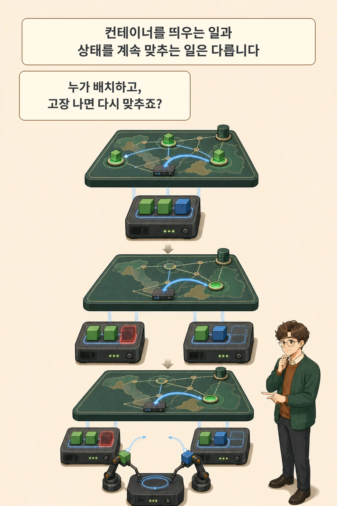
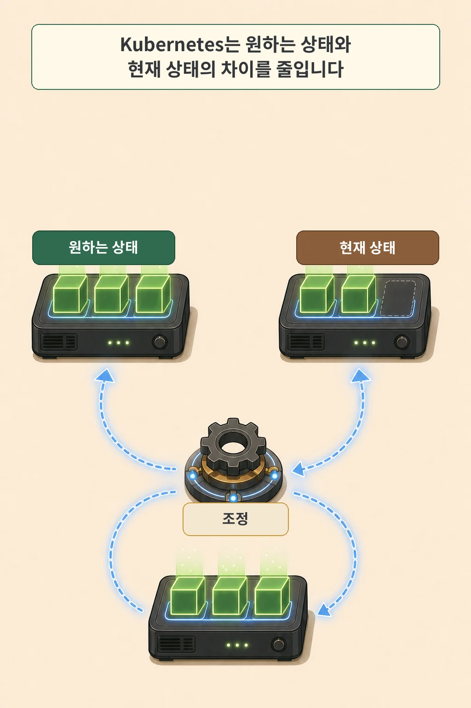
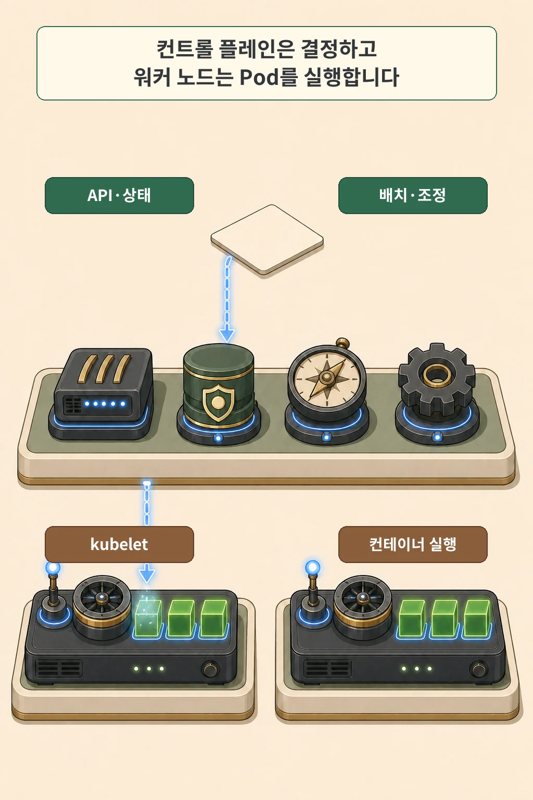
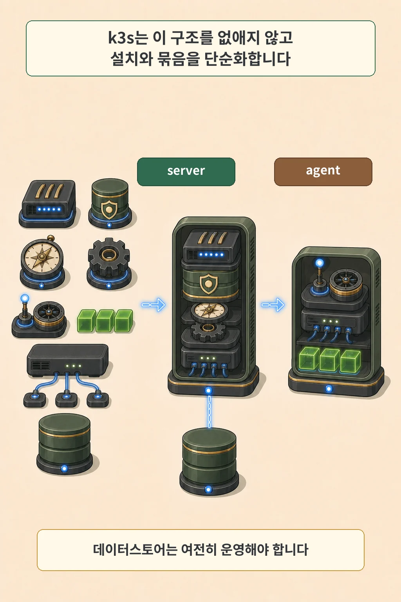
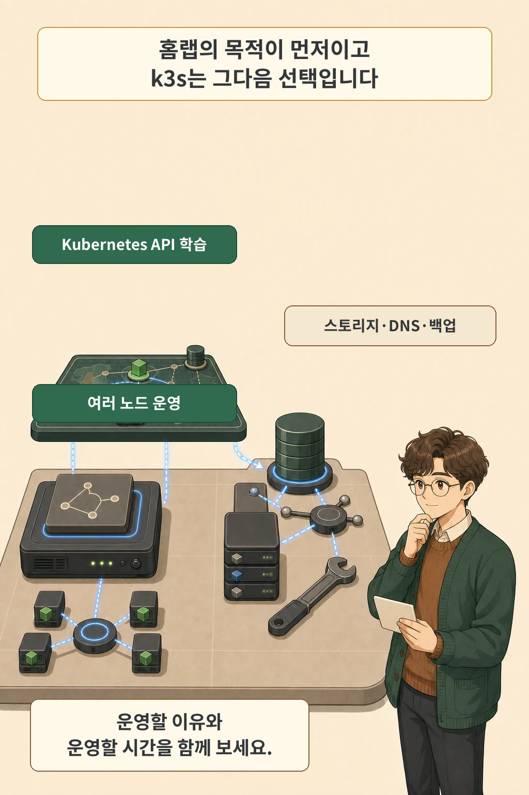

저는 시놀로지 NAS 한 대에 k3s를 올려 배포와 스토리지, 네트워크를 익혔습니다. 작은 단일 노드 클러스터는 좋은 학습장이었습니다. 하지만 Airflow 작업과 k3s 시스템 구성요소가 적은 CPU 코어를 나눠 쓰기 시작하자 32GB RAM의 여유만으로는 문제가 풀리지 않았습니다. 밤에 NAS를 끄면 메타데이터 DB와 오브젝트 스토리지도 함께 사라졌고, 한 노드가 멈추면 클러스터 전체가 멈추는 구조도 그대로였습니다.

이때부터 제 질문은 “k3s를 실행할 수 있는가?”에서 “어떤 상태를 몇 시간 동안, 어떤 장애까지 견디며 운영할 것인가?”로 바뀌었습니다.

**컨테이너 런타임은 컨테이너를 실행하고 Kubernetes는 여러 컨테이너와 노드의 원하는 상태를 계속 맞춥니다.** k3s는 이 운영 모델을 없앤 별도 도구가 아니라 설치와 기본 구성요소를 한데 묶은 Kubernetes 배포판입니다. 설치 부담은 줄여 주지만 CPU 경합, 24시간 의존성, 노드 장애를 어떻게 다룰지는 운영자가 결정해야 합니다.

글·해설: 다메카솔

Updated: 2026-07-28

## 컨테이너를 실행하는 일과 클러스터를 운영하는 일

컨테이너 런타임의 책임은 컨테이너를 실제로 실행하는 데 있습니다. Kubernetes 노드에도 containerd나 CRI-O처럼 CRI와 호환되는 런타임이 필요합니다. Kubernetes가 런타임을 대체하는 것이 아니라, 런타임 위에서 더 큰 운영 상태를 관리하는 셈입니다.

여기서 구분해야 할 층이 생깁니다.

| 층 | 주로 답하는 질문 | 대표 구성요소 |
| --- | --- | --- |
| 컨테이너 실행 | 이 컨테이너 프로세스를 어떻게 시작하고 격리할까? | containerd, CRI-O 같은 런타임 |
| 클러스터 제어 | 어떤 워크로드를 어느 노드에 놓고, 고장 뒤 어떤 상태로 되돌릴까? | Kubernetes API, 스케줄러, 컨트롤러 |
| 애플리케이션 | 요청을 어떻게 처리하고 데이터 오류를 어떻게 막을까? | 실제 서비스 코드와 데이터베이스 |

이 경계를 그어야 자가 복구도 정확히 이해할 수 있습니다. Kubernetes는 실패한 컨테이너를 재시작하거나 사라진 복제본을 대체할 수 있습니다.

하지만 같은 결함을 가진 컨테이너를 다시 띄우면 같은 버그가 그대로 돌아옵니다. 사용할 수 없어진 스토리지와 손상된 데이터도 별도의 복구 설계가 필요합니다.

## 원하는 상태를 계속 맞추는 제어 시스템

Kubernetes를 이해하는 가장 짧은 길은 `spec`과 `status`를 나눠 보는 것입니다.

사용자는 객체의 `spec`에 원하는 상태를 적습니다. 컨트롤 플레인은 관찰한 현재 상태를 `status`로 갱신하고, 둘 사이에 차이가 생기면 컨트롤러가 다시 맞추려고 움직입니다.

예를 들어 Deployment에 복제본 세 개를 원한다고 선언했는데 현재 두 개만 준비됐다면, 컨트롤러는 새 Pod를 만들어 차이를 줄입니다. 중요한 점은 A 다음 B, B 다음 C를 한 번 실행하고 끝내는 스크립트가 아니라는 데 있습니다. 상태를 계속 관찰하고 조정하는 루프입니다.

이 모델은 강력하지만 전제도 있습니다. 새 Pod를 놓을 노드의 CPU와 메모리가 부족하면 스케줄링은 멈춥니다. PersistentVolume을 다시 붙일 수 없는 상태라면 Pod만 교체해도 서비스는 돌아오지 않습니다. Kubernetes가 관리할 수 있는 범위와 외부 의존성을 함께 봐야 하는 이유입니다.

## 컨트롤 플레인과 워커 노드는 무엇을 하나

클러스터는 크게 컨트롤 플레인과 워커 노드로 나뉩니다. 각 구성요소의 이름보다 먼저 책임을 잡으면 구조가 선명해집니다.

- `kube-apiserver`는 Kubernetes API의 입구입니다.
- 상태 저장 계층은 API 서버가 다루는 클러스터 상태를 보존합니다. 일반 Kubernetes 구성에서는 etcd가 이 역할을 맡습니다.
- `kube-scheduler`는 아직 노드가 정해지지 않은 Pod를 살피고 적합한 노드를 고릅니다.
- `kube-controller-manager`의 컨트롤러들은 선언한 상태와 실제 상태의 차이를 줄입니다.
- 워커의 `kubelet`은 자신이 맡은 Pod와 컨테이너가 실행되도록 관리합니다.
- 컨테이너 런타임은 마지막 실행 단계에서 실제 컨테이너를 시작합니다.

이 구분은 역할에 대한 것이고, 물리 서버 배치는 별개의 선택입니다. 단일 노드 학습 클러스터에서는 한 장비가 server와 worker 역할을 함께 맡을 수 있습니다. 역할의 논리적 경계와 물리 장비의 수를 같은 것으로 생각하지 않는 편이 좋습니다.

## k3s는 무엇을 줄이고 무엇을 남기는가

k3s는 Kubernetes의 핵심 역할을 더 적은 설치 단위로 묶습니다. 공식 문서는 k3s를 Kubernetes 적합성을 갖춘 배포판으로 설명하며, 단일 바이너리와 함께 containerd, Flannel, CoreDNS, Ingress 등 여러 구성요소를 기본 제공한다고 안내합니다. 이 묶음 덕분에 처음부터 각 부품을 따로 골라 연결해야 하는 부담이 줄어듭니다.

구조 자체는 남습니다. `k3s server`는 컨트롤 플레인과 데이터스토어를 관리하고, `k3s agent`는 워커로 참여합니다. server와 agent 모두 kubelet, 컨테이너 런타임, CNI를 실행합니다.

데이터스토어 선택은 특히 중요합니다.

| 구성 | 데이터스토어 | 운영상 의미 |
| --- | --- | --- |
| 단일 server | 기본 embedded SQLite 사용 가능 | 시작은 단순하지만 server 장애가 곧 컨트롤 플레인 중단으로 이어집니다. |
| 다중 server, embedded HA | embedded etcd, server 3대 이상 | 컨트롤 플레인 가용성을 높이는 대신 쿼럼과 디스크 지연을 관리해야 합니다. |
| 다중 server, 외부 DB | MySQL·PostgreSQL·etcd 등, server 2대 이상 | 외부 데이터스토어의 가용성과 백업도 클러스터 운영 범위에 들어옵니다. |

따라서 “k3s는 가벼우니 운영도 저절로 쉽다”는 결론은 너무 빠릅니다. 설치 진입점은 단순해져도 DNS, 네트워크, 인증서, 영구 스토리지, 데이터스토어 백업, 버전 업그레이드는 여전히 설계해야 합니다.

## 최소 요구사항은 실제 권장 사양이 아니다

K3s 공식 요구사항이 제시하는 설치 하한선은 작습니다. 2026년 7월 23일 확인 기준으로 server는 2코어와 2GB RAM, agent는 1코어와 512MB RAM입니다.

| 노드 역할 | 공식 최소 CPU | 공식 최소 RAM |
| --- | ---: | ---: |
| server | 2코어 | 2GB |
| agent | 1코어 | 512MB |

이 숫자가 덮는 범위는 k3s 자체까지이고, 사용자 워크로드 자원은 따로 더해야 합니다. 이미지 다운로드와 압축 해제는 CPU와 디스크 IO를 사용하고, 컨트롤 플레인 변경이 잦거나 Operator가 많으면 server 부하도 커집니다. 데이터스토어와 컨테이너 이미지 저장소, 워크로드 볼륨이 같은 느린 디스크를 다투면 RAM이 남아도 클러스터가 답답해질 수 있습니다.

그러므로 최소 요구사항은 “설치가 시작될 수 있는 선”으로만 읽어야 합니다. 실제 장비를 고를 때는 워크로드의 CPU·메모리, 디스크 지연과 IOPS, 애드온, 복제본 수, 장애 때 남겨 둘 여유까지 더해야 합니다.

## 홈랩에서 k3s가 필요한지 판단하는 법

먼저 목적을 한 문장으로 적어 보세요. 목적이 “서버 한 대에서 소수의 컨테이너를 편하게 실행한다”라면 Compose나 운영체제 서비스 관리자가 더 단순할 수 있습니다. 반대로 Kubernetes API, 선언형 배포, 스케줄링, Operator, 다중 노드 장애를 배우려는 목적이라면 단일 노드 k3s도 충분히 의미가 있습니다.

아래 질문에서 오른쪽 책임까지 받아들일 수 있을 때 도입이 오래갑니다.

- Kubernetes API와 운영 모델 자체를 배울 이유가 있는가?
- 노드를 늘리거나 워크로드를 다른 노드로 옮길 필요가 있는가?
- server와 agent의 역할, 데이터스토어 토폴로지를 설명할 수 있는가?
- 영구 스토리지와 백업을 복제와 별개로 설계할 수 있는가?
- DNS·CNI·Ingress·인증서 가운데 내가 운영할 범위를 정했는가?
- 정기적으로 업그레이드하고 장애 뒤 복구를 연습할 시간이 있는가?

한두 항목에 아직 답하지 못해도 설치를 미룰 필요는 없습니다. 다만 학습용 단일 노드와 24시간 서비스를 맡길 운영 클러스터를 같은 안전 수준으로 취급하지는 마세요. 처음부터 목적과 실패 허용 범위를 분리하면 k3s는 좋은 학습 도구가 되고, 나중에는 어떤 계층을 강화해야 하는지도 보입니다.

## 자주 묻는 질문

### k3s는 Kubernetes와 다른 기술인가요?

별도의 오케스트레이션 모델이 아닙니다. k3s는 Kubernetes 적합성을 갖춘 배포판이며 Kubernetes API와 컨트롤러 모델을 사용합니다. 차이는 설치 방식, 기본 데이터스토어, 함께 묶이는 구성요소와 기본값에 있습니다.

### 단일 노드 k3s에도 의미가 있나요?

학습 목적이라면 의미가 있습니다. Deployment, Service, Ingress, PersistentVolume, Operator 같은 Kubernetes 개념을 작은 환경에서 익힐 수 있습니다. 노드 한 대의 장애를 견디는 고가용성은 여기서 한 단계 더 나아간 구성입니다.

### NAS에 k3s를 바로 설치해도 되나요?

장비 이름보다 운영체제와 커널 조건을 먼저 확인해야 합니다. K3s는 현대적인 Linux와 cgroup을 전제로 하며, 지원되지 않는 NAS 전용 OS에서는 업데이트나 커널 모듈, 네트워크 구성이 걸림돌이 될 수 있습니다. 이런 경우에는 NAS 위의 Linux VM이나 별도 미니 PC가 경계를 더 분명하게 만듭니다.

이 개념 글이 나온 실제 구축 배경은 [홈랩 쿠버네티스 구축기 1편: RAM은 32GB인데 Airflow DAG가 계속 실패한 이유](/posts/why-homelab-kubernetes/)에서 이어집니다.

## 출처

- Kubernetes, [Overview](https://kubernetes.io/docs/concepts/overview/)
- Kubernetes, [Kubernetes Components](https://kubernetes.io/docs/concepts/overview/components/)
- Kubernetes, [Objects In Kubernetes](https://kubernetes.io/docs/concepts/overview/working-with-objects/)
- Kubernetes, [Container Runtimes](https://kubernetes.io/docs/setup/production-environment/container-runtimes/)
- Kubernetes, [Kubernetes Self-Healing](https://kubernetes.io/docs/concepts/architecture/self-healing/)
- K3s, [K3s - Lightweight Kubernetes](https://docs.k3s.io/)
- K3s, [Architecture](https://docs.k3s.io/architecture)
- K3s, [Cluster Datastore](https://docs.k3s.io/datastore)
- K3s, [Requirements](https://docs.k3s.io/installation/requirements)
- K3s, [Resource Profiling](https://docs.k3s.io/reference/resource-profiling)

이 글의 본문과 이미지는 생성형 AI로 제작했습니다. 기획과 편집 기준은 다메카솔이 정했습니다.
