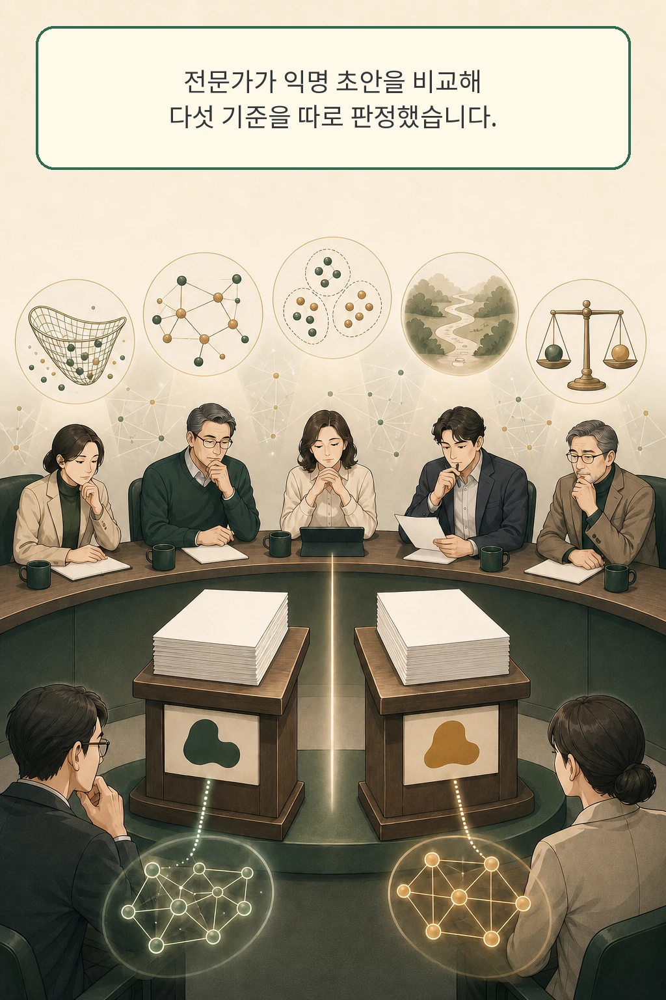

논문을 더 많이 찾고 요약을 길게 쓰면 문헌 리뷰도 좋아진다고 생각하기 쉽습니다. **「LitReview Arena: Evaluating Literature Review Agents with Battle-Style Peer Review Platform」**의 결과는 그 믿음을 흔듭니다. 현재 강한 시스템은 검색과 인용 범위를 넓혔지만, 연구 지형을 조직하고 다음 질문을 제안하는 단계에서 인간 초안과 큰 차이를 보였습니다.

이 논문은 2026년 8월 25일 arXiv cs.AI 신규 목록에 나타났습니다. v1 자체의 제출 시각은 7월 1일 14:54:07 UTC입니다. 저자들은 문헌 리뷰 초안 두 개를 분야가 맞는 연구자에게 익명으로 보여 주고, 다섯 기준을 따로 비교하는 LitReview Arena와 고정 benchmark인 LitReviewBench를 제안했습니다.

글·해설: 다메카솔

## 핵심 내용

- 문헌 coverage가 넓어도 주장 근거, 분야 구조, 비자명한 연구 제안이 약하면 좋은 연구 출발점이 되기 어렵습니다.
- 논문은 AI 논문 작성 경험이 있는 105명을 분야에 맞춰 배정하고 두 초안을 익명 비교했다고 보고합니다.
- 인간 초안과의 overall utility decisive match에서 비인간 시스템의 승률은 208/904, 23.0%였습니다.
- 두 AI judge가 서로 비슷하게 판정해도 전문가 순위와 크게 어긋날 수 있었습니다.
- LitJudge는 전문가 사례로 보정해 D5 정렬을 0.467에서 0.792로 높였지만, 공개 snapshot만으로 전체 실험을 독립 재현할 수는 없습니다.

## 논문 수와 연구 지형은 다른 문제다

문헌 리뷰에는 검색 가능한 일과 판단이 필요한 일이 함께 들어 있습니다. 관련 논문을 찾고 인용이 실제 주장과 맞는지 확인하는 단계는 비교적 구체적인 규칙으로 나눌 수 있습니다. 분야를 어떤 축으로 묶을지, 서로 충돌하는 결과를 어떻게 설명할지, 다음 실험이 풀어야 할 빈틈이 무엇인지는 더 높은 합성을 요구합니다.

저자들은 기존 자동 평가가 reference overlap, citation count, topical coverage처럼 안정적으로 셀 수 있는 신호에 치우쳤다고 봅니다. 이 신호는 필요합니다. 문제는 연구자가 리뷰를 읽고 “이 분야가 어떻게 나뉘며 다음에 무엇을 검증해야 하는가”를 판단할 때 필요한 구조를 충분히 대변하지 못한다는 점입니다.

그래서 이 연구는 정답 초안 하나와의 문장 유사도를 재지 않았습니다. 같은 topic을 다룬 초안 두 개 가운데 어느 쪽이 연구 출발점으로 더 나은지 전문가가 상대 비교하도록 설계했습니다.

## 분야가 맞는 전문가에게 두 초안을 익명으로 보여 줬다

topic seed는 OpenAlex에서 가져왔습니다. 저자들은 2022~2025년 AI 분야에서 인용 수 50회를 넘긴 survey-style paper 3,000편 이상을 모으고, 각 survey에서 하나의 topic을 추출했다고 설명합니다. 공개 저장소 snapshot에는 정규화된 topic 925개가 들어 있습니다.

각 battle은 서로 다른 시스템이 만든 초안 두 개를 이름 없이 좌우 무작위 순서로 보여 줍니다. 전문가는 아래 다섯 차원을 각각 `A`, `B`, `Tie`, `Both Bad` 가운데 하나로 판정합니다.

| 차원 | 묻는 질문 |
| --- | --- |
| Literature Coverage | 중요한 문헌을 충분히 포함했는가 |
| Claim Support | 핵심 주장이 관련 인용으로 뒷받침되는가 |
| Paper Structure | 접근법 사이 관계를 이해할 수 있게 조직했는가 |
| Research Suggestions | 중요하고 비자명한 연구 방향을 제시했는가 |
| Overall Utility | 연구자의 출발점으로 어느 초안이 더 유용한가 |

논문은 AI 논문 작성 경험이 있는 annotator 105명을 모집하고, 연구 분야·세부 분야·익숙한 논문을 확인해 topic과 맞는 사람에게 battle을 배정했다고 보고합니다. 같은 총점으로 합치기 전에 coverage와 synthesis를 분리했다는 점이 이 benchmark의 핵심입니다.

## 강한 시스템도 구조와 연구 제안에서 뒤처졌다

사람 초안은 다섯 차원 모두 1위였습니다. D5에서 사람 초안과 직접 붙은 decisive match 904개만 세면 비인간 시스템이 이긴 것은 208개, 23.0%입니다. `Tie`와 `Both Bad`는 이 계산에서 제외됐습니다.

격차가 컸던 곳은 Paper Structure와 Research Suggestions였습니다. 이 두 차원의 D5 순위 상관은 각각 0.99와 0.96이었고, Literature Coverage는 0.90이었습니다. 문헌을 넓게 모으는 일보다 분야의 숨은 관계를 드러내고 구체적인 다음 질문을 만드는 일이 전문가 효용에 더 가깝게 붙어 있었습니다.

계산을 늘려도 간격은 남았습니다. 논문 표에서 agentic system은 query당 평균 122.3K token을 사용했고 standalone model은 8.1K를 썼습니다. 약 15배의 test-time budget은 전반적인 품질을 높였으나 인간 초안과의 효용 차이를 닫지는 못했습니다. 저자들의 표현대로 많은 초안은 합성된 review보다 효율적인 bibliography에 가까웠습니다.

## AI judge의 높은 일치는 전문가 정렬을 보장하지 않았다

전문가 평가는 비쌉니다. 연구팀은 LLM judge가 대체할 수 있는지 보기 위해 battle 500개를 뽑아 Qwen3-235B가 다섯 차원을 한 번씩 판정하게 했습니다.

Coverage에서는 전문가 순위와 어느 정도 맞았지만 synthesis로 갈수록 어긋났습니다. D5 ranking correlation은 0.467이었습니다. 더 선명한 장면은 leaderboard 역전입니다. 전문가는 인간 초안을 1위로 두었는데, naive judge는 D5에서 인간에게 Elo 310, GPT-5.2에 2490을 부여했습니다.

이 차이를 단순한 주관성으로 돌리기도 어렵습니다. D5 expert-expert agreement는 0.861이었습니다. Qwen과 DeepSeek judge끼리도 모든 차원에서 0.7을 넘게 일치했지만, 전문가와의 정렬은 낮았습니다. AI 심사끼리 같은 표면적 유창성이나 형식 선호를 공유하면 안정적으로 같은 방향을 잘못 가리킬 수 있다는 해석입니다.

LitJudge는 이 간격을 전문가 사례로 보정합니다. 구조가 비슷한 사례, topic이 비슷한 사례, 인간 초안에서 가져온 diversity-aware research-gap anchor를 context로 제공합니다. 같은 500-instance 설정에서 D5 정렬은 0.467에서 0.792로, Research Suggestions는 0.430에서 0.842로 높아졌습니다. 이 결과는 보정이 유용하다는 증거이며, 모든 분야에서 전문가 심사를 대체한다는 보증은 아닙니다.

## 공개 재현에는 Git LFS 경계가 남아 있다

저자들의 GitHub 저장소는 MIT license의 evaluator code, protocol 문서, expert outcome과 topic snapshot을 제공합니다. 2026년 8월 25일 고정한 revision은 `768d18362ae913f74a0257f240ba50c00dc9eef9`입니다. 이 snapshot에서 `expert_outcomes.jsonl`은 2,754행, `topics.jsonl`은 925행이었습니다.

핵심 draft pair를 담는 `battles.jsonl`은 archive 안에서 실제 본문이 아니라 164,220,412-byte Git LFS object를 가리키는 pointer였습니다. outcome 파일의 pseudonymized `annotator_id`도 보존 snapshot만으로 논문이 보고한 105명의 실제 참여자 수를 재집계할 수 있는 형태는 아닙니다. 저는 PDF, TeX, metadata, 고정 저장소 archive와 공개 label을 보존하고 방법·결과·한계를 교차 확인했지만, 전체 battle replay나 LitJudge API 실행, leaderboard 재생산은 하지 않았습니다.

논문과 저자 저장소는 ICML 2026 채택을 명시합니다. 공식 ICML 2026 사이트와 paper browser도 확인했으나, JavaScript 없이 받은 목록에서는 이 제목을 독립적으로 찾을 수 없었습니다. 따라서 이 글은 채택 상태를 저자 표기로 귀속해 적습니다.

## 범위: 전문가 선호도에도 편향이 들어갈 수 있다

main benchmark는 AI topic을 중심으로 합니다. 부록의 biology pilot이 비슷한 경향을 보였어도 biomedicine이나 law처럼 증거 규범과 안전 비용이 다른 분야에는 별도의 사실·인용 감사를 더해야 합니다.

전문가 보정 자체도 중립적이지 않습니다. 구조가 비슷한 사례를 반복해서 고르면 익숙한 논문 문법을 강화할 수 있고, gap anchor가 유행하는 주제에 몰리면 색다르지만 가치 있는 합성을 낮게 볼 수 있습니다. 현재 benchmark는 새 논문이 계속 들어오는 living review에서 주장을 갱신하고 과거 문맥과 모순 없이 유지하는 장기 과제도 다루지 않습니다.

## 다메카솔의 해석: 검색·근거·구조·제안을 분리한다

제가 문헌 리뷰 에이전트를 production workflow에 넣는다면 하나의 종합 점수로 승인하지 않겠습니다. 네 층의 evidence를 따로 남기겠습니다.

| 검증 층 | 운영에서 남길 증거 |
| --- | --- |
| 검색 범위 | query, database, cutoff date, 누락 후보 |
| 주장 근거 | claim별 citation과 원문 위치 |
| 연구 구조 | 분류 축과 서로 충돌하는 결과를 묶은 이유 |
| 연구 제안 | 기존 연구로 바로 반박되지 않는 구체적인 gap |

judge도 고정 정답처럼 다루지 않습니다. 분야 전문가가 읽은 표본을 정기적으로 넣어 순위를 다시 맞추고, AI judge끼리의 높은 일치는 참고 신호로만 기록하겠습니다. 공개 자료만으로 판단할 수 있는 범위는 여기까지입니다.

다음 도입 실험의 성공 기준은 간단합니다. 에이전트가 더 많은 논문을 가져오는지와 별개로, 사람이 분류 축을 수정한 횟수, 근거 없는 gap을 제거한 비율, 새 논문이 들어왔을 때 기존 주장을 안전하게 갱신하는지를 측정해야 합니다. 좋은 문헌 리뷰는 검색 결과의 끝이 아니라 연구 판단의 시작점입니다.

## 논문 정보

| 항목 | 내용 |
| --- | --- |
| 제목 | LitReview Arena: Evaluating Literature Review Agents with Battle-Style Peer Review Platform |
| 저자 | Ruotong Zhao, Zhiyu Chen, Xurui Liu, Haidong Xue, Dong Liang, Jigao Fu, Yanbiao Wu, Yuanyi Zhen, Fengli Xu, Yong Li |
| 공개 이력 | arXiv v1 2026-07-01 14:54:07 UTC; 2026-08-25 cs.AI 신규 목록 등장 |
| 저자 표기 | ICML 2026 accepted |
| 공개 artifact | 고정 GitHub revision의 evaluator code·labels·topics; battle 본문은 Git LFS pointer |

## 자주 묻는 질문

### 논문을 정확히 많이 찾으면 좋은 리뷰 아닌가요?

Coverage는 출발 조건입니다. 어떤 연구가 같은 가정을 공유하고 어디서 충돌하는지 조직하지 못하면 독자는 분야의 구조를 얻지 못합니다. 이번 expert preference에서 structure와 research suggestions가 overall utility와 특히 강하게 연결됐습니다.

### LitJudge가 전문가를 대체할 수 있나요?

이 연구는 500-instance 설정에서 전문가 정렬이 개선됐다고 보고합니다. main domain은 AI이고, living review와 다른 증거 규범의 분야는 범위 밖입니다. LitJudge는 전문가 사례를 싸게 재사용하는 보정 장치로 읽는 편이 정확합니다.

## 함께 읽기

- [AI 에이전트는 열린 연구 질문을 끝까지 풀 수 있을까](/posts/ai-open-ended-research-shadow-evaluation/)
- [LLM이 출처를 제시해도 정보 판단이 끝나지 않는 이유](/posts/information-discernment-llm-sources/)

## 출처

- [Ruotong Zhao 외, “LitReview Arena: Evaluating Literature Review Agents with Battle-Style Peer Review Platform,” arXiv:2608.21374](https://arxiv.org/abs/2608.21374)
- [arXiv v1 PDF](https://arxiv.org/pdf/2608.21374)
- [저자 공식 GitHub 저장소, pinned revision 768d1836](https://github.com/VanellopeAsher/LitReview-Arena/tree/768d18362ae913f74a0257f240ba50c00dc9eef9)
- [ICML 2026 공식 사이트](https://icml.cc/Conferences/2026)

이 글의 본문과 이미지는 생성형 AI로 제작했습니다. 기획과 편집 기준은 다메카솔이 정했습니다.

Updated: 2026-08-25
