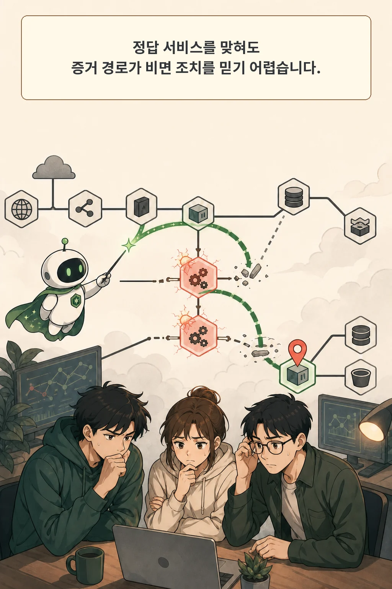
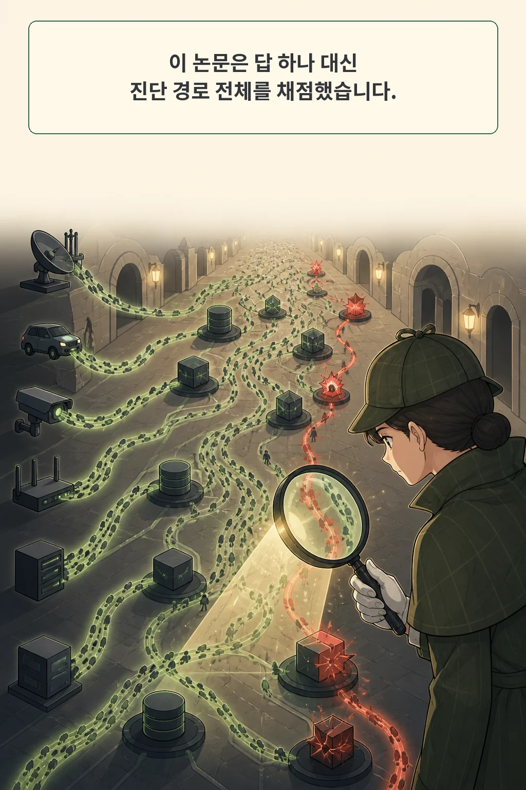
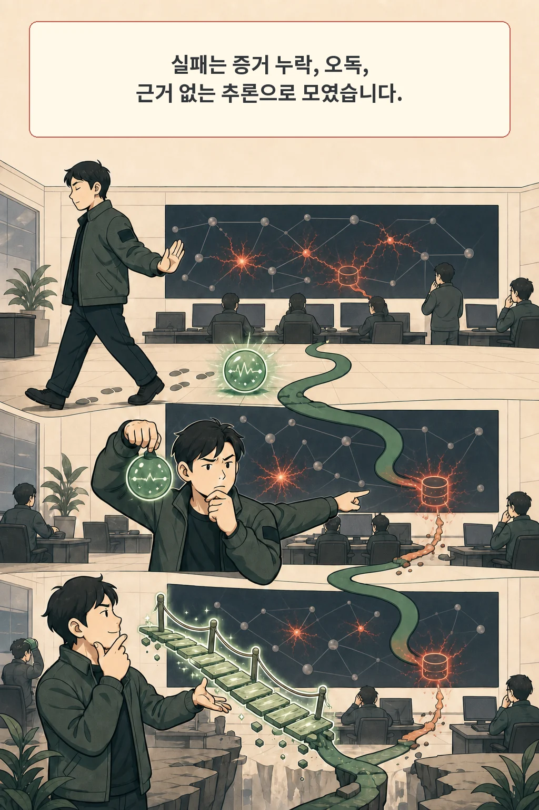
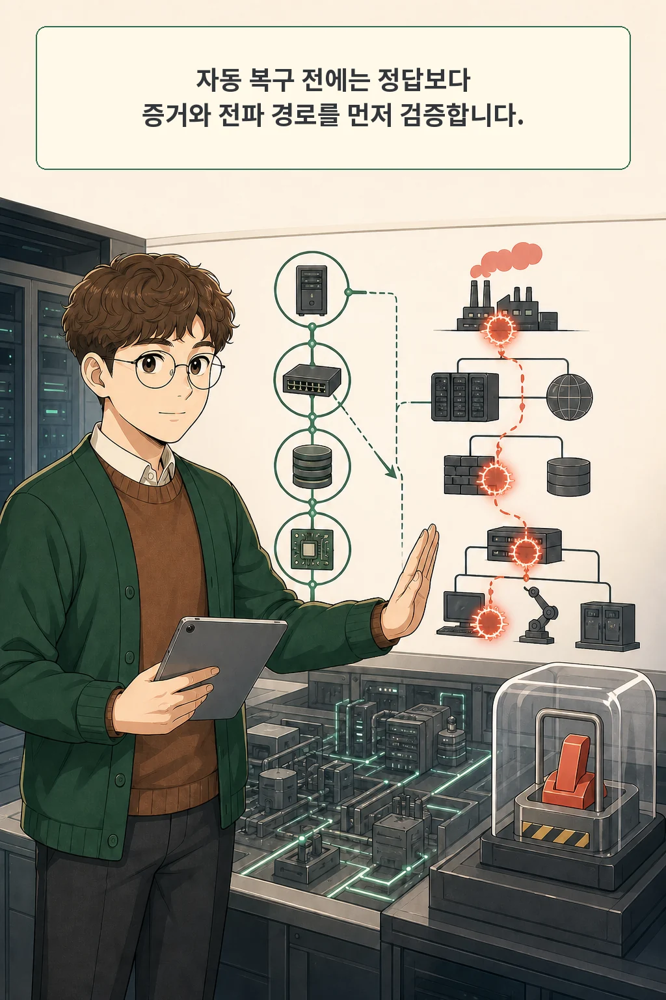

장애 원인을 맞힌 진단도 운영에 바로 쓸 수 없습니다. 어떤 로그와 지표를 확인했고, 장애가 어느 서비스를 거쳐 번졌는지 설명하지 못한다면 그 정답은 우연과 구분하기 어렵습니다. 자동 복구까지 연결할수록 이 차이가 커집니다.

2026년 8월 21일 arXiv에 제출된 **「Beyond Fault Localization: A Trajectory-Level Study of LLM Agents for Microservice Root Cause Analysis」**는 최종 서비스 이름 대신 진단 과정 전체를 들여다봅니다. 저자들은 3,500개 agent trajectory를 주석된 장애 전파 경로와 비교하고, 반복되는 실패를 두 겹의 방어 구조인 DiagGuard로 옮겼습니다.

글·해설: 다메카솔

## 핵심 내용

- root-cause 서비스가 맞아도 증거와 전파 경로가 빠진 진단은 조치 근거로 약합니다.
- 저자들은 RCABench 500개 사례에서 일곱 구성의 3,500개 trajectory를 수집했습니다.
- 실패는 결정적 증거 누락, 증거 오독, 증거와 무관한 추론의 세 계열로 정리됐습니다.
- 별도 AIOps 2025 조건에서 DiagGuard는 Acc@1을 43.5%에서 52.5%로 높였습니다.
- 특성화는 단일 토폴로지와 일회 실행에 기대므로 실제 자동 복구에는 별도 승인 조건이 필요합니다.

## 맞힌 서비스와 믿을 수 있는 진단은 다르다

기존 마이크로서비스 RCA 평가는 대개 원인 서비스를 맞혔는지 봅니다. Acc@1이나 Top-k 정확도는 여러 방법을 비교하기 좋지만, 에이전트가 어떤 근거로 그 답에 도착했는지는 접어 버립니다.

운영자는 답 하나보다 더 많은 정보를 필요로 합니다. 예를 들어 저장소 계층의 I/O 이상이 데이터베이스를 거쳐 상품 서비스 지연으로 번졌다면, 진단은 그 연결을 telemetry로 뒷받침해야 합니다. 중간 서비스와 방향 간선을 건너뛴 채 마지막 노드만 맞혔다면 복구 대상이나 순서를 잘못 정할 수 있습니다.

이 논문의 질문은 여기서 시작합니다. **정답률 뒤에 숨은 조사 과정을 비교 가능한 근거로 만들 수 있는가?** 저자들은 root-cause label과 service-level fault-propagation path를 분리해 답했습니다.

## 3,500개 진단 경로를 전파 경로와 대조했다

저자들은 공개 RCABench의 1,430개 사례에서 단순 무작위 비복원으로 500개를 골랐습니다. 각 사례에는 원인 서비스 label이 있었지만 서비스 수준 전파 경로는 없어서, 장애 주입 정보와 전후 로그·지표·트레이스, TrainTicket 호출 그래프를 바탕으로 사람이 경로를 주석했습니다.

그다음 여섯 agent framework를 같은 Qwen backbone으로 비교하고, ThinkDepth.ai 한 구성은 Sonnet으로 다시 돌렸습니다. 사례마다 일곱 trajectory가 생겨 총 3,500개입니다. 각 trajectory는 에이전트의 생각, SQL 질의, 반환된 telemetry, 최종 답을 포함합니다.

평가는 두 층으로 나뉩니다. 최종 root cause를 맞혔는지 Acc@1으로 보고, 주석 경로의 서비스 노드와 방향 간선을 얼마나 되찾았는지 Node F1과 Edge F1으로 봅니다. 특히 Edge F1은 장애가 서비스 사이에서 어떻게 전파됐는지를 묻습니다.

공유 Qwen에서 개방형 조사 framework 세 개의 Acc@1은 77.6%에서 79.6% 사이였습니다. 그럼에도 모든 구성의 평균 Edge F1은 0.67을 넘지 못했습니다. ThinkDepth.ai의 backbone을 Sonnet으로 바꾸자 Acc@1은 10.8%p 높아졌지만 Edge F1은 0.66에서 0.67로 거의 그대로였습니다. 더 강한 모델이 전파 경로까지 자동으로 복원해 주지는 않았다는 뜻입니다.

## 실패는 증거를 다루는 세 방식으로 모였다

성공한 조사에는 방향이 있었습니다. 장애가 영향을 준 서비스와 telemetry 범위에 머물렀고, 실제로 조회한 증거에 맞춰 다음 질의를 바꿨습니다. 인과 사슬이 깊어질수록 질의 의도도 넓어졌습니다.

반대로 실패는 세 계열로 모였습니다.

| 실패 계열 | 진단에서 벌어진 일 |
| --- | --- |
| 증거 누락 | 비교 기준이나 결정적 service·metric·log를 조회하지 않음 |
| 증거 오독 | 가져온 신호의 의미, 시간 범위, 호출 방향을 잘못 읽음 |
| 근거 없는 추론 | 관측과 연결되지 않은 원인 상태를 만들거나 마찰을 피하려고 결론을 고정함 |

두 저자는 154개 실패 trajectory를 독립 코딩했고, 144개에서 같은 코드 집합을 부여해 93.5% 일치를 보고했습니다. 세부 실패 코드는 한 trajectory에 함께 나타날 수 있으므로 비율 합계가 100%가 되는 분류표는 아닙니다.

인과 사슬 깊이도 난도를 바꿨습니다. Qwen을 쓴 모든 framework는 깊이가 2에서 5로 길어질수록 정확도가 낮아졌습니다. 이상 노드를 찾는 일과 그 노드 사이 전파 방향을 복원하는 일은 서로 다른 난도였습니다.

## DiagGuard는 먼저 펼치고 나중에 의심한다

저자들은 실패 목록을 사후 설명으로 끝내지 않았습니다. 각 실패를 방어 요구사항으로 바꿔 기존 진단 코어 바깥에 **Grounder**와 **Verifier**를 놓았습니다.

Grounder는 답을 찾기 전에 이용 가능한 telemetry의 범위와 정상 구간 기준을 펼칩니다. Verifier는 에이전트가 고른 원인이 조회한 증거와 맞는지, 다른 설명을 배제했는지 다시 확인합니다. 하나는 보지 못한 증거를 줄이고, 다른 하나는 보고도 잘못 읽거나 억지로 결론 낸 경우를 겨냥합니다.

검증 조건은 특성화와 달랐습니다. AIOps 2025의 e-commerce benchmark 400개 incident, 다른 서비스 토폴로지, 다른 vendor의 Seed 2.0 Pro를 사용해 다섯 번 실행했습니다. 이 held-out 조건에서 Acc@1은 43.5%에서 52.5%로, pass@3은 56.9%에서 67.1%로, pass@5는 62.3%에서 73.0%로 높아졌습니다.

구성요소 제거 실험도 두 층의 역할을 나눠 보여 줍니다. Grounder만 두면 Acc@1이 4.1%p, Verifier만 두면 4.5%p 높아졌고, 둘을 함께 쓰면 9.0%p 높아졌습니다. 이 결과는 다섯 번 실행의 평균과 표준편차로 보고됐습니다.

## 한 번의 연구가 운영 토폴로지를 대표하지는 않는다

특성화는 RCABench의 TrainTicket 한 토폴로지, 고정된 500개 표본, 선택한 agent에 기대고 있습니다. framework와 model을 하나씩 바꿨지만 구현 차이가 완전히 사라진 비교도 아닙니다. 저자들이 별도 benchmark로 transfer를 확인한 점은 이 위험을 줄이지만, 다른 stack과 production incident까지 보증하지는 않습니다.

process label에는 사람의 주석과 LLM 보조 분류가 들어갑니다. 고정 protocol, 이중 코딩, 사람 검토로 일관성을 확인했어도 주석자의 판단과 judge bias는 남습니다. 특성화의 일곱 구성은 각각 한 번만 실행했고 유의성 검정을 하지 않아, framework 사이 차이는 지시적 결과로 읽어야 합니다.

## 공개 재현의 경계

저자들은 주석된 전파 경로, trajectory 분석 pipeline, failure-mode codebook, DiagGuard prompt를 공개할 계획이라고 적었습니다. 2026년 8월 24일 확인한 arXiv 원문과 메타데이터에는 접근 가능한 저자 artifact 저장소가 연결돼 있지 않았습니다.

저는 13쪽 PDF, API 메타데이터, TeX 원문 묶음과 35개 추출 파일을 보존하고 방법·표·한계를 교차 확인했습니다. 실행 가능한 공식 산출물이 없어 benchmark를 다시 돌리거나 코딩 일치도를 독립 검증하지 않았습니다. 이 글은 공개 원문에 대한 근거 검토입니다.

## 다메카솔의 해석: 자동 복구에는 증거 승인선을 둔다

제가 LLM RCA를 자동 복구와 연결한다면 **정답 서비스 일치**를 첫 조건으로만 두겠습니다. 다음 세 조건이 닫히기 전에는 변경 권한을 넘기지 않겠습니다.

| 승인 조건 | 확인할 것 |
| --- | --- |
| 근거 telemetry | incident window와 정상 구간을 같은 entity·metric으로 비교했는가 |
| 전파 경로 | 관측된 서비스 노드와 방향 간선이 원인에서 증상까지 이어지는가 |
| 반증 확인 | 만성 잡음이나 더 단순한 대체 원인을 검토했는가 |

세 조건 가운데 하나라도 비면 사람에게 넘기고, 진단 보고서에는 조회하지 않은 telemetry까지 구분해 남겨야 합니다. 모델의 자연어 확신보다 재검사 가능한 evidence chain을 승인 근거로 삼는 설계입니다.

저의 입장은 분명합니다. LLM RCA의 다음 기준은 “얼마나 자주 맞혔나”에서 멈추면 안 됩니다. “무엇을 보고, 어떤 경로를 따라, 무엇을 배제했나”까지 재생할 수 있어야 자동 복구 권한을 논의할 수 있습니다.

## 논문 정보

| 항목 | 내용 |
| --- | --- |
| 제목 | Beyond Fault Localization: A Trajectory-Level Study of LLM Agents for Microservice Root Cause Analysis |
| 저자 | Qisheng Lu, Aoyang Fang, Junjielong Xu, Jin'ao Shang, Songhan Zhang, Yifan Yang, Xiaochuan Yan, Pinjia He |
| 공개 이력 | arXiv v1 제출 2026-08-21 17:13:45 UTC |
| 이 글의 분류 | 마이크로서비스 RCA agent trajectory empirical study |
| 공개 artifact | 수집 시점에 접근 가능한 저자 저장소 없음; 논문은 향후 공개를 예고 |

## 자주 묻는 질문

### 원인 서비스를 맞혔다면 복구 결과도 같은 것 아닌가요?

복구는 대상뿐 아니라 순서와 범위를 요구합니다. 중간 전파 경로가 틀리면 증상 서비스를 원인으로 오인하거나, 정상인 의존성을 먼저 바꿀 수 있습니다. 그래서 endpoint accuracy와 path evidence를 함께 봐야 합니다.

### DiagGuard가 실제 production incident에서도 검증됐나요?

이 연구는 공개 benchmark의 주입 장애를 사용했습니다. held-out model·dataset·topology에서 이득을 보였지만, 장기 운영의 불완전한 telemetry와 새로운 fault를 다룬 production 검증은 앞으로의 과제입니다.

## 함께 읽기

- [AI 코딩 에이전트의 결과보다 작업 흔적을 먼저 읽어야 하는 이유](/posts/agentic-coding-production-traces/)
- [AI 에이전트는 기억하고도 현재 상태를 놓칠 수 있습니다](/posts/statemem-agent-memory-state-tracking/)

## 출처

- [Qisheng Lu 외, “Beyond Fault Localization: A Trajectory-Level Study of LLM Agents for Microservice Root Cause Analysis,” arXiv:2608.21310](https://arxiv.org/abs/2608.21310)
- [arXiv v1 PDF](https://arxiv.org/pdf/2608.21310)

이 글의 본문과 이미지는 생성형 AI로 제작했습니다. 기획과 편집 기준은 다메카솔이 정했습니다.

Updated: 2026-08-24

