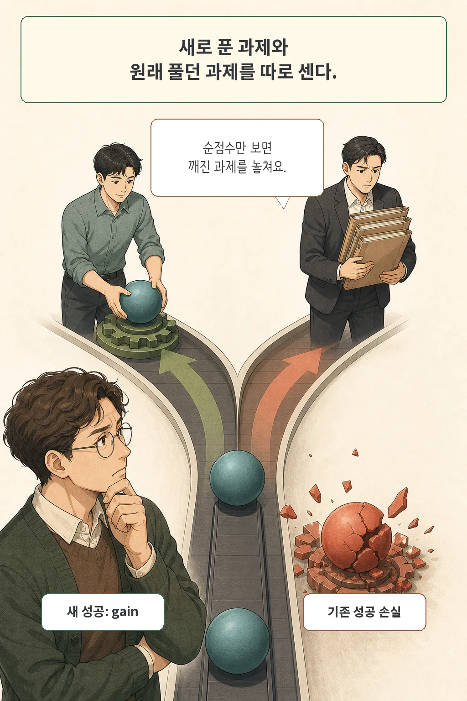
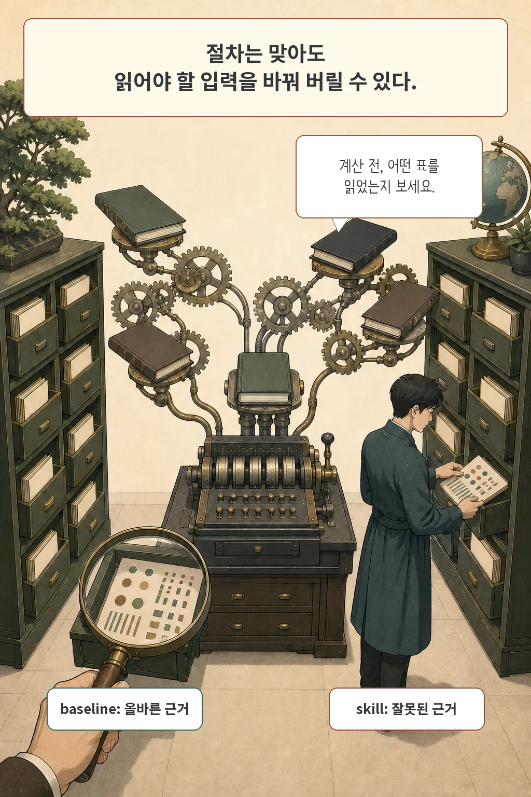
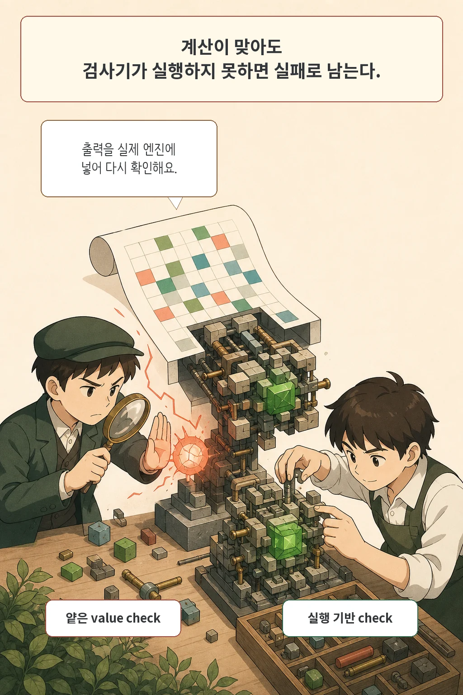
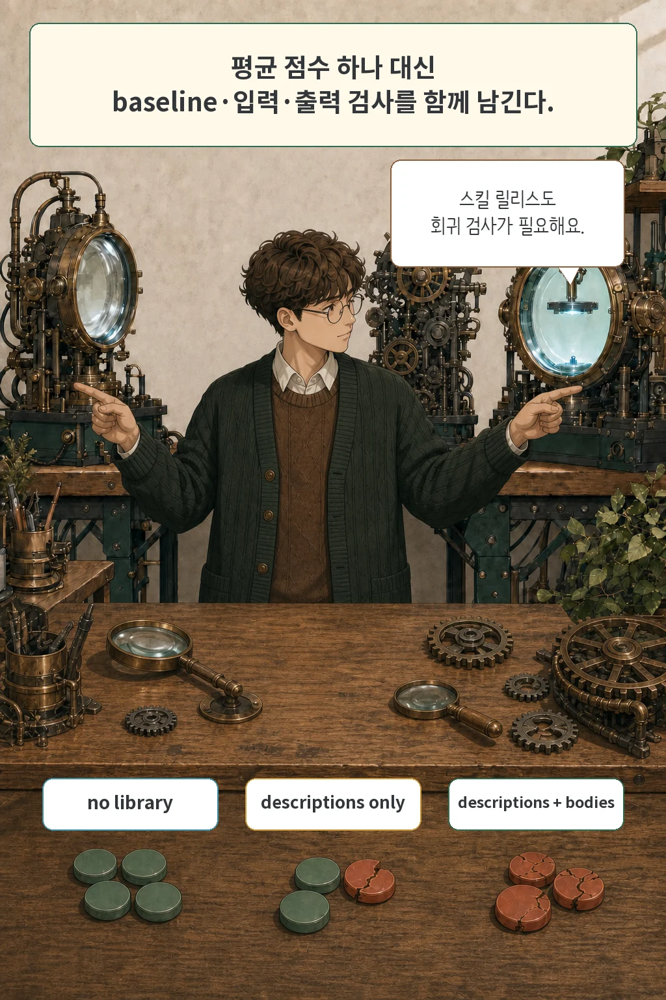

AI 에이전트의 역량을 높이려고 프롬프트나 스킬(Skill)을 추가했다가, **오히려 잘 되던 작업까지 깨져버린 경험**이 있으신가요?

최근 발표된 논문 **The Regression Tax: Decomposing Why Skills Help and Hurt LLM Agents**는 에이전트에 절차형 스킬을 주입했을 때 발생하는 '성능 퇴보(Regression)' 비용을 정량적으로 측정한 흥미로운 연구입니다. 연구진에 따르면 새로 얻은 성공 중 무려 59%가 기존 기능 파괴로 상쇄되었다고 합니다. 왜 스킬을 더했는데 에이전트가 더 바보가 되는지, 그리고 실무 파이프라인에서 이를 어떻게 방어해야 하는지 핵심을 정리했습니다.

글·해설: 다메카솔

## 평균 성공률은 무엇을 숨기나

연구진은 동일한 과제에 대해 스킬이 없을 때(Baseline)와 스킬을 넣었을 때의 결과를 일대일로 비교했습니다. 베이스라인에서 실패했다가 스킬 덕분에 성공하면 **획득(Gain)**, 반대로 베이스라인에서 성공했던 과제가 스킬 주입 후 실패하면 **퇴보(Regression)**로 정의합니다.

전체 '순 성공률'만 보면 획득에서 퇴보를 뺀 수치만 남게 됩니다. 하지만 같은 '+5점'이라도 내막은 완전히 다를 수 있습니다. A 라이브러리는 신규 성공 15개를 얻는 대신 기존 성공 10개를 깨뜨렸고, B 라이브러리는 신규 성공 7개를 얻으면서 기존 성공을 단 2개만 깨뜨렸을 수 있습니다. 순증가는 같아도 B 라이브러리가 기존 안정성을 훨씬 잘 지킨 셈입니다.

논문에서 18개 라이브러리 조건을 합산한 결과, 신규 성공(Gain)은 553건이었지만 성능 퇴보(Regression) 역시 324건이나 발생했습니다. 순증가는 229건에 불과했습니다. 즉, 겉보기 지표 뒤에는 수많은 기존 기능 파괴가 숨어 있었습니다.

## 실험은 5,832개의 독립 과제가 아니다

평가는 스프레드시트와 오피스 자동화 중심의 486개 과제로 진행되었습니다. 각 과제를 기본 상태와 세 가지 스킬 라이브러리 조건에서 실행하고, 이를 세 가지 모델-환경 스택에 적용했습니다. 이를 모두 곱하면 `486 × 4 × 3 = 5,832`개의 실행 트레이스가 나옵니다.

실험에 사용된 세 스택은 다음과 같습니다:

- OpenCode + MiniMax-M2.7
- Codex + GPT-5.4-mini
- Claude Code + Claude Sonnet 4.6

각 스택 내부에서는 스킬 라이브러리만 변경되었지만, 스택 간을 비교할 때는 모델과 실행 환경이 함께 바뀌었습니다. 따라서 이 데이터만으로 모델 자체의 역량과 프레임워크의 영향을 완벽히 분리해 단정하기는 어렵습니다.

## 입력, 절차, 검증을 한 줄에 놓는다

논문은 에이전트의 작업 흐름을 크게 세 단계로 구분합니다:

1. **입력 식별 (Grounding)**: 어떤 문서, 표, 데이터 범위를 다뤄야 하는지 올바르게 파악하는 단계
2. **절차 수행 (Method)**: 실제 계산이나 텍스트 편집 로직을 수행하는 중간 단계
3. **결과 검증 (Verification)**: 산출물이 요구사항에 부합하는지 실행해보고 검증하는 마지막 단계

시중의 많은 스킬 프롬프트는 2단계인 '중간 절차'를 자세히 설명하는 데 치중합니다. 하지만 실제 실패 로그를 뜯어보면, 절차 자체의 오류보다는 1단계(입력 선택)와 3단계(결과 검증)에서 실패가 집중되었습니다. 절차 지침이 쓸모없다는 뜻이 아니라, 실제 병목은 입력을 제대로 읽고 결과를 제대로 검증하는 데 있었다는 의미입니다.

## 열지 않은 skill 설명도 영향을 줄 수 있다

**스킬 설명 삼투 현상(Skill-description osmosis)**은 스킬 본문 코드를 직접 호출하지 않았음에도, 시스템 프롬프트에 상주하는 스킬 이름과 설명만으로 에이전트의 판단 경로가 바뀌는 현상입니다.

실제로 스프레드시트 벤치마크에서 발생한 243건의 성능 퇴보 중 70건이 이 삼투 현상으로 분류되었습니다. 흥미로운 점은 설명이 컨텍스트에 들어있는 것만으로도 성능이 올라간 경우도 많았다는 것입니다. 즉, 프롬프트에 들어간 스킬 설명은 중립적이지 않으며 에이전트의 주의 집중(Attention) 방향을 미묘하게 흔들어 놓습니다.

## 절차가 입력 독해를 밀어내는 경우

가장 빈번했던 실패 원인은 **‘입력 문맥 상실(Grounding displacement)’**이었습니다. 에이전트가 스킬에 적힌 장황한 절차를 따르느라, 정작 기본 모델이 잘 골라내던 원본 데이터를 놓치는 현상입니다.

예를 들어 1934년과 1946년 데이터를 비교하는 문제에서, 기본 모델은 표에서 올바른 두 값을 찾아 정답(142)을 계산했습니다. 반면 스킬을 장착한 에이전트는 절차 지침에 매몰되어 엉뚱한 표의 수치를 가져오는 바람에 오답(542)을 냈습니다. 계산 로직 자체는 틀리지 않았지만, **'어떤 데이터를 가져올 것인가'**라는 근본적인 전제에서 실패한 것입니다.

## 계산이 맞아도 검증에서 실패할 수 있다

검증 단계의 결함도 큰 문제였습니다. 기존 평가 환경(Grader)은 에이전트가 작성한 수식(Formula)을 제대로 실행해 재계산하지 못해, 올바른 수식을 작성하고도 오답 처리되는 한계가 있었습니다.

연구진이 실패로 처리된 663개 과제를 완전한 스프레드시트 엔진으로 다시 계산해보니, 226개는 이미 정답이었습니다. 즉, 얕은 검증 도구 때문에 올바른 산출물 226개가 억울하게 실패로 집계된 것입니다. 이는 에이전트 시스템에서 산출물을 검증할 때 단순 문자열 비교가 아니라 실제 런타임 엔진을 통한 엄밀한 평가가 얼마나 중요한지 보여줍니다.

## 숫자가 지지하는 범위와 남은 빈칸

통계적 엄밀함 측면에서 보면, 다중 비교 보정(Bonferroni correction)을 거친 후 유의미한 효과가 남은 것은 특정 모델(Claude Code) 조건뿐이었습니다. 따라서 "모든 환경에서 스킬이 항상 이만큼의 퇴보를 일으킨다"고 일반화하기는 이릅니다.

또한 이 연구는 오피스 자동화 과제에 국한되어 있고, 각 과제를 단 1회씩만 실행해 반복 실행 간 편차를 완전히 통제하지는 못했습니다. 논문과 연계된 오픈소스 저장소([`sentient-agi/meta-skill-creator`](https://github.com/sentient-agi/meta-skill-creator))는 공개되어 있지만, 5,832개 실행 트레이스 전체가 투명하게 공개되지는 않았다는 점도 감안해야 합니다.

## 다메카솔의 해석: 스킬 릴리스에도 회귀 방지 장치가 필수적이다

실무에서 에이전트 스킬이나 프롬프트를 배포할 때, **전체 '평균 성공률' 하나만 보고 안도하는 것은 매우 위험합니다.** 신규 기능 15개가 성공했더라도 기존에 잘 되던 핵심 기능 10개가 망가졌다면, 프로덕션 환경에서는 심각한 배포 장애이기 때문입니다.

따라서 에이전트 파이프라인을 고도화할 때는 다음 3가지 원칙을 고려해야 합니다:

1. **기존 베이스라인 테스트셋 고정**: 스킬을 주입하기 전 정상 동작하던 골든 케이스들을 보존하고 회귀 여부를 항시 측정합니다.
2. **프롬프트 오염도 점검**: 스킬 설명문만 컨텍스트에 추가되었을 때 기존 의도 분류(Routing)나 데이터 추출에 노이즈를 주지 않는지 확인합니다.
3. **실패 지점의 명확한 분리**: 에러가 났을 때 무작정 절차(프롬프트)부터 길게 쓰지 말고, 원본 데이터를 잘못 읽은 건지(Grounding) 최종 결과 검증이 부실했던 건지(Verification)를 먼저 디버깅해야 합니다.

결국 AI 에이전트 시스템도 전통적인 백엔드 엔지니어링과 마찬가지로, **‘기존 성공을 깨뜨리지 않는 회귀 테스트(Regression Test) 체계’**가 뒷받침되어야 안전하게 프로덕션에 배포할 수 있습니다.

## 논문 정보

| 항목 | 내용 |
| --- | --- |
| 제목 | The Regression Tax: Decomposing Why Skills Help and Hurt LLM Agents |
| 저자 | Darshan Tank, Baran Nama |
| 소속 | Sentient Labs |
| arXiv v1 제출 | 2026-07-24 17:50:03 UTC |
| 분야 | cs.AI |
| 평가 규모 | 486 tasks × 4 conditions × 3 stacks = 5,832 task-condition runs |
| 공식 연결 저장소 | sentient-agi/meta-skill-creator, Apache-2.0 |

## 출처

- [논문 초록과 메타데이터, arXiv:2607.22520](https://arxiv.org/abs/2607.22520)
- [논문 원문 PDF](https://arxiv.org/pdf/2607.22520)
- [arXiv HTML 원문](https://arxiv.org/html/2607.22520)
- [저자 공식 meta-skill-creator 저장소](https://github.com/sentient-agi/meta-skill-creator)

이 글의 본문과 이미지는 생성형 AI로 제작했습니다. 기획과 편집 기준은 다메카솔이 정했습니다.

Updated: 2026-07-28
