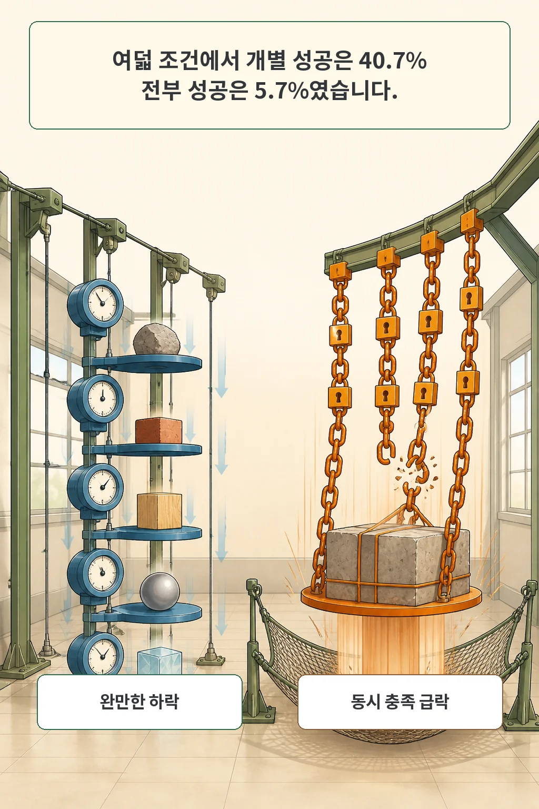

조건이 8개가 되자 개별 조건은 평균 40.7% 통과했지만, 여덟 조건을 모두 만족한 응답은 5.7%뿐이었습니다. 하나씩 보면 완만한 하락인데 전부를 요구하는 순간 결과가 가파르게 무너졌습니다.

2026년 8월 14일 arXiv Artificial Intelligence 새 목록에 실린 **Large Language Models Can Follow Instructions, But Not Many at Once**는 이 간격을 `Constraint Saturation Evaluation`으로 측정합니다. 연구진은 LLM judge 대신 결정적 규칙 검사기를 쓰고, 동시에 요구하는 제약 수를 1개에서 12개까지 늘렸습니다. 이 글은 논문이 보고한 곱셈형 붕괴와 그 적용 범위를 분리해 살펴봅니다.

글·해설: 다메카솔

## 핵심 내용

- 개별 제약의 평균 통과율과 모든 제약의 동시 통과율은 다른 지표입니다.
- 작은 실패율도 제약마다 누적되면 전체 성공률은 곱으로 급락합니다.
- 구조처럼 생성 내내 추적해야 하는 제약이 단순 어휘 제약보다 더 빨리 무너졌습니다.
- 생성 전 계획은 임계점을 옮기지 못했고, 자기수정과 다섯 번 재시도도 한두 조건의 여유만 만들었습니다.
- 실무에서는 중요한 요구를 단계로 나누고 각 단계에서 결정적으로 검증해야 합니다.

## 하나씩 통과해도 전부 통과하는 것은 아닙니다

논문이 구분한 두 지표부터 봐야 합니다. `marginal CSR`은 개별 제약의 평균 통과율입니다. `strict CSR`은 한 응답에 붙은 모든 제약이 동시에 통과한 비율입니다. 제약이 하나일 때 둘은 같지만, 제약 수가 늘면 둘 사이가 벌어집니다.

예를 들어 어떤 모델이 여덟 조건을 각각 절반 가까이 지키더라도, 한 응답에서 여덟 개를 전부 지킬 확률은 훨씬 낮습니다. 논문은 이 현상을 특정 제약끼리 유난히 충돌해서 생기는 문제보다, 각 제약의 작은 실패가 곱으로 누적되는 구조로 설명합니다. 평균 쌍별 실패 상관은 약 0.067로 보고됐습니다.

이 차이는 배포 판단과 맞닿아 있습니다. JSON 형식, 길이, 금지어, 안전 경계, 근거 표기 가운데 하나라도 어기면 실패인 작업에서 평균 점수는 성공을 보장하지 않습니다. 필요한 것은 제약별 점수만이 아니라 all-pass 결과입니다.

## CSE는 제약 수를 늘리고 규칙으로 판정했습니다

`Constraint Saturation Evaluation`, 줄여서 CSE는 절차적으로 제약 조합을 만듭니다. 서로 만족할 수 없는 조합은 compatibility checker에서 버리고, 만족 가능한 조합만 모델에 제시합니다. 응답은 LLM judge가 아니라 제약마다 작성된 결정적 함수로 통과와 실패를 판정합니다.

초록과 방법 절은 8개 처리 차원, 36개 제약 유형, 4,527개 probe, 15개 모델을 평가했다고 적습니다. 제약 수 `k`는 1에서 12까지 바뀌며, 초록의 전체 보고값은 369,753 constraint check입니다. 문자 금지와 필수 단어 같은 국소 제약부터 문단 수, 문장 길이, 관계 순서, 자기 단어 수 보고처럼 생성 전체를 추적해야 하는 제약까지 포함합니다.

결정적 검사는 이 연구의 장점이자 범위 제한입니다. 판정기의 불안정성을 줄이는 대신 coherence, informativeness, tone consistency, factual accuracy처럼 의미 판단이 필요한 조건은 빠졌습니다. CSE는 모든 요구를 동시에 만족하는 conjunction을 측정하며, 순차 연결이나 조건 분기까지 같은 형태로 무너진다고 검증한 것은 아닙니다.

## 완만한 하락이 전체 응답에서는 절벽이 됩니다

전체 집계에서 개별 제약 통과율은 `72.0% × 0.922^(k-1)`에 가깝게 감소했고 held-out 평균절대오차는 0.2%포인트였습니다. 그러나 strict CSR은 각 제약의 성공이 함께 필요하므로 훨씬 빠르게 내려갔습니다. `k=8`에서 marginal CSR은 40.7%, strict CSR은 5.7%였습니다.

가장 강한 모델도 7개 제약에서 probe-level 성공률이 50% 아래로 내려갔습니다. 15개 모델 가운데 12개는 3개 이하에서 그 임계점을 지났습니다. 논문의 “5~6개 이후 신뢰성이 무너진다”는 결론은 이 모델 패널과 결정적 제약 집합에서 관찰한 결과입니다. 모든 모델과 모든 실무 prompt의 고정 한계로 넓히면 안 됩니다.

제약 종류도 같은 속도로 떨어지지 않았습니다. 구조 제약은 어휘 제약보다 제약 하나가 추가될 때 기준 능력을 약 2배 더 잃었습니다. 형식을 한 번 선택하면 끝나는 결정과 달리 문단 수, 문장 길이, 관계 구조는 생성하는 내내 상태를 유지해야 합니다. 저자는 이 차이를 이해하지 못해서라기보다 끝까지 유지하지 못하는 `comprehension-maintenance gap`으로 분석합니다.

## 계획과 재시도가 붕괴를 없애지는 못했습니다

연구진은 세 모델에서 생성 전 계획, 사후 자기수정, best-of-5 재시도를 비교했습니다. 계획 scaffold는 compositional half-life를 일관되게 늘리지 못했습니다. 출력 예산이 부족해서 생긴 효과와 분리해도 계획 자체가 임계점을 옮겼다는 근거는 없었습니다.

자기수정과 재시도는 일부 도움이 됐습니다. 대체로 한두 제약만큼 임계점을 늦췄습니다. 다섯 번 뽑으면 독립 실패를 여러 번 피할 수 있을 것 같지만, 같은 probe는 여러 draw에서도 같은 방식으로 실패하는 경향이 있었습니다. 그래서 실제 이득은 독립 재표본화가 예상하는 값보다 작았습니다.

저자들은 `k=12`를 실제 배포의 복제본이 아니라 stress test로 규정합니다. 일반 시스템은 보통 2~6개 고수준 제약에 암묵 규범을 더합니다. 바로 그 현실적인 구간에 전환점이 걸린다는 점이 실무에 중요합니다. 반대로 이 결과만으로 복잡한 작업을 6개 규칙 아래로 만들면 안전하다고 결론내릴 수는 없습니다.

## 공개물과 집계의 경계

arXiv v1에는 편집 단계의 불일치가 남아 있습니다. 초록과 방법은 36개 제약과 369,753개 검사를 적지만, limitations는 30개 제약을 적습니다. 결과 표는 314,108개 satisfiable constraint check를, verifier audit는 또 다른 부분 집계를 사용합니다. 이 글은 각 숫자를 해당 절의 보고값으로만 두고 하나의 완전한 재현 집계로 합치지 않았습니다.

공개 상태도 문장끼리 맞지 않습니다. 초록은 probes, verifiers, model outputs, code가 공개됐다고 쓰지만 Appendix A는 출판 시 공개될 예정이라고 적습니다. 2026년 8월 14일 arXiv 메타데이터와 TeX source bundle에서는 공식 artifact URL이나 실행 코드를 찾지 못했습니다. 원문·TeX·메타데이터는 교차 확인했지만, 실험 코드를 독립 실행해 재현했다고 주장하지 않습니다.

판정기는 빈 code block이나 문장 복사처럼 형식상 조건만 만족하는 우회도 발견했습니다. 이는 검사가 틀렸다는 한 문장으로 끝나지 않습니다. 사양이 허용한 기계적 지름길과 사람이 기대한 유용한 응답이 어긋날 수 있다는 별도 문제입니다. 결정적 검증도 무엇을 성공으로 정의했는지 함께 읽어야 합니다.

## 다메카솔의 해석

제가 이 논문에서 가져갈 설계 원칙은 **긴 prompt를 더 정교하게 쓰는 것보다 작업을 나누고 각 경계를 검사하는 것**입니다. 한 호출에 형식, 길이, 안전, 근거, 도구 사용, 톤을 계속 얹지 않겠습니다.

먼저 중요한 요구를 생성 단계와 검증 단계로 분리합니다. 각 단계에서는 가능한 제약 수를 줄이고, JSON schema·허용값·출처 존재·테스트 결과처럼 프로그램으로 확인할 수 있는 조건을 즉시 검사합니다. 실패한 결과를 다음 단계로 넘기지 않는 fail-closed 경계도 둡니다. 안전 요구는 일반 형식 검사와 분리해 별도 평가에서 다시 확인하겠습니다.

이 운영 원칙은 다메카솔의 해석입니다. 논문이 모든 에이전트 파이프라인에서 단계 분리가 최적이라고 실험한 것은 아닙니다. 다만 개별 평균 점수가 전체 동시 성공을 가릴 수 있다는 증거는, 중요한 요구를 한 번의 생성에 몰아넣지 말아야 할 충분한 경고입니다.

## 논문 정보

| 항목 | 내용 |
| --- | --- |
| 제목 | Large Language Models Can Follow Instructions, But Not Many at Once: Phase Transitions in Compositional Constraint Satisfaction |
| 저자 | Mariya I. Vasileva |
| arXiv v1 제출 | 2026-08-12 10:57:06 UTC |
| arXiv 새 목록 | 2026-08-14 |
| 분야 | cs.AI, cs.CL |
| 상태 | arXiv preprint, ARR May 2026 review 표기; 채택 페이지 미확인 |

## 출처

- [논문 초록과 메타데이터 — arXiv:2608.12426](https://arxiv.org/abs/2608.12426)
- [논문 원문 PDF](https://arxiv.org/pdf/2608.12426)
- [공식 arXiv TeX source bundle](https://export.arxiv.org/e-print/2608.12426)
- [관련 글: AI 에이전트의 판단 근거는 왜 로그만으로 부족할까](/posts/workflow-as-knowledge/)

이 글의 본문과 이미지는 생성형 AI로 제작했습니다. 기획과 편집 기준은 다메카솔이 정했습니다.

Updated: 2026-08-14
