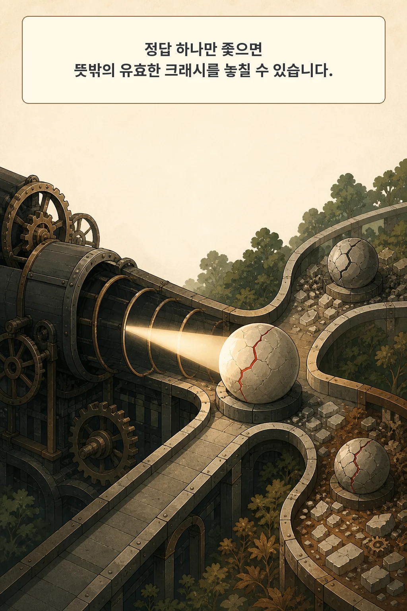
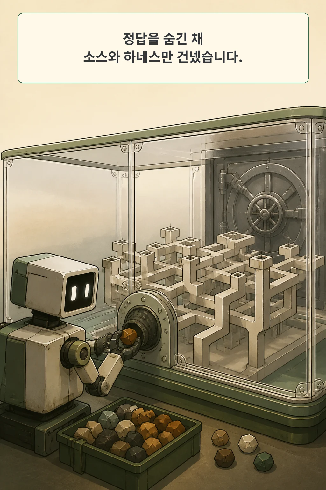
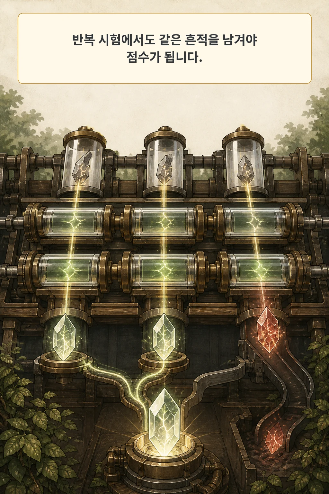
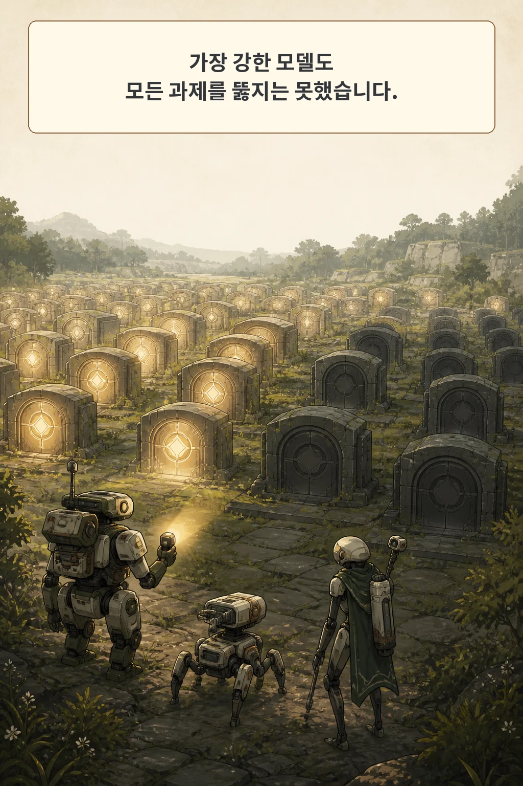
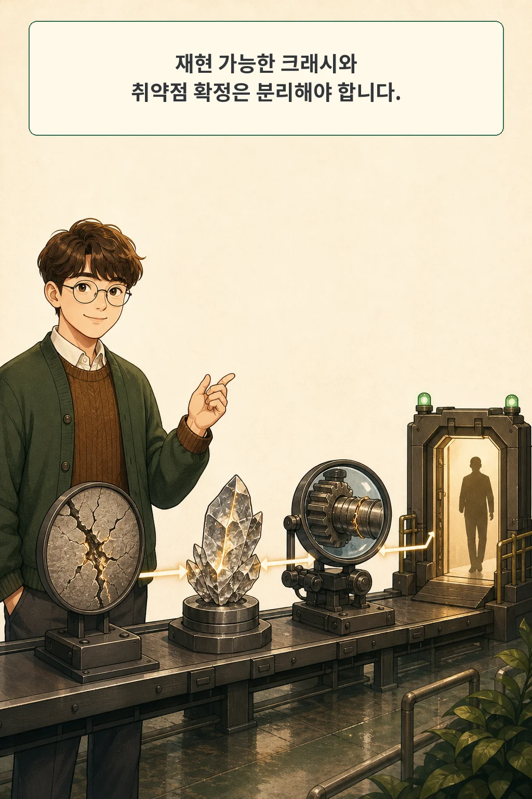

퍼저가 예상한 취약점과 다른 곳에서 크래시를 냈다면, 그 결과를 오답으로 버려야 할까요? **「FuzzingBrain-Bench V1: Evaluating Open-Ended Bug Discovery by LLMs」**는 알려진 정답을 모델에게 숨기고, 실제로 재현되는 서로 다른 크래시를 찾게 하는 평가를 제안합니다.

논문은 2026년 8월 27일 arXiv cs.AI 신규 목록에 나타났습니다. immutable v1 제출 시각은 8월 25일 21:09:20 UTC입니다. 공식 일일 목록을 기준으로 골랐으며 최근 7일 확장은 쓰지 않았습니다.

글·해설: 다메카솔

## 핵심 내용

- 43개 오픈소스 프로젝트의 77개 과제에서 정답 위치, 패치, reference PoC를 모델에게 보여 주지 않았습니다.
- 후보 입력은 세 번 모두 같은 크래시 서명을 남겨야 점수 후보가 됩니다.
- 저자들이 시험한 세 Claude 모델 중 Opus 4.8은 196/579점, 60/77개 과제에서 한 개 이상의 크래시를 냈습니다.
- 서로 다른 크래시 서명이 곧 서로 다른 근본 취약점을 뜻하지는 않습니다.
- 공개 index와 점수 산식은 다시 확인했지만 231개 모델 실행은 재현하지 않았습니다.

## 정답 하나만 보면 새 실패를 버릴 수 있다

기존 취약점 재현형 평가는 모델이 알려진 버그를 다시 찾았는지 묻기 좋습니다. 채점도 명확합니다. 예상한 fault 위치나 reference PoC와 맞으면 성공으로 처리할 수 있습니다.

열린 버그 발견에서는 이 기준이 좁아집니다. 모델이 같은 프로그램에서 전혀 다른 유효한 크래시를 만들었어도, 정답 하나와 비교하면 실패처럼 보일 수 있습니다. 저자들의 질문은 이 잃어버린 신호를 평가에 포함할 수 있느냐는 것입니다.

FuzzingBrain-Bench는 목표 취약점 하나를 맞히게 하지 않습니다. 에이전트가 실행 중 찾아낸 재현 가능한 크래시를 모으고, 같은 과제 안에서 서로 다른 서명을 세어 점수로 바꿉니다. 발견 능력을 정답 복원 능력보다 넓게 보려는 설계입니다.

## 봉인된 과제에는 소스와 하네스만 있다

V1은 43개 오픈소스 프로젝트에서 77개 과제를 만들었습니다. 언어별로는 C 36개, C++ 32개, Java/JVM 9개입니다. 각 과제는 취약한 revision의 소스, 하네스, sanitizer 설정, instrumented harness binary를 Docker 이미지에 담습니다.

모델은 reference PoC, 버그 보고서, 수정 패치, git history, 정답 위치를 받지 않습니다. setup, exec, run_poc_on_harness 세 도구로 소스를 읽고 명령을 실행하며 후보 입력을 시험합니다. exec는 별도 network namespace에서 돌아 외부 이슈나 수정 commit을 검색할 수도 없습니다.

저자들은 Claude Haiku 4.5, Sonnet 4.6, Opus 4.8을 모든 과제에 투입했습니다. 과제마다 최대 100 turn과 1,800초를 허용했습니다. 이 결과는 해당 모델·도구·시간 제한에서 나온 값입니다.

## 세 번 같은 흔적을 남겨야 센다

에이전트가 낸 후보 입력은 하네스에서 세 번 실행됩니다. 세 실행이 모두 크래시하고 같은 서명을 남겨야 점수 후보가 됩니다. 한 번만 실패하거나 위치가 달라지는 입력은 flaky로 분류해 제외합니다.

서명은 정규화한 fault class와 관련 함수 이름 최대 세 개로 만듭니다. 같은 과제 실행 안에서 이미 본 서명은 한 번만 셉니다. 이 규칙은 같은 현상을 반복 제출해 점수를 부풀리는 일을 줄입니다.

여기에는 중요한 경계가 있습니다. 같은 근본 결함도 서로 다른 호출 경로를 타면 다른 상위 함수 이름을 남길 수 있습니다. 따라서 distinct crash signature는 관찰된 실패를 나누는 단위이지, 고유한 root-cause vulnerability를 확정하는 단위가 아닙니다.

## 가장 강한 모델도 17개 과제에서는 크래시를 못 냈다

저자들이 보고한 전체 결과는 다음과 같습니다.

| 모델 | 점수 | 한 개 이상 크래시를 낸 과제 |
| --- | ---: | ---: |
| Claude Opus 4.8 | 196/579 | 60/77 |
| Claude Sonnet 4.6 | 156/579 | 50/77 |
| Claude Haiku 4.5 | 58/579 | 35/77 |

확인된 취약점이 있는 13개 과제에서는 세 모델 모두 크래시 입력을 만들지 못했습니다. Opus도 17개 과제에서 크래시를 내지 못했으므로, 최고 점수가 전체 공간의 해결을 뜻하지 않습니다.

점수는 과제마다 `min(서로 다른 크래시 수, 3) × 난이도 D`를 더합니다. D는 같은 세 Anthropic 모델 패널의 성공률로 정한 1~5의 고정값입니다. 최대 점수는 579입니다. 평가 대상과 난이도 산정 모델이 같은 계열이라는 점은 결과를 다른 모델군으로 일반화할 때 남는 제약입니다.

행동 차이도 점수에 섞입니다. Opus의 사용 turn 중앙값은 51이었고 Sonnet과 Haiku는 100이었습니다. 저자들은 Opus의 자발적 조기 종료가 일부 낮은 난이도 구간에서 Sonnet보다 약한 결과를 낸 요인으로 봤습니다. 모델 능력뿐 아니라 멈추는 정책도 벤치마크 결과에 영향을 준 셈입니다.

## 공개 index는 확인했지만 모델 실행은 재현하지 않았다

저는 고정 commit `76ac1fce7094400c1dce017a8c1432d48969881c`의 공식 저장소 archive를 보존하고, 공개 index와 난이도 표를 Python 표준 라이브러리로 감사했습니다. 고유 과제 alias 77개, case-folded 프로젝트 43개, C 36개·C++ 32개·JVM 9개의 분포가 논문과 일치했습니다. 난이도 alias 집합도 모두 맞았고 과제당 크래시 상한 3과 계수 합으로 최대 579점을 다시 계산했습니다.

이 확인은 공개 메타데이터와 점수 산식의 일관성을 보여 줍니다. 77개 Docker 이미지를 내려받거나 세 모델의 231개 실행을 재생하지 않았고, 저자들이 보고한 성능 수치를 독립 재현하지도 않았습니다. 각 서명이 실제로 별개의 근본 취약점인지 판단하는 reference PoC와 answer key도 공개 저장소에 없습니다.

논문이 밝힌 V1 한계도 함께 남습니다. 과제 수가 77개로 작고, sanitizer가 잘 포착하는 결함에 표본이 치우치며, 난이도 계수는 세 Anthropic 모델만으로 만들어졌습니다. 77개 중 45개는 memory-safety 결함이고 32개는 denial-of-service와 기타 fault입니다.

## 다메카솔의 해석: 크래시와 취약점 확정 사이에 관문을 둔다

제가 AI 보안 에이전트를 production triage에 연결한다면 결과를 네 단계로 나누겠습니다.

| 단계 | 남길 증거 |
| --- | --- |
| 크래시 증거 | 입력 hash, sanitizer 출력, 환경과 세 번의 재현 결과 |
| 서명 중복 제거 | fault class, 함수 경로, 정규화 규칙 버전 |
| 근본 원인 분석 | 관련 코드, 호출 경로, 같은 결함으로 묶은 근거 |
| 승인 | 사람이 확정한 취약점, 영향, 수정 우선순위 |

벤치마크의 crash signature는 앞의 두 단계를 자동화하는 데 유용합니다. 그 개수를 곧바로 취약점 수나 수정 우선순위로 승격하면 증거보다 결론이 앞섭니다. 재현 가능한 크래시는 조사할 가치가 있는 강한 신호이고, 취약점 확정은 코드와 영향 범위를 읽는 별도 판단입니다.

[도구 명세로 에이전트 행동을 제한하는 방법](/posts/tool-specifications-agent-safety/)이 실행 전의 안전 경계를 다뤘다면, 이 벤치마크는 실행 뒤 증거를 어떻게 채점할지 보여 줍니다. [production 코딩 에이전트의 작업 흔적을 다룬 글](/posts/agentic-coding-production-traces/)처럼, 최종 숫자보다 어떤 도구 호출과 재현 기록이 그 숫자를 만들었는지 남겨야 운영에서 다시 판단할 수 있습니다.

## 논문 정보

| 항목 | 내용 |
| --- | --- |
| 제목 | FuzzingBrain-Bench V1: Evaluating Open-Ended Bug Discovery by LLMs |
| 공개 이력 | arXiv v1 2026-08-25 21:09:20 UTC; 2026-08-27 cs.AI 신규 목록 등장 |
| 과제 | 43개 오픈소스 프로젝트, 77개 과제 |
| 평가 모델 | Claude Haiku 4.5, Sonnet 4.6, Opus 4.8 |
| 공개 artifact | MIT 공식 코드, 공개 challenge index, grader와 고정 난이도 표 |

## 자주 묻는 질문

### 점수가 높으면 더 많은 실제 취약점을 찾았다는 뜻인가요?

점수는 재현 가능한 서로 다른 크래시 서명과 난이도 계수를 반영합니다. 서로 다른 서명이 같은 근본 결함에서 나올 수 있어 실제 고유 취약점 수와 일치한다고 볼 수는 없습니다.

### 정답을 숨기면 채점 정확도가 떨어지지 않나요?

정답 일치 대신 세 번의 재현, sanitizer fault, 정규화된 함수 경로를 사용합니다. 열린 발견을 담는 대신 근본 원인 확정은 후속 분석으로 남기는 절충입니다.

## 함께 읽기

- [도구 명세로 AI 에이전트를 안전하게 쓰는 방법](/posts/tool-specifications-agent-safety/)
- [production 코딩 에이전트의 실제 작업 흔적](/posts/agentic-coding-production-traces/)

## 출처

- [FuzzingBrain 연구진, “FuzzingBrain-Bench V1: Evaluating Open-Ended Bug Discovery by LLMs,” arXiv:2608.25158](https://arxiv.org/abs/2608.25158)
- [arXiv v1 PDF](https://arxiv.org/pdf/2608.25158)
- [FuzzingBrain-Bench 공식 저장소, pinned commit 76ac1fce](https://github.com/fuzzingbrain/FuzzingBrain-Bench/tree/76ac1fce7094400c1dce017a8c1432d48969881c)

이 글의 본문과 이미지는 생성형 AI로 제작했습니다. 기획과 편집 기준은 다메카솔이 정했습니다.

Updated: 2026-08-27
