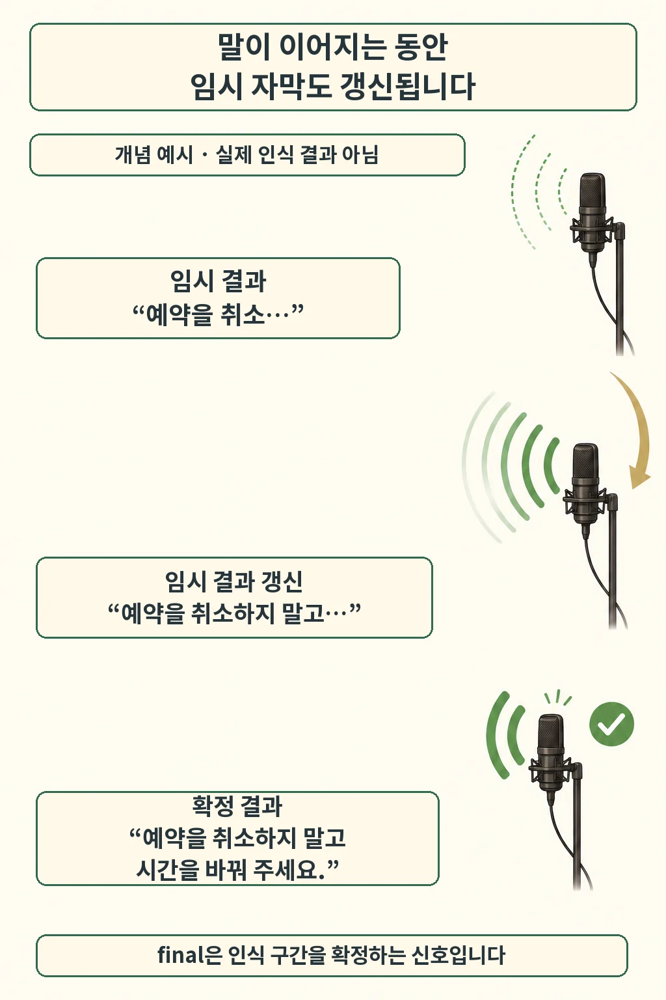
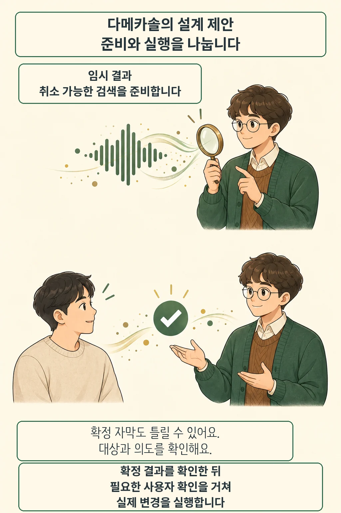

글·해설: 다메카솔

발행·확인: 2026-10-02

“예약을 취소…”까지 들은 음성 에이전트가 먼저 취소를 실행하면, 뒤이어 나온 “하지 말고 시간을 바꿔 주세요”를 되돌리기 어려워집니다. 실시간 자막을 빨리 받는 서비스에서는 **아직 바뀔 문장과 확정된 구간을 나누는 설계**가 필요합니다. Microsoft가 2026년 10월 1일 발표한 **MAI-Transcribe-2-Streaming**은 음성이 도착하는 동안 임시 결과를 보내고, 발화가 끝나면 결과를 확정하는 음성 인식 모델입니다. [Microsoft 공식 발표](https://techcommunity.microsoft.com/blog/azure-ai-foundry-blog/build-expressive-voice-experiences-with-new-mai-models-in-microsoft-foundry/4524637)

## 말이 이어지면 자막도 바뀝니다

Vercel의 모델 문서에서는 WebSocket 연결로 음성을 연속 전송하고, 말하는 도중 전사 결과를 점진적으로 받는다고 설명합니다. `Partials`는 현재 전사를 갱신하는 중간 결과이고, `final` 결과는 한 구간을 확정합니다. 앞서 받은 문장을 모두 완성 문장처럼 쌓으면 수정 전 문장까지 남기게 됩니다. [제공 방식과 모델 문서](https://vercel.com/ai-gateway/models/mai-transcribe-2-streaming)

그림의 예약 대화는 동작 차이를 보여 주기 위해 만든 예시입니다. 실제 모델의 인식 결과를 재현한 장면은 아닙니다. **문장이 아직 진행 중이라는 상태**가 핵심입니다. 가령 자막을 화면에 먼저 표시하더라도 임시 구간은 갱신할 수 있게 두고, 확정된 구간과 구별해 저장하는 구조를 생각할 수 있습니다.

## 지금 제공되는 모델과 확인할 범위

출시 소식에는 듣는 모델과 말하는 모델이 함께 들어 있습니다. Microsoft는 세 모델을 Foundry의 Azure Speech와 직접 API 경로로 제공한다고 밝혔습니다. Vercel AI Gateway에서도 Streaming의 모델 안내를 확인했습니다. 개별 계정의 지역·권한·할당량은 실제 도입 환경에서 확인해야 합니다.

| 모델 | 발표에서 설명한 역할 | 10월 1일 발표 가격 |
| --- | --- | --- |
| MAI-Transcribe-2-Streaming | 들어오는 음성을 실시간 텍스트로 변환 | 음성 1시간당 0.54달러, 2026년 말까지 도입 가격 |
| MAI-Voice-2.1 | 텍스트를 음성으로 생성 | 100만 문자당 22달러 |
| MAI-Voice-2.1-Flash | 응답 속도와 처리량을 중시한 음성 생성 | 100만 문자당 15달러 |

입력 음성 시간과 출력 문자 수는 과금 단위부터 다릅니다. 이 표는 발표 당시 가격이며, 실제 청구 조건은 선택한 제공 경로에서 다시 확인할 항목입니다.

Microsoft는 Streaming의 60개 언어 처리와 자동 언어 감지를 설명합니다. 같은 글에 나오는 화자 분리와 단어별 타임스탬프는 비스트리밍 **MAI-Transcribe-2**의 기능으로 소개했습니다. Streaming을 검토할 때는 이 기능들을 별도로 확인해야 합니다. 이 글은 공식 발표와 제공업체 문서를 대조한 것으로, 한국어 음성·잡음 환경의 정확도나 실제 지연을 직접 측정한 결과는 없습니다.

## 다메카솔의 해석: 준비는 앞당기고 실행은 확인 뒤로

저라면 부분 인식 결과를 받았을 때 취소 가능한 검색과 화면 준비부터 시작하겠습니다. 뒤에 붙는 말로 의도가 바뀌면 준비한 결과를 버리거나 다른 요청으로 돌릴 수 있기 때문입니다. 이때 이전 요청의 늦은 응답이 새 화면에 섞이지 않도록 발화 구간이나 요청 버전을 함께 관리하는 편이 좋겠습니다.

예약 변경이나 메시지 전송은 별도 실행 단계에 두겠습니다. 확정 결과를 받은 뒤에도 대상과 사용자의 의도가 맞는지, 해당 행동에 추가 확인이 필요한지 판단해야 합니다. `final`은 인식 구간의 확정 상태를 가리킵니다. 정답이나 실행 승인까지 보증하는 신호로 사용하면 확인 절차가 비게 됩니다.

이 경계는 제가 제안하는 애플리케이션 설계입니다. 모델에 자동으로 내장된 승인 기능이라는 뜻은 아닙니다. [Copilot Memory의 현재 브랜치 확인](/posts/github-agentic-autofix-copilot-memory/)이 저장된 맥락을 다시 검사하듯, 음성 에이전트도 앞서 받은 맥락을 실행 직전에 다시 확인할 이유가 있습니다.

도입 실험에서는 첫 자막이 뜨는 시간과 **잘못 시작한 준비를 취소하는 동작**을 함께 살펴보겠습니다. 부정 표현이 늦게 붙는 문장, 말하는 중간에 대상을 바꾸는 문장, 같은 요청을 반복하는 문장을 넣어 보세요. 빠른 인식이 실제 서비스의 안전한 반응으로 이어지는지는 그 연결 지점에서 드러납니다.

## 출처

- [Microsoft Foundry: 새 MAI 음성 모델 발표](https://techcommunity.microsoft.com/blog/azure-ai-foundry-blog/build-expressive-voice-experiences-with-new-mai-models-in-microsoft-foundry/4524637) — 2026-10-01. 출시 내용·사양·발표 가격의 1차 출처.
- [Vercel AI Gateway: MAI-Transcribe-2-Streaming](https://vercel.com/ai-gateway/models/mai-transcribe-2-streaming) — 2026-10-02 확인. WebSocket, 임시/확정 결과, 제공 경로를 확인한 제공업체 문서.

이 글의 본문과 이미지는 생성형 AI로 제작했습니다. 기획과 편집 기준은 다메카솔이 정했습니다.
