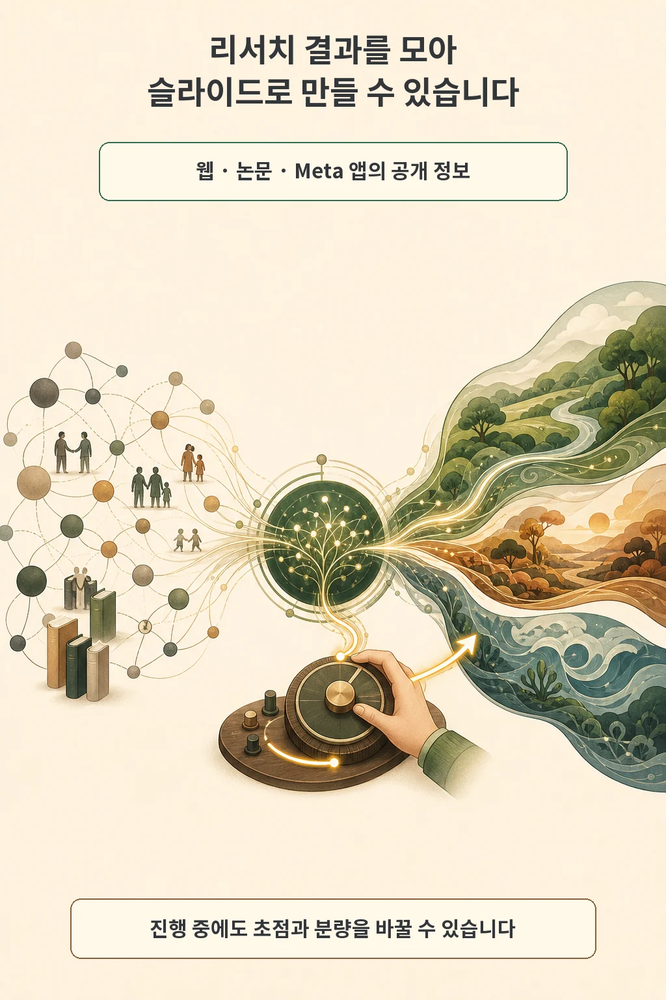
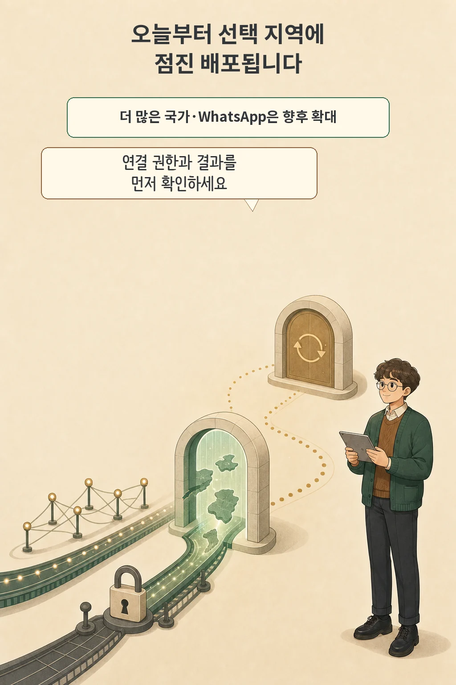

매주 같은 브리핑을 다시 요청하거나 약속을 확인하는 일을 AI에게 한 번만 설명하고 맡길 수 있을까요? Meta는 2026년 7월 24일 **Meta AI가 이메일·캘린더 앱에 연결해 계획을 세우고 반복 작업을 처리하는 기능**을 발표했습니다. 새 기능은 Meta AI 앱과 meta.ai의 선택 지역부터 배포되며, 모든 국가와 WhatsApp에 이미 제공된 것은 아닙니다.

글·해설: 다메카솔

## 답변에서 연결·계획·반복 실행으로 넓어집니다

Meta의 발표에서 가장 큰 변화는 Meta AI가 답을 만드는 데서 멈추지 않고 연결된 앱의 맥락으로 다음 일을 계획한다는 점입니다. 이메일과 캘린더를 연결해 일정이 겹쳤는지 확인하거나, 가능한 날을 찾아 식사 장소를 제안하는 예시가 나왔습니다. 회사는 주간 식단 계획, 관심 제품 알림, 정해진 시각의 브리핑처럼 한 번 설정한 작업을 다시 전달할 수 있다고 설명합니다.

다만 발표에는 지원 이메일·캘린더 제공자의 전체 목록이나 연결 권한의 세부 범위가 없습니다. “앱에 연결한다”는 말만 보고 메일 작성, 전송, 일정 변경까지 모두 자동 실행한다고 넓혀 읽으면 안 됩니다. 실제 화면에서 요구하는 권한과 최종 확인 단계를 따로 봐야 합니다.

## 리서치와 슬라이드도 진행 중에 수정합니다

새 범위는 한 번 예약한 알림보다 넓습니다. Meta는 Meta AI가 웹의 정보, 연구 논문, Meta 앱에서 크리에이터와 커뮤니티가 공유한 내용을 모아 리서치 결과를 만들고, 이를 슬라이드로 바꿀 수 있다고 밝혔습니다. 결과의 정확성이나 출처 품질을 독립적으로 검증했다는 뜻은 아니므로, 중요한 판단에는 원문을 다시 확인해야 합니다.

작업이 끝날 때까지 기다릴 필요도 없다고 Meta는 설명합니다. 보고서·프레젠테이션·계획을 만드는 동안 초점, 말투, 분량을 바꾸라고 지시하면 진행 중인 결과를 수정합니다. [OpenAI Presence가 업무 에이전트의 권한과 평가를 운영 문제로 다룬 사례](/posts/openai-presence-agent-operations/)처럼, 생성 능력보다 중간 수정과 결과 확인 경로가 실제 사용성을 좌우합니다.

## 선택 지역 배포와 향후 계획을 나눠 봅니다

현재 이용 가능 범위는 발표 문구보다 좁을 수 있습니다. Meta는 7월 24일부터 Meta AI 앱과 meta.ai의 **선택 지역**에 새 기능을 배포하기 시작했다고 밝혔지만, 발표문에는 해당 국가의 전체 목록이 없습니다. 더 많은 국가와 표면으로 확대하고 WhatsApp에도 몇 주 안에 가져오겠다는 내용은 현재 상태가 아니라 미래 계획입니다.

Incognito Chat은 일반 연결 작업과 다른 조건에서 동작합니다. Meta는 Incognito Chat을 일반 Meta AI 대화와 분리된 임시·비저장 대화 경로로 설명했으며, 별도의 롤아웃 일정이 적용됩니다. 연결한 이메일·캘린더 맥락과 반복 작업이 자동으로 Incognito 처리된다고 발표하지는 않았습니다.

## 사용 전에 네 가지를 확인합니다

기능이 계정에 나타나면 먼저 작은 작업으로 경계를 확인하는 편이 안전합니다.

- 내 지역과 사용하는 표면에 새 기능이 실제로 배포됐는가?
- 어떤 이메일·캘린더 앱을 연결하며 읽기·쓰기 권한은 어디까지인가?
- 반복 작업의 실행 시점, 중단, 실패 알림과 최종 승인 단계가 보이는가?
- 중요한 리서치 결과와 생성 슬라이드를 원문에 대조할 수 있는가?

Muse Spark 1.1은 이 기능을 구동하는 모델입니다. Meta는 계획, 외부 앱·서비스 조정, 멀티에이전트 작업을 위해 설계했다고 설명하지만, 이번 회차의 핵심은 모델 벤치마크가 아니라 실제 제품에서 확인할 연결·반복·배포 경계입니다.

## 출처

- [Meta — Meta AI Doesn’t Just Think, It Acts](https://about.fb.com/news/2026/07/meta-ai-muse-spark-doesnt-just-think-it-acts/)
- [Meta AI — Introducing Muse Spark 1.1](https://ai.meta.com/blog/introducing-muse-spark-meta-model-api/)
- [Meta — Introducing a Completely Private Way to Chat With AI](https://about.fb.com/news/2026/05/incognito-chat-whatsapp-meta-ai/)

이 글의 본문과 이미지는 생성형 AI로 제작했습니다. 기획과 편집 기준은 다메카솔이 정했습니다.

Updated: 2026-07-26
