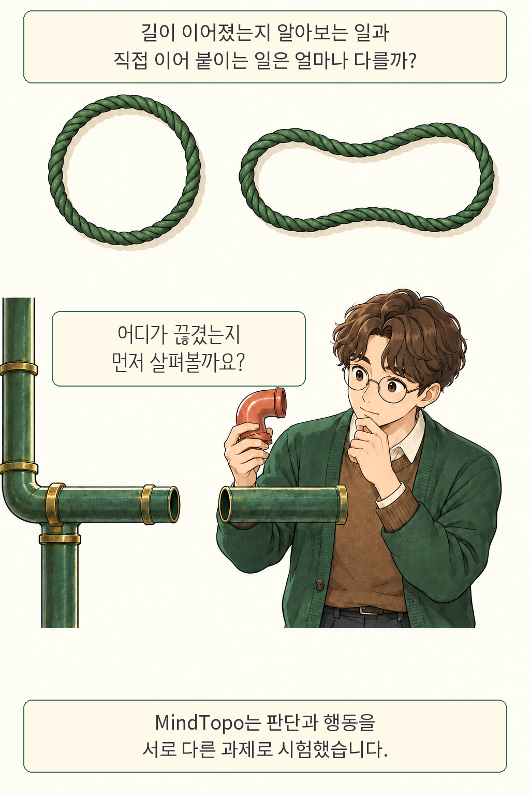
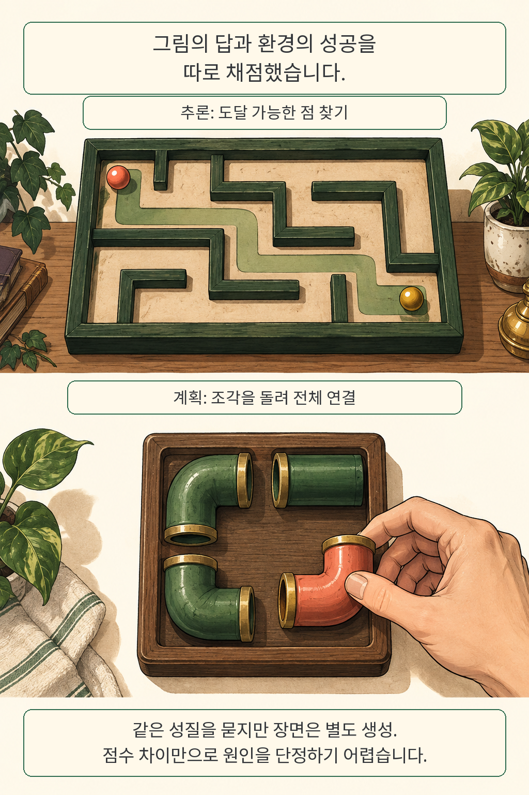

**MindTopo에서 평가한 멀티모달 모델은 그림 속 관계를 답하는 과제보다, 직접 행동해서 목표를 만드는 과제에서 낮은 평균 점수를 받았습니다.** 연결된 길을 알아보는 능력이 행동 계획에도 그대로 이어질 것이라는 기대를 점검한 결과입니다. 저자들은 미로·파이프·구슬·매듭처럼 구조가 눈에 보이는 문제로 두 능력을 나눠 살폈습니다. 개발자가 읽을 때도 답변의 그럴듯함과 실행의 성공을 구분해 볼 만합니다.

글·해설: 다메카솔

## 핵심 내용

- MindTopo v1은 연속성·분리·순서·둘러쌈·매듭에 관한 13종, 11,030개 사례를 담고 있습니다.
- 정적 추론에서는 관계를 답하고, 행동 계획에서는 환경이 정한 목표 조건을 만족해야 성공합니다.
- 정적 과제와 계획 과제는 같은 성질로 묶되 장면은 따로 만들었습니다. 점수 차이에는 과제 구성과 난도 차이도 관여합니다.
- 성능 수치는 2026년 9월 10일 제출된 논문 v1에 고정했습니다. 공식 소개 페이지에는 다른 수치가 남아 있습니다.
- 공식 코드와 데이터의 공개 상태를 직접 확인했습니다. 아래 모델 점수는 저자 보고이며 전체 평가를 재실행한 결과와 구별합니다.

## 휘어도 이어진 고리, 돌려야 이어지는 파이프

둥근 고리를 옆으로 늘려도 끊어진 곳이 생기지는 않습니다. 모양은 달라도 연결은 유지됩니다. 논문에서 다루는 위상적 관계는 이처럼 길이·각도보다 무엇과 무엇이 이어지고, 어떤 경계가 안과 밖을 나누는지에 초점을 둡니다. 자르거나 이어 붙이거나 한 부분을 다른 부분에 통과시키지 않는 변형이라는 조건이 붙습니다.

연구팀은 이 관점을 다섯 성질로 나눴습니다. **연속성**은 길이 끊김 없이 이어지는지, **분리**는 부분들을 나눌 수 있는지, **순서**는 줄을 따라 어떤 순서로 놓였는지 묻습니다. **둘러쌈**은 경계 안팎과 구멍을, **매듭**은 꼬임과 고리의 연결을 살핍니다. 모든 공간 능력을 대표하는 목록으로 받아들이기에는 범위가 제한적입니다.

만화의 고리와 작업대는 이 질문을 쉽게 보이기 위해 새로 그린 예시입니다. 파이프의 두께와 색은 설명을 돕는 장치이며, 실제 평가 화면이나 공개된 개별 문제를 복제한 그림은 아닙니다. 논문의 문제 설정은 [v1 2.1~2.2절](https://arxiv.org/html/2609.11900v1#S2)에 제시돼 있습니다.

## 답을 고르는 시험에서 행동을 실행하는 시험으로

길이 이어졌다는 판단을 실제 연결 작업으로 옮기면 무엇을 채점해야 할까요? 미로 추론 과제에서는 주어진 점에서 도달 가능한 점을 답합니다. Pipe 계획 과제에서는 조각을 90도씩 돌려 모든 활성 파이프가 시작점에 연결되도록 해야 합니다. 하나의 빈틈도 결과에 영향을 줍니다.

정적 질문의 숫자·선택형 답은 정답과 정확히 일치해야 하고, 순서 없는 목록은 집합으로 비교합니다. 본문 계획 평가에서는 모델이 관측을 받아 행동을 고르면 시뮬레이터가 상태를 갱신합니다. 정해진 행동 횟수 안에 과제별 목표 조건에 도달해야 한 회차의 성공으로 집계합니다. 자연어로 완료했다고 말하는 것과는 판정 근거가 다릅니다.

두 과제군은 동일한 장면을 번갈아 보여 준 실험이 아닙니다. 저자들은 같은 위상 성질을 중심으로 과제를 묶고 각 생성기로 장면을 따로 만들었습니다. 따라서 추론과 계획의 평균 차이는 평가에서 드러난 차이로 읽어야 합니다. 행동 자체, 상태 표현, 난도, 필요한 행동 길이 가운데 무엇이 얼마만큼 원인인지 분리하려면 추가 대조 실험이 필요합니다.

이 관점은 [JarvisGUI의 기기 간 작업 완료 평가](/posts/jarvisgui-cross-device-state/)와도 연결됩니다. 앞선 연구가 파일 전달과 후속 작업의 의존성을 시험했다면, MindTopo는 연결 관계를 만들어야 하는 공간 과제로 실행 능력을 살핍니다.

## 평균 점수와 파이프의 빈틈을 함께 읽기

Pipe에서 가장 높은 모델 성공률도 50.50%였습니다. 모든 조각을 연결하는 과제에서 절반 가까운 시도가 목표에 도달하지 못한 셈입니다. 이 수치는 논문 v1이 비교한 멀티모달 모델 14개 가운데 GPT-5.6-Sol의 결과이며, 실제 배관 작업이나 로봇 성공률로 확장해서 읽기에는 실험 조건이 다릅니다.

| 논문 v1의 평가 대상 | 정적 추론 과제평균 | 행동 계획 과제평균 | Pipe 성공률 |
| --- | ---: | ---: | ---: |
| GPT-5.6-Sol | 66.83% | 52.75% | 50.50% |
| GPT-5.5 | 53.77% | 24.33% | 2.17% |
| Gemini-3.1-Pro | 52.24% | 19.23% | 5.50% |

출처는 [논문 v1 Table 1과 3.2절](https://arxiv.org/html/2609.11900v1#S3.S2)입니다. 정적 추론은 8종, 행동 계획은 5종의 **과제별 점수를 같은 비중으로 평균**했습니다. 모든 사례를 한데 모은 정답률과 구분해야 합니다. 계획 과제의 사례 수는 종류마다 600개이며, 본문 평가의 디코딩 온도는 0입니다.

GPT-5.6-Sol의 13종 전체 과제평균은 61.42%, 인간 관측 평균은 97.87%였습니다. 전문 평가자 5명이 전체 11,030개 중 11,008개를 평가했고, 사례당 완료된 평가는 하나였습니다. 모든 사람이 모든 문제를 풀었다거나 인간 전체의 능력을 측정했다고 해석하면 표본의 범위를 벗어납니다.

학습을 추가한 실험에서도 격차가 남았습니다. Qwen3-VL-2B-Instruct에 지도 미세조정과 강화학습을 순서대로 적용하자 선택된 추론 5종의 평균은 14.24%에서 51.53%로, 계획 4종은 0.20%에서 6.33%로 올랐습니다. 여기서는 초기 관측에서 전체 행동열을 예측해 실행했습니다. 앞의 본문 계획 평가와 실행 방식이 달라 두 표의 수치를 직접 이어 비교할 때 주의가 필요합니다.

성공 조건 자체도 들여다봐야 합니다. Untangle은 화면에 투영된 줄의 교차를 없애는 과제로, 삼차원 매듭의 종류를 보존하는 문제와 구별됩니다. 전체 장면은 절차적으로 생성됐으며 실제 사진의 다양한 배경과 조명은 범위 밖입니다. 저자들이 함께 살핀 생성 영상에서도 그럴듯한 끝 장면과 유효한 상태 전이를 구분해야 하는 문제가 관찰됐습니다. 선택된 영상 모델과 제한된 검수 표본에서 얻은 결과입니다.

## 공식 페이지와 원문이 다를 때의 기준

공식 소개 페이지에는 확인 시점에 사례 11,016개, 모델 11개, 최고 점수 54.1%가 표시돼 있었습니다. v1 PDF의 11,030개, 14개, 61.42%와 다릅니다. 이 글은 **논문 v1의 연구 결과와 소개 페이지의 표시 상태를 분리**했으며, 숫자가 바뀐 원인은 공개 자료만으로 확정하지 않았습니다.

공개 여부도 링크까지 따라가 확인했습니다. 소개 페이지의 코드·데이터에는 공개 예정 표시가 남았지만, PDF가 연결하는 [GitHub 저장소](https://github.com/mll-lab-nu/MindTopo/tree/96ac4d15a706c43b31fb60ada7902c604cb857c1)와 [Hugging Face 데이터](https://huggingface.co/datasets/MLL-Lab/MindTopo/tree/312ae92494ff1f17d7b1eb340ea77ccadb9a3cba)는 공개 상태였습니다. 저장소는 정적 질문, 상호작용 계획, 이미지 생성 결합, 저장된 영상 평가의 실행 경로를 제공합니다.

이번 검토에서는 버전을 고정한 원문과 코드, 데이터 메타데이터를 보존하고 Pipe의 완료 조건을 대조했습니다. 저장소 README는 실행 로그를 배포에서 제외한다고 명시합니다. 모델 API 호출과 전체 벤치마크 재실행은 수행하지 않았으므로, 성능표를 독립 재현했다고 주장할 근거는 없습니다.

## 다메카솔의 해석: 완료 조건을 환경 쪽에 두겠습니다

저는 이런 에이전트 평가를 만들 때 설명의 정답률과 실행 성공률을 별도 지표로 관리하겠습니다. 답이 맞아도 도구에 전달한 행동이 유효한지, 목표 상태에 실제로 도달했는지는 다른 증거가 필요하기 때문입니다. Pipe라면 연결 여부를 그래프 탐색으로 확인하고, 파일 작업이라면 목적지의 파일 내용과 필수 속성을 검사하는 식입니다.

평가 기준은 모델이 고칠 수 없는 환경 쪽에 두는 편이 타당하다고 봅니다. 모델의 자체 설명을 그대로 승인 근거로 쓰면 잘못 이해한 목표와 그 목표를 만족했다는 주장이 함께 통과할 수 있습니다. [ExecCritic의 테스트 작성·수정 역할 분리](/posts/execcritic-independent-tests/)와 닿는 지점입니다. 이 설계는 완료 판정의 근거를 명확히 하지만, 관측 오류를 자동으로 해결해 주지는 않습니다.

대신 비용이 생깁니다. 과제마다 목표 판정기를 만들어야 하고, 모호한 요구사항은 검사가 가능한 조건으로 정리해야 합니다. 판정기 자체의 회귀 테스트도 필요합니다. 여기까지는 공개 연구를 바탕으로 한 제 설계 판단이며, MindTopo가 운영 시스템에서 이 구성을 검증한 결과로 읽어서는 안 됩니다.

다음으로 궁금한 것은 상태를 정확한 구조 데이터로 주고 행동 길이까지 맞췄을 때 남는 격차입니다. 그 차이를 좁혀 보면, 더 잘 보는 모델이 필요한지 더 나은 계획 방식이 필요한지 한층 분명해질 것입니다.

## 출처

- Ge 외, [MindTopo: Can Foundation Models Reason in Topological Space? v1](https://arxiv.org/abs/2609.11900v1), 2026-09-10 제출. 프리프린트.
- [논문 PDF](https://arxiv.org/pdf/2609.11900v1), 2절의 과제 설계, Table 1·2, 3.2~3.5절의 결과, 5절의 한계, 부록 B의 평가 조건.
- [공식 프로젝트 페이지](https://mind-topo.github.io/), 2026-09-11 확인. 수치와 공개 예정 표시가 PDF 및 직접 링크 상태와 다름.
- [공식 코드 96ac4d15](https://github.com/mll-lab-nu/MindTopo/tree/96ac4d15a706c43b31fb60ada7902c604cb857c1), [공식 데이터 312ae924](https://huggingface.co/datasets/MLL-Lab/MindTopo/tree/312ae92494ff1f17d7b1eb340ea77ccadb9a3cba), 2026-09-11 확인.

Updated: 2026-09-11

이 글의 본문과 이미지는 생성형 AI로 제작했습니다. 기획과 편집 기준은 다메카솔이 정했습니다.
