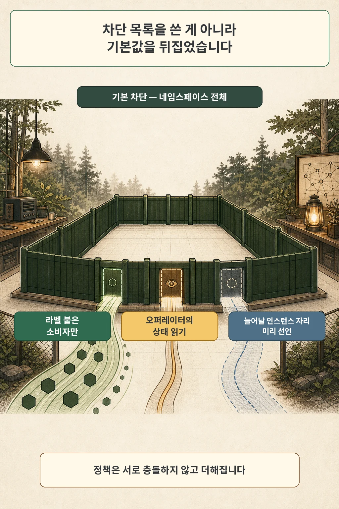
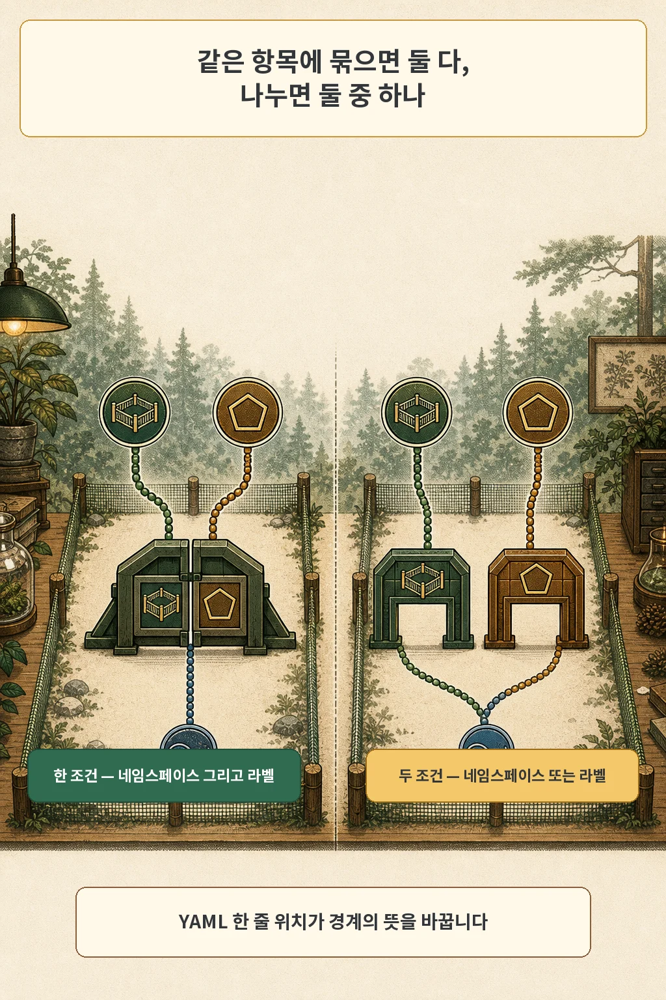
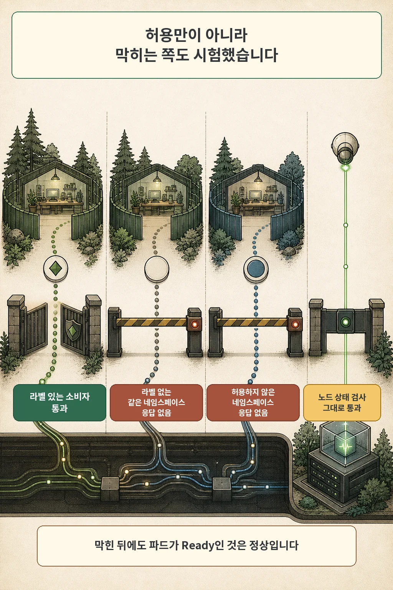

글·해설: 다메카솔

정책을 커밋하고 Argo CD에서 초록색 Synced를 확인하면, 보통 그 작업은 거기서 끝납니다. 2026년 7월 13일 오후에 저도 같은 화면을 봤습니다. 그 화면이 알려 주는 것은 선언이 클러스터에 들어갔다는 사실 하나입니다. 무언가 실제로 막히고 있다는 정보는 그 초록색 안에 들어 있지 않습니다.

> 이 글은 2026년 7월 12~13일에 진행한 홈랩 파일럿의 작업 로그와 같은 날 GitOps 커밋을 다시 대조해 썼습니다. 이번 편에는 장애가 없습니다. 정책은 처음부터 의도대로 동작했고, 남아 있는 기록은 검증 결과입니다. 본문의 매니페스트와 명령은 실제 네임스페이스·라벨·프로젝트 이름을 지우고 일반화한 예시로 다시 썼습니다.

## 네 장으로 선언한 경계

그날 커밋한 정책은 넉 장이었습니다. 한 장은 데이터베이스 네임스페이스 전체의 인입을 기본 차단했고, 나머지 셋은 통과시킬 경로를 하나씩 이름 붙여 열었습니다. 소비 앱에서 데이터베이스 포트로 가는 길, 오퍼레이터가 인스턴스 상태를 읽으러 오는 길, 그리고 인스턴스가 늘어났을 때 필요한 인스턴스끼리의 길입니다. 마지막 길에는 아직 아무도 다니지 않았습니다.

기본 차단은 이렇게 생겼습니다.

```yaml
spec:
  podSelector: {}      # 네임스페이스 안 모든 파드를 선택
  policyTypes:
    - Ingress          # egress는 이번 범위 밖
```

이 넉 장이 「차단 목록」이라는 인상을 줄 수 있어서 한 번 짚고 갑니다. Kubernetes 문서는 NetworkPolicy가 서로 충돌하지 않고 더해진다고 설명합니다. 한 파드에 여러 정책이 걸리면 그 정책들이 허용하는 연결의 합집합이 결과이고, 평가 순서는 결과를 바꾸지 않습니다. 파드는 원래 인입에 대해 격리돼 있지 않다가, 자기를 선택하는 정책이 하나라도 생기는 순간 격리됩니다. 기본 차단 정책이 하는 일은 규칙을 쌓는 것이 아니라 그 기본값을 뒤집는 것입니다.



오퍼레이터가 상태를 읽는 길을 미리 연 데에는 이유가 있습니다. 그 길을 막으면 오퍼레이터가 인스턴스 상태를 못 읽고, 데이터베이스는 멀쩡한데 Cluster만 unhealthy로 보입니다. 인스턴스 간 통신을 미리 선언한 것도 같은 성격입니다. 지금은 인스턴스가 하나라 트래픽이 없지만, 복제본을 늘리는 순간 복제 스트림이 이 규칙에 걸립니다. 그때 조용히 멈추는 것보다 지금 한 줄 적어 두는 편이 싸다고 봤습니다.

## 한 항목에 묶으면 「그리고」, 나누면 「또는」

허용 조건을 두 개 쓰면 둘 다 만족해야 할까요, 하나만 만족해도 될까요. 답은 YAML에서 그 두 줄이 어디에 놓였느냐에 달려 있습니다. 소비 앱 허용 정책은 이렇게 썼습니다.

```yaml
ingress:
  - from:
      - namespaceSelector:          # 이 네임스페이스에 속하고
          matchLabels:
            kubernetes.io/metadata.name: app-ns
        podSelector:                # 동시에 이 라벨을 가진 파드만
          matchLabels:
            needs-db: "true"
    ports:
      - protocol: TCP
        port: 5432
```

두 셀렉터가 같은 `from` 항목 안에 있으므로 조건은 「그리고」입니다. 지정한 네임스페이스에 속하면서 동시에 그 라벨을 단 파드만 통과합니다. `podSelector` 앞에 하이픈을 하나 더 붙여 배열 항목을 나누면 조건이 「또는」으로 바뀝니다. 그러면 그 네임스페이스의 모든 파드와, 정책이 놓인 네임스페이스에서 그 라벨을 단 모든 파드가 각각 통과합니다. Kubernetes 문서도 두 형태를 예제로 나란히 놓고 YAML 문법에 주의하라고 적어 두었습니다.



들여쓰기 두 칸이 경계의 뜻을 바꿉니다. 그리고 잘못 쓴 쪽도 문법상으로는 멀쩡합니다. 조용히 적용되고, 경계만 넓어집니다.

## 그 정책을 집행하는 쪽은 누구입니까

여기까지는 전부 선언 이야기입니다. 선언은 클러스터에 저장됐고, Argo CD는 저장된 내용이 Git과 같다고 알려 줬습니다. 그런데 저장된 문서가 트래픽을 막지는 못합니다. 노드에서 실제로 통행 규칙을 만드는 쪽이 따로 있어야 합니다.

Kubernetes 문서는 이 대목을 한 문장으로 못 박아 두었습니다. NetworkPolicy는 네트워크 플러그인이 구현하며, 구현하는 컨트롤러 없이 리소스만 만들면 아무 효과가 없습니다. 이때 리소스는 정상적으로 만들어지고, API는 성공을 돌려주고, 트래픽은 그대로 흐릅니다.


이 홈랩은 k3s 기본 구성이고, 기본 CNI는 트래픽을 나르는 일까지만 합니다. 정책을 집행하는 쪽은 k3s가 함께 배포하는 별도의 네트워크 정책 컨트롤러입니다. K3s 문서에서 그 근거를 확인할 수 있는데, server 플래그 `--disable-network-policy`의 설명이 「k3s 기본 네트워크 정책 컨트롤러를 끈다」이기 때문입니다. 끌 수 있는 것이 있다는 말은 켜져 있는 것이 있다는 말입니다. 다른 CNI를 설치할 때는 충돌을 피하려 이 플래그를 함께 설정하라는 안내도 같은 문서에 있습니다.

그 플래그가 이 클러스터에 설정돼 있지 않은지 확인할 때 한 번 헛짚을 뻔했습니다. 실행 중인 프로세스 목록을 문자열로 훑는 방법은 오탐합니다. 정본은 systemd 유닛의 `ExecStart`입니다.

```bash
systemctl cat k3s | grep -- --disable-network-policy
```

출력이 비어 있으면 컨트롤러가 꺼져 있지 않다는 뜻입니다. 여기까지가 「집행자가 있을 것이다」까지이고, 「지금 이 정책을 집행하고 있다」는 아직 확인되지 않은 상태입니다.

## 두 방향에서 막힌 것을 확인했습니다

저는 이 단계를 배포의 마지막 절차가 아니라 별개의 시험으로 뒀습니다. 통과되는 쪽만 확인하면 정책이 없어도 같은 결과가 나오기 때문입니다. 그래서 세 가지를 봤습니다.

양성 시험은 라벨을 붙인 소비자 파드에서 데이터베이스에 접속해 질의 하나를 보내는 것이었고, 성공했습니다. 음성 시험은 둘로 나눴습니다. 하나는 같은 네임스페이스 안에 있지만 허용 라벨이 없는 파드, 다른 하나는 정책이 아예 언급하지 않은 네임스페이스의 파드입니다. 두 파드 모두 데이터베이스 포트에서 timeout으로 막혔습니다.

```bash
# 음성 1: 같은 네임스페이스, 라벨 없음
kubectl -n app-ns run probe-nolabel --rm -it --restart=Never \
  --image=<psql 이미지> -- psql -h <db-service> -p 5432 -c 'SELECT 1'

# 음성 2: 정책에 없는 네임스페이스
kubectl -n other-ns run probe-outside --rm -it --restart=Never \
  --image=<psql 이미지> -- psql -h <db-service> -p 5432 -c 'SELECT 1'
```



거부의 모양이 timeout이라는 점은 기억해 둘 만합니다. 요청은 나갔는데 응답이 돌아오지 않습니다. 즉시 거절당하는 화면을 기대하고 있으면, 몇 초 기다렸다가 「아직 반영이 안 됐나」 하고 다시 시도하게 되는 지점이 여기입니다.

세 번째로 본 것은 데이터베이스 자신의 상태입니다. 정책이 정착하고 60초가 지난 뒤에도 Cluster는 healthy였고 파드는 1/1이었습니다. 이게 이상하게 보일 수 있습니다. 인입을 전부 막았는데 상태 검사는 왜 통과할까요. kubelet이 보내는 상태 검사는 노드에서 출발하고, `kubectl exec`은 API 서버를 거칩니다. 둘 다 이 기본 차단에 걸리지 않습니다. 차단이 걸린 상태에서 파드가 Ready인 것은 정상이고, 오히려 여기서 파드가 죽었다면 허용 규칙 하나를 빠뜨린 것입니다.

제가 확인한 범위는 여기까지입니다. 컨트롤러가 실제로 만든 통행 규칙을 덤프해서 매니페스트와 한 줄씩 대조하지는 않았습니다.

## 권한은 네 판이고, 판마다 거부를 봤습니다

같은 데이터베이스 앞에는 관문이 넷 서 있었습니다. 클러스터 API를 다룰 권한(k8s RBAC), 트래픽이 닿을 수 있는가(NetworkPolicy), 데이터에 손을 댈 수 있는가(데이터베이스 GRANT), 자격증명을 받을 수 있는가(시크릿 정책)입니다. 넷은 각자 다른 것을 통제하고, 하나를 통과했다고 다음이 열리지 않습니다.

데이터베이스 권한 계층에서도 같은 방식으로 거부를 봤습니다. 권한을 하나도 주지 않은 임시 role을 만들어 TCP로 접속해 보니, 해당 데이터베이스에 대한 CONNECT 권한이 없다는 이유로 접속 자체가 거절됐습니다. 확인한 뒤 그 role은 삭제했습니다. PostgreSQL 문서를 보면 CONNECT는 접속 시작 시점에 검사되고, 데이터베이스를 만들면 PUBLIC이 기본으로 CONNECT를 갖습니다. 이 파일럿은 그 기본 권한을 회수하고 앱 role에만 다시 부여한 상태였습니다.

시크릿 신원 계층도 양성과 음성을 나눴습니다. 정책에 바인딩된 ServiceAccount의 토큰으로 로그인하면 정해진 정책이 붙은 토큰이 발급됐고, 바인딩되지 않은 다른 ServiceAccount의 유효한 토큰으로는 인가된 계정이 아니라는 이유로 거부됐습니다. 이 시험의 요지는 그 토큰이 진짜였다는 점입니다. 유효한 자격증명도 바인딩 밖에서는 아무 문을 열지 못합니다.

네 판 가운데 셋에서 거부를 봤습니다. 나머지 한 판인 k8s RBAC 계층에서는 「권한 없는 주체가 거절되는」 형태의 독립된 시험 기록을 찾지 못했습니다. 권한 위임이 있어야 신원 검증이 돌아간다는 사실은 다른 단계에서 확인됐지만, 그건 양성 쪽 증거입니다. 이 공백은 그냥 공백으로 남겨 둡니다. 채워 넣은 것처럼 쓰는 편이 훨씬 나쁘다고 생각합니다.

여기서 정리해 두고 싶은 문장이 하나 있습니다. 네임스페이스는 그 자체로 보안 경계가 아니라 정책이 적용되는 범위입니다. 경계는 라벨과 정책으로 따로 선언해야 생기고, 선언한 뒤에는 그 경계가 실제로 서 있는지 한 번 더 봐야 합니다.

## 자주 묻는 질문

**정책을 적용했는데 아무것도 막히지 않습니다.**
먼저 정책 자체보다 집행하는 쪽을 확인해 보시기 바랍니다. 구현하는 컨트롤러가 없으면 리소스는 정상적으로 만들어지고 아무 효과도 없습니다. 관리형 클러스터라면 제공사 문서에서 NetworkPolicy 지원 여부와 활성화 방법을, 직접 세운 클러스터라면 CNI와 정책 컨트롤러 설정을 봅니다.

**허용 정책을 만들었더니 오히려 전부 막혔습니다.**
파드는 자기를 선택하는 정책이 하나라도 생기면 격리됩니다. 허용 정책 한 장을 추가하는 순간 그 파드는 「이 정책이 허용한 것만」 받게 되고, 그 전까지 열려 있던 다른 경로는 함께 닫힙니다. 필요한 경로를 빠짐없이 세는 것이 먼저입니다.

**차단은 됐는데 파드가 계속 Ready입니다. 정책이 새는 걸까요.**
그 상태가 정상입니다. kubelet의 상태 검사는 노드에서 출발하고 `kubectl exec`은 API 서버를 거치므로 인입 차단의 영향을 받지 않습니다. 운영 중에 진단 경로가 살아 있다는 뜻이기도 합니다.

## 열어 둔 것들

이 편에서 하지 않은 일도 적어 둡니다. egress는 의도적으로 차단하지 않았습니다. 오퍼레이터와 데이터베이스 인스턴스가 이름 해석과 API 서버로 나가는 경로를 이번 범위에서 건드리지 않기로 했기 때문입니다. 메트릭 인입 허용도 선언하지 않았는데, 그 시점에 메트릭을 읽어 갈 소비자가 하나도 없었습니다. 관측 스택을 이 클러스터로 옮기는 날 함께 열어야 합니다.

아직 답을 정하지 못한 것도 있습니다. 지금 확인한 「집행된다」는 이 클러스터의 이 구성에 한정된 결과입니다. CNI를 바꾸거나 배포판을 올리거나 정책 컨트롤러 설정을 건드리면 같은 매니페스트가 같은 효과를 낸다는 보장이 사라집니다. 그러면 이 시험을 얼마 만에 한 번씩 다시 돌려야 할까요. 저는 아직 그 주기를 정하지 못했고, 지금은 클러스터 구성을 바꾸는 변경에 손으로 붙여 두고 있습니다.

이번 편의 결론은 짧습니다. 허용되는 경로만 확인한 정책은 절반만 시험한 것이고, 나머지 절반은 막히는 쪽을 직접 두드려 봐야 나옵니다.

> 검증 환경: k3s v1.36 노드 2대(server 1 + agent 1), 기본 CNI와 k3s 기본 네트워크 정책 컨트롤러, CloudNativePG 오퍼레이터 1.30, Argo CD 3.4. 2026년 7월 실측입니다. 다른 CNI·배포판 조합에서는 다르게 동작할 수 있습니다.

다음 편에서는 백업 2차 사본을 만들다 공유 게이트웨이를 OOM으로 몰아넣은 사건과, 전송이 끝난 뒤에 사본이 정말 같은지 객체 단위로 대조한 절차를 다룹니다.

## 함께 읽을 개념 글

- [Kubernetes NetworkPolicy 간헐적 connection refused: DNAT 뒤 목적지를 확인한 기록](/posts/k8s-networkpolicy-dnat-evaluation/): 정책이 평가하는 목적지가 요청한 주소와 다를 수 있는 경우를 다룹니다.
- [CoreDNS를 두 대 띄우고도 재구축이 위험했던 이유](/posts/dns-bootstrap-loop/): 같은 홈랩에서 「정상으로 보이는 상태」와 「실제로 필요한 순간에 동작하는 상태」를 나눠 본 3편입니다.

## 출처

- 개인 인프라 파일럿 작업 로그: 권한 재설계와 CONNECT 부정 시험, 신원 흐름 양성·음성 검증, NetworkPolicy 4종과 검증 3종, 2026-07-12~13
- 개인 GitOps 저장소 기록: 데이터베이스 네임스페이스 기본 차단과 명시 허용 4종, 2026-07-13, commit `7bdf6f74`
- [Kubernetes: Network Policies](https://kubernetes.io/docs/concepts/services-networking/network-policies/)
- [K3s: server CLI reference](https://docs.k3s.io/cli/server)
- [K3s: Basic Network Options](https://docs.k3s.io/networking/basic-network-options)
- [PostgreSQL: Privileges](https://www.postgresql.org/docs/current/ddl-priv.html)
- [HashiCorp Vault: Kubernetes auth method](https://developer.hashicorp.com/vault/docs/auth/kubernetes)

사설 주소, 내부 도메인과 호스트명, 실제 네임스페이스·라벨·프로젝트 이름은 공개하지 않았습니다. 본문의 매니페스트와 명령은 같은 구조의 예시 이름으로 다시 쓴 것입니다. 2026년 8월 4일 공식 문서를 다시 확인했습니다.

이 글의 본문과 이미지는 생성형 AI로 제작했습니다. 기획과 편집 기준은 다메카솔이 정했습니다. 만화 이미지는 텍스트 없는 원화에 결정적 레터링을 합성해 만들었습니다. 공식 로고·UI·문서 도표 등 외부 이미지 자산은 사용하지 않았습니다.
