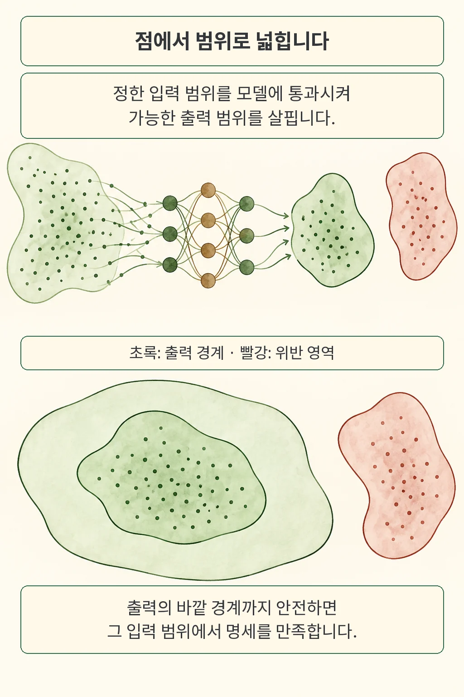
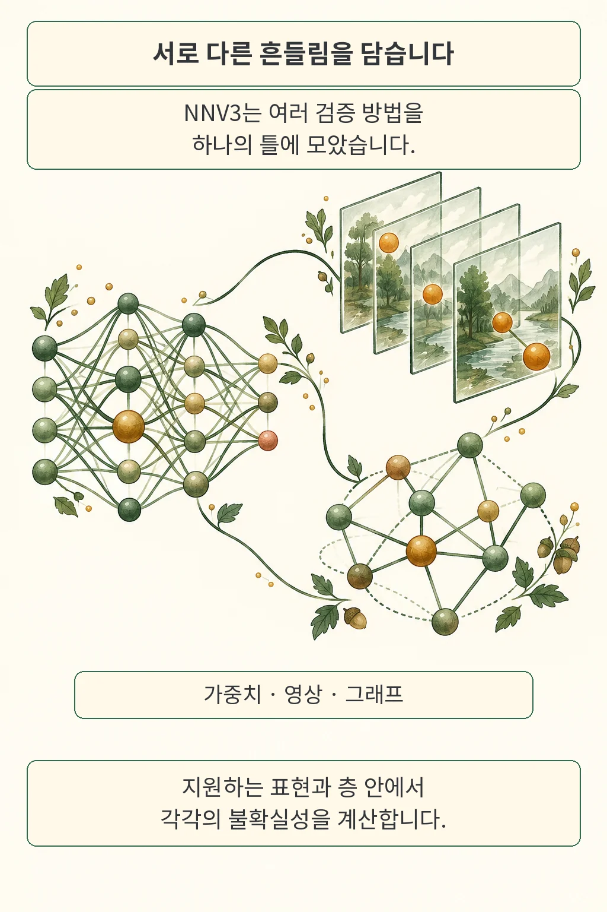

모델을 가볍게 줄여 배포하려는데, 테스트 데이터의 점수는 잘 나옵니다. 그래도 가중치가 조금 달라지거나 영상 입력이 흔들릴 때까지 같은 판단을 유지할지는 별도로 확인해야 합니다. **NNV3는 정한 입력·가중치 범위에서 모델 출력이 어디까지 변할 수 있는지 계산하고, 그 범위가 명세를 만족하는지 확인하는 신경망 검증 도구**입니다.

*글·해설: 다메카솔*

확인·작성: 2026년 9월 27일

이번에 읽은 논문은 Anne M. Tumlin 등 11명의 **NNV3: Expanding Neural Network Verification to New Architectures and Domains**입니다. 2026년 9월 24일 공개된 arXiv v1을 기준으로 읽었습니다. MATLAB 기반 NNV에 여러 집합 표현과 검증 방법을 통합한 시스템 논문이며, 여기서는 개발자가 결과표를 읽을 때 필요한 보장의 범위에 초점을 맞춥니다.

## 테스트한 점 사이까지 살펴보는 방법

개별 테스트는 선택한 입력에서 모델이 낸 출력을 확인합니다. 집합 기반 검증에서는 먼저 허용할 입력 범위를 정하고, 그 안에서 가능한 출력을 한꺼번에 표현합니다. 이 출력들의 집합을 **도달 가능 집합**이라고 부릅니다. 그림의 초록 영역은 이런 범위를 나타내는 개념도이며 실제 실험 데이터의 분포를 그린 것은 아닙니다.

가능한 출력을 정확히 계산하기 어려우면, 모든 출력을 포함하는 더 넓은 경계로 감쌀 수 있습니다. 이것이 **과대근사**입니다. 넓게 잡은 경계조차 명세 위반 영역과 만나지 않는다면, 설정한 범위 안의 실제 출력도 그 영역에 들어가지 않는다고 판단할 수 있습니다.

제가 배포 검토에서 먼저 보고 싶은 것도 이 범위입니다. 검증 결과에 붙은 성공 표시만 보면, 입력에 어느 정도 변화를 허용했는지와 어떤 출력을 위험으로 정의했는지가 사라지기 쉽습니다. 모델과 명세, 입력 집합을 함께 읽어야 결과의 의미가 살아납니다.

## NNV3가 하나의 틀에 모은 것

저자들은 선행 연구에서 따로 개발했던 표현과 분석 방법을 공통 Star-set 추상화, 명세 인터페이스, 개발 API로 묶었습니다. 통합이 이번 논문의 중심 기여입니다. 각각의 알고리즘이 모두 이 논문에서 처음 등장했다는 뜻으로 읽으면 기여 범위가 달라집니다.

| 표현 | 주로 다루는 불확실성 | 결과를 읽을 때 확인할 조건 |
| --- | --- | --- |
| ModelStar | 모델 가중치의 구간 변화 | 교란할 층과 가중치, 허용 변화 폭 |
| VolumeStar | 영상 프레임과 3차원 체적 입력 | 프레임 수, 공간 크기, 입력 교란 범위 |
| GraphStar | 그래프 연결 구조를 지닌 모델의 노드·간선 특성 | 지원하는 메시지 전달 연산과 검증 명세 |

ModelStar는 입력뿐 아니라 모델 매개변수도 변하는 상황을 다룹니다. 단일 교란층에 단일점 입력이 들어가는 경우에는 그 층의 출력 집합을 정확하게 표현할 수 있고, 여러 층을 동시에 교란할 때는 과대근사를 사용합니다. 이후 비선형층을 포함한 전체 네트워크까지 항상 정확히 계산한다는 보장으로 확장해서는 곤란합니다.

공식 문서가 밝힌 현재 지원 범위는 완전연결층과 2D 합성곱층입니다. 또 저장된 가중치를 낮은 정밀도로 반올림하는 오차와, 추론 중 정수·고정소수점 연산이 만드는 효과를 구분합니다. 후자의 이산 연산 효과는 아직 지원 범위 밖입니다. 양자화 모델을 검토한다면 이 차이가 실제 배포 조건과 맞는지부터 확인해야 합니다.

## 원문 실험이 보여 준 범위

영상 실험에서는 **검증 성공과 미확정이 같은 표에 남습니다**. 저자들은 4프레임 MNIST 영상 분류기인 ZoomIn-4f를 사용해, 각 입력 교란 크기에서 표본 10개를 확인했습니다. 표본당 시간 제한은 30분이었습니다.

| 교란 크기 | 검증 | 미확정 | 평균 시간 |
| --- | --- | --- | --- |
| 1/255 | 7/10 | 3/10 | 35.54초 |
| 2/255 | 7/10 | 3/10 | 37.88초 |
| 3/255 | 7/10 | 3/10 | 36.49초 |

출처는 원문 표 2입니다. 미확정 세 건을 실패로 묶으면, 검증기가 결론을 내리지 못한 경우와 실제 위반을 찾아낸 경우를 잃게 됩니다. 이 표의 나머지 세 표본은 과대근사 때문에 **unknown**으로 남았습니다.

저자들은 전체 평가를 통합 기능의 실행 가능성 시연으로 설명합니다. 포괄적인 확장성 연구는 후속 과제이며, 프레임 수와 입력 크기가 커지면 메모리와 계산 비용도 증가합니다. 보고한 실험 환경은 MATLAB 2025b Docker, 24코어 i9-285K, 메모리 64GB, RTX 5090 32GB입니다. 여기 적은 시간은 그 환경의 저자 측 측정값입니다.

## 확률적 보장에는 분포가 따라옵니다

큰 네트워크에서는 모든 출력을 안전하게 감싸는 계산 자체가 감당하기 어려울 수 있습니다. NNV3는 이런 경우를 위해 샘플링과 conformal inference를 이용한 확률적 모드도 통합했습니다. 표본으로 오차를 보정해 출력 범위에 대한 보장을 만드는 방식이라, **어떤 분포에서 입력을 뽑는지**가 조건에 들어갑니다.

원문 TinyYOLO 실험은 VNN-COMP 2023의 명세 72개 중 무작위로 고른 3개를 사용했습니다. 명세마다 보정 표본 9,230개를 두고 coverage와 confidence를 각각 0.999로 설정했으며, 세 명세 모두 조건부 UNSAT 결과를 보고했습니다. GPU 환경에서 명세당 시간은 111.26~131.86초였습니다.

이 두 확률은 서로 다른 층위에 있습니다. 보정 집합을 뽑는 과정에 대해 적어도 99.9%의 신뢰도로, 같은 샘플링 분포에서 새로 뽑은 입력의 출력이 계산한 집합에 들어갈 확률을 적어도 99.9%로 보장한다는 설정입니다. 이를 탐지 모델의 정확도나 모든 가능한 입력에 대한 보장으로 바꿔 읽으면 의미가 달라집니다.

UNSAT도 보장 방식과 함께 읽어야 합니다. 이 실험에서는 계산한 집합이 위반 영역과 만나지 않았다는 결과에 확률적 coverage·confidence 조건이 붙습니다. 공식 문서 역시 최악조건의 모든 입력을 다루는 모드와 샘플링 분포를 전제로 하는 모드를 구분합니다.

## 다메카솔의 해석: 결과 옆에 조건을 남깁니다

검증 결과를 배포 기록에 연결한다면, 저는 모델 버전과 입력 범위, 명세, 검증 방식을 한 묶음으로 남기겠습니다. 테스트를 통과한 모델 파일과 실제 배포 파일이 다르면 테스트 근거가 약해지듯, 검증이 가정한 가중치나 입력 조건이 바뀌면 인증 결과를 그대로 가져다 쓰기 어렵습니다. 이는 논문이 실험한 배포 절차가 아니라, 버전 관리와 회귀 검증에 연결한 제 해석입니다.

unknown은 별도 상태로 보존할 가치가 있습니다. 모든 미확정을 실패로 합치면 원인을 파악하기 어렵고, 성공으로 취급하면 아직 확보하지 못한 보장을 부여하게 됩니다. 더 정밀한 분석, 입력 범위 조정, 추가 테스트 중 무엇을 이어 갈지는 검증 비용과 요구 명세를 함께 보고 판단할 일입니다.

기존의 [ExecCritic 독립 테스트 논문 읽기](/posts/execcritic-independent-tests/)는 코드를 검사할 테스트를 어떻게 마련할지 다뤘습니다. 이번 논문은 신경망의 허용 변화 범위와 보장 의미에 초점을 둡니다. 저는 두 접근의 결과를 같은 성공 배지로 압축하기보다, 각각 무엇을 확인했는지 드러내는 기록을 선호합니다.

이번 검토에서는 원문 PDF와 공식 ModelStar·확률적 검증 문서, 고정 커밋의 README 및 공개 파일 목록을 대조했습니다. MATLAB 벤치마크는 재실행하지 않았습니다. 성능과 검증률은 저자 보고이며, 재현 환경과 실험 산출물을 직접 확인할 다음 경로로 공식 저장소를 연결합니다.

## 출처

- [NNV3 논문 및 제출 이력, arXiv v1](https://arxiv.org/abs/2609.30050v1)
- [NNV3 원문 PDF, 특히 5절과 표 2·3](https://arxiv.org/pdf/2609.30050v1)
- [공식 ModelStar 설명과 지원 범위](https://verivital.github.io/nnv/theory/weight-perturbation.html)
- [공식 확률적 검증 이론과 전제](https://verivital.github.io/nnv/theory/probabilistic.html)
- [NNV 공식 코드: 검토한 커밋](https://github.com/verivital/nnv/tree/376568b449535a779f751dd2def774a0ed94ead8)

이 글의 본문과 이미지는 생성형 AI로 제작했습니다. 기획과 편집 기준은 다메카솔이 정했습니다.
논문의 그림은 복제하지 않았으며, 만화의 개념도는 설명을 위해 새로 구성했습니다.
