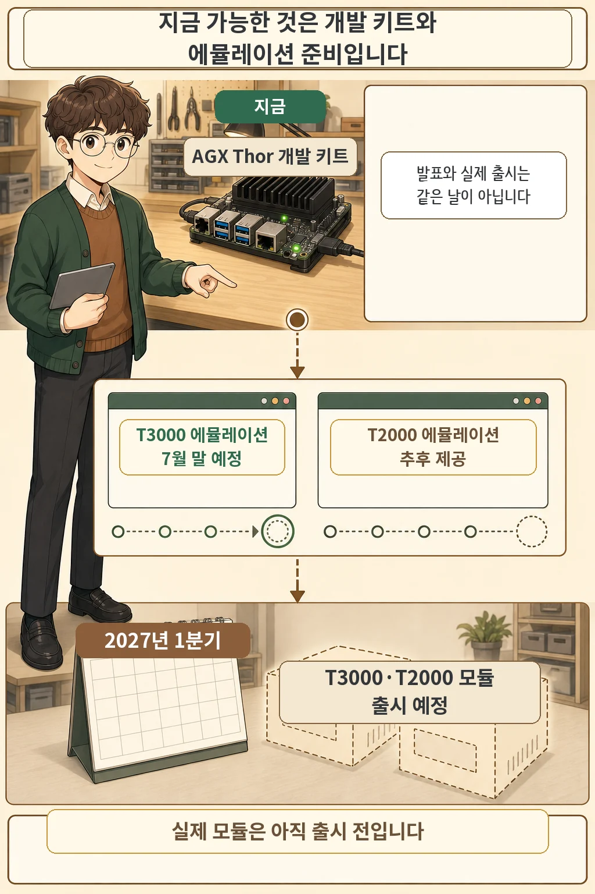
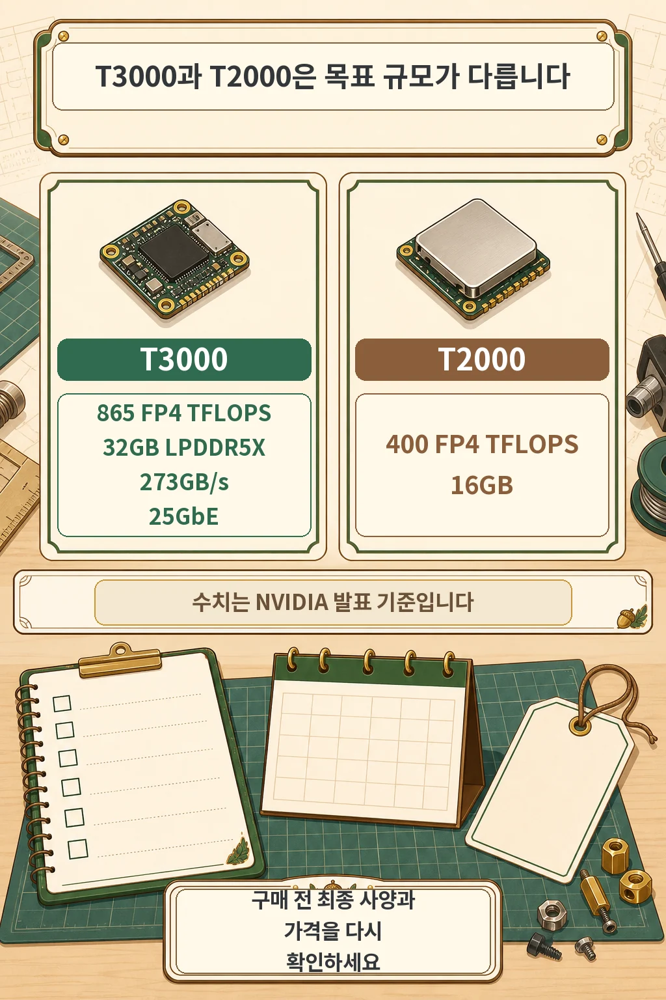

새 Jetson 모듈 발표를 보고 바로 구매할 수 있다고 생각했다면 날짜를 한 번 더 봐야 합니다. **NVIDIA는 2026년 7월 15일 T3000과 T2000을 발표했지만, 실제 모듈 출시는 2027년 1분기 예정입니다.** 지금 가능한 것은 기존 Jetson AGX Thor 개발 키트로 시작하고 발표된 에뮬레이션 일정을 확인하는 것입니다.

글·해설: 다메카솔

## 핵심 내용

- T3000 에뮬레이션은 JetPack 7.2.1과 함께 2026년 7월 말 제공 예정입니다.
- T2000 에뮬레이션은 향후 릴리스, 실제 T3000·T2000 모듈은 2027년 1분기 출시 예정입니다.
- T3000은 865 FP4 TFLOPS·32GB, T2000은 400 FP4 TFLOPS·16GB로 발표됐습니다.
- 모든 성능 수치는 독립 벤치마크가 아니라 출시 전 NVIDIA 발표 기준입니다.

## 지금 가능한 것과 아직 기다려야 하는 것

2026년 7월 16일 기준으로 개발자는 현재 판매 중인 **Jetson AGX Thor 개발 키트**로 개발을 시작할 수 있습니다. NVIDIA는 같은 Thor 계열 칩 아키텍처와 소프트웨어 스택을 이용해 새 모듈 성능을 미리 맞춰 보는 경로를 제시했습니다.

| 단계 | 발표된 상태 |
| --- | --- |
| 현재 | Jetson AGX Thor 개발 키트 사용 가능 |
| 2026년 7월 말 | T3000 에뮬레이션 모드 제공 예정 |
| 향후 릴리스 | T2000 에뮬레이션 모드 제공 예정 |
| 2027년 1분기 | T3000·T2000 실제 모듈 출시 예정 |

여기서 `예정`은 중요한 조건입니다. 발표일과 실제 제공일은 다르며, 미래 일정은 바뀔 수 있습니다. 따라서 “T3000을 지금 살 수 있다”가 아니라 “현재 개발 키트에서 T3000용 준비를 시작할 수 있는 경로가 발표됐다”라고 이해하는 편이 정확합니다.

## T3000과 T2000 발표 사양 비교

아래 수치는 모두 **NVIDIA의 출시 전 발표 기준**입니다. 서로 다른 단위를 하나의 막대그래프로 섞지 않고 항목별로 읽어야 합니다.

| 항목 | Jetson T3000 | Jetson T2000 |
| --- | ---: | ---: |
| AI 연산 성능 | 865 FP4 TFLOPS | 400 FP4 TFLOPS |
| 메모리 | 32GB LPDDR5X | 16GB |
| 메모리 대역폭 | 273GB/s | 발표문에 별도 수치 없음 |
| 네트워크 | 25GbE | 발표문에 별도 수치 없음 |
| 주요 대상 | 휴머노이드·고성능 로봇·멀티모달 엣지 AI | 비전 AI 에이전트·이동 로봇·산업용 매니퓰레이터 등 더 넓은 엣지 AI |

NVIDIA는 T3000이 T5000의 약 절반 크기와 전력으로 멀티모달 추론에서 비슷한 성능을 낸다고 설명했습니다. 하지만 공개 발표문에는 그 비교의 세부 벤치마크 조건이 제시되지 않았으므로, 독립 검증된 일반 성능으로 받아들이면 안 됩니다.

## 다메카솔의 해석: 이번 발표에서 봐야 할 것

이번 발표의 핵심은 최고 성능 숫자 하나가 아닙니다. 128GB급 개발 키트보다 작은 32GB·16GB 메모리 구간까지 Thor 계열을 넓혀, 로봇과 비전 AI 개발자가 비용과 전력 범위에 맞는 모듈을 선택하게 하려는 방향이 더 중요합니다.

또 하나는 소프트웨어입니다. NVIDIA가 공개한 Jetson Agent Skills는 Orin과 Thor에서 진단, 메모리 감사, 추론 메모리 튜닝, BSP 맞춤화 같은 작업을 에이전트가 따르도록 돕습니다. 다만 “최적화로 더 작은 메모리에서도 충분하다”는 판단은 실제 모델, 센서 입력, 지연 시간 목표로 직접 검증해야 합니다.

지금 프로젝트를 시작한다면 다음 세 가지를 확인하세요.

1. 현재 필요한 연산과 메모리를 AGX Thor 개발 키트에서 측정합니다.
2. T3000 에뮬레이션이 실제로 공개됐는지 JetPack 릴리스 노트를 다시 확인합니다.
3. 구매 결정은 2027년 출시에 가까워졌을 때 최종 사양, 가격, 공급 일정을 다시 검증합니다.

## 출처

- [NVIDIA 공식 발표: NVIDIA Introduces New Jetson Thor Computers to Advance Mainstream Robotics and Edge AI](https://blogs.nvidia.com/blog/jetson-thor-robotics-edge-ai-agent/)
- [NVIDIA Jetson Thor 공식 제품 페이지](https://www.nvidia.com/en-us/autonomous-machines/embedded-systems/jetson-thor/)
- [NVIDIA Developer Forums: Jetson Agent Skills](https://forums.developer.nvidia.com/t/jetson-agent-skills-ai-assisted-workflows-for-device-bsp-customization/374150)

이 글의 만화 이미지는 AI로 생성했습니다.
