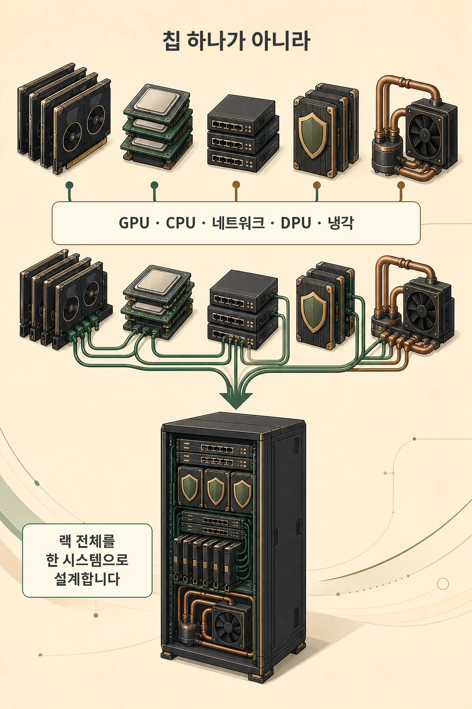
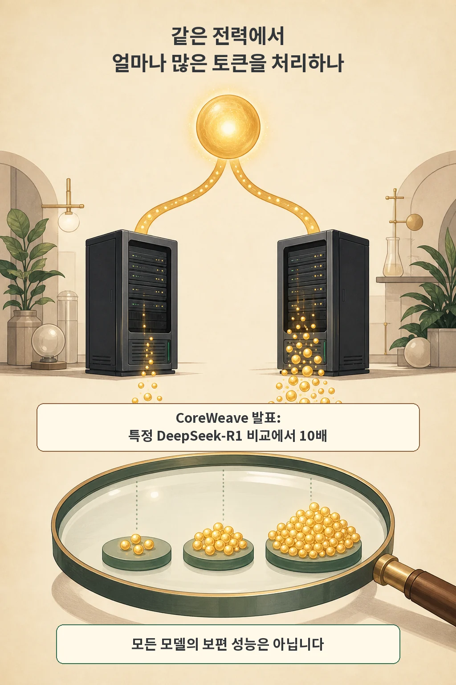

NVIDIA는 2026년 7월 21일 Vera Rubin NVL72가 전 세계에서 양산 확대 단계에 들어갔다고 발표했습니다. CoreWeave에서는 실제 랙을 가동해 첫 측정값을 공개했고, Google Cloud·Microsoft Azure·Oracle Cloud Infrastructure에서도 랙이 가동 중이라고 NVIDIA는 밝혔습니다. 이번 발표에서 눈여겨볼 변화는 최고 GPU 속도 하나보다 **랙 전체가 같은 전력으로 얼마나 많은 토큰을 처리하는지**를 앞세웠다는 점입니다.

글·해설: 다메카솔

## 이번에 시작된 것은 칩 하나가 아니라 랙 시스템의 양산입니다

Vera Rubin NVL72는 72개의 Rubin GPU와 36개의 Vera CPU를 한 랙에 넣습니다. 여기에 NVLink 6 스위치, ConnectX-9 네트워크, BlueField-4 DPU와 외부 연결용 네트워크가 함께 동작합니다. NVIDIA는 일곱 종류의 칩과 다섯 종류의 랙 트레이를 하나의 시스템으로 공동 설계했다고 설명합니다.

이 구조가 중요한 이유는 대규모 AI 작업이 GPU 계산만으로 끝나지 않기 때문입니다. 모델 학습과 추론에서는 GPU들이 중간 결과를 계속 주고받습니다. CPU는 에이전트의 도구 호출과 작업 흐름을 조정하고, 네트워크는 수많은 가속기가 기다리지 않도록 데이터를 옮기며, 냉각과 전력 공급은 시스템이 지속해서 일할 수 있는 한계를 정합니다.

따라서 개별 칩의 최고 처리량이 높아도 메모리 이동이나 네트워크가 막히면 랙 전체의 실제 처리량은 떨어질 수 있습니다. Vera Rubin 발표가 ‘칩’보다 ‘AI 팩토리’를 반복해서 말하는 배경입니다.

## 전력당 토큰은 같은 전력 예산의 산출량을 묻습니다

전력당 토큰은 일정한 전력 예산에서 시스템이 단위 시간에 얼마나 많은 토큰을 처리하는지 보는 효율 지표입니다. 전력이 데이터센터의 물리적 상한이 될 때는 최고 속도만큼 중요한 질문입니다. 같은 1메가와트에서 더 많은 토큰을 처리하면 제한된 전력 안에서 더 많은 추론 요청을 감당할 여지가 생깁니다.

CoreWeave는 DeepSeek-R1 벤치마크에서 Vera Rubin NVL72의 메가와트당 초당 토큰이 Grace Blackwell NVL72보다 10배였다고 발표했습니다. 이는 CoreWeave가 실제 Vera Rubin 실리콘으로 공개한 첫 측정값이라는 의미가 있습니다.

다만 ‘10배’는 모든 AI 모델과 서비스에 자동으로 적용되는 상수가 아닙니다. 비교 모델, 수치 정밀도, 입력·출력 길이, 배치 크기, 응답 지연 목표, 소프트웨어 최적화와 전력을 어디까지 포함했는지에 따라 결과가 달라집니다. NVIDIA와 도입 파트너가 공개한 수치라는 출처 경계도 함께 봐야 합니다.

NVIDIA는 Spectrum-6 기반 네트워크가 10만 개가 넘는 GPU 배치에서 최대 95% 네트워크 효율을 유지한다고 주장합니다. 이 역시 배치 구성과 워크로드 조건을 확인해야 하는 벤더 수치입니다. 핵심은 네트워크가 부속품이 아니라 토큰 처리량을 결정하는 계산 경로의 일부가 됐다는 점입니다.

## 양산 확대와 즉시 일반 제공은 같은 말이 아닙니다

NVIDIA가 말한 `ramping into full production`은 공급망이 제품을 규모 있게 생산하고 파트너 랙이 가동되기 시작했다는 뜻입니다. 모든 지역과 모든 고객이 같은 날 동일한 클라우드 인스턴스를 일반 제공으로 사용할 수 있다는 뜻은 아닙니다.

CoreWeave는 먼저 랙을 가동하고 측정값을 공개했습니다. 다른 클라우드와 인프라 파트너의 제공 지역, 프리뷰·일반 제공 상태, 가격과 할당 방식은 각 서비스의 별도 공지를 확인해야 합니다. 발표의 생산 상태와 실제 구매 가능 상태를 나눠 읽어야 하는 이유입니다.

## 다메카솔의 해석: 최고 수치보다 측정 경계를 먼저 맞추세요

저는 이런 발표의 랙 단위 수치를 제 워크로드로 환산하기 전까지는 판단을 유보하는 편입니다. Vera Rubin은 AI 인프라의 계산 단위를 GPU 한 장에서 랙과 데이터센터로 넓혀 보여 주고, 실제 도입 판단도 같은 경계에서 해야 합니다.

- 워크로드: 내가 쓰는 모델과 입력·출력 길이로 측정합니다.
- 품질과 정밀도: 정확도나 출력 품질을 유지한 비교인지 확인합니다.
- 응답성: 총처리량과 함께 첫 토큰·토큰 간 지연을 봅니다.
- 시스템 경계: GPU뿐 아니라 CPU·네트워크·냉각을 포함한 전력과 가동률을 기록합니다.
- 이용 가능성: 발표, 프리뷰, 일반 제공, 실제 할당 가능 상태를 구분합니다.

전력당 토큰은 중요한 지표지만 품질, 지연시간, 이용률과 총비용을 대신하지 않습니다. 자기 워크로드에서 같은 조건과 같은 시스템 경계로 재는 순간부터 구매 판단에 쓸 수 있습니다.

## 출처

- [NVIDIA 발표 — Vera Rubin Driving Performance Per Watt](https://blogs.nvidia.com/blog/vera-rubin/)
- [NVIDIA 제품 문서 — Vera Rubin Platform](https://www.nvidia.com/en-us/data-center/technologies/rubin/)
- [CoreWeave 발표 — First-Ever Measured Vera Rubin NVL72 Silicon Performance Stats](https://coreweave.com/blog/nvidia-vera-rubin-nvl72-on-coreweave-10x-more-tokens-per-megawatt-than-blackwell)
- [NVIDIA 기술 발표 — Spectrum-6 Arrives in Gigascale AI Factories](https://blogs.nvidia.com/blog/nvidia-spectrum-six-arrives-in-gigascale-ai-factories/)

이 글의 본문과 이미지는 생성형 AI로 제작했습니다. 기획과 편집 기준은 다메카솔이 정했습니다.
