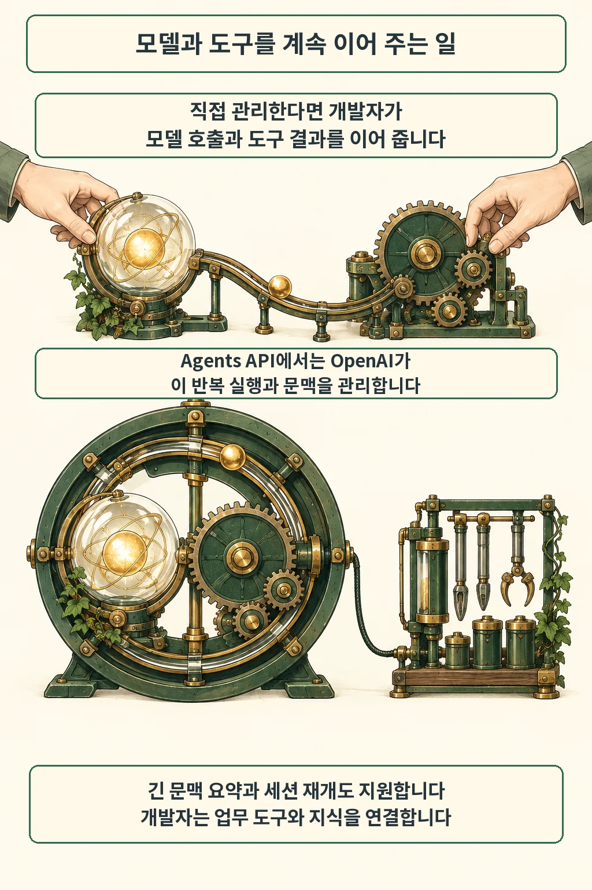
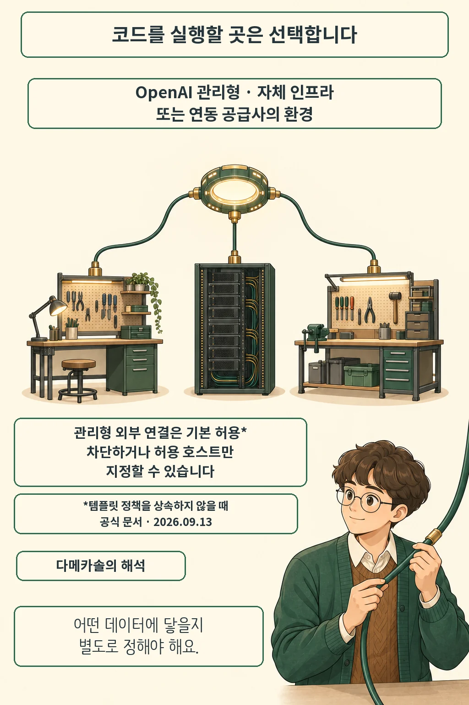

모델을 부르는 코드는 짧아도, 작업을 계속 이어 가는 코드는 길어집니다. OpenAI는 2026년 9월 10일 이 실행 계층을 관리해 주는 **Agents API 공개 베타**를 발표했습니다. Codex의 실행 구조를 API로 제공하고, 개발자는 에이전트가 일할 환경을 선택합니다. [공식 발표](https://openai.com/index/introducing-the-agents-api/)와 9월 13일 확인한 개발자 문서를 기준으로 정리했습니다.

글·해설: 다메카솔

Updated: 2026-09-13

## 반복 실행을 누가 이어 주나요

도구가 돌려준 결과는 다음 판단의 입력이 됩니다. 이 연결을 유지하는 일이 하네스의 역할입니다. Agents API에서는 OpenAI가 모델 호출과 도구 사용, 문맥 관리를 조정합니다. 개발자는 업무에 필요한 도구와 지식을 연결합니다. 그림의 장치는 이 역할 분담을 보여 주는 개념도입니다.

[Agents API 개요](https://developers.openai.com/api/docs/guides/agents-api/overview)는 긴 문맥의 요약, 세션 재개, 작업 중 지시 수정, 하위 에이전트에 일을 나누는 기능을 설명합니다. 여러 단계의 작업을 붙잡는 공통 실행 구조를 서비스로 가져오는 셈입니다. 공개 베타와 기능 설명은 OpenAI가 밝힌 범위이며, 이번 글에서 성능이나 장애 복구를 직접 시험하지는 않았습니다.

## 작업 공간과 외부 연결은 따로 고릅니다

코드와 파일이 놓일 곳에는 선택지가 있습니다. OpenAI 관리형 샌드박스, 자체 인프라, 연동 공급사의 환경을 사용할 수 있다고 회사는 설명합니다. 실행을 맡기는 선택과 코드를 어디서 돌릴지의 선택을 분리한 구조입니다.

관리형 환경에도 설정은 필요합니다. [샌드박스 문서](https://developers.openai.com/api/docs/guides/agents-api/environments/openai-hosted)에 따르면 파일과 패키지, 스킬, 플러그인을 준비할 수 있습니다. 설정 명령이 실패하면 에이전트 시작을 막습니다. 재사용 템플릿에 저장되는 것은 구성이며, 실행 중인 작업 공간 자체가 보존되는 방식과는 구별됩니다.

외부 연결은 별도 항목입니다. 템플릿 정책을 상속하지 않을 때 기본값은 허용인 `enabled`입니다. `disabled`로 차단하거나 `restricted`로 허용할 호스트를 지정할 수 있습니다. 관리형이라는 이름만 읽고 네트워크까지 닫혀 있다고 가정하면 실제 접근 범위를 놓칩니다.

## 다메카솔의 해석: 맡길 실행과 줄일 접근 범위

저는 이런 서비스를 검토할 때 하네스 구현 시간을 줄이는 이점과 데이터 접근 설계를 함께 보겠습니다. 실행 코드를 직접 유지할 곳은 줄어듭니다. 반면 어떤 입력을 제공하고 어떤 외부 시스템에 연결할지는 업무마다 달라집니다. 제품이 대신 운영하는 부분과 우리 서비스가 결정할 부분을 나눠야 도입 효과를 제대로 평가할 수 있습니다.

로그 파일만 읽어 원인을 정리하는 과제를 가정해 봅시다. 설명을 위해 만든 예시입니다. 분석에 필요한 입력을 먼저 제공하고 외부 연결을 닫아도 과제가 끝나는지 확인하겠습니다. 외부 조회가 꼭 필요하다면 그 목적에 맞게 연결을 추가하고, 보고서가 가리키는 근거와 실제 파일을 대조할 수 있습니다. 이때 확인하는 것은 답변 품질과 접근 범위 두 가지입니다.

[Salesforce AI Harness 발표](/posts/salesforce-enterprise-ai-harness/)에서도 실행을 묶는 흐름을 다뤘습니다. 이번 소식의 새 지점은 Codex 실행 구조를 공개 베타 API로 제공하면서 작업 환경 선택을 분리했다는 데 있습니다. 제 판단은 작은 읽기 작업부터 시작하는 쪽입니다. 맡길 일을 넓히는 속도는 결과와 접근 기록을 확인하는 속도에 맞추겠습니다.

## 출처

- [OpenAI — Agents API 발표 (2026-09-10)](https://openai.com/index/introducing-the-agents-api/): 공개 베타와 환경 선택.
- [OpenAI 개발자 문서 — Agents API 개요](https://developers.openai.com/api/docs/guides/agents-api/overview): 관리형 실행 기능. 2026-09-13 확인.
- [OpenAI 개발자 문서 — 관리형 샌드박스](https://developers.openai.com/api/docs/guides/agents-api/environments/openai-hosted): 환경 준비와 네트워크 설정. 2026-09-13 확인.

이 글의 본문과 이미지는 생성형 AI로 제작했습니다. 기획과 편집 기준은 다메카솔이 정했습니다.
