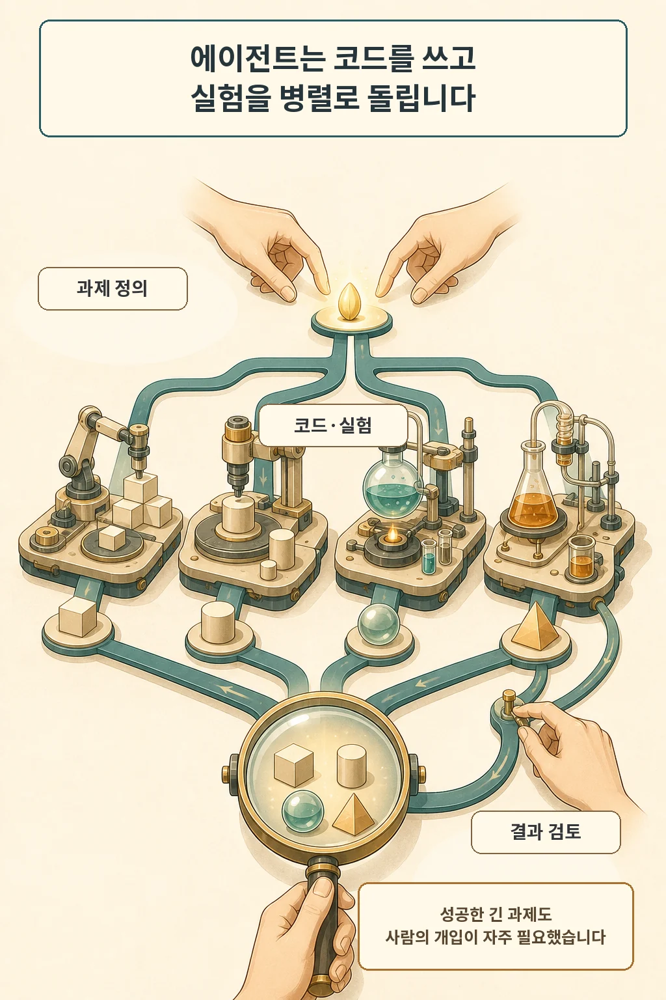

OpenAI는 2026년 9월 6일 사람이 지시한 연구 과제를 수행하는 '자동화 연구 인턴' 단계에 도달했다고 밝혔습니다. 회사가 붙인 이름보다 중요한 것은 범위입니다. 이 시스템은 잘 정의된 과제를 받아 숙련 연구자에게 며칠이 걸릴 작업까지 다루지만, 무엇을 연구하고 어떤 결과를 믿을지는 사람이 결정합니다.

글·해설: 다메카솔

## OpenAI가 말하는 '연구 인턴'은 제한된 역할입니다

이번 공개의 대상은 OpenAI 연구 조직의 내부 운영입니다. 제품 출시나 일반 사용자용 기능 발표와는 범위가 다릅니다. 회사는 사람이 방향을 정한 잘 정의된 과제를 수행하는 현재 단계를 '연구 인턴'으로 부르고, 더 넓은 자동화 AI 연구자는 2028년 3월을 향한 미래 목표로 구분했습니다.

따라서 현재 선언을 스스로 연구 주제를 만들고 과학적 결론까지 확정하는 자율 연구자 완성으로 읽으면 범위를 벗어납니다. OpenAI 설명에서도 사람은 연구 우선순위를 정하고, 어떤 아이디어와 결과를 계속 볼지 판단하며, 시스템을 확대하거나 멈추거나 배포할지 결정합니다.

## 실행 차선은 실제로 넓어졌습니다

OpenAI는 2026년 8월 중순 연구 조직 전체에서 사람의 표준 근무일 하나당 에이전트 작업일 3.1일을 썼다고 환산했습니다. 실험자 1인당 실험 수는 8월에 2025년 1월 추적 이후 가장 높았고, 연구자들은 에이전트를 여러 세션으로 동시에 운용하는 일이 늘었다고 보고했습니다.

숫자는 실행량이 커진 방향을 보여 줍니다. 연구 성과의 원인은 별도로 검증해야 합니다. OpenAI도 실험 증가가 Codex 채택과 상관관계를 보였지만 같은 기간 사용할 수 있는 컴퓨팅 자원도 크게 늘었다고 적었습니다. 코드량과 실험 수는 측정하기 쉬운 반면, 실제 연구 진척과의 관계는 해석하기 어렵다는 한계도 밝혔습니다.

## 긴 과제일수록 사람의 개입이 남았습니다

OpenAI가 결과를 판정할 수 있었던 내부 세션을 분류했을 때, 성공한 4~8시간 추정 과제의 절반 이상에는 한 번 이상의 사람 개입이 있었습니다. 에이전트가 긴 작업을 성공시킨 경우에도 사람의 조정이 중요한 변수였습니다.

이 수치도 범위를 좁혀 읽어야 합니다. 내부 분류가 결과를 확실히 판정할 수 있는 세션만 그래프에 넣었고, 빠르게 바뀌는 도구 환경 때문에 사용량 집계는 대부분을 포함하지만 전부는 아니라고 OpenAI가 설명했습니다. 이번 공개의 검증 범위는 OpenAI 내부 관측까지입니다.

## 다음 병목은 실행 뒤의 판단입니다

실행 속도가 오르면 느린 지점이 사라지는 대신 위치를 바꿉니다. OpenAI는 덜 자동화되는 과제가 연구자 시간에서 더 큰 몫을 차지하고, 컴퓨팅 자원도 다음 제약이 될 수 있다고 봤습니다. 연구 질문을 고르는 일, 모순된 결과를 판단하는 일, 안전 위험 앞에서 멈추는 일은 사용량 그래프가 답하지 못하는 영역입니다.

이 경계는 운영팀에도 익숙합니다. 배포 자동화가 빨라질수록 승인 규칙, 회귀 검증, 관측 가능성이 더 중요해지는 것과 같습니다. 연구 조직도 에이전트 수보다 어떤 작업을 위임했고, 어느 지점에서 사람이 개입했으며, 실패와 불확실성을 어떻게 기록했는지가 품질을 좌우합니다.

## 다메카솔의 해석

제가 보는 이번 공개의 핵심은 '연구자가 사라졌다'가 아니라 연구자의 병목이 이동했다는 점입니다. 코드를 쓰고 실험을 돌리는 차선은 넓어졌습니다. 이제 과제 선택, 증거 판정, 안전 통제가 처리량을 결정하는 게이트로 더 선명하게 드러납니다.

개발 조직이라면 에이전트 도입 효과를 생성한 코드 줄 수보다 완료 기준이 분명한 과제의 성공률로 먼저 재겠습니다. 저는 사람 개입 횟수, 재작업률, 운영 사고, 검토자가 결론을 뒤집은 사례도 함께 보겠습니다. OpenAI의 자료는 그 측정 설계를 시작할 이유를 줍니다. 다른 조직에서도 같은 변화가 재현되는지는 아직 열린 질문입니다.

관련해서 에이전트가 답을 잘 만드는 것과 약한 증거 앞에서 연구 경로를 바꾸는 능력의 차이는 [AI 에이전트는 개방형 연구를 얼마나 평가할 수 있나](/posts/ai-open-ended-research-shadow-evaluation/)에서 이어서 볼 수 있습니다.

## 출처

- [OpenAI, Research acceleration: The view inside OpenAI Research (2026-09-06)](https://openai.com/index/research-acceleration-view-inside-openai/)

이 글의 본문과 이미지는 생성형 AI로 제작했습니다. 기획과 편집 기준은 다메카솔이 정했습니다.
