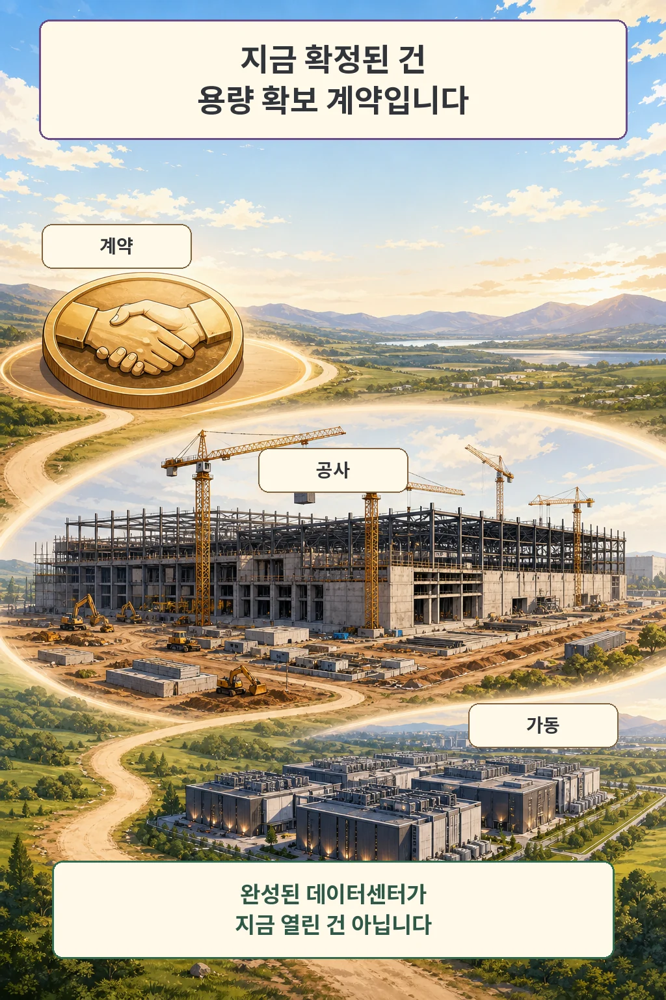
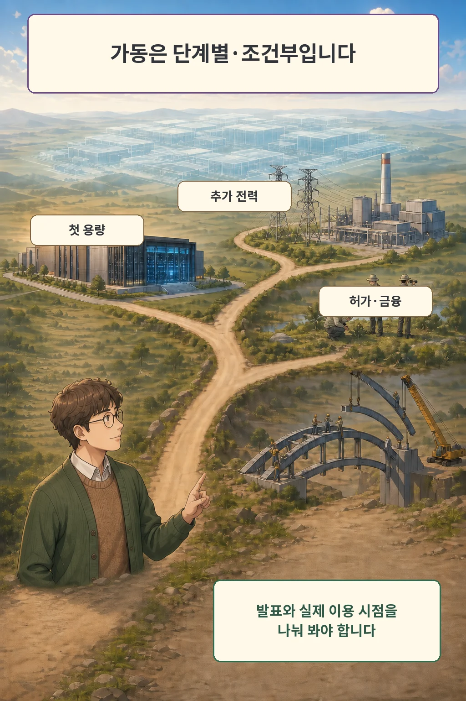

OpenAI는 2026년 8월 17일 미국 오하이오주 PORTS-Pike Technology Campus에서 약 8 IT-GW의 데이터센터 용량을 확보하는 계약을 발표했습니다. 이 발표가 뜻하는 바는 완공된 시설의 즉시 가동보다 기존 캠퍼스 프로젝트에 장기 수요자로 참여하는 계약에 가깝습니다.

글·해설: 다메카솔

## 지금 확정된 것은 용량 확보 계약입니다

발표에 따르면 SB Energy가 시설을 건설·소유·운영하고, OpenAI는 20년 임대 구조로 완성되는 용량을 단계적으로 사용합니다. 이 용량에는 NVIDIA AI 연산 인프라가 배치될 예정입니다. 여기까지는 OpenAI가 밝힌 계약 구조이며, 전체 시설의 완공 여부와는 별개입니다.

## 첫 가용 시점과 전체 확장 시점은 다릅니다

OpenAI는 첫 800MW가 기존 AEP 인프라를 주로 활용해 2028년부터 이용 가능할 것으로 예상한다고 밝혔습니다. 이는 현재 가용성을 말한 것이 아니라 공급사가 제시한 미래 일정입니다.

그 뒤의 확장에는 신규 발전소와 송전선, 관련 인프라가 필요합니다. OpenAI 발표도 허가, 환경 검토, 금융이 갖춰져야 개발이 진행된다고 명시합니다. 따라서 발표 용량 전체를 하나의 확정된 개통일로 읽으면 안 됩니다.

## 캠퍼스 전체 계획과 OpenAI 계약은 같은 숫자가 아닙니다

미국 에너지부는 2026년 3월 이 부지에 10GW 데이터센터 개발과 10GW 신규 발전을 추진하는 선행 프로젝트를 발표했습니다. 4월 환경 자료에는 초기 189에이커 임대 부지가 AI·클라우드 캠퍼스를 위한 단계형 임대라고 기록돼 있습니다.

이번 OpenAI 발표의 약 8 IT-GW는 그 캠퍼스 안에서 OpenAI가 확보하려는 고객 용량입니다. 기존 10GW 캠퍼스 계획과 단순히 같은 숫자로 합치거나, 모두 지금 이용 가능한 용량처럼 표현해서는 안 됩니다.

## 다메카솔의 한 줄 해석

저는 이 발표를 “초대형 데이터센터가 열렸다”보다 “OpenAI가 장기 용량 계약으로 기존 프로젝트의 핵심 수요자가 됐다”에 가깝다고 봅니다. 실제 진행을 볼 때는 첫 용량, 추가 전력, 허가·환경 검토, 금융을 따로 확인해야 합니다.

## 출처

- [OpenAI — OpenAI joins PORTS-Pike project](https://openai.com/index/openai-joins-ports-pike-project/)
- [U.S. Department of Energy — Energy Department Announces Partnership to Ensure Affordable Energy and Power America’s AI Future](https://www.energy.gov/articles/energy-department-announces-partnership-ensure-affordable-energy-and-power-americas-ai)
- [U.S. Department of Energy — CX-270956 Environmental Site Assessment](https://www.energy.gov/nepa/articles/cx-270956-environmental-site-assessment-esa-batch-1-leased-property-portsmouth)

이 글의 본문과 이미지는 생성형 AI로 제작했습니다. 기획과 편집 기준은 다메카솔이 정했습니다.
