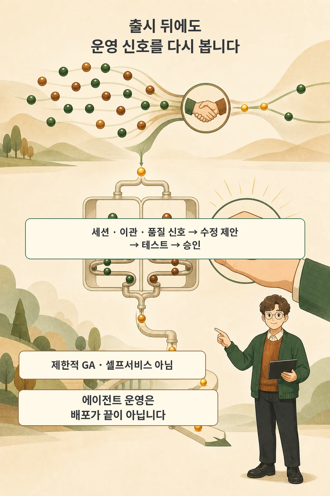

OpenAI는 2026년 7월 22일 기업용 AI 에이전트 제품 `OpenAI Presence`를 공개했습니다. 음성과 채팅 에이전트를 고객 지원, 아웃바운드 영업, 고위험 내부 업무에 배포하도록 돕는 제품입니다. 이번 발표에서 눈여겨볼 지점은 더 강한 모델 하나가 아니라 **업무별 접근, 행동 승인, 사람 이관, 평가, 변경 승인까지 이어지는 운영 통제 루프**를 제품의 중심에 놓았다는 점입니다.

글·해설: 다메카솔

## 에이전트에게 먼저 업무 하나만 맡깁니다

Presence 배포는 청구 문제 해결이나 직원 IT 요청처럼 구체적인 업무에서 시작합니다. OpenAI는 에이전트가 그 업무에 필요한 지식과 시스템 접근만 받는다고 설명합니다. 고객 데이터 전체나 모든 사내 도구를 한꺼번에 열어 주는 구조가 아닙니다.

업무 범위를 좁히면 무엇을 평가해야 하는지도 분명해집니다. 청구 문의라면 고객을 확인하고 계정 정보를 조회한 뒤 회사 정책에 맞는 행동을 해야 합니다. 범위를 벗어나거나 위험한 상황에서는 에이전트가 멈추고 사람이 맡아야 합니다.

현재 OpenAI가 밝힌 지원 채널은 실시간 음성과 채팅입니다. 고객 지원, 아웃바운드 영업, 위험도가 높은 내부 업무를 예시로 들었지만, 모든 업무를 같은 방식으로 자동화할 수 있다는 뜻은 아닙니다.

## 행동하기 전에 승인과 사람 이관을 정합니다

기업은 에이전트가 할 수 있는 행동과 승인이 필요한 시점, 사람이 이어받아야 할 시점을 정책으로 정합니다. Presence는 표준 운영 절차, 가드레일, 승인된 행동, 시뮬레이션과 평가 도구를 이 경계에 묶습니다.

출시 전에는 일반 요청뿐 아니라 예외 상황과 위험도가 높은 시나리오도 시험합니다. OpenAI는 시뮬레이션과 평가기가 올바른 결과에 도달했는지, 정책을 지켰는지, 도구를 제대로 썼는지, 필요할 때 사람에게 넘겼는지를 확인한다고 설명합니다.

여기서 중요한 것은 사람 이관이 실패의 반대말이 아니라는 점입니다. 위험한 행동을 자동으로 끝내는 것보다 적절한 시점에 사람에게 넘기는 편이 더 좋은 결과일 수 있습니다. 따라서 해결률만 높이는 목표와 안전한 이관 기준은 함께 설계해야 합니다.

## 출시는 끝이 아니라 다음 검증의 시작입니다

제품과 정책, 사용자의 행동은 출시 뒤에도 바뀝니다. 실제 세션, 사람 이관, 품질 신호를 살펴야 새로 생긴 빈틈을 찾을 수 있습니다. OpenAI는 Codex가 이런 신호를 조사해 수정안을 제안하고, 팀이 운영 중인 버전과 비교 테스트한 뒤 통제된 배포를 승인하는 흐름을 제시했습니다.

수정 제안과 실제 변경은 서로 다른 단계입니다. 사람이 테스트 결과를 확인하고 승인해야 배포가 진행됩니다. 발표문이 말하는 개선 루프를 완전 자동화로 읽으면 안 되는 이유입니다.

OpenAI는 자사 영어 전화 지원에서 Presence가 사람의 도움 없이 문의의 75%를 해결했고, Codex 기반 개선 루프가 10일 동안 사람 이관을 15%포인트 줄였다고 주장합니다. 자사 채널에서 얻은 벤더 자체 보고 수치이며 평가 표본과 독립 검증 결과가 공개된 것은 아닙니다. 적용 범위는 이 사례들까지이며, 다른 기업의 업무는 따로 확인해야 합니다.

## 현재는 제한적 GA이며 셀프서비스 제품이 아닙니다

`available today`라는 표현에는 조건이 붙습니다. Presence는 자격을 갖춘 기업 고객을 대상으로 제한적 일반 제공 중입니다. OpenAI의 현장 배포 엔지니어와 일부 글로벌 시스템 통합사가 배포를 이끌며, 현재 셀프서비스로 바로 시작하는 제품은 아닙니다.

일반 개발자가 API 키만으로 같은 운영 제품을 구성하는 경로는 이번 발표 범위 밖입니다. 기존 음성 API 고객은 계속 API에서 모델을 사용할 수 있지만, Presence 도입은 OpenAI 계정 팀과 상담하는 방식입니다.

## 다메카솔의 해석: 모델보다 운영 경계를 먼저 확인하세요

저라면 데모를 보기 전에 업무 범위를 한 문장으로 적겠습니다. 나머지 질문은 그 문장이 있어야 답할 수 있습니다. 기업용 에이전트를 검토할 때는 데모 화면보다 다음 운영 질문이 먼저입니다.

- 업무 범위: 에이전트가 맡을 일을 한 문장으로 고정했는가?
- 최소 접근: 그 업무에 필요한 지식과 시스템만 열었는가?
- 행동 통제: 허용된 행동과 사람의 사전 승인을 구분했는가?
- 사람 이관: 위험·불확실·범위 밖 상황을 누가 이어받는가?
- 평가: 정책 준수, 도구 사용, 결과와 이관을 출시 전에 시험했는가?
- 변경 관리: 수정안을 운영 버전과 비교하고 사람이 승인하는가?

Presence 발표는 에이전트 운영의 질문을 모델 성능에서 통제 가능한 변화 관리로 옮겼습니다. 제품을 선택하든 직접 만들든, 에이전트의 권한과 변경 경계를 증거로 남길 수 있어야 실전 운영에 가까워집니다.

## 출처

- [OpenAI 공식 발표 — Introducing OpenAI Presence](https://openai.com/index/introducing-openai-presence/)

이 글의 본문과 이미지는 생성형 AI로 제작했습니다. 기획과 편집 기준은 다메카솔이 정했습니다.
