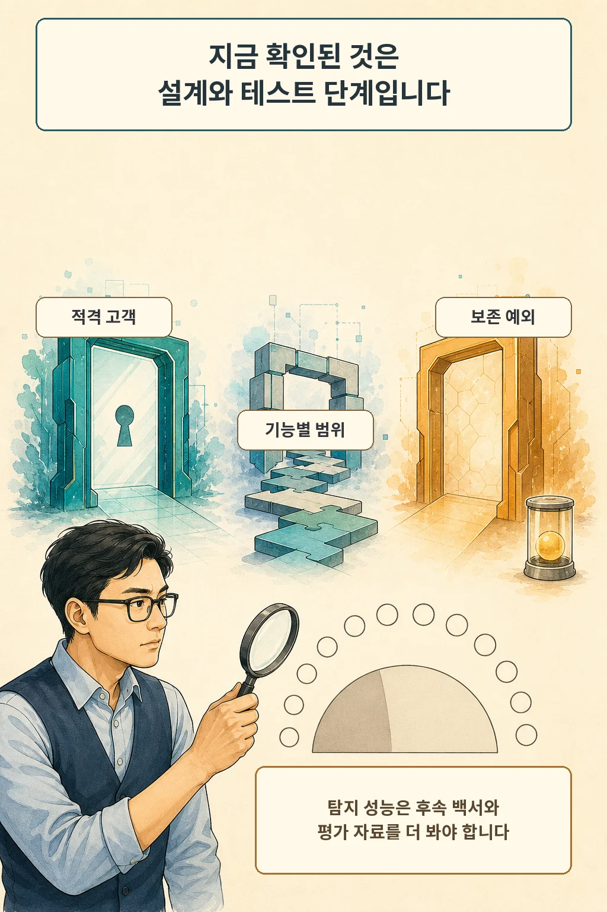

“데이터를 보관하지 않는다”와 “여러 대화에 걸친 위험을 찾는다”는 요구는 얼핏 충돌해 보입니다. OpenAI는 2026년 8월 19일 적격 API 고객을 위한 Zero Data Retention(ZDR) 확대와 `Private Safety Processing` 프리뷰를 발표하며 두 요구를 서로 다른 데이터 경계로 풀겠다고 설명했습니다.

글·해설: 다메카솔

## ZDR은 ‘학습 비사용’보다 좁고 구체적인 보존 설정입니다

OpenAI API 고객 데이터의 기본 학습 사용 상태는 비사용입니다. 학습 사용 정책과 보존 정책은 별개입니다. 일반 API 사용에서는 남용 탐지용 로그가 기본적으로 최대 30일 보관될 수 있고, ZDR은 승인을 받은 조직의 적격 요청에서 프롬프트와 응답을 처리 뒤 보존 대상에서 제외하는 별도 제어입니다.

따라서 학습 비사용 정책과 요청 원문의 보존 제어를 구분해야 합니다. 전자는 학습 사용 정책이고, 후자는 보존 경계를 다룹니다.

## 비공개 안전 처리는 원문과 신호를 분리합니다

OpenAI가 예고한 Private Safety Processing은 관련된 여러 상호작용에서 위험 패턴을 찾는 자동화 시스템입니다. 회사 설명대로라면 고객 콘텐츠는 고객이 통제하는 인프라에 남고, 자동화 시스템은 제한된 안전 신호만 OpenAI에 반환합니다. 플래그가 발생한 경우에도 직원에게 전달되는 범위에서 프롬프트와 응답 원문이 제외되는 구조입니다.

OpenAI 인프라에서 처리하는 선택지도 계획돼 있습니다. 이 경우에는 고객이 관리하는 키로 콘텐츠를 암호화해 OpenAI 직원의 접근을 막겠다는 설명입니다. 이 설명은 향후 추가할 선택지에 해당하며, 현재 모든 ZDR 요청의 공통 동작과 범위가 다릅니다.

## 기능마다 ZDR 적용 범위가 다릅니다

ZDR은 요청 경로별로 달라지는 제어입니다. 승인과 자격이 필요하고, 사용 엔드포인트와 기능에 따라 보존 동작이 달라집니다. OpenAI 문서에는 background mode, Code Interpreter, extended prompt caching 같은 ZDR 미지원 기능이 따로 적혀 있습니다. 운영자는 계정 라벨보다 실제 요청 경로별 호환성을 확인해야 합니다.

또한 잠재적 아동 성착취 이미지의 탐지와 신고에는 제한적 보존 예외가 있습니다. 운영자는 이 예외까지 포함해 실제 보존 범위를 읽어야 합니다.

## 현재는 초기 테스트와 출시 계획 단계입니다

Private Safety Processing은 현재 초기 고객과 테스트 중입니다. OpenAI는 2026년 9월부터 기능을 출시하고 기술 백서를 공개할 계획이라고 밝혔습니다. 날짜가 있는 향후 계획이므로 실제 제공 여부와 문서 공개는 그때 다시 확인해야 합니다.

현재 발표는 아키텍처의 의도와 데이터 경계를 설명합니다. 위험 탐지의 오탐·미탐, 공격에 대한 견고성, 키 관리 실패 시 영향에 대한 독립 검증은 후속 과제입니다. 직원의 원문 접근을 제한한다는 공급사 설명과 안전 탐지 성능은 별개의 검증 문제입니다.

## 다메카솔의 해석

저는 이번 프리뷰의 핵심을 두 요구를 분리하는 설계에서 찾습니다. 원문 고객 콘텐츠, 자동화된 패턴 처리, 운영 조직에 전달되는 제한된 신호를 서로 다른 권한과 저장 경계로 나누려는 시도에 가깝습니다.

같은 구조를 도입하는 팀이라면 세 질문을 따로 시험해야 합니다. 원문이 약속한 위치에만 머무는가, 제한된 신호만으로 필요한 대응이 가능한가, 미지원 기능과 법적 예외가 요청 경로에서 명확히 드러나는가입니다. 9월 백서가 공개되면 데이터 흐름뿐 아니라 탐지 평가와 실패 모드까지 확인해야 설계를 판단할 수 있습니다.

## 출처

- [OpenAI, Offering Zero Data Retention for frontier models (2026-08-19)](https://openai.com/index/offering-zero-data-retention-for-frontier-models/)
- [OpenAI Platform, Data controls in the OpenAI platform (2026-08-20 확인)](https://platform.openai.com/docs/guides/your-data)
- [OpenAI, Business data privacy, security, and compliance (2026-08-20 확인)](https://openai.com/business-data/)

이 글의 본문과 이미지는 생성형 AI로 제작했습니다. 기획과 편집 기준은 다메카솔이 정했습니다.
