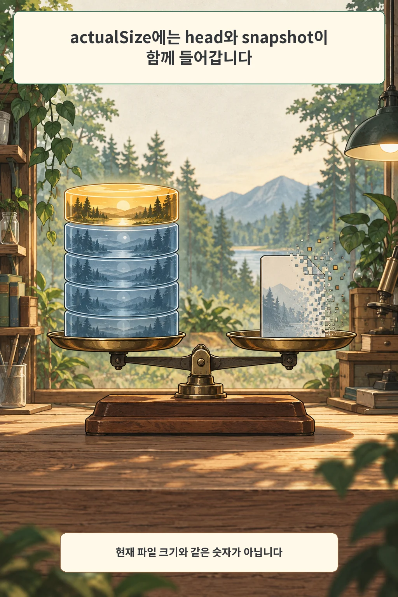
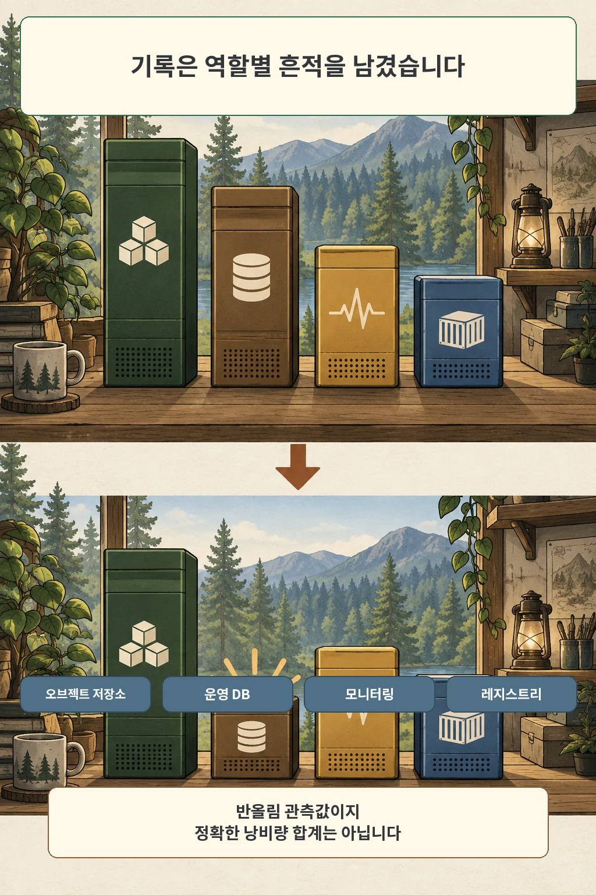

글·해설: 다메카솔

2026년 7월 20일, 볼륨 확장과 replica rebuild를 거친 홈랩에서 제가 직접 만든 적 없는 스냅숏들이 보였습니다. 처음에는 한 숫자로 답을 내고 싶었습니다. 스토리지 화면의 용량과 노드 디스크 사용량을 빼면 사라진 공간이 나올 것 같았습니다. 하지만 Longhorn의 `actualSize`부터 제가 생각한 의미가 아니었습니다.

> 이 글은 2026년 7월 20일과 24일의 개인 인프라 변경 기록·운영 runbook을 2026년 10월 3일 Longhorn 1.13 공식 문서와 다시 대조해 썼습니다. 변경 기록의 용량은 당시 남긴 반올림 관측값이며 원본 명령 출력은 보존되지 않았습니다. 최초 초안의 72%, 155GB, 289GB 비교는 측정 시각·명령·대상 범위를 확인할 수 없어 제목과 본문 주장, 이미지에서 제외했습니다.

## actualSize는 현재 파일 크기가 아닙니다

Longhorn 1.13 문서는 볼륨의 actual size를 각 replica가 디스크에서 사용하는 공간으로 설명합니다. 여기에는 현재 쓰기 대상인 volume head뿐 아니라 스냅숏도 들어갑니다. 파일시스템에서 파일을 지웠다고 해서 블록 계층에 trim이 자동 전달되는 것도 아닙니다. 그래서 애플리케이션이 보는 파일 크기와 Longhorn actual size, 노드 파일시스템 사용량은 서로 같은 숫자가 아닐 수 있습니다.

이 구분을 놓치면 `actualSize`를 “지금 사용자가 읽는 데이터”로만 해석하게 됩니다. 실제로는 다음 질문에 더 가깝습니다.

> 이 replica의 head와 스냅숏 레이어들이 현재 디스크에서 얼마나 많은 공간을 쓰는가?

Longhorn은 rebuild, volume expansion, backup 과정에서 시스템 스냅숏을 만들 수 있습니다. 운영자가 UI에서 직접 생성하지 않았더라도 생길 수 있다는 뜻입니다. 반대로 스냅숏 객체가 보인다는 사실만으로 그 크기 전체가 즉시 회수 가능한 낭비 공간이라는 뜻도 아닙니다. head와 자식 레이어가 참조하는 블록, 병합 상태, replica별 배치까지 봐야 합니다.

## 네 볼륨의 숫자는 단서였지 정답이 아니었습니다

당시 변경 기록에는 역할별로 다음 값이 남아 있습니다.

| 공개용 역할명 | 기록된 snapshot 관측값 |
| --- | ---: |
| 오브젝트 스토리지 | 180.5G |
| 운영 데이터베이스 | 18.9G |
| 모니터링 | 15.1G |
| 컨테이너 레지스트리 | 4.3G |

이 표를 더해서 “그만큼이 전부 낭비였다”고 쓰지는 않습니다. 원본 출력이 없어서 값이 replica별인지, snapshot 객체별 합계인지, 같은 블록을 어떤 범위로 센 것인지 다시 확인할 수 없기 때문입니다. 지금 확실히 말할 수 있는 것은 두 가지입니다. 변경 기록이 expand와 rebuild 뒤 시스템 스냅숏 누적을 원인 후보로 지목했고, 작은 운영 DB 역할 볼륨에서 관련 snapshot 객체를 정리한 직후 약 13GB가 회수됐다는 것입니다.

13GB 회수는 정리 경로가 실제 디스크 사용량에 영향을 줬다는 관측입니다. 그러나 다른 세 볼륨의 모든 표시가 같은 원인이고 같은 비율로 회수된다는 증명은 아닙니다. 그래서 큰 볼륨부터 일괄 삭제하지 않고 작은 대상 하나로 행동과 회수 결과를 먼저 확인했습니다.

## 삭제 명령보다 먼저 닫아야 할 gate가 있습니다

snapshot purge는 단순한 객체 삭제가 아닙니다. Longhorn은 레이어를 병합하고 더 이상 필요 없는 데이터를 정리합니다. 공식 문서는 cleanup과 merge가 추가 임시 공간을 요구할 수 있으며, 상황에 따라 그 여유가 볼륨의 nominal size만큼 필요할 수 있다고 경고합니다. 디스크가 거의 찬 뒤에 무계획으로 정리를 시작하면 다음 편의 사건처럼 cleanup 자체가 압박을 키울 수 있습니다.

그래서 이 환경의 runbook은 정리 전에 다음 조건을 확인하도록 바뀌었습니다.

1. 전체 namespace에 active Job과 ownerless batch Pod가 없는지 확인합니다.
2. 모든 Longhorn volume이 attached·healthy이고 replica가 running이며 rebuild가 없는지 확인합니다.
3. 외부 백업 사본의 최신 checksum과 복원 경로를 확인합니다.
4. 보존할 사용자 snapshot 이름을 기록합니다.
5. 정리 중에는 대형 backup·restore·volume 이동을 시작하지 않습니다.

주기 작업에는 Longhorn의 `snapshot-cleanup` task를 쓸 수 있습니다. 이 작업은 제거 가능한 snapshot과 system snapshot을 purge하는 count 기반 작업입니다. 일반 snapshot 보존 개수를 뜻하는 `retain` 값으로 동작을 조절하는 작업이 아니라는 점도 공식 문서에 명시돼 있습니다. rebuild 뒤 시스템 생성 snapshot을 자동 정리하는 설정도 있지만, 설정이 존재한다는 사실과 현재 클러스터에서 활성화됐다는 사실은 분리해서 확인해야 합니다.

여기서 `markRemoved`를 읽는 법도 고쳤습니다. 당시 기록에는 purge가 실행되기 전 `markRemoved` snapshot들이 관측됐습니다. 하지만 후속 runbook과 Longhorn 문서를 대조하면, purge 뒤에도 snapshot CR이 tombstone처럼 남을 수 있습니다. 따라서 `markRemoved=true`인 CR이 있다는 이유만으로 공간이 아직 남았다고 단정하거나 purge를 반복하면 안 됩니다.

## 정리 뒤에는 객체가 아니라 결과를 확인합니다

2026년 7월 24일 후속 기록에서는 NAS checksum 작업과 volume·rebuild gate를 통과한 뒤 기존 cleanup 계약을 실행했습니다. 기록상 33개 볼륨은 모두 건강 상태를 유지했고, 한 노드의 root 사용률은 79%에서 67%로 낮아졌습니다. 변경 기록은 이를 약 53GiB 회수로 남겼습니다.

이 수치도 당시 기록의 관측값입니다. 지금 같은 명령으로 재현한 측정은 아닙니다. 중요한 것은 정리 성공을 CR 개수 하나로 판정하지 않았다는 점입니다. 작업 로그의 volume별 purge 결과, 사용자 snapshot 보존, volume robustness, 노드 파일시스템 사용률을 함께 확인했습니다.

정리 뒤 `markRemoved` 객체가 남아도 노드 사용량이 줄고 볼륨이 건강하다면 tombstone일 수 있습니다. 반대로 객체 수가 줄었는데 host 사용량이 그대로라면 더 지우기 전에 replica의 sparse file과 실제 참조 블록을 다시 조사해야 합니다.

## 한 숫자 대신 세 층을 같은 시간축에 놓습니다

지금은 용량 경보를 세 층으로 나눠 봅니다.

- 노드 파일시스템: 물리 여유가 얼마나 남았는가
- Longhorn volume: head와 snapshot이 replica별로 얼마나 커졌는가
- 작업 상태: rebuild, expansion, backup, cleanup이 언제 시작되고 끝났는가

Longhorn은 volume과 snapshot의 actual size 지표를 제공합니다. 여기에 노드 사용률과 작업 이벤트를 같은 시간축으로 붙이면 “어느 작업 뒤 어떤 레이어가 커졌는가”를 좁힐 수 있습니다. 세 값이 맞지 않는다고 바로 파일을 지우는 대신, 관측 범위와 시각부터 맞추는 순서입니다.

제가 남긴 결론은 단순합니다. `actualSize` 하나로 사라진 공간을 계산하지 않습니다. head와 snapshot을 함께 보는 숫자라는 뜻부터 확인하고, 정리 전 안전 gate와 정리 후 물리 사용량을 한 세트로 기록합니다.

## 함께 읽을 글

- [애플리케이션 복제와 스토리지 복제는 무엇이 다른가](/posts/application-storage-replication-layers/): 앞선 6편의 replica 계층 판단을 개념으로 정리합니다.
- [replica 1은 같은 뜻이 아니었습니다: Vault PDB 앞에서 멈춘 drain](/posts/replica-layer-pdb-drain/): 같은 홈랩에서 애플리케이션과 스토리지 replica를 분리한 사건입니다.

## 출처

- 개인 인프라 변경 기록, 2026-07-20·24
- 개인 인프라 Longhorn snapshot 회수 runbook
- [Longhorn 1.13: Volume Size](https://longhorn.io/docs/1.13.0/nodes-and-volumes/volumes/volume-size/)
- [Longhorn 1.13: Scheduling Backups and Snapshots](https://longhorn.io/docs/1.13.0/snapshots-and-backups/scheduling-backups-and-snapshots/)
- [Longhorn 1.13: Create and Manage Snapshots](https://longhorn.io/docs/1.13.0/snapshots-and-backups/setup-a-snapshot/)
- [Longhorn 1.13: Helm Values](https://longhorn.io/docs/1.13.0/references/helm-values/)
- [Longhorn 1.13: Metrics](https://longhorn.io/docs/1.13.0/monitoring/metrics/)

공식 문서는 2026년 10월 3일 다시 확인했습니다. 실제 볼륨 이름, 사설 주소, 호스트명과 네임스페이스는 공개용 역할명으로 바꿨습니다.

이 글의 본문과 이미지는 생성형 AI로 제작했습니다. 기획과 편집 기준은 다메카솔이 정했습니다. 만화 이미지는 텍스트 없는 원화에 결정적 레터링을 합성해 만들었습니다. 공식 로고·UI·문서 도표 등 외부 이미지 자산은 사용하지 않았습니다.
