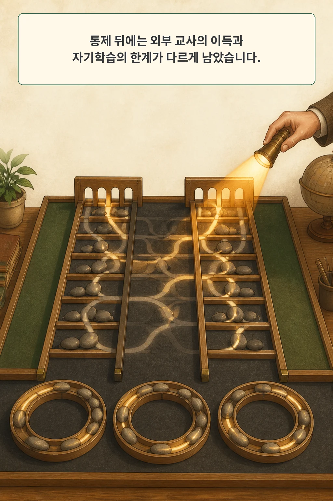

모델이 학습 전에는 틀렸고 학습 뒤에는 맞힌 문제가 있습니다. 이 한 문제를 **새로 배운 능력**으로 세어도 될까요? 반대로 맞히던 문제를 틀리면 **망각**이라고 불러도 될까요?

문제별 변화는 평균 정확도보다 더 자세해 보입니다. 하지만 두 번의 평가가 각각 흔들린다면 그 차이는 잡음도 함께 확대합니다. 더 곤란한 점은 전혀 학습하지 않은 같은 모델을 다시 평가해도 학습과 손실처럼 보이는 전이가 생긴다는 사실입니다.

2026년 8월 20일 arXiv에 제출된 **「Phantom Gains: Auditing Self-Improvement Against a Measured Null」**은 이 함정을 frozen control, 즉 학습하지 않은 동결 대조군으로 감사합니다. 저자들은 자기학습 실험과 동일한 문제·체크포인트·평가 파이프라인을 대조군에도 적용하고, “변화가 없을 때도 관측되는 변화량”을 직접 측정했습니다.

글·해설: 다메카솔

## 핵심 내용

- 문제별 학습·손실은 잡음이 있는 두 추정치의 차이라 단일 판정에 취약합니다.
- 동결 모델의 두 평가만 비교해도 6개 학습과 9개 손실이 나타났고, 학습 대비 손실 비율인 CLR은 1.5가 됐습니다.
- 성공 임계값을 강화해도 110개 동결 비교에서 measured null은 0이 아니라 0.058이었습니다.
- 문제별 pooled baseline, exact test, false-discovery-rate 통제를 적용하자 held-out 동결 반복에서는 잘못된 탐지가 없었습니다.
- 조건을 맞춘 비교에서 외부 교사 distillation의 이득은 남았지만, 세 자기학습 설정의 전이는 훨씬 제한적이었습니다.

## 같은 모델을 두 번 재도 결과는 뒤집힌다

평균 정확도는 여러 문제의 성공을 한데 모읍니다. 반면 전이 수준 통계는 각 문제를 `틀림→맞음`, `맞음→틀림`, `변화 없음`으로 분류합니다. 어디서 배웠고 어디서 잊었는지 말할 수 있어 매력적입니다.

하지만 각 칸은 두 번의 noisy estimate, 즉 잡음이 있는 추정치의 차이입니다. 생성 샘플, 문제 순서, 수식 동치 채점, 출력 파싱, 런타임 상태가 조금만 달라도 경계에 있던 문제는 칸을 옮깁니다. 세밀한 단위로 내려갈수록 판정 하나의 흔들림이 곧 “능력의 생성”이나 “능력의 소실”이라는 서사가 됩니다.

논문의 단일 greedy decode 원장에서 동결 모델은 아무것도 학습하지 않았는데도 6개 문제를 새로 맞히고 9개를 잃었습니다. 이 값으로 계산한 change-to-loss ratio는 1.5였습니다. 숫자만 보면 손실이 학습보다 더 많다는 결론까지 만들 수 있지만, 실제 원인은 모델 변화가 아니라 측정 파이프라인입니다.

같은 200개 문제를 한 프로세스에서 직렬 평가하면 판정 뒤집힘은 16건에서 4건으로 줄었습니다. 그래도 2%가 남았습니다. 실행을 더 결정적으로 만드는 일은 필요하지만, 단일 decode를 모델의 고정된 능력 상태로 간주할 수 있다는 뜻은 아닙니다.

## 영가설을 0으로 놓지 않고 직접 잰다

저자들의 핵심 제안은 간단합니다. “학습이 없으면 전이도 0”이라고 가정하지 말고, 학습하지 않은 대조군에서 전이 통계의 분포를 먼저 측정합니다. 논문은 이를 **measured null**, 측정된 영가설이라고 부릅니다.

대조군은 이름만 frozen이면 충분하지 않습니다. 실험군과 같은 문제, 같은 체크포인트 수, 같은 decode 수, 같은 프롬프트와 파서, 같은 실행 경로를 거쳐야 합니다. 파이프라인이 달라지면 모델 변화와 측정 환경 변화가 다시 섞입니다.

논문은 Qwen3-8B에 rank-32 LoRA 자기학습을 세 라운드 적용했습니다. 동결 대조군도 동일한 단계 수와 평가 파이프라인을 통과했습니다. 확장 판정의 성공 임계값을 두 번으로 올린 보정에서도 110개 동결 비교의 pooled null은 0.058이었고 95% 구간은 0.038~0.078이었습니다. 더 엄격한 임계값이 잡음을 줄였지만 없애지는 못했습니다.

대안 통계는 문제별로 1,408회의 pooled baseline을 만들고 exact test를 수행한 뒤, 여러 문제를 동시에 검사하는 false-discovery-rate를 통제합니다. 열한 개 held-out frozen replicate에 이 절차를 적용했을 때 탐지는 0건이었습니다. “변화 없음”을 실제 파이프라인에서 먼저 보정했기 때문에 얻은 결과입니다.

## 한 번의 성공은 새 능력이 아닐 수 있다

기본 모델이 한 번도 맞히지 못한 문제를 학습 모델이 한 번 맞혔다면 **확장**이라고 세는 통계가 있습니다. 직관은 분명합니다. 이전에는 못 풀던 문제를 풀었으니 능력 범위가 넓어졌다는 뜻입니다.

그러나 표본이 적으면 “한 번도”와 “한 번” 사이가 너무 얇습니다. 논문의 m=1 확장 통계는 학습하지 않은 frozen control에도 25개 중 7개, 0.280의 확장을 부여했습니다. 드문 성공 가능성이 있었지만 앞선 소수 샘플에서 관측되지 않았던 문제를 새 능력으로 오인한 셈입니다.

성공 임계값을 높이는 것만으로도 충분하지 않습니다. 문제별 기본 성공률이 다르고, 반복 횟수와 decode budget에 따라 임계선을 넘을 확률도 달라집니다. 그래서 논문은 문제별 baseline과 exact test를 사용합니다. 핵심 질문은 “이번에 맞혔는가”가 아니라 **이 문제의 기존 성공 분포로 설명하기 어려운 변화인가**입니다.

## 외부 교사의 이득과 자기학습의 한계를 분리했다

잡음을 보정했다고 자기학습이 무조건 실패한다는 뜻은 아닙니다. 저자들은 데이터 흐름, 보존량, 평가를 맞춘 AIME ladder에서 외부 교사 답을 쓰는 distillation과 세 자기학습 설정을 비교했습니다.

기본 모델이 드물게라도 맞히던 22개 문제에서 distillation은 seed마다 8~11개를 개선했습니다. 세 자기학습 설정은 0~2개였습니다. 전체 이득 규모가 달라 생긴 착시인지 확인한 logistic model에서도 distillation 상호작용은 beta 1.91, p<10^-8로 남았습니다. 공개 기록을 다시 계산한 값은 beta 1.905, p=9.867×10^-9였습니다.

범위는 좁혀 읽어야 합니다. 기본 모델이 pooled draw 1,408회에서 단 한 번도 맞히지 못한 10개 문제만 보면 비교는 유의하지 않았습니다. 따라서 이 결과는 “외부 교사가 완전히 새로운 능력을 만들었다”기보다 **드물게 도달하던 문제에서 외부 신호의 전이가 더 분명했다**고 읽는 편이 정확합니다.

손실도 대조군과 함께 봐야 합니다. 전이가 잘 보이도록 구성한 1,163개 MATH 문제 band에서 STaR와 majority-vote SFT는 각각 106개와 88개 문제를 손상시켰습니다. 설계를 맞춘 동결 대조군의 중앙 손실 수는 8개였습니다. 손실 전부가 측정 잡음은 아니었지만, 대조군 없이 총손실만 말하면 효과 크기를 과장하게 됩니다.

## 실험 범위와 공개 재현 경계

실험은 한 backbone family, rank-32 LoRA, 세 라운드, 약 270 optimizer step에 한정됩니다. 장기 자기학습이나 다른 모델 계열에서 능력 확장이 불가능하다는 연구가 아닙니다. 저자들도 세 자기학습 방법이 짧은 지평에서 제한된 확장을 보였다고 주장합니다.

손실 분석의 MATH training band는 backbone 사전학습에 거의 확실히 포함됐고, 전이가 잘 보이도록 선택됐습니다. 이 결과를 자연 사용자 분포의 forgetting rate로 바꾸어 말할 수 없습니다. 희귀 기본 성공을 다룬 핵심 비교도 22개 문제이며, 완전 미도달 하위 집합은 10개입니다.

공식 저장소는 48개 실행, 344만 세대, 53억 토큰의 결과를 약 19MB 문제별 집계 기록으로 축약해 공개합니다. 약 15GB 원본 생성 텍스트는 저자에게 요청해야 합니다. 저는 고정 커밋 `ccb887872e3c684fa2fb532bbd44064a7da07821`에서 원장 비교, bootstrap 구간, measured null, exact test, sensitivity, 표와 9개 그림을 다시 계산했습니다.

공식 테스트는 45개 중 37개가 통과했습니다. 수식 동치 판정 테스트 8개는 이 Windows 환경에서 `math-verify` 자식 프로세스의 핸들 복제 오류로 실패했습니다. 논문 코드를 고쳐 통과시키지 않았고, LoRA 학습과 모델 생성도 새로 실행하지 않았습니다. 따라서 이 글의 재현 범위는 **공개 집계 기록으로 핵심 분석을 재계산한 것**이지 전체 학습 실험의 독립 재현이 아닙니다.

## 다메카솔의 해석: 성능 통계마다 no-op 테스트를 둔다

제가 제품 평가 파이프라인에 이 원리를 적용한다면 각 성능 통계에 같은 설계의 no-op test를 붙이겠습니다. 모델 가중치를 바꾸지 않은 채 동일한 checkpoint 수, 문제 순서, decode budget, 파서, 채점기, 실행 환경을 통과시킵니다. 그 결과가 이번 통계의 noise floor입니다.

배포 게이트에는 평균 점수뿐 아니라 세 값을 함께 두는 편이 안전합니다.

| 항목 | 확인할 질문 |
| --- | --- |
| 평균 변화 | 전체 성능이 실제로 얼마나 움직였나? |
| 전이 통계 | 어떤 문제에서 gain과 loss가 생겼나? |
| measured null | 같은 파이프라인의 무변화 모델에서도 그만큼 움직이나? |

문제별 판정에는 신뢰구간이나 bootstrap 구간을 붙이고, 여러 문제를 동시에 검사한다면 FDR 같은 다중검정 통제를 사용해야 합니다. 파이프라인 버전, seed, 문제 순서, 샘플 수, decode 설정도 원장에 남겨야 같은 결과를 다시 감사할 수 있습니다.

이것은 논문 결과를 모든 AI 시스템에 곧바로 일반화한 처방이 아니라 **다메카솔의 운영 해석**입니다. 핵심은 자기 개선을 믿지 말자는 것이 아닙니다. 개선을 주장하기 전에, 그 측정기가 변하지 않은 대상에도 개선을 만들어 내는지 먼저 시험하자는 것입니다.

## 논문 정보

| 항목 | 내용 |
| --- | --- |
| 제목 | Phantom Gains: Auditing Self-Improvement Against a Measured Null |
| 저자 | Cheng Xu, Nan Yan, Liming Chen, M-Tahar Kechadi |
| 공개 이력 | arXiv v1 제출 2026-08-20 17:30:14 UTC, cs.AI 신규 목록 2026-08-21 |
| 이 글의 분류 | 경험적 모델 평가·자기학습 감사 연구 |
| 공식 코드 | chengxuphd/phantom-gains, 검증 커밋 ccb8878 |

## 자주 묻는 질문

### temperature 0이면 이런 잡음이 없어지나요?

줄어들 수 있지만 0이라고 가정할 수는 없습니다. 문제 순서, 런타임 상태, 파서, 수식 동치 채점, 모델 서빙과 실행 환경이 판정을 바꿀 수 있습니다. 이 논문에서도 직렬 평가 뒤 뒤집힘이 줄었지만 남았습니다.

### 평균 정확도도 믿으면 안 되나요?

평균은 문제별 전이보다 흔들림에 덜 민감할 수 있지만 불확실성 추정은 여전히 필요합니다. 특히 “새 능력”이나 “망각”처럼 문제별 상태 변화로 해석할 때 matched control이 더 중요합니다.

### frozen control은 한 번만 실행하면 되나요?

한 번의 대조 실행도 경고 신호를 주지만 분포를 추정하려면 반복이 필요합니다. 실험군과 대조군의 문제, checkpoint 수, decode budget, 실행 경로를 맞춰야 합니다.

## 함께 읽기

- [AI 에이전트는 기억하고도 현재 상태를 놓칠 수 있습니다](/posts/statemem-agent-memory-state-tracking/)

## 출처

- [Chengxu Yang 외, “Phantom Gains: Auditing Self-Improvement Against a Measured Null,” arXiv:2608.20290](https://arxiv.org/abs/2608.20290)
- [arXiv HTML 본문](https://arxiv.org/html/2608.20290)
- [공식 코드와 평가 기록](https://github.com/chengxuphd/phantom-gains)

이 글의 본문과 이미지는 생성형 AI로 제작했습니다. 기획과 편집 기준은 다메카솔이 정했습니다.

Updated: 2026-08-22
