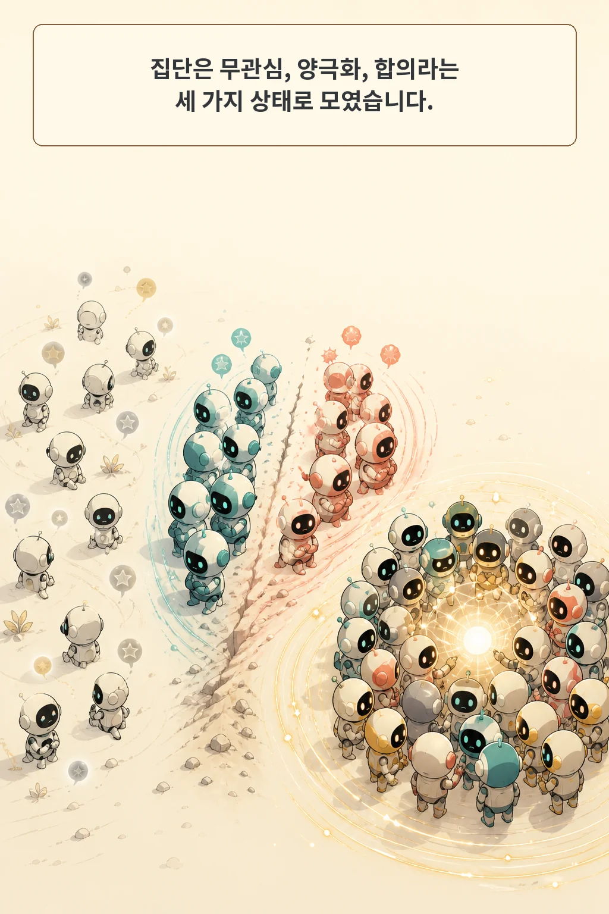
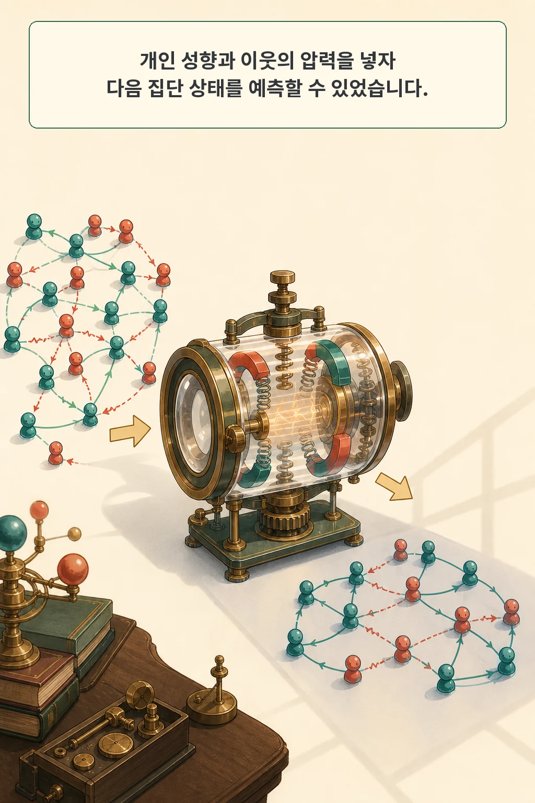

여러 AI 에이전트를 연결하면 답이 모이기도 하지만, 같은 연결이 공유된 편향까지 증폭할 수 있습니다. 중요한 것은 에이전트 수가 아니라, 개인의 성향과 이웃의 압력이 반복 상호작용에서 어떻게 결합되는지입니다.

2026년 8월 17일 arXiv에 공개된 **Physics of Agents: Statistical Mechanics Predicts Collective Behavior of AI Agents**는 1만 개가 넘는 LLM 에이전트 집단을 시뮬레이션했습니다. 저자들은 복잡한 자연어 대화를 무관심·양극화·합의라는 세 집단 상태로 정리하고, 통계역학에서 가져온 작은 확률 모델로 다음 의견 변화를 예측했습니다.

글·해설: 다메카솔

## 핵심 내용

- 32개 에이전트가 하나의 이진 문항을 두고 8라운드 동안 메시지를 교환했습니다.
- 집단은 약한 의견이 흩어진 무관심, 강한 두 진영의 양극화, 한쪽으로 모인 합의 상태를 보였습니다.
- 객관적 수학 문항에서는 네 모델 모두 집단 정답률이 높아졌습니다.
- 주관적 정치 문항에서는 네 모델 중 세 모델이 오른쪽 방향으로 이동했습니다. 이는 사람 사회가 아니라 특정 페르소나를 준 LLM 시뮬레이션 결과입니다.
- 세 결합계수만 쓴 갱신 규칙도 보지 않은 문항에서 한 단계 의견 변화를 75~86의 balanced accuracy로 예측했습니다.

## 32개 에이전트가 같은 질문을 반복해서 논의했다

주 실험의 한 집단에는 에이전트 32개가 들어갑니다. 에이전트들은 하나의 이진 문항에 먼저 답한 뒤, 고정된 대칭 네트워크에서 이웃의 최신 메시지를 받고 다시 의견을 냅니다. 이 과정을 8라운드 반복했습니다. 과거 대화 전체가 아니라 현재 받은편지함만 보는 단순한 Markov 갱신입니다.

실험 모델은 GPT-4o-mini, Gemma-3n-E4B-it, Qwen3.5-9B, Llama-3.1-8B-Instruct입니다. 객관 영역에는 MATH에서 가져온 수학 문항과 서로 다른 수학 전문성을, 주관 영역에는 정치 성향 문항과 서로 다른 페르소나를 사용했습니다.

이 구성은 실제 온라인 커뮤니티를 복제한 것이 아닙니다. 하나의 질문, 고정된 연결망, 이진 의견이라는 통제된 조건에서 LLM 집단의 의견 변화만 떼어 본 실험입니다. 이후 결과를 읽을 때도 이 경계를 유지해야 합니다.

## 복잡한 대화가 세 가지 집단 상태로 정리됐다

저자들의 핵심 관찰 분석은 9,600개 시뮬레이션 집단을 사용했습니다. 미관측 그래프 일반화와 비동기 갱신 실험까지 포함하면 전체 데이터는 1만 개가 넘는 집단입니다.

각 에이전트의 의견에는 방향과 강도가 있습니다. 약한 의견들이 흩어져 있으면 무관심, 강한 의견이 양쪽 진영으로 갈리면 양극화, 강한 의견이 한쪽으로 모이면 합의입니다. 출발점에서는 약한 의견이 많았지만, 메시지를 반복해서 주고받을수록 확신이 커지고 집단은 더 질서 있는 상태로 이동했습니다.

여기서 “질서”는 사실에 가까워졌다는 뜻이 아닙니다. 의견이 약한 상태에서 강하고 정렬된 상태로 변했다는 동역학 표현입니다. 정답 여부는 객관 문항에서 별도로 측정해야 합니다.

## 수학에서는 정답을 모았고, 정치 문항에서는 방향성 편향도 모았다

객관적 수학 문항 6,400개 집단 궤적에서는 네 모델 모두 상호작용 뒤 집단 정답 비율이 높아졌습니다. 처음에 틀린 다수가 정답으로 바뀐 경우가, 정답 다수가 오답으로 바뀐 경우보다 많았습니다. 서로 다른 전문성을 가진 에이전트의 정보가 연결망을 따라 모이는 효과입니다.

주관적 정치 문항에서는 다른 결과가 나타났습니다. 저자들은 네 모델 중 세 모델의 집단 의견이 상호작용 뒤 오른쪽 방향으로 이동했다고 보고했습니다. 이 결과는 사람 집단의 정치 성향을 측정한 것이 아니며, 연구진이 설정한 페르소나와 문항, 모델에 한정된 LLM 시뮬레이션입니다. 방향의 원인을 사회 일반으로 확대할 근거도 아직 없습니다.

따라서 “에이전트끼리 토론시키면 더 정확해진다”는 한 문장만 가져가면 절반만 맞습니다. 객관 문항에서는 정답 정보가 모였고, 주관 문항에서는 모델에 이미 들어 있던 방향성도 함께 모였습니다.

## 작은 통계역학 모델은 다음 의견을 어떻게 예측했나

저자들은 각 에이전트의 자연어 메시지 내용을 직접 모델링하지 않았습니다. 대신 현재 의견을 강화하거나 뒤집는 힘을 세 부분으로 나눴습니다.

첫째는 에이전트 개인의 기본 성향을 나타내는 내재장입니다. 둘째는 같은 방향의 우호 이웃이 끌어당기는 힘, 셋째는 반대 방향의 비우호 이웃이 미는 힘입니다. 이 세 결합계수를 Ising 계열 확률 갱신 규칙에 넣고 실제 의견 전환에 맞췄습니다.

보지 않은 시험 문항에서 이 규칙의 한 단계 balanced accuracy는 모델과 문항 유형에 따라 75~86, 초기 상태부터 여러 단계를 굴린 rollout balanced accuracy는 61~77이었습니다. GPT-4o-mini 그래프 일반화 표에서는 학습하지 않은 연결 구조를 포함한 16개 열 중 15개에서 세 결합계수 규칙이 가장 높은 한 단계 점수를 냈습니다.

논문의 `social temperature`는 GPT나 다른 LLM의 생성 온도가 아닙니다. 적합한 확률 갱신 규칙이 얼마나 잡음에 흔들리는지를 나타내는 변수입니다. 저자들은 적합 동작점인 T=1이 대부분 집단의 임계온도 아래에 있어, 작은 압력도 집단 질서로 이어지기 쉬웠다고 해석했습니다.

## 계수는 관측을 압축한 설명이지 원인 판정이 아니다

적합된 유효 우호 연결 계수는 모델과 문항 유형에 따라 0.99~3.03이었고, 비우호 연결 계수는 0.73을 넘지 않았습니다. 저자들은 이 차이가 양극화보다 합의가 더 자주 나타나는 이유를 설명한다고 봤습니다.

객관 문항용 확장 규칙에서는 네 모델 모두 현재 정답을 가진 우호 이웃에게 더 강하게 끌리고, 오답을 가진 비우호 이웃에게 더 강하게 밀리는 비대칭도 보였습니다. 그러나 이것은 관측된 전환을 가장 잘 설명하도록 맞춘 계수입니다. 연결 종류를 독립적으로 개입해 인과효과를 확인한 실험과 같지 않습니다.

예측 점수가 높다는 사실도 자연어 대화의 의미를 모두 설명했다는 뜻은 아닙니다. 적합 모델은 메시지 내용, 설득 전략, 근거의 질을 버리고 의견 상태만 남겼습니다. 작은 모델의 장점은 집단 변화를 압축해서 비교할 수 있다는 것이고, 한계는 어떤 문장이 왜 사람이나 모델을 설득했는지 말해 주지 못한다는 것입니다.

## 적용 전에 확인할 실험 범위와 공개 아티팩트

직접 범위는 하나의 이진 문항, 고정·대칭 통신망, 최신 받은편지함만 보는 갱신입니다. 실제 멀티 에이전트 제품처럼 질문이 여러 개 이어지거나, 역할과 연결이 시간에 따라 바뀌거나, 외부 도구 결과가 개입하는 조건은 아직 검증되지 않았습니다. 동기식 갱신을 벗어난 추가 실험이 있어도 이 기본 단순화는 남습니다.

논문은 공식 GitHub 저장소, 프로젝트 페이지, Hugging Face 조직을 연결합니다. 2026년 8월 18일 확인 시 GitHub 저장소에는 README와 Apache-2.0 라이선스만 있었고 실행 코드가 없었습니다. 프로젝트 페이지는 404를 반환했고, Hugging Face 조직에는 공개 데이터셋이 0개였습니다. 이 글은 원문 PDF와 TeX를 대조했지만 시뮬레이션을 독립 재현했다고 주장하지 않습니다.

## 다메카솔의 해석

제가 멀티 에이전트 시스템에 추가할 것은 더 많은 토론 라운드가 아니라 **집단 상태 계기판**입니다. 완료율과 최종 답만 기록하면, 시스템이 맞는 답으로 수렴한 것인지 같은 편향을 강하게 공유하게 된 것인지 구분하기 어렵습니다.

운영 지표를 네 갈래로 나누겠습니다. 첫째는 의견 다양성이 얼마나 남았는지, 둘째는 상호작용 뒤 확신만 커졌는지, 셋째는 객관 문항에서 오답이 정답으로 실제 전환됐는지, 넷째는 주관 문항에서 특정 방향으로 지속적으로 이동하는지입니다. 정답이 정의되지 않는 일이라면 반대 역할의 에이전트나 독립 검증 경로도 연결망 밖에 두겠습니다.

여기부터는 논문 결과를 운영 설계로 옮긴 제 판단입니다. 이 연구가 보여 준 것은 통제된 LLM 집단에서 같은 상호작용이 진실 탐색과 편향 증폭을 동시에 만들 수 있다는 사실입니다. 실제 제품에서는 집단의 합의 자체보다, 무엇이 합의를 만들었고 반대 증거가 살아 있는지를 함께 측정해야 합니다.

## 논문 정보

| 항목 | 내용 |
| --- | --- |
| 제목 | Physics of Agents: Statistical Mechanics Predicts Collective Behavior of AI Agents |
| 저자 | Batu El, Jinhee Paeng, Fatih Dinc, Shiye Su, Mete Erdogan, Aneesh Pappu, Haotian Ye, Wanjia Zhao, Surya Ganguli, James Zou |
| arXiv v1 제출 | 2026-08-17 13:41:24 UTC |
| 분야 | Artificial Intelligence (cs.AI), Multiagent Systems (cs.MA) |
| 이 글의 분류 | empirical paper |

## 출처

- [Physics of Agents — arXiv:2608.16578](https://arxiv.org/abs/2608.16578)
- [공식 arXiv PDF](https://arxiv.org/pdf/2608.16578)
- [저자가 연결한 GitHub 저장소](https://github.com/batu-el/physics-of-agents)
- [저자가 연결한 Hugging Face 조직](https://huggingface.co/physics-of-agents)

이 글의 본문과 이미지는 생성형 AI로 제작했습니다. 기획과 편집 기준은 다메카솔이 정했습니다.

논문 그림과 프로젝트 시각물은 복제하지 않고, 검증한 주장만 자체 시각 언어로 재구성했습니다.

Updated: 2026-08-18
