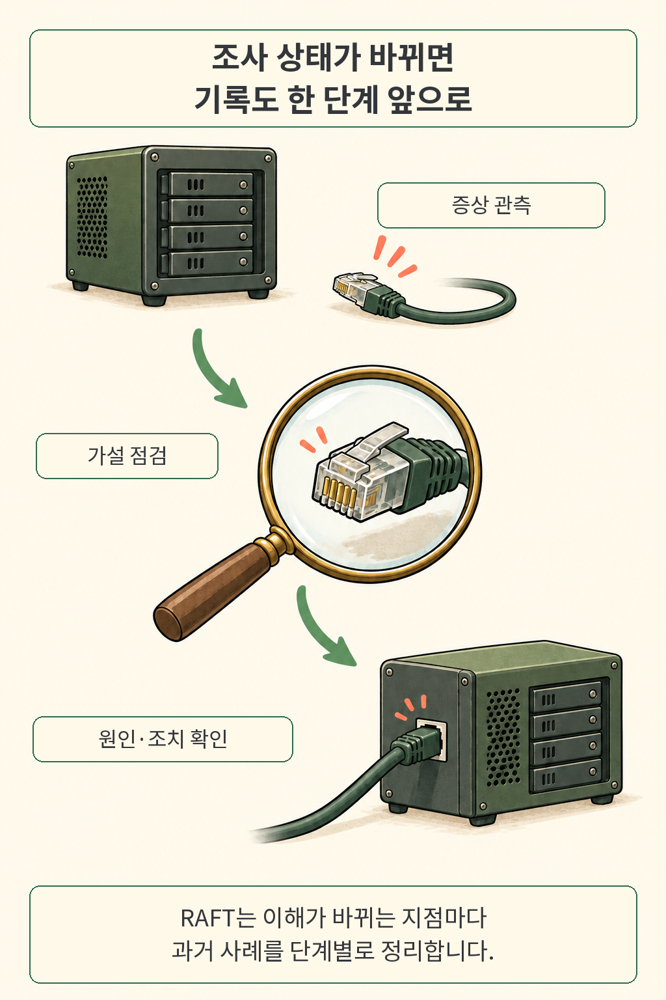
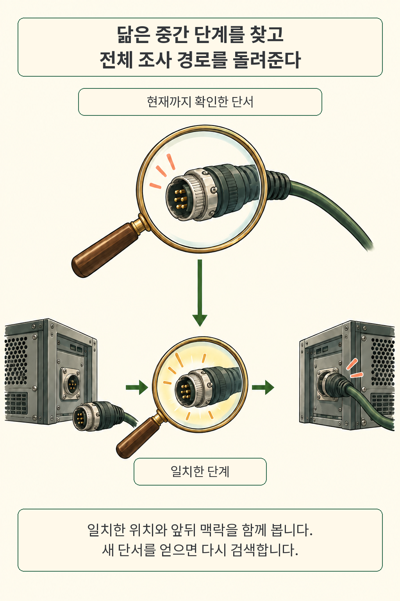
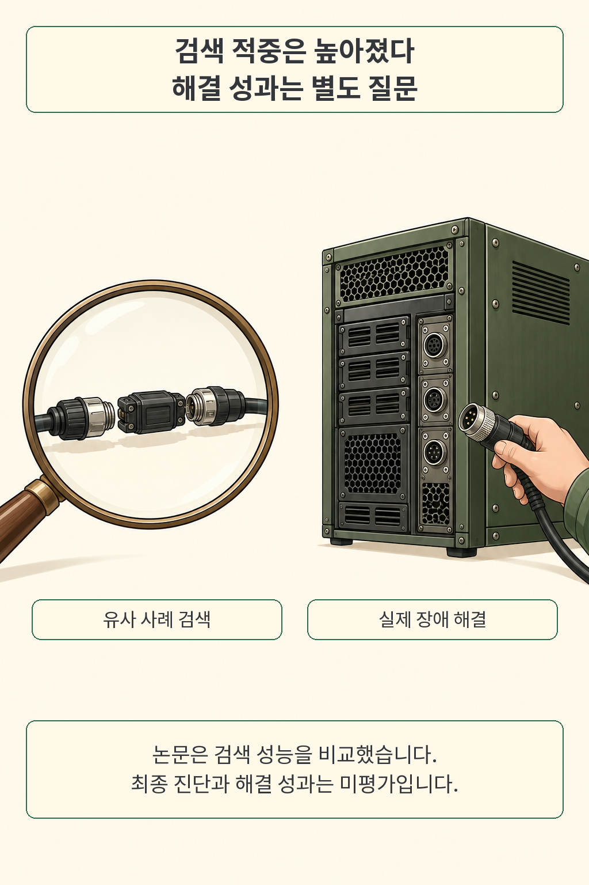
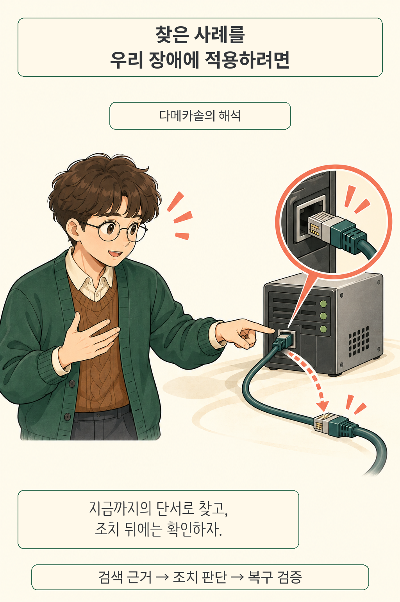

**장애 대응 RAG에서는 검색어에 지금까지의 조사 상태를 담는 것이 중요합니다.** 연결 실패를 보고한 순간과, 케이블·인증·방화벽을 차례로 확인한 뒤에는 필요한 과거 사례가 달라집니다. RAFT 연구팀은 장애 이력을 단계별로 정리해 검색하고, 맞아떨어진 단계와 전체 조사 경로를 함께 돌려주는 방법을 제안했습니다.

글·해설: 다메카솔

## 핵심 내용

- 조사 중 이해가 달라진 시점을 검색 단위로 삼습니다.
- 유사한 중간 단계와 그 사례의 앞뒤 경로를 함께 반환합니다.
- 합성 과제와 소규모 Jira 평가에서 유사 사례 검색 적중률이 높아졌습니다.
- 최종 진단, 실제 해결 성공률과 엔지니어 생산성은 후속 검증 과제입니다.

## 장애 이력의 어느 부분을 검색할까

처음의 증상이 같아도 조사 중 얻은 단서는 달라집니다. 예를 들어 연결 실패를 조사하다 인증이 정상임을 확인했다면, 그 관측을 반영한 사례가 다음 판단에 더 유용할 수 있습니다. 만화의 서버와 케이블은 이 흐름을 설명하기 위한 가상 예시입니다. 논문이 실험한 특정 장애를 재현한 그림은 아닙니다.

저자들은 과거의 종료된 사례를 읽고, 문제를 이해하는 방식이 바뀔 때마다 새 타임라인 항목을 만듭니다. 증상 보고, 가설 추가와 기각, 원인 확인, 조치 검증 등이 경계입니다. 인사나 단순한 확인 답장은 해당 단계에 흡수합니다. 글자 수로 자른 조각과 조사 단계는 서로 다릅니다. [논문 4.1절](https://arxiv.org/html/2609.20754v1#S4.SS1)

기록을 정리하는 과정에도 검토가 있습니다. 작업자는 순서대로 입력을 읽으며 구조화된 사례 상태를 고치고, 마지막 검토자는 원문과 수정 이력을 참조합니다. 설계상 긴 기록을 여러 번에 나눠 처리하지만, 이번 실험의 짧은 사례는 작업자 한 번 호출로 처리했습니다. 긴 운영 이력에서도 같은 추출 품질을 얻는지는 별도로 확인할 부분입니다. [부록 B](https://arxiv.org/html/2609.20754v1#A2)

## 중간 단서로 찾되 앞뒤 맥락도 가져온다

그렇다면 여러 단계 중 어디와 비교해야 할까요. RAFT는 타임라인의 각 항목을 개별 검색 대상으로 삼습니다. 의미 유사도와 단어 검색인 BM25의 순위를 RRF라는 방식으로 합친 뒤, 같은 사례가 여러 번 나오는 중복을 제거합니다. 반환할 사례는 정해진 문맥 예산 안에서 고릅니다.

에이전트가 받는 결과에는 **일치한 항목의 위치와 요약된 전체 조사 경로**가 함께 들어 있습니다. 원시 대화 기록 전부를 그대로 보내는 방식과는 차이가 있습니다. 해당 가설을 왜 세웠고 뒤에서 어떻게 수정했는지 함께 읽을 수 있도록 정리한 것입니다. 새 관측을 얻으면 현재 상태를 반영해 다시 질의합니다. [논문 4.2절과 알고리즘 1](https://arxiv.org/html/2609.20754v1#S4.SS2)

사례끼리 연결하는 그래프도 선택적으로 사용합니다. 원인이나 해결 절차가 닮은 이웃 사례를 추가로 가져오는 장치입니다. 저자들은 부록의 비교에서 그래프 확장을 주요 적중률 향상의 원인으로 설명하지 않았습니다. 직접 찾은 사례에서 관련 근거를 더 넓히는 보조 기능으로 읽는 편이 정확합니다. [부록 C.5](https://arxiv.org/html/2609.20754v1#A3.SS5)

## 높아진 것은 유사 사례를 찾은 비율

연구팀은 Microsoft Learn의 Windows Server 문서를 바탕으로 만든 합성 사례 826건을 사용했습니다. 원인 그룹마다 한 사례를 질의로 뽑고 나머지를 색인하는 구성을 다섯 번 반복했습니다. 826은 전체 사례 수입니다. 모든 사례를 한 번씩 시험한 독립 질문 수로 읽으면 표본의 의미가 바뀝니다.

아래의 Case Hit은 같은 원인·해결 그룹에 속한 사례를 하나 이상 찾은 질문의 비율입니다. 0%는 최초 증상 보고만 주어진 시점이고, 30%와 60%에서는 대화가 진행되며 관측이 추가됩니다. 표는 다섯 번의 실험 평균입니다. [논문 5절, 표 1·2](https://arxiv.org/html/2609.20754v1#S5)

| 합성 사례의 조사 진행 시점 | 일반 RAG | RAFT |
| --- | ---: | ---: |
| 최초 증상만 제공: 0% | 67.3% | 84.2% |
| 대화 30%까지 반영 | 71.9% | 87.1% |
| 대화 60%까지 반영 | 76.9% | 88.8% |

초기 단계에서 67.3%가 84.2%로 올라갔습니다. 첫 검색부터 참고할 사례를 찾는 기회가 꽤 달라진 셈입니다. 이 비교는 반환 문맥 최대 6,000토큰이라는 조건에서 얻었습니다. 공통 임베딩 모델은 `text-embedding-3-large`, 색인용 모델은 `gpt-5.2`, 평가용 모델은 `gpt-5.4`입니다. 사례 단위로 반환하는 방식에는 최대 5건 제한도 적용했고, 문서 조각을 돌려주는 Fast-GraphRAG에는 문맥량 제한만 적용했습니다.

근거의 범위도 함께 봐야 합니다. 원인 그룹 단위로 다시 표본을 뽑는 부트스트랩 분석에서는 Case Hit 차이가 세 시점 모두 양의 95% 신뢰구간을 보였습니다. 반면 후기 단계의 원인 설명·조치 절차 포함률 차이는 신뢰구간에 0을 포함했습니다. 좋은 사례를 찾았다는 결과와 필요한 근거를 충분히 담았다는 결과의 강도가 같지는 않습니다. [부록 C.3, 표 5](https://arxiv.org/html/2609.20754v1#A3.SS3)

### 실제 Jira 기록에서는 표본이 더 작다

사람이 중복으로 연결한 Apache Jira 이슈에서도 연구팀은 같은 방향의 결과를 보고했습니다. 검토를 거친 질문 그룹은 30개이고, 검색 대상은 정답 사례 30건과 방해 사례 570건을 합친 600건입니다. 이 실험은 문맥 한도가 5,000토큰이고, 질의당 사례 5건을 반환합니다. 합성 실험과 문맥 예산이 다릅니다.

| Jira 조사 진행 시점 | 유효 질문 수 | 일반 RAG | RAFT |
| --- | ---: | ---: | ---: |
| 0% | 30 | 66.7% | 83.3% |
| 30% | 30 | 66.7% | 84.0% |
| 60% | 19 | 78.9% | 89.5% |

수치는 다섯 색인 시드의 평균입니다. 후기에는 정답 노출 이전의 조사 이력이 충분한 19개 그룹만 평가했습니다. 따라서 89.5%를 앞선 30개 질문 전체의 개선으로 해석할 수는 없습니다. 저자들도 이 소규모 평가에는 신뢰구간을 제시하지 않고, 실제 사례에 적용될 가능성을 보여주는 방향성 근거로 한정했습니다. [표 4와 부록 D](https://arxiv.org/html/2609.20754v1#A4)

## 공개 코드와 데이터에서 확인한 범위

공개 파일을 직접 세어 보면 후기 표본이 줄어든 이유를 확인할 수 있습니다. 2026년 9월 20일 Microsoft 공식 저장소의 커밋 `29dcb429`를 고정해 Jira 데이터와 검색 코드를 확인했습니다. 색인 파일은 600건, 질문 파일은 30건이며, 시점별 유효성 표시는 30·30·19건이었습니다. 정답 키는 모두 색인에 있었고 질문 이슈의 키는 색인과 겹치지 않았습니다.

이 검수는 파일 구성과 데이터 분리 조건을 확인한 것입니다. 모델로 사례를 추출하고 임베딩을 만든 뒤 논문의 성능을 다시 계산하는 실험은 수행하지 않았습니다. 고정한 저장소에는 구현과 Jira 데이터가 있었으며, 합성 데이터셋은 찾지 못했습니다. 논문의 공개 설명과 이번에 직접 보존한 자산 범위를 구별해 읽어야 합니다. [고정된 공식 저장소](https://github.com/microsoft/RAFT/tree/29dcb42967b70db2f9bffb99c82d30adfbc8a8ed)

RAFT는 원문 제목의 *Retrieval-Augmented Framework for Troubleshooting Agents*를 줄인 이름입니다. 이 글에서는 분산 합의 알고리즘 Raft나 동명의 검색 증강 미세조정 기법을 다루지 않습니다.

## 다메카솔의 해석: 당시의 단서로 다시 시험하기

저라면 먼저 과거 장애 하나를 골라, 해결 답안을 가린 상태에서 조사 시점별 질문을 만들겠습니다. 초기 증상, 새 관측, 기각한 가설을 순서대로 더했을 때 검색 결과가 적절히 바뀌는지 보는 겁니다. 전체 사후 분석서를 질문으로 넣으면 이미 알아낸 원인이 검색을 도와버립니다. 운영자가 당시에 알던 정보로 평가해야 다음 장애에도 도움이 될지 판단하기 쉽습니다.

검색 결과 다음에는 실행 판단이 남습니다. 유사 사례의 조치를 가져왔어도 우리 서비스의 버전·권한·의존성이 맞는지 확인하고, 실제 변경과 복구 검증을 거쳐야 합니다. 저는 검색 근거, 조치 승인, 검증 결과를 각각 기록하는 구조를 권합니다. 이는 논문의 검색 결과를 바탕으로 한 설계 제안입니다. 장애 원인 분석에서 판단 경로를 확인하는 문제는 [RCA 에이전트의 과정 증거를 다룬 글](/posts/llm-agent-rca-trajectory-evidence/)과도 이어집니다.

비용 판단은 질의량에 따라 달라집니다. RAFT는 과거 사례를 미리 정리하는 데 모델 비용을 쓰고, 이후 검색에서는 정리된 경로를 재사용합니다. 반복 검색이 많은 조직과 이력을 드물게 찾는 조직은 비용 구조가 다릅니다. 실제 이력으로 추출 오류, 색인 갱신 비용, 검색 지연을 함께 재야 도입 근거가 생깁니다.

이번 논문이 검증한 범위는 검색 계층까지입니다. 최종 진단 정확도, 해결 성공률, 엔지니어 생산성과 전체 운영 비용은 열린 질문입니다. 다음 실험에서는 검색 적중률과 함께 **그 근거로 어떤 다음 점검을 골랐고, 무엇을 확인했는지**를 남겨 보겠습니다. [논문 한계와 부록 C.7](https://arxiv.org/html/2609.20754v1#A3.SS7)

## 출처

- Mingxuan Zhang 외, [RAFT: A Stateful Retrieval-Augmented Framework for Troubleshooting Agents, arXiv:2609.20754v1](https://arxiv.org/abs/2609.20754v1). 2026년 9월 17일 제출. 원문은 EMNLP 2026 Industry Track 채택을 표기합니다.
- [원문 PDF](https://arxiv.org/pdf/2609.20754v1), [HTML 본문](https://arxiv.org/html/2609.20754v1). 원문은 CC BY 4.0으로 공개돼 있으며, 이 글은 의미를 풀어 설명하고 그림을 새로 구성했습니다.
- Microsoft, [RAFT 공식 코드와 Jira 데이터](https://github.com/microsoft/RAFT/tree/29dcb42967b70db2f9bffb99c82d30adfbc8a8ed). 코드 고정 버전과 공개 파일 확인일: 2026년 9월 20일.

자료 확인 및 글 업데이트: 2026년 9월 20일.

이 글의 본문과 이미지는 생성형 AI로 제작했습니다. 기획과 편집 기준은 다메카솔이 정했습니다.
