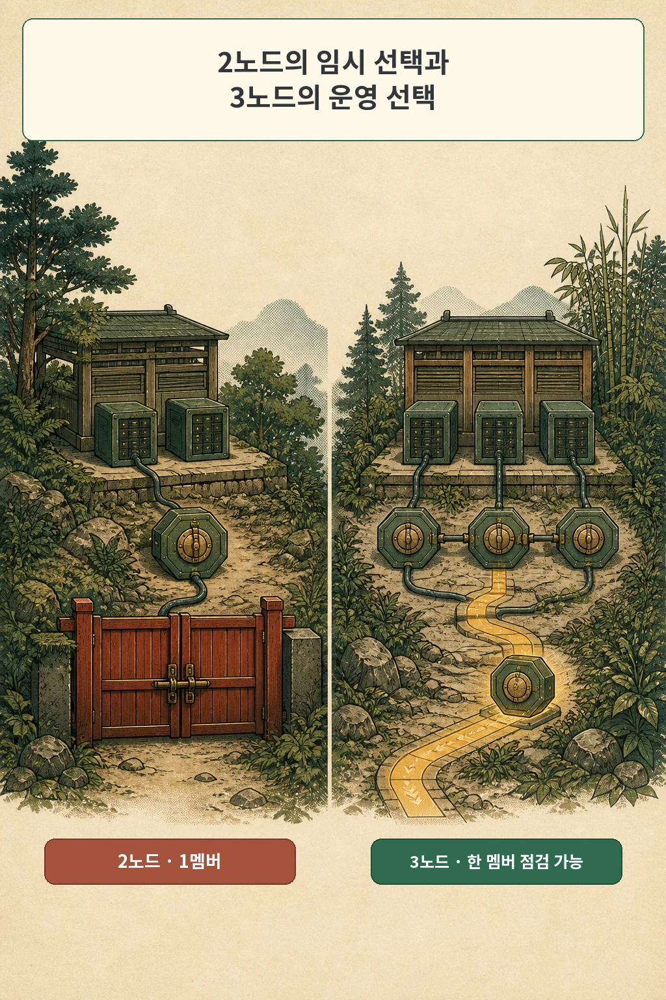

---
title: "replica 1은 같은 뜻이 아니었습니다: Vault PDB 앞에서 멈춘 drain"
description: "단일 Vault를 보호한 PDB의 중단 예산 0에서 kubectl drain이 멈춘 사건과 애플리케이션·스토리지 복제를 따로 설계한 기록입니다."
searchTitle: "Kubernetes drain이 PDB maxUnavailable 0에서 멈춘 이유"
slug: "replica-layer-pdb-drain"
publishedAt: 2026-08-31
updatedAt: 2026-08-31
track: tech_column
subtype: case_study
category: development_episode
series:
  slug: homelab-k8s
  title: "홈랩 쿠버네티스 구축기"
  order: 6
tags:
  - "홈랩"
  - "Kubernetes"
  - "K3s"
  - "고가용성"
  - "스토리지"
audience: developer
readerOutcome: "애플리케이션 복제와 스토리지 복제를 따로 세고, drain 전에 PDB 중단 예산과 실제 복구 주체를 확인한다."
contentFormats:
  - article
  - comic
  - diagram
  - checklist
freshnessStatus: current
reviewedAt: 2026-08-09
reviewAfter: 2027-02-09
cover: "./cover.webp"
coverAlt: "남성 카솔이 멈춘 노드 점검 레버와 복제 계층을 살피는 표지"
sourceUrl: "urn:internal:homelab-k8s:pdb-drain-2026-07-14"
featured: false
draft: true
---

글·해설: 다메카솔

노드 한 대를 비우려고 `kubectl drain`을 실행했습니다. 화면은 `evicting pod vault-0`에서 멈췄습니다. 오류로 끝나지도, 다음 파드로 넘어가지도 않았습니다. 2026년 7월 14일, 2노드 홈랩을 3노드로 다시 세우던 때의 일입니다.


> 이 글은 당시 실패 패턴 원장 H-05와 이후의 복제 정책 ADR을 2026년 8월 9일에 다시 대조해 쓴 회고입니다. 사설 주소와 호스트명은 뺐고, 정확한 차트 패치 버전은 기록이 없어 확정하지 않습니다.

## 두 노드에서 하나만 띄운 이유

당시 Vault replica는 하나였습니다. 고가용성을 포기해서가 아니라 2노드에서 Raft 멤버를 둘로 만드는 편이 낫지 않다고 판단했기 때문입니다. 멤버 둘의 과반수는 둘입니다. 한 노드만 빠져도 합의를 이어 갈 수 없습니다. 장애 허용 수는 그대로인데 운영해야 할 멤버만 늘어납니다.

그래서 3노드가 준비되기 전까지 Vault를 하나만 두었습니다. 그런데 차트가 그 replica 수를 보고 PodDisruptionBudget의 `maxUnavailable`을 0으로 계산했습니다. 렌더된 결과는 사실상 이런 뜻이었습니다.

```yaml
spec:
  maxUnavailable: 0
```

Kubernetes 공식 문서가 설명하는 동작도 같습니다. `maxUnavailable: 0` 또는 `minAvailable: 100%`이면 자발적 eviction을 하나도 허용하지 않습니다. 해당 파드가 놓인 노드를 drain하면 작업이 끝나지 않을 수 있습니다.


제가 본 멈춤은 장애가 아니라 정책 집행이었습니다. drain은 노드를 스케줄 불가로 만들고 eviction API로 파드를 내보냅니다. API는 PDB를 존중했고, 허용된 중단 수가 0이므로 기다렸습니다. 화면의 정적 상태만 보면 고장처럼 보이지만, 실제로는 제가 써 둔 보호 규칙이 정확히 작동하고 있었습니다.

## values를 바꿨는데도 0이 남았습니다

처음에는 values에서 PDB 값을 바꾸려 했습니다. 배포 설정을 수정했으니 다음 렌더에서는 1이 나올 거라고 생각했습니다. 하지만 당시 차트 helper는 replica가 하나면 `maxUnavailable: 0`을 직접 계산했습니다. 제가 바꾼 값보다 템플릿 계산이 우선했고, 결과는 그대로였습니다.

이 지점에서 원인을 설정 파일과 렌더 결과로 나눠 봐야 했습니다.

```bash
helm template <release> <chart> -f values.yaml \
  | yq 'select(.kind == "PodDisruptionBudget")'

kubectl get pdb -A
kubectl describe pdb <pdb-name> -n <namespace>
```

Git에 적힌 의도보다 클러스터에 들어갈 최종 YAML이 중요합니다. 특히 `disruptionsAllowed`가 0인지 먼저 보면 drain이 기다리는 이유를 빠르게 좁힐 수 있습니다.

당시 선택지는 둘이었습니다. 점검 시간을 잡고 PDB를 잠시 제거하거나, `--disable-eviction`으로 eviction API를 우회하는 방법입니다. 둘 다 같은 위험을 받아들입니다. 단일 Vault 파드를 내리는 동안 서비스가 멈춘다는 사실입니다. 저는 이 옵션을 「문제를 해결하는 플래그」가 아니라 「보호를 건너뛰겠다는 운영 승인」으로 기록했습니다.

3노드 전환 뒤에는 Vault를 3멤버로 늘렸고 차트가 `maxUnavailable: 1`을 계산했습니다. 그제야 한 멤버를 자발적으로 내릴 여지가 생겼습니다.



## 같은 시기에 replica를 한 번 더 셌습니다

여기서 비슷해 보이지만 별개의 판단이 하나 더 있었습니다. Longhorn 볼륨 replica 수입니다. `replica: 1`이라는 표기가 Vault에도, 스토리지 정책에도 나타나서 두 사건이 이어진 것처럼 보일 수 있습니다. 그러나 Longhorn replica 1이 drain을 막은 것은 아닙니다. 직접 원인은 단일 Vault를 선택한 PDB의 중단 예산 0이었습니다.

애플리케이션 replica는 서비스를 수행하는 프로세스의 사본입니다. 스토리지 replica는 한 볼륨의 블록 사본입니다. CloudNativePG는 PostgreSQL 자체 물리 복제로 데이터베이스 인스턴스 사이에 데이터를 보냅니다. Longhorn은 각 볼륨을 여러 노드의 replica로 동기 복제합니다. 둘은 복구하는 대상과 담당자가 다릅니다.

두 수를 무조건 같게 맞추면 복제가 곱해집니다. 데이터베이스 인스턴스 셋이 셋이고 각 PVC가 다시 세 사본을 만들면 물리 데이터 경로는 최대 아홉 개입니다. 작은 홈랩에서는 그 비용을 CPU, 네트워크, 디스크 용량으로 모두 냅니다.

그래서 워크로드별로 나눴습니다.

| 워크로드 | 애플리케이션 복구 주체 | Longhorn replica | 판단 |
| --- | --- | ---: | --- |
| CloudNativePG | PostgreSQL 스트리밍 복제 | 1 | 애플리케이션 계층에서 이미 복제 |
| Vault | Raft 멤버 | 1 | 3멤버 전환 뒤 애플리케이션 계층이 복제 |
| SeaweedFS 단일 인스턴스 | 없음 | 3 | 볼륨 계층이 노드 실패를 받아야 함 |
| Prometheus·Loki·Tempo | 제한적 재생성·재수집 | 2 | 손실 비용과 저장 비용 사이 절충 |

이 표는 보편적인 권장값이 아니라 당시 홈랩의 결정 기록입니다. 특히 Longhorn 문서가 말하는 N-1은 replica 실패에 관한 조건입니다. 애플리케이션이 정상 응답하는지, 데이터베이스가 일관된 상태로 승격되는지까지 자동으로 보장하는 숫자는 아닙니다.


## 숫자보다 먼저 적을 세 문장

이 일을 겪고 replica 설정 앞에 바로 숫자를 넣지 않게 됐습니다. 먼저 세 문장을 적습니다.

1. 프로세스가 죽었을 때 누가 새 인스턴스를 만들고 데이터를 이어 받는가.
2. 노드나 디스크가 사라졌을 때 어느 계층이 복구를 맡는가.
3. 계획 점검 중 동시에 몇 개까지 멈춰도 되는가.

첫 문장의 답은 애플리케이션 replica로, 둘째는 스토리지 replica와 실패 도메인으로, 셋째는 PDB와 점검 절차로 이어집니다. 세 답이 모두 같을 이유는 없습니다.


PDB 앞에서 멈춘 drain은 replica가 부족하다는 단순한 사건이 아니었습니다. 단일 멤버를 의도적으로 택한 단계와, 그 멤버를 한 개도 내릴 수 없게 만든 보호 규칙이 만난 결과였습니다. 같은 시기의 스토리지 replica 정책은 또 다른 질문에 대한 답이었습니다.

제가 남긴 결론은 이렇습니다. `replica: 1`이라는 숫자를 발견했을 때 먼저 늘리지 않습니다. 그 숫자가 어느 계층의 사본인지, 무엇이 실패했을 때 누가 복구하는지부터 확인합니다.

## 함께 읽을 개념 글

- [애플리케이션 복제와 스토리지 복제는 무엇이 다른가](/posts/application-storage-replication-layers/): 두 replica 수가 곱해지는 구조와 결정 순서를 설명합니다.
- [PodDisruptionBudget는 무엇을 보장하나: maxUnavailable 0의 의미](/posts/poddisruptionbudget-zero-eviction/): PDB의 보호 범위와 `disruptionsAllowed`를 읽는 법을 정리합니다.
- [kubectl drain이 멈췄을 때 PDB를 우회하기 전에 확인할 것](/posts/kubectl-drain-pdb-checklist/): 정체 원인과 강제 옵션의 차이를 체크리스트로 묶었습니다.

## 출처

- 개인 인프라 실패 패턴 원장 H-05, 2026-07-14
- 개인 인프라 ADR-033·ADR-034, 2026-07-13~16
- [Kubernetes: Specifying a Disruption Budget for your Application](https://kubernetes.io/docs/tasks/run-application/configure-pdb/)
- [Kubernetes: kubectl drain](https://kubernetes.io/docs/reference/kubectl/generated/kubectl_drain/)
- [CloudNativePG: Replication](https://cloudnative-pg.io/docs/current/replication/)
- [Longhorn 1.12: Architecture and Concepts](https://longhorn.io/docs/1.12.0/concepts/)

공식 문서는 2026년 8월 9일 다시 확인했습니다. 본문 명령과 리소스 이름은 공개 가능한 예시로 바꿨습니다.

이 글의 본문과 이미지는 생성형 AI로 제작했습니다. 기획과 편집 기준은 다메카솔이 정했습니다. 만화 이미지는 텍스트 없는 원화에 결정적 레터링을 합성해 만들었습니다. 공식 로고·UI·문서 도표 등 외부 이미지 자산은 사용하지 않았습니다.

