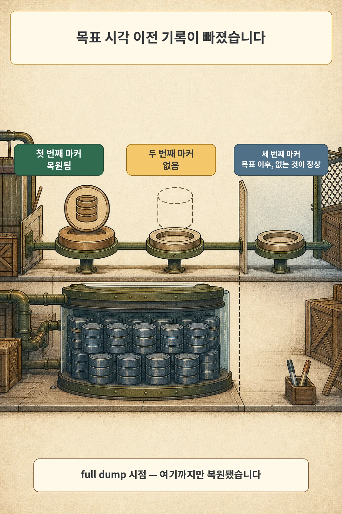
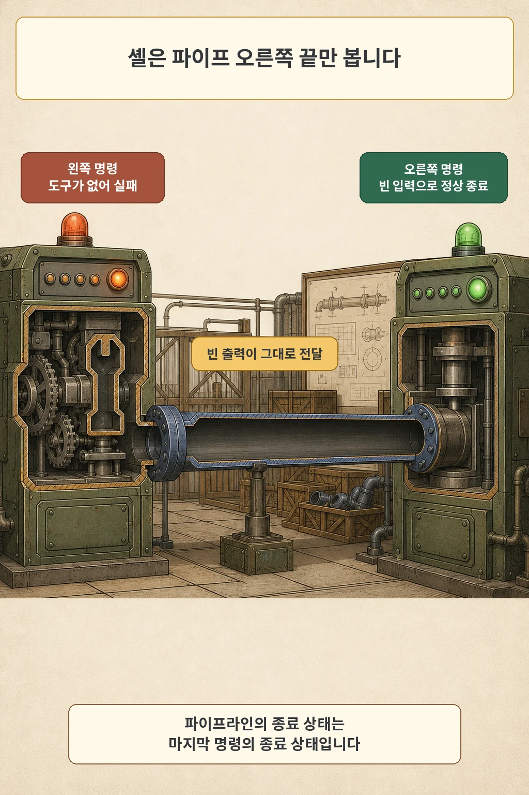
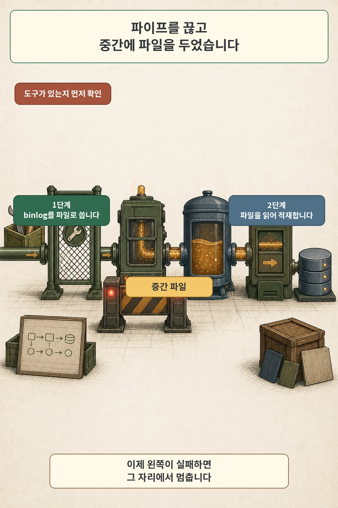

글·해설: 다메카솔

복원 잡은 종료코드 0으로 끝났고, 마지막 로그 줄은 정합성 검증을 통과했다고 알렸습니다. 그런데 목표 시각 **이전**에 심어 둔 마커 하나가 복원본에 없었습니다.

2026년 7월 10일, 차세대 선불결제 플랫폼의 내부 오픈을 앞두고 첫 복원 리허설을 했습니다. 단일 노드 개발 클러스터에 GitOps 배포 루프를 세우고, 일 1회 논리 백업과 15분 주기 binlog 보관 위에서 특정 시각으로 되돌리는 복구를 실행했습니다. 복원은 운영 데이터베이스에 하지 않았습니다. 리허설을 위해 따로 띄운 복원 전용 인스턴스가 대상입니다.

> 이 글은 2026년 7월 10일의 리허설을 회고해 쓴 기록입니다. 사내 시스템 이름, 저장소, 사내망 자원은 담지 않았고, 실측값은 개발 환경에서 나온 값입니다.

## 리허설이 판정하려던 것

백업이 있느냐는 질문에는 이미 답이 있었습니다. 이 절차가 물은 것은 그 백업으로 원하는 시각까지 되돌아가느냐였습니다. 선불결제는 잔액과 원장이 함께 맞아야 하는 도메인이라, 복원됐다는 말과 쓸 수 있다는 말이 다릅니다. 그래서 판정 기준을 데이터 자체에 두기로 했습니다.

방법은 단순합니다. 복구 목표 시각을 정하고, 그 시각 **이전**에 두 번, **이후**에 한 번 식별 가능한 기록을 남깁니다. 복원이 제대로 됐다면 앞의 두 개는 살아 있고 뒤의 하나는 없어야 합니다. 저는 이 대조를 리허설의 핵심으로 잡았습니다. 성공 로그는 판정에 넣지 않았습니다.



## 마커 하나가 비어 있었습니다

첫 실행 결과를 대조하자 두 번째 마커가 없었습니다. 목표 시각 이후의 세 번째 마커가 빠진 것은 예상대로였지만, 두 번째는 살아 있어야 하는 기록입니다. 잡은 실패를 남기지 않았고, 정합성 검증도 통과했습니다.

복원본을 더 들여다보니 경계가 선명했습니다. 논리 백업 파일이 만들어진 시점까지의 데이터만 있었고, 그 이후 구간은 통째로 없었습니다. binlog 재생이 일부 실패한 것이 아니라 아예 실행되지 않은 상태였습니다.

## 제가 먼저 의심한 것은 시각 계산이었습니다

여기서부터 한 문단은 당시 판단 순서를 다시 세운 재구성입니다. 판단 과정 자체는 기록으로 남기지 않았고, 남은 것은 그때 복원 잡이 이미 무엇을 검사하고 있었는지뿐입니다.

저는 목표 시각과 백업 파일 시각의 경계를 먼저 의심했습니다. 잡이 UTC 문자열을 파싱하고, 파일 이름의 시각과 실제 파일 완료 시각을 목표 시각과 비교하는 검사를 여러 겹 갖고 있었기 때문입니다. 경계 계산이 한 칸 어긋났다면 그럴듯한 설명이 됩니다. 그런데 그 가정이 맞다면 오류는 반대 방향으로 나와야 했습니다. 목표를 넘겨 재생해서 **이후** 기록이 남는 쪽이지, **이전** 기록이 사라지는 쪽이 아닙니다.

방향이 맞지 않는다는 것을 알고 나서야 재생 단계 자체를 봤습니다.

## 셸은 파이프 오른쪽 끝만 봅니다

원인은 두 겹이었습니다. 복원 잡이 쓰던 MySQL 8.0.34 기본 이미지에 `mysqlbinlog`가 들어 있지 않았습니다. 이 이미지는 Oracle Linux 기반의 작은 변형인데, 어느 변형에 어떤 클라이언트 도구가 빠져 있는지는 공식 이미지 문서에 적혀 있지 않습니다. 저도 그날 실행해 보고 알았습니다.

도구가 없으면 그 자리에서 멈춰야 정상입니다. 멈추지 않은 이유가 두 번째 겹입니다. 당시 재생 단계는 MySQL 공식 매뉴얼이 제시하는 표준 형태, 즉 `mysqlbinlog` 출력을 `mysql` 클라이언트로 파이프하는 한 줄이었습니다. 그리고 잡의 셸은 `sh -e`로 실행됩니다.

POSIX 셸에서 파이프라인의 종료 상태는 마지막 명령의 종료 상태입니다. 왼쪽에서 무슨 일이 일어나도 상태값에는 오른쪽 결과만 남습니다. 여기서 오른쪽 `mysql`은 빈 입력을 받아 아무 일도 하지 않고 정상 종료했습니다. `-e` 옵션은 실패를 보지 못했고, 스크립트는 다음 줄로 넘어가 검증을 돌리고 성공 메시지를 찍었습니다.



이 구조는 데이터베이스와 상관없이 재현됩니다. 아래는 2026년 8월 4일 이 글을 쓰면서 로컬 `dash`에서 그대로 돌려 본 출력입니다.

```console
$ sh -ec 'mysqlbinlog --stop-datetime="2026-07-10 03:00:00" bin.000001 | cat > /tmp/replay.txt
> printf "다음 줄 도달, 파이프라인 상태=%s\n" "$?"
> printf "복원 입력 크기=%s바이트\n" "$(wc -c < /tmp/replay.txt)"
> printf "정합성 검증 통과\n"'
sh: 1: mysqlbinlog: not found
다음 줄 도달, 파이프라인 상태=0
복원 입력 크기=0바이트
정합성 검증 통과
$ echo $?
0
```

`not found`가 화면에 찍혀 있는데도 스크립트 종료코드는 0입니다. 파이프만 지우면 같은 스크립트가 종료코드 127로 즉시 멈춥니다. 한 문자 차이로 실패가 보이거나 사라집니다.

`set -o pipefail`이 이 차이를 없애 줍니다. 다만 쓸 수 있는 셸인지 먼저 확인해야 합니다. 같은 환경의 `dash`는 이 옵션을 거부했고, `bash`는 받아들였습니다. 컨테이너 안에서 `/bin/sh`가 무엇으로 연결돼 있는지에 따라 갈립니다.

## 파이프를 끊고 관문을 세웠습니다

그 두 겹을 같은 날 함께 걷어냈습니다. 복원 잡 이미지를 클라이언트 도구가 모두 들어 있는 debian 변형으로 바꿨고, 재생 전에 `command -v`로 도구가 있는지 확인하게 했고, 파이프를 중간 파일 두 단계로 나눴습니다.

```sh
command -v mysqlbinlog
mysqlbinlog --start-position="${start_pos}" \
  --stop-datetime="${target_utc}" "$@" > /tmp/binlog-replay.sql
mysql -h "${restore_host}" -uroot < /tmp/binlog-replay.sql
```

이 형태는 우회로가 아닙니다. MySQL 매뉴얼도 파이프 형태와 함께, 먼저 파일로 쓴 뒤 그 파일을 적재하는 2단계 형태를 나란히 문서화합니다. 두 줄로 나누면 각 명령의 종료 상태가 따로 남고, `-e`가 첫 줄에서 스크립트를 멈춥니다.



더 중요한 변화는 판정 기준 쪽에 있었습니다. 복원 절차의 마지막 단계를 정합성 검증 결과가 하나라도 0이 아니면 종료코드 1로 실패하는 관문으로 만들고, 리허설 판정은 앞서 심어 둔 마커와 복원본을 대조해서 내리기로 고정했습니다. 복원 잡이 성공했다는 사실은 그 관문을 여는 조건 중 하나일 뿐입니다.

수정 후 재검증에서는 목표 시각 이전 마커 두 개가 모두 복원되고 이후 마커는 복원되지 않았습니다. 정합성 위반 0건, 복원 개시부터 검증 통과까지 38초였습니다.


같은 리허설의 다른 항목도 함께 쟀습니다. 배포 롤백은 장애 선언부터 서비스 복구까지 16초였고, Git 되돌림까지 재수렴하는 데는 5분 40초가 걸렸습니다. 스키마 마이그레이션을 포함한 배포 sync는 1분 26초였습니다. 이 값들이 무난하게 나왔기 때문에 복구 항목의 성공 로그도 그대로 믿을 뻔했습니다.

## 아직 확인하지 못한 것

이 숫자들이 적용되는 범위는 좁습니다. 단일 노드 개발 클러스터였고, 스키마는 사실상 비어 있었습니다. 38초는 데이터가 거의 없을 때의 값이라, 실데이터 규모에서 복원이 얼마나 걸릴지 저는 아직 모릅니다. 운영 클러스터의 스토리지가 어떻게 동작할지도 그 환경에서 다시 재야 합니다.

파이프에 대한 결론도 한 걸음만 나갑니다. 파이프가 위험하다는 이야기가 아닙니다. 공식 문서가 표준 절차로 제시하는 형태이고, 실패를 감지하는 장치와 함께 쓰면 문제가 되지 않습니다. 이 사건에서 무너진 것은 파이프와 `-e`와 최소 이미지가 겹친 지점이었고, 셋 중 하나만 달랐어도 성공 보고는 나오지 않았으리라고 봅니다.

제가 이 리허설에서 가져온 기준은 한 문장입니다. **백업과 복원 작업이 성공으로 끝났다는 사실은 복구 가능성의 증거가 아닙니다.** 복구는 복원된 데이터와 미리 심어 둔 표식을 맞춰 봐야 확인됩니다. 그 대조를 통과하지 못하면 로그가 무슨 색이든 아직 복구된 것이 아닙니다.

다음 분기 리허설에서 제가 확인하려는 것은 두 가지입니다. 실데이터에 가까운 규모에서 복원 시간이 목표 안에 들어오는지, 그리고 이번처럼 도구가 통째로 빠진 경우 말고 재생이 **중간에** 끊긴 경우에도 이 관문이 걸러 내는지입니다. 두 번째는 아직 재현해 보지 못했습니다.

검증 환경: 단일 노드 개발용 Kubernetes 클러스터, Argo CD v3.4.5, MySQL 8.0.34, ROW 형식 binlog, 2026년 7월 10일 실측. 셸 재현은 2026년 8월 4일 `dash`와 `bash`에서 확인했습니다. 다른 셸·이미지·스토리지 조합에서는 다르게 동작할 수 있습니다.

## 출처

- 내부 복원 리허설 기록과 복원 잡 수정 이력, 2026-07-10 (비공개)
- [POSIX Shell Command Language — 2.9.2 Pipelines](https://pubs.opengroup.org/onlinepubs/9699919799/utilities/V3_chap02.html)
- [MySQL 8.0 Reference Manual — Point-in-Time Recovery Using mysqlbinlog and mysql Client](https://dev.mysql.com/doc/refman/8.0/en/point-in-time-recovery-binlog.html)
- [Docker Official Image: mysql](https://hub.docker.com/_/mysql)

사내 시스템 이름, 저장소, 사내망 주소, 데이터베이스 스키마 이름은 공개하지 않았습니다. 공식 문서는 2026년 8월 4일 다시 확인했습니다.

이 글의 본문과 이미지는 생성형 AI로 제작했습니다. 기획과 편집 기준은 다메카솔이 정했습니다. 만화 이미지는 텍스트 없는 원화에 결정적 레터링을 합성해 만들었습니다. 공식 로고·UI·문서 도표 등 외부 이미지 자산은 사용하지 않았습니다.
