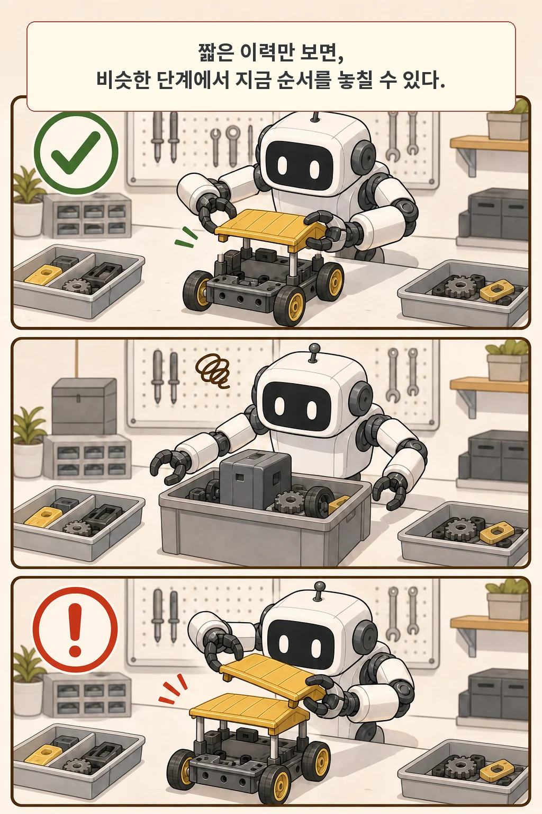
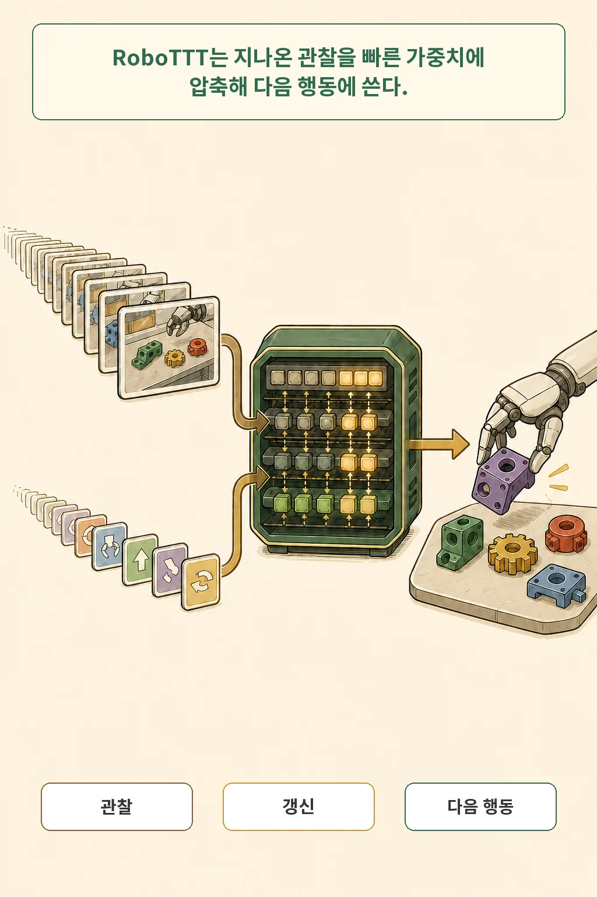
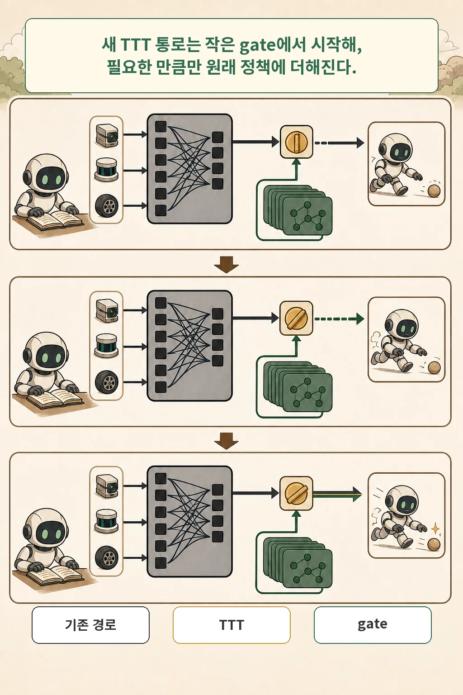
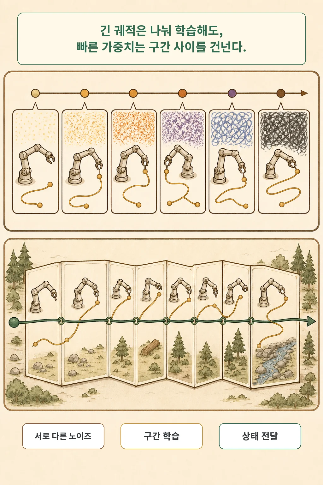
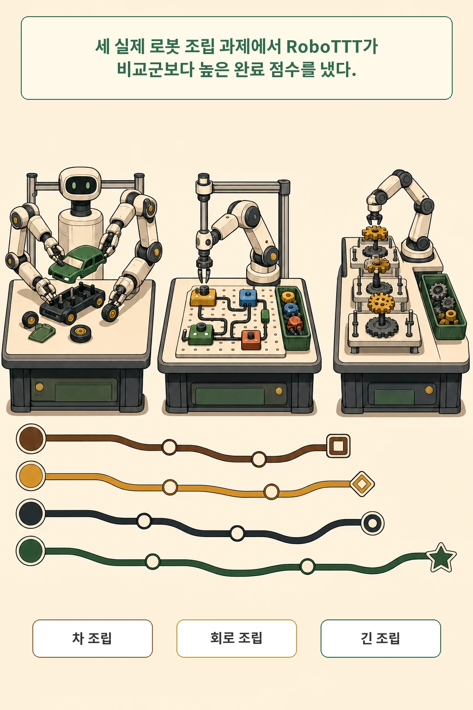
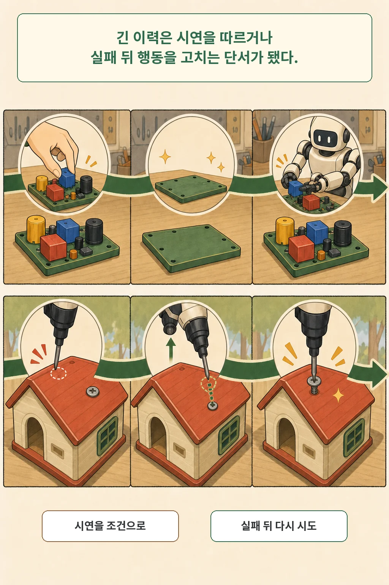

로봇이 부품 하나를 끼운 뒤 다음 단계로 넘어갔습니다. 카메라 각도가 조금 바뀌자 방금 끝낸 장면과 이전 장면이 비슷해졌고, 로봇은 어느 단계인지 다시 헷갈립니다.

2026년 7월 16일 공개된 **「RoboTTT: Context Scaling for Robot Policies」**는 긴 시각·행동 이력을 계속 쌓아 두는 대신, 추론 중 갱신되는 **빠른 가중치(fast weights)**에 압축하자는 방법을 제안합니다. 저자들은 이 구조를 실제 양팔 로봇의 세 조립 과제에서 시험했고, 짧은 이력이나 다른 고정 크기 상태를 쓴 비교군보다 높은 평균 완료 점수를 보고했습니다. 다만 특정 로봇·과제·연구진의 결과이며, 모든 실패를 해결하거나 다른 환경의 성능을 보장한 것은 아닙니다.

글·해설: 다메카솔

## 핵심 내용

- RoboTTT는 Vision-Language-Action 정책의 action head에 Test-Time Training 층을 넣습니다.
- 이 층의 작은 모델은 관찰이 들어올 때마다 fast weights를 갱신하고, 누적 이력을 고정 크기 상태로 다음 시점에 넘깁니다.
- 긴 시퀀스 훈련에는 action chunk마다 다른 noise level을 주는 `sequence action forcing`과 구간별 역전파를 쓰는 `TBPTT`를 결합했습니다.
- 실제 로봇 세 과제에서 유의미한 개선을 보고했지만, 훈련 비용·과제 범위·재현 가능한 공개 코드가 남은 판단 조건입니다.

긴 작업에서 필요한 기억은 사진을 많이 저장하는 일보다 요약을 계속 고쳐 쓰는 일에 가깝습니다. 정책은 지금 행동을 고르는 데 어떤 과거가 중요한지 구분해야 합니다.

## 짧은 이력은 왜 조립 순서를 놓칠까

긴 조립은 한 장면만 보면 서로 다른 단계가 거의 같은 모습일 수 있습니다. 저자들은 이를 `state aliasing` 문제로 설명합니다. 이미 지붕을 끼운 뒤인지, 방금 부품이 가려져 지붕이 안 보이는 것인지 현재 프레임만으로 구분하기 어려운 상황입니다.

기존 GR00T N1.7 비교군은 현재 시점만 보거나 과거 프레임 한 장을 더 봤습니다. 과거 관찰을 단순히 붙인 GR00T N1.7 Hist.는 모든 과제에서 좋아지지 않았습니다. 논문에서 Pup Go Car 완료 점수는 현재 시점만 본 모델이 57%, 한 장의 이력을 더 본 모델이 39.5%였습니다. 저자들은 과거 프레임을 무작정 붙이면 우연한 상관관계가 늘고, 추론 시점의 시간 위치가 훈련 분포에서 벗어날 수 있다고 해석합니다.

## fast weights는 긴 이력을 어떻게 담나

프레임을 더 많이 붙이는 대신, RoboTTT는 작은 모델의 가중치 자체를 상태로 씁니다. 한 시점의 token이 들어오면 TTT 층은 self-supervised loss로 fast weights를 한 번 갱신하고, 갱신된 작은 모델로 출력을 계산합니다. 다음 시점에는 같은 크기의 가중치 상태만 넘깁니다.

저자들의 표현대로라면 과거 stream은 가중치 공간으로 압축됩니다. 그렇다고 모든 프레임을 무손실로 기억한다는 뜻은 아닙니다. outer task loss가 fast-weight 초기값과 갱신 규칙을 함께 학습하므로, 정책이 다음 행동에 유용한 정보를 남기도록 훈련한다는 의미에 가깝습니다.

이 설계에서 한 시점의 추론 비용은 누적 context 길이와 무관하게 일정합니다. Transformer가 긴 KV cache를 계속 읽는 방식과 달리 고정 크기 상태를 전달하기 때문입니다. 전체 모델이 가볍다는 뜻은 아닙니다. 논문 구현은 GR00T N1.7의 16개 DiT 층에 TTT 층을 더해 action head 규모를 538M parameter에서 약 690M으로 늘렸습니다.

## 원래 정책을 덮지 않는 gate

원래 정책에 새 층을 붙이면 pretrained capability가 갑자기 흔들릴 수 있습니다. 연구진은 TTT 출력 앞에 학습 가능한 `tanh` gate를 두고 값을 0에 가깝게 초기화했습니다. 훈련 시작점에서는 새 branch가 거의 닫혀 있고, 도움이 되는 만큼만 기존 attention 출력에 더해집니다.

이 gate는 보존을 위한 설계 장치이지 안전 보증은 아닙니다. 실제 배치에서 기존 능력이 얼마나 유지되는지는 별도 평가가 필요합니다.

## 긴 시퀀스를 메모리에 맞춰 훈련하는 법

8K 시점의 전체 gradient를 한 번에 저장하면 GPU 메모리가 context 길이에 따라 커집니다. RoboTTT는 두 장치를 함께 씁니다.

첫째, `sequence action forcing`은 각 action chunk에 서로 다른 noise level을 샘플링합니다. 시퀀스 전체가 똑같은 난이도로 노이즈 제거를 배우면 한 trajectory가 통째로 쉽거나 어려워져 훈련이 불안정해졌기 때문입니다. 논문 ablation에서는 이 장치를 빼자 closed-loop 성능이 크게 낮아졌습니다.

둘째, `truncated backpropagation through time`은 긴 trajectory를 작은 구간으로 나눕니다. gradient는 구간 안에서만 흐르지만 fast weights는 구간 경계를 넘어 계속 전달됩니다. 훈련 메모리는 전체 길이가 아니라 구간 길이에 좌우되고, 상태는 긴 작업의 끝까지 이어지는 구조입니다.

## 실제 로봇 세 과제에서 무엇이 달라졌나

구조 설명보다 중요한 질문은 실제 로봇에서 더 나은 행동으로 이어졌는지입니다. 저자들은 네 대의 RGB 카메라가 달린 YAM 양팔 로봇으로 세 과제를 평가했습니다. Pup Go Car와 Circuit은 정책마다 20회, 평균 5분이 걸리는 Gear Bot은 10회 실행했습니다. 완료 점수는 과제별 rubric으로 계산했습니다.

| 방법 | 세 과제 평균 완료 점수 | 컨텍스트 형태 |
| --- | ---: | --- |
| RoboTTT | 79% | 추론 중 gradient로 갱신되는 fast weights |
| GR00T N1.7 | 42% | 현재 시점 |
| GR00T N1.7 Hist. | 49% | 과거 프레임 한 장 추가 |
| GDN | 56% | gradient 없는 고정 크기 recurrent state |

RoboTTT의 79%는 현재 시점만 본 42%보다 상대적으로 약 87%, GDN의 56%보다 약 41% 높습니다. 이 비교는 세 과제 평균이고, 보편적인 로봇 성공률이 아닙니다. Gear Bot의 완전 성공도 RoboTTT가 10회 중 2회, 세 비교군이 0회였습니다. 가능성을 보여 주지만 표본이 작고 절대 성공률도 낮습니다.

저자들은 pretraining context를 128 시점에서 8K 시점까지 늘린 별도 평가도 했습니다. DAgger 훈련 전 기준으로 RoboTTT의 평균 완료 점수는 1K context의 43.9%에서 8K의 71.5%로 올랐습니다. 같은 그림에서 best short-context baseline은 45.6%였습니다. 30Hz 제어에서 8K는 4분이 넘는 이력입니다.

## 시연을 따르고 실패 뒤 다시 시도한 조건

긴 이력은 평균 점수 밖에서도 두 가지 행동 차이를 만들었습니다. Circuit의 보지 못한 구성 하나를 사람이 영상으로 시연한 뒤 장면을 초기화하자, RoboTTT는 10회 중 6회를 완전히 조립했습니다. 완료 점수는 65%였습니다. 비교한 GDN은 33%, 완전 성공 0회였습니다. 이 시험은 같은 `assemble circuit` 지시를 쓰고 목표 구성을 영상으로만 보여 줬습니다.

Pup Go Car에서는 잘못된 행동과 사람의 교정을 함께 담은 DAgger trajectory를 사용했습니다. `DAgger Distillation`은 실패한 robot action을 흉내 낼 target이 아니라 context로 두고, human correction만 target으로 삼았습니다. 같은 100개 trajectory에서 sequence model 두 종의 평균 개선은 33%였고, RoboTTT는 36%, GDN은 29% 개선됐습니다.

외부 교란 평가도 조건을 봐야 합니다. 사람이 설치된 지붕이나 타이어를 중간에 빼면 RoboTTT는 지붕 20회 중 15회, 타이어 20회 중 18회를 다시 설치했습니다. GDN은 각각 13회와 18회였습니다. 타이어에서는 두 방법이 같았고, 모든 방법이 30분의 교란 데이터를 함께 훈련했습니다.

## 이 논문이 아직 답하지 못한 것

여기서 “긴 기억”을 일반적인 로봇 기억 능력으로 넓히면 근거보다 앞서갑니다. 논문 구현은 GR00T N1.7과 YAM 양팔 로봇, 세 조립 과제에 묶여 있습니다. 연구진도 긴 training context가 훈련 비용을 늘리고, robotics-oriented TTT objective가 더 필요하며, 배치에서 만난 모든 실패를 처리하지는 못했다고 적었습니다.

계산 자원도 작지 않습니다. 각 pretraining run은 NVIDIA GB200 GPU 16개로 30K steps, 과제별 post-training은 GPU 8개로 20K steps를 사용했습니다. 절대 훈련 시간, 전력, 비용은 논문에 제시되지 않았습니다.

2026년 7월 21일 발행 전 재확인 시 [공식 NVIDIA 프로젝트 페이지](https://research.nvidia.com/labs/gear/robottt/)에는 논문과 실제 로봇 영상이 공개돼 있었습니다. 공식 코드나 데이터 저장소 링크는 arXiv 메타데이터와 프로젝트 페이지에서 확인되지 않았습니다. 이 상태는 바뀔 수 있으므로 이후 재현을 시도할 때 다시 확인해야 합니다.

## 다메카솔의 해석: 기록량보다 갱신 규칙

저는 RoboTTT에서 가장 실무적인 대목이 **갱신 가능한 내부 상태**로 압축하도록 정책 자체를 학습시킨 부분이라고 봅니다. 과거 화면을 끝없이 붙이는 방식과는 비용 곡선이 달라지기 때문입니다. 언어 모델의 긴 문맥처럼 로봇에도 context length가 하나의 scaling axis가 될 수 있다는 주장도 이 설계와 실제 로봇 결과에서 나옵니다.

적용 판단은 네 질문으로 좁혀집니다.

- 어떤 과거 관찰이 상태에 남고 무엇이 지워지는가?
- 추론 중 gradient update가 예상 밖의 행동을 만들 때 어떻게 감시할 것인가?
- 긴 context가 실제 과제 성공을 높이는 범위는 어디까지인가?
- 훈련 비용과 재현 가능한 코드가 운영 가치에 맞는가?

세 조립 과제에서 얻은 결과는 긴 이력의 가능성을 보여 줍니다. 다른 로봇, 센서, 안전 요구에서도 같은 결론이 유지되는지는 아직 열린 문제입니다.

## 논문 정보

| 항목 | 내용 |
| --- | --- |
| 제목 | RoboTTT: Context Scaling for Robot Policies |
| 저자 | Yunfan Jiang 외 10명 |
| 공개 | arXiv v1, 2026-07-16 |
| 분야 | Robotics, Artificial Intelligence, Machine Learning |
| 이 글의 분류 | systems paper |
| 라이선스 | CC BY 4.0 |

## 자주 묻는 질문

### Test-Time Training이면 로봇이 배치 중 전체 모델을 다시 학습하나요?

아닙니다. 이 논문에서는 각 TTT 층 안의 작은 모델이 가진 fast weights를 매 시점 갱신합니다. pretrained backbone 전체를 매번 다시 학습하는 방식과 다릅니다.

### 8K 시점이면 로봇이 모든 과거를 기억하나요?

아닙니다. fast weights는 고정 크기 상태입니다. 긴 stream에서 필요한 정보를 압축하도록 학습하지만, 무엇을 얼마나 오래 보존하는지에 대한 완전한 보장은 없습니다.

### 79%면 실제 조립 현장에 바로 쓸 수 있나요?

그렇게 해석할 수 없습니다. 79%는 YAM 양팔 로봇의 세 과제에서 rubric으로 계산한 평균 완료 점수입니다. 과제별 완전 성공 횟수, 실패 유형, 다른 hardware 전이, 비용과 안전 평가를 함께 봐야 합니다.

## 출처

- [Yunfan Jiang et al., “RoboTTT: Context Scaling for Robot Policies,” arXiv:2607.15275 (2026)](https://arxiv.org/abs/2607.15275)
- [RoboTTT 공식 NVIDIA GEAR 프로젝트 페이지와 실제 로봇 영상](https://research.nvidia.com/labs/gear/robottt/)
- [원문 PDF](https://arxiv.org/pdf/2607.15275)
- [Creative Commons Attribution 4.0 International](https://creativecommons.org/licenses/by/4.0/)

이 글의 본문과 이미지는 생성형 AI로 제작했습니다. 기획과 편집 기준은 다메카솔이 정했습니다. 논문의 그림·표·스크린샷은 복제하지 않고 핵심 의미를 새 장면으로 재구성했습니다.
