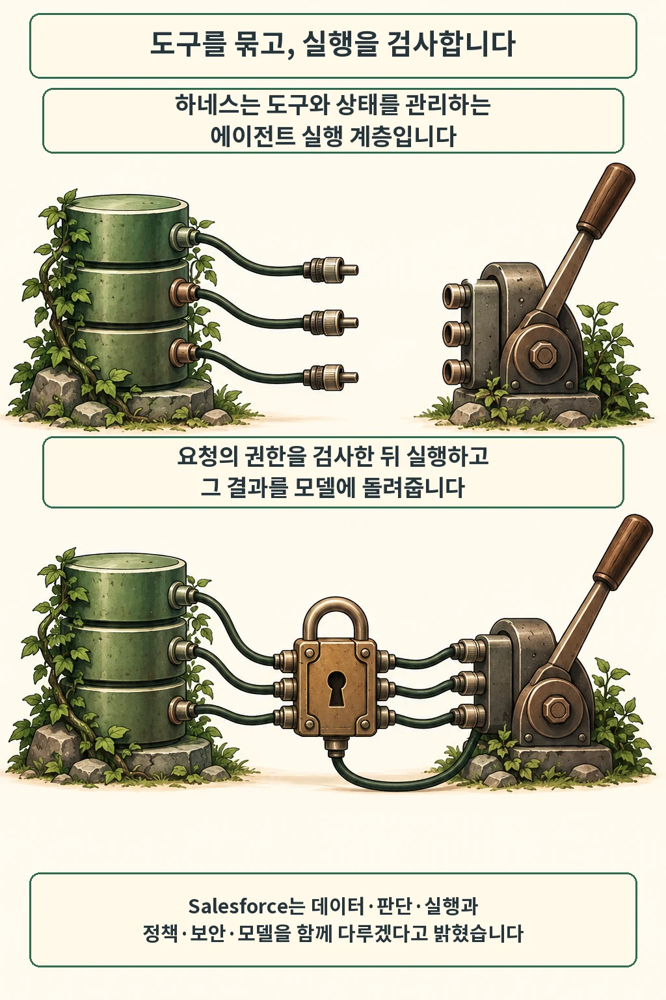
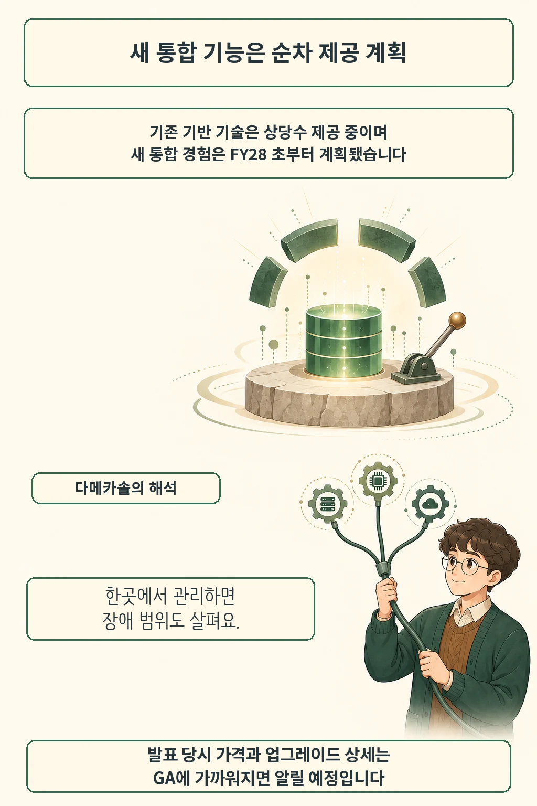

Salesforce가 2026년 9월 10일 Enterprise AI Harness와 AI Control Plane 구상을 발표했습니다. 에이전트의 실행과 관리를 공통 구조로 묶겠다는 계획입니다. 기반 기술 상당수는 이미 제공 중이며, 새 기능과 통합 경험은 회사 회계연도 FY28 초부터 순차 제공할 예정입니다. [공식 발표](https://www.salesforce.com/news/stories/enterprise-ai-harness/)를 기준으로 정리했습니다.

글·해설: 다메카솔

Updated: 2026-09-11

## 하네스는 어디에 끼어들까요

모델이 도구 호출을 제안하면 누군가는 그 요청을 실제 API로 보내야 합니다. 실행 지점이 필요합니다. Salesforce의 [하네스 설명](https://www.salesforce.com/agentforce/ai-agents/agent-harness/)은 이 계층에서 상태를 보관하고 권한을 확인한 뒤, 도구 실행 결과를 모델에 돌려주는 구조를 다룹니다.

이번 구상은 여기에 데이터·판단·실행·정책·보안·모델을 함께 묶습니다. AI Control Plane은 에이전트의 활동과 관리를 한곳에서 다루려는 구성입니다. 두 자료 모두 Salesforce가 작성했습니다. 회사가 제시한 설계 방향과 독립적으로 확인한 운영 성과를 구분해서 읽어야 합니다.

## 지금 쓸 수 있는 것과 앞으로 더해질 것

새 통합 경험에는 시간이 더 필요합니다. 발표문은 기존 기반 기술의 현재 제공과 FY28 초부터 시작할 새 기능 제공을 구분합니다. 여기서 FY28은 Salesforce의 회계연도 표기입니다. 발표된 표현을 그대로 남기며 달력상의 2028년 출시일로 바꾸지 않았습니다.

가격과 업그레이드 상세도 추후 안내 대상입니다. 2026년 9월 11일 확인한 공개 자료의 범위는 여기까지입니다. 도입 검토에서는 이름이 같은 묶음 안에서도 지금 계약할 기능과 이후 추가될 기능을 따로 확인할 필요가 있습니다.

## 다메카솔의 해석: 관리가 모이면 장애도 함께 봐야 합니다

저는 실행 계층을 모으는 설계에서 변경의 영향 범위부터 보겠습니다. 에이전트마다 권한 검사를 따로 구현하면 같은 정책을 고칠 곳이 늘어납니다. 공통 검사 지점을 쓰면 수정 범위가 줄지만, 그 지점의 장애가 여러 작업을 동시에 멈출 가능성도 생깁니다. 관리 편의에는 운영 책임이 따라옵니다.

예를 들어 조회는 성공했는데 후속 변경 API가 시간 초과됐다고 가정해 봅시다. 모델에 다시 해보라고만 지시하면 이미 반영된 변경을 반복할 위험이 있습니다. 실행 계층이 요청 식별자와 처리 결과를 보관하고, 재시도 전에 상태를 확인하도록 설계하는 이유입니다. 이 사례는 제가 설명을 위해 만든 상황이며 Salesforce 제품에서 관찰한 장애는 아닙니다.

또한 공통 관리 화면이 보인다는 사실만으로 각 업무 시스템의 권한 검사가 끝났다고 판단해서는 곤란합니다. 저는 정상 완료, 권한 거부, 실행 계층 장애를 각각 시험하겠습니다. [Claude 평가 사고 재분석](/posts/claude-cyber-incidents-alignment-assessment/)에서 살핀 설명과 실행 경계의 차이도 같은 검토에 도움이 됩니다. 앞으로 공개될 통합 기능이 이 경계를 어디까지 책임질지 남은 확인 사항입니다.

## 출처

- [Salesforce — Enterprise AI Harness 발표 (2026-09-10)](https://www.salesforce.com/news/stories/enterprise-ai-harness/): 발표 범위와 제공 계획.
- [Salesforce — Agent Harness 설명](https://www.salesforce.com/agentforce/ai-agents/agent-harness/): 실행 계층 개념. 날짜 표기 없음, 2026-09-11 확인.

이 글의 본문과 이미지는 생성형 AI로 제작했습니다. 기획과 편집 기준은 다메카솔이 정했습니다.
