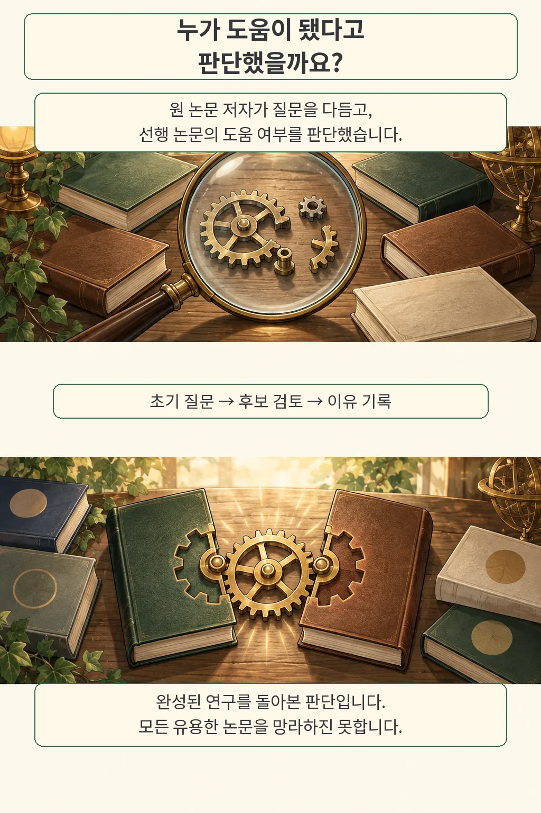
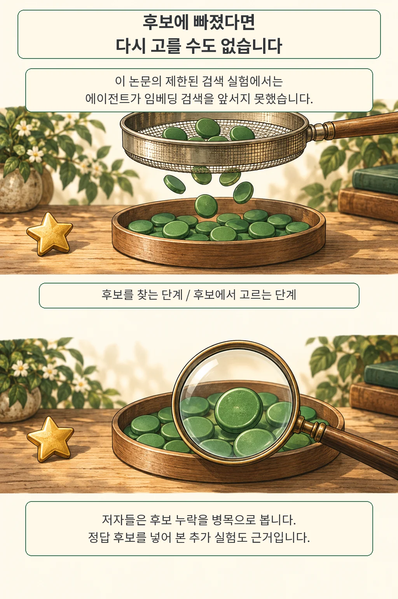

**논문 검색 결과는 쌓이는데, 다음 실험에 가져올 아이디어는 잘 보이지 않습니다.** ScholarCatalyst는 이 간극을 평가합니다. 주제가 비슷한 문헌을 넘어, 연구를 진전시키는 데 도움이 되는 선행 논문을 찾아내는지 묻습니다. 저자들은 특정 검색 실험에서 후보 누락이 중요한 제약이라고 해석합니다.

*글·해설: 다메카솔*

원문 확인·작성: 2026년 10월 4일

Sohyeon Kim 등의 **ScholarCatalyst: A Benchmark for Retrieving Papers That Inspire New Research**는 2026년 10월 1일 제출된 arXiv v1 프리프린트입니다. 이번 글은 원문과 저자 프로젝트, 공식 코드·데이터 공개 상태를 확인한 리뷰입니다. 벤치마크 재실행은 이번 검토 범위 밖입니다.

## 비슷한 논문과 도움이 되는 논문 사이

연구자는 다른 분야의 방법을 가져오거나 기존 연구의 한계에서 새 질문을 얻기도 합니다. 같은 단어가 많이 등장하는지만으로는 이런 관계를 충분히 설명하기 어렵습니다. 저자들은 연구에 도움이 됐거나 도움이 될 수 있었던 선행 논문을 **촉매 논문(catalyst paper)**으로 부릅니다.

판단은 원 논문 저자에게 물었습니다. 자동으로 만든 초기 질문과 후보 목록을 저자가 검토·수정하고, 각 문헌의 도움 여부와 이유를 기록했습니다. 연구자 184명이 연구 207건에 참여했고, 질문은 중심 연구 질문 207개와 세부 분야 질문 687개, 총 894개입니다. 전체 후보 문헌은 190,896편입니다.

시간도 평가 조건입니다. 주 실험에서는 각 원 논문 발표 시점보다 나중에 나온 문헌을 제외하고, 에이전트의 외부 웹 및 원 논문 접근을 막았습니다. 이는 연구 초기의 문헌 환경을 근사하려는 설계입니다. 실제 프로젝트 시작 날짜를 모두 복원한 것과는 차이가 있습니다.

## 검색을 더 반복하면 나아졌을까

이 실험에서는 도구를 여러 번 호출해도 비교 대상 임베딩 검색을 앞서지 못했습니다. 논문 Table 3의 **Recall@20**은 저자가 도움이 된다고 표시한 논문 중 상위 20개 결과에 들어온 비율입니다. 아래 수치는 중심 질문 207개 / 세부 질문 687개 순서입니다.

- Gemini-Embedding-2 검색: **0.38 / 0.46**
- GPT-4.1 도구 호출 에이전트: **0.37 / 0.43**
- o3 기반 deep research 에이전트: **0.33 / 0.38**

추가 추론과 검색 호출만으로 빠진 아이디어를 메우기는 어려웠던 셈입니다. 두 에이전트는 Gemini-Embedding-2를 검색 도구로 사용했습니다. 제목과 초록을 읽는 로컬 문헌 환경이며, 부족한 순위는 관찰한 후보와 검색기 결과로 보충하는 규칙도 적용했습니다. 서로 다른 모델과 실행 예산을 사용했으므로 수치 차이 전체를 한 가지 설계의 효과로 돌릴 수는 없습니다.

저자들은 **후보를 찾는 단계**를 살폈습니다. 추가 실험에서는 질문 100개에 대해 후보 20개 중 일부를 누락된 정답 논문으로 바꾸고, 목록 크기를 유지한 채 다시 순위를 매겼습니다. 더 강한 재정렬 모델이 이 조작에서 더 큰 이득을 보였습니다. 정답을 미리 아는 진단 실험이므로, 그대로 서비스에 적용할 수 있는 개선책은 아닙니다.

그림의 별은 후보에 들어오지 못한 유용한 논문을 뜻합니다. 접시 안에서 아무리 잘 골라도 접시 밖의 별은 선택할 수 없습니다. 동전 수와 크기는 설명을 위한 구성입니다.

## 다메카솔의 해석: 검색 실패를 두 군데에서 살피기

검색 품질을 고칠 때 저는 최종 답변 점수와 함께 **필요한 근거가 후보에 들어왔는지**를 먼저 기록하는 편이 낫다고 봅니다. 후보가 비어 있으면 검색식·문서 분할·색인을 점검하고, 근거가 들어왔는데도 놓치면 재정렬이나 답변 생성 단계를 살펴볼 이유가 생깁니다. 장애 원인을 좁히는 방식입니다.

이 구분은 모델 교체 실험에도 유용합니다. 검색 후보를 고정한 비교와 검색부터 다시 하는 비교를 따로 남겨야, 좋아진 이유가 판단 능력인지 후보 변화인지 설명하기 쉽습니다. [에이전트 평가에서 실행 설정을 함께 기록하는 이유](/posts/agent-evaluation-system-configuration/)와도 이어집니다. 여기까지는 논문에서 얻은 설계 해석이며, 운영 효과를 직접 측정했다는 뜻은 아닙니다.

정답 목록에도 경계가 있습니다. 저자들은 완성된 연구를 돌아보며 판단했고, 2025~2026년 컴퓨터과학·AI 연구의 분야별 비중에도 편차가 있습니다. 검토한 후보 밖에 또 다른 유용한 논문이 남을 수 있습니다. 따라서 이 점수는 연구 성공률이나 모든 분야의 발견 능력으로 넓혀 읽기 어렵습니다.

공식 저장소에는 검색·평가 실행 방법이 있으며 데이터는 공개 상태로 확인했습니다. 제가 확인한 범위는 원문과 공개 자료까지입니다. **아직 아무도 유용하다고 표시하지 않은 논문까지 찾았을 때, 그 가치는 어떻게 평가할까요?** 후보 누락을 다루다 보면 정답을 만드는 방법이라는 다음 질문에 닿습니다.

## 출처

- [ScholarCatalyst 논문 v1](https://arxiv.org/abs/2610.02202v1) — 질문·자료 구성은 §3, 결과는 Table 3, 추가 실험은 §4.4·부록 D.2, 한계는 §5.
- [저자 프로젝트 페이지](https://ohmyksh.github.io/project/ScholarCatalyst/) — 과제 설명과 저자 판단 예시.
- [공식 코드, 확인한 리비전](https://github.com/stanford-iris-lab/ScholarCatalyst/tree/56eafcf878d12fd1036a5578d9630e665329221e) — 검색·평가 실행 경로.
- [공식 데이터, 확인한 리비전](https://huggingface.co/datasets/ScholarCatalyst/ScholarCatalyst/tree/a5a73467500ada90db4e7641e0697a9591e41a4e) — 저자 판단 기반 자료. 데이터 사용에는 해당 저장소의 라이선스 조건이 적용됩니다.

이 글의 본문과 이미지는 생성형 AI로 제작했습니다. 기획과 편집 기준은 다메카솔이 정했습니다.

논문 그림을 복제하지 않고 검색 과정을 별도의 비유로 재구성했습니다.
