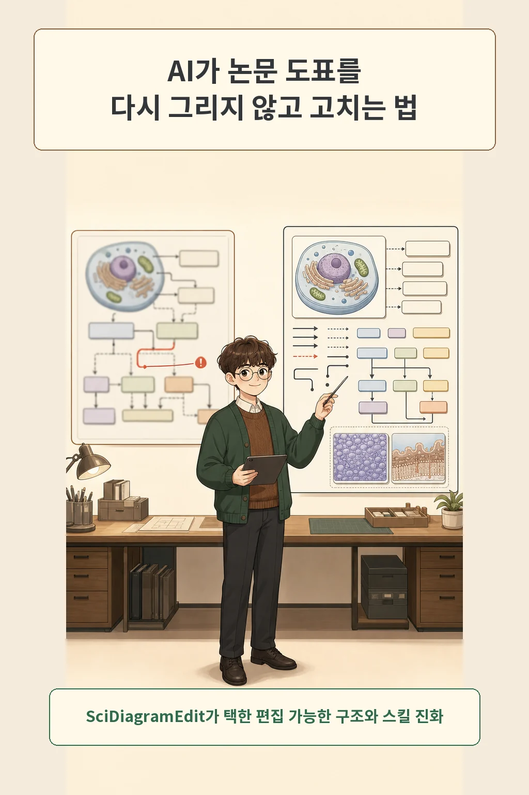
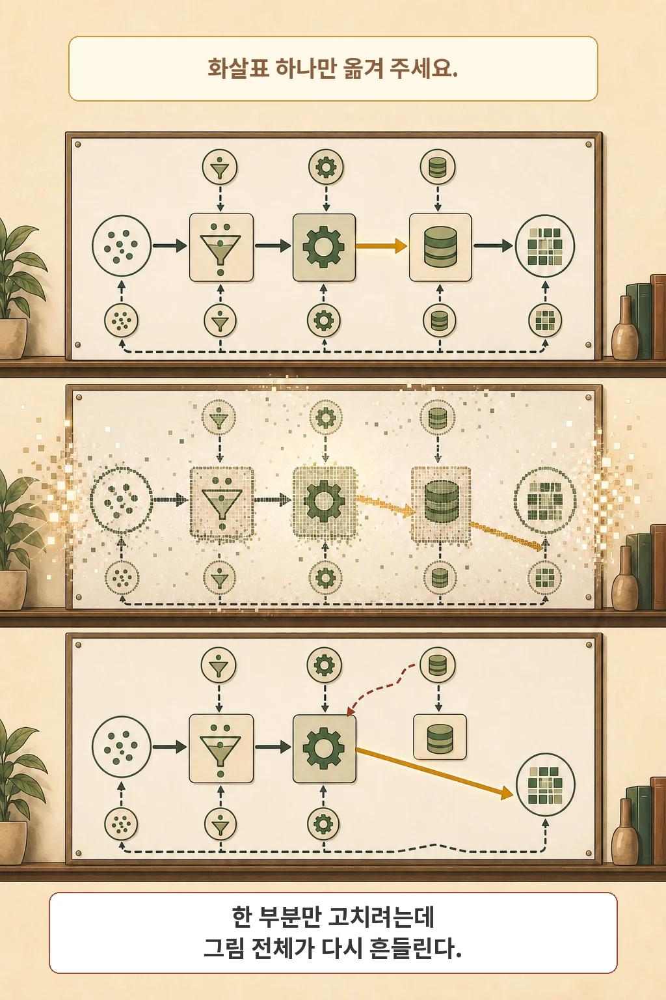
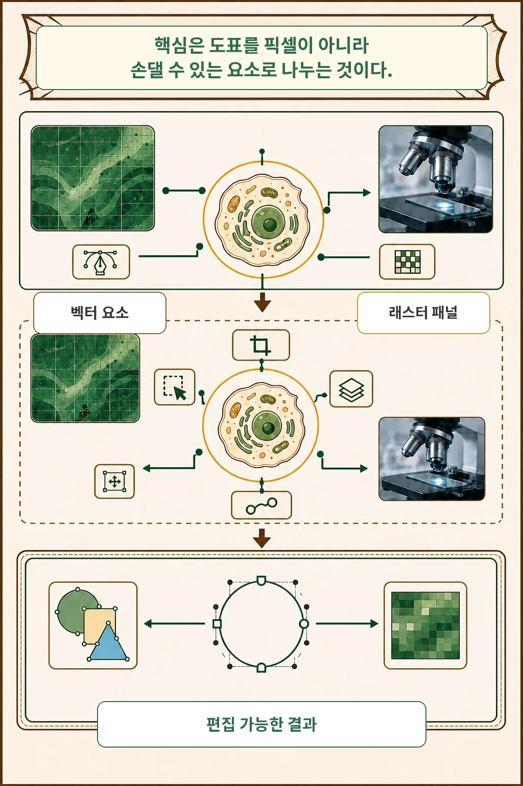
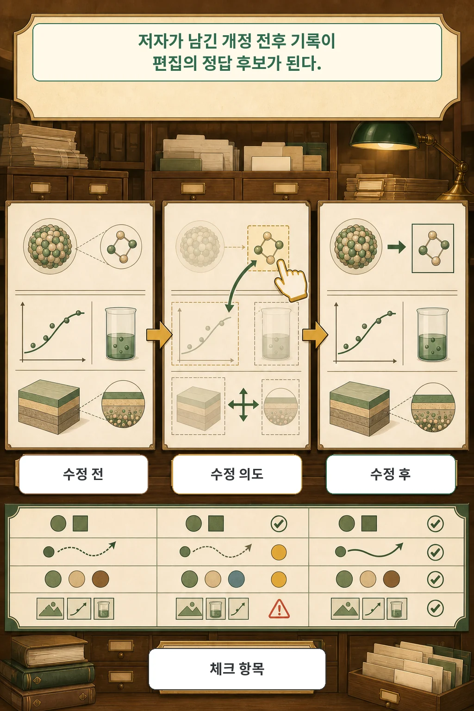
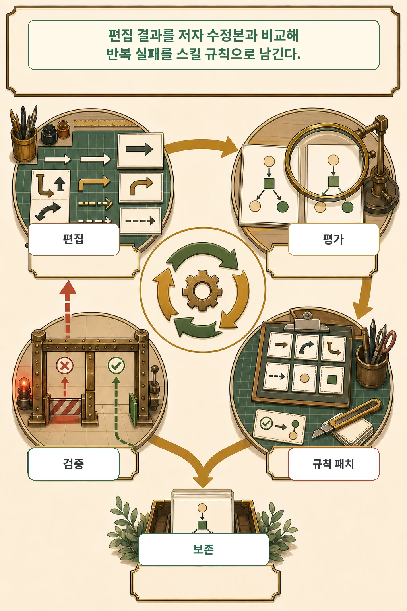
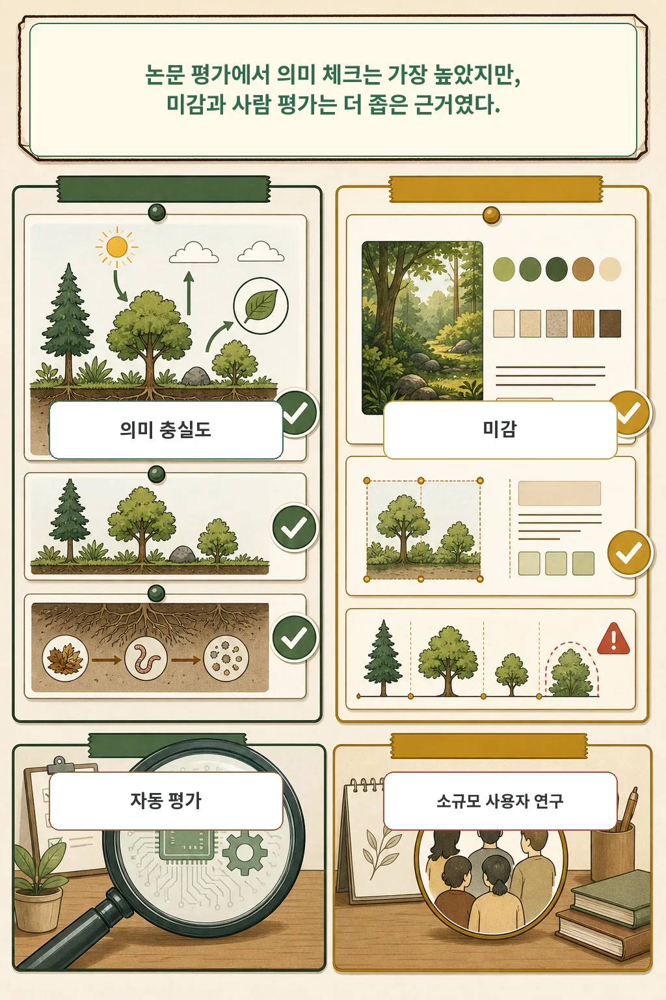
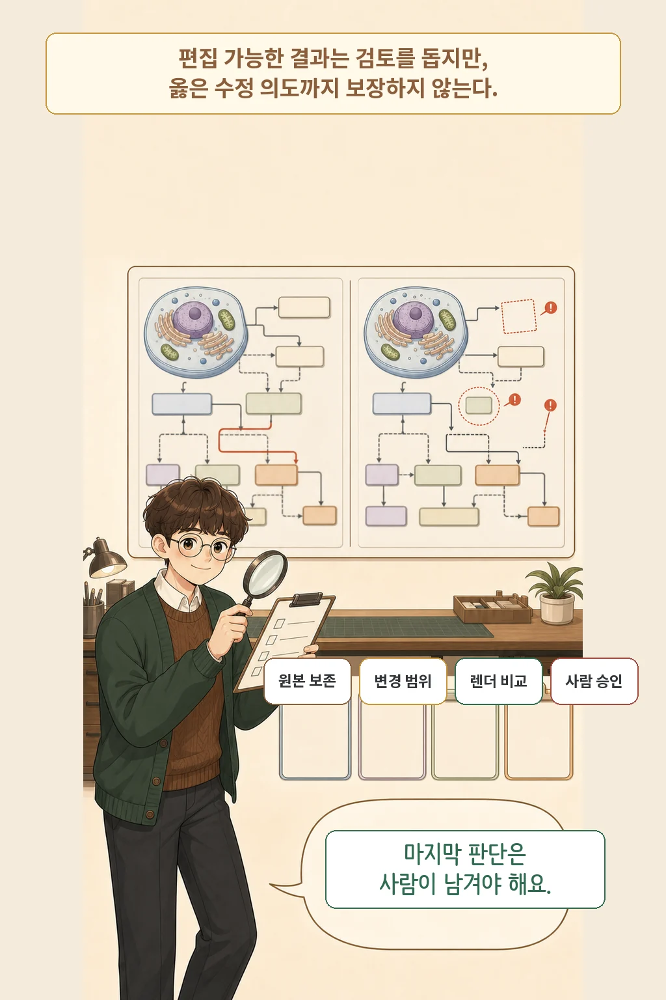

공동 저자가 “화살표 하나만 옮겨 주세요”라고 남겼는데, AI 편집기가 도표 전체를 다시 그려 다른 라벨과 간격까지 바꿔 버린 적이 있나요? SciDiagramEdit 논문은 이 문제를 한 장의 픽셀을 재생성하는 작업이 아니라, 주소를 가진 벡터 요소를 고치고 수정 전후를 검증하는 작업으로 다시 정의합니다.

글·해설: 다메카솔

## 핵심 내용

- 저자들은 실제 arXiv 개정 전후 도표를 편집 감독 신호로 삼았습니다.
- 텍스트·화살표·프레임은 SVG 원시 요소로 열어 두고, 복잡한 사진·플롯은 래스터 패널로 포함했습니다.
- Editor가 수정하고 Judge가 의미와 미감을 평가하면 Coach가 반복 실패를 스킬 파일 패치로 남깁니다.
- 저자 실험에서 의미 체크리스트 결과는 강했지만, 미감·사용자 연구·비용·암묵적 저자 의도에는 분명한 경계가 남았습니다.

도표가 보기 좋은지만 확인하면 수정 범위를 놓치기 쉽습니다. 어느 요소를 바꿨고 무엇이 그대로 남았는지를 먼저 볼 필요가 있습니다.

## 한 부분만 고치는데 왜 전체가 흔들릴까

화살표 하나만 옮겨도 주변 관계가 흔들릴 수 있는 이유는 과학 도표가 텍스트, 연결선, 프레임, 사진, 플롯을 하나의 논리로 묶기 때문입니다. 저자들은 래스터 편집기가 복잡한 도표를 한 번에 다시 렌더링하면 국소 작업도 주변 요소의 위치와 모양을 함께 바꿀 수 있다고 지적합니다.

문제는 래스터 자체가 아니라 주소 가능성입니다. 결과가 평면 픽셀 한 장으로만 남으면 사용자는 “이 연결선만 다시 고치기”보다 그림 전체를 다시 요청하기 쉽습니다. 반대로 수정 대상이 원시 요소로 남으면 변경 범위와 보존 대상을 따로 검사할 수 있습니다.

## 벡터 요소와 래스터 패널을 함께 남긴다

SciDiagramEdit은 모든 것을 억지로 벡터화하지 않습니다. 텍스트·화살표·프레임처럼 자연스럽게 분리되는 부분은 네이티브 SVG 원시 요소로 바꾸고, 사진이나 복잡한 플롯처럼 손실 없는 벡터화가 어려운 영역은 `<image>` 노드 안의 래스터 패널로 유지합니다.

이 혼합 표현 덕분에 Editor는 특정 라벨을 바꾸거나 연결선을 다시 잇는 코드를 작성할 수 있습니다. 사용자는 결과를 다시 SVG 편집기에서 열어 각 요소를 검사하고 함께 고칠 수 있습니다. 다만 편집 가능성이 정확성을 보장하지는 않습니다. 수정이 옳았는지는 별도 검증이 필요합니다.

## 저자 개정 이력이 편집 데이터가 됐다

저자들은 arXiv 버전 사이에서 같은 도표가 어떻게 바뀌었는지 추적했습니다. 이렇게 모은 벤치마크는 실제 개정 전후 364쌍, 23개 주제, 2,628개 원자적 편집 체크 항목으로 구성됩니다. 이름 바꾸기 22.8%와 요소 추가 21.4%가 합쳐 44.2%였고, 표본의 73.6%는 cs.LG·cs.CL·cs.CV·cs.RO에 집중됐습니다.

각 표본에는 자연어 편집 지시와 체크리스트가 붙습니다. 체크리스트는 지정한 요소를 바꿨는지뿐 아니라 주변 연결과 도표의 논리적 일관성을 보존했는지도 묻습니다. 이 때문에 저자 수정본은 단순한 예쁜 참고 그림이 아니라, 편집 결과와 비교할 수 있는 목표가 됩니다.

## 실패를 스킬 규칙으로 남기는 루프

한 개정 사례에서 얻은 교훈을 다음 편집에도 쓰려면 어떻게 해야 할까요? Editor는 현재 스킬 파일을 읽고 SVG를 고치고, Judge는 결과를 저자 수정본과 비교해 의미 체크리스트와 미감 선호를 평가합니다. Coach는 실행 흔적과 실패 이유를 읽어 스킬 파일에 패치를 제안합니다.

후보 패치는 곧바로 정답이 되지 않습니다. 저자들은 데이터를 훈련·검증·테스트 2:1:3으로 나눴고, 검증 점수가 나아진 후보만 상위 frontier에 남겼습니다. 스킬 전체를 매번 다시 쓰지 않고 실패 유형별 규칙을 파일 패치로 축적해, 이전에 얻은 규칙을 잊는 위험도 줄이려 했습니다.

## 의미 충실도는 강했지만 모든 축에서 이긴 것은 아니다

저자들이 보고한 테스트 결과는 지표별로 읽어야 합니다. Ours의 의미 체크리스트 성공률은 0.932로 비교군 중 가장 높았지만, 저자 수정본 대비 지시 이행 win rate는 0.756으로 GPT-Image-2의 0.778보다 낮았습니다.

| 평가 축 | Ours | 비교 기준 | 해석 경계 |
| --- | ---: | ---: | --- |
| 의미 체크리스트 성공률 | 0.932 | GPT-Image-2 0.882 | 체크 항목 기준 최고 |
| 지시 이행 win rate | 0.756 | GPT-Image-2 0.778 | 저자 수정본 대비 블라인드 비교 |
| 미감 IAA / ISTA | 47.93 / 45.58 | 저자 수정본 48.25 / 46.49 | 자동 미감 평가 |
| 미감 win rate | 0.515 | GPT-Image-2 0.637 | 각각 저자 수정본 대비 |

사람 평가도 규모를 함께 봐야 합니다. 저자 기관의 자원자 5명이 테스트 사례 30개에서 총 600회의 강제 선택을 했습니다. Ours는 GPT-Image-2와 비교했을 때 미감 0.54, 의미 0.59의 선택률을 보였지만, 이 표본만으로 넓은 사용자 선호를 일반화하기는 어렵습니다.

## 편집 가능성은 사람 검토를 대신하지 않는다

이 논문은 편집 의도가 자연어 지시에 명시된 경우만 다뤘습니다. 도표의 논증을 여러 단계로 읽거나 주변 논문 문맥에서 저자의 암묵적 의도를 알아내는 문제는 아직 남아 있습니다. 부록 실패 사례에서도 명시한 요청은 반영했지만 오래된 노드를 남기고, 기존 연결을 떨어뜨리고, 새 프레임의 회전을 주변 스타일과 맞추지 못했습니다.

재현 비용도 작지 않습니다. 실험은 영어 arXiv 도표 수백 쌍과 폐쇄형 GPT-5.X·Claude Opus 4.7 API에 의존했고, 저자들은 전체 보고 실험의 표준 요금 기준 API 비용을 약 2만 달러로 적었습니다. 논문은 벤치마크와 진화된 스킬을 공개하겠다고 밝혔지만, 2026년 7월 18일 현재 원문이나 arXiv 메타데이터에서 공식 코드·프로젝트 URL은 확인되지 않았습니다.

다메카솔의 해석은 보수적입니다. 공개 구현과 독립 재현 전에는 이 시스템을 제품 권고로 읽기보다, 원본을 보존하고 변경 범위를 제한하며 렌더링 전후를 비교하고 사람이 승인 기록을 남기는 설계 원칙을 분리해 적용하는 편이 안전합니다.

## 출처

- [SciDiagramEdit: Learning to Edit Scientific Diagrams from Paper Revisions — arXiv 초록](https://arxiv.org/abs/2607.15272)
- [SciDiagramEdit arXiv v1 PDF](https://arxiv.org/pdf/2607.15272)

이 글의 만화 이미지는 AI로 생성했습니다. 논문 그림·표·사례는 복제하지 않고 의미를 보존해 새 도식으로 구성했습니다.

Updated: 2026-07-18
