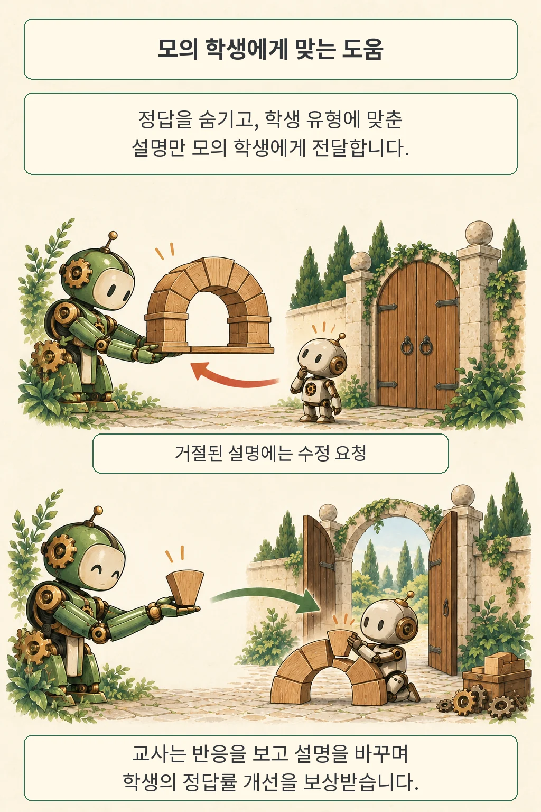

글·해설: 다메카솔

AI 튜터를 훈련할 때는 학생이 어떤 설명에 반응하는지도 보상에 반영할 수 있습니다. Sherpa 연구진은 설명을 받아들이는 조건이 다른 모의 학생을 만들고, 교사 모델이 대화 중에 그 조건을 찾아 설명을 조정하도록 훈련했습니다. 학습 지원 챗봇을 만드는 개발자에게는 **학생 시뮬레이터의 설계가 교사의 행동까지 바꾼다**는 점이 흥미롭습니다.

결과를 읽을 때는 시험지를 먼저 봐야 합니다. 이번 연구에서 모의 학생은 수업 대화 기록과 함께 가르친 문제를 다시 풀었고, 사람 실험에서는 교사들이 두 응답 중 더 잘 가르치는 쪽을 골랐습니다. 실제 학생의 장기 학습 효과는 후속 확인이 필요한 영역입니다.

## Sherpa는 학생의 반응을 어떻게 만들었을까

모의 학생에게 역할 설명만 붙이면 서로 비슷한 도움을 선호할 수 있습니다. 그러면 교사는 상대를 살피는 대신 모든 학생에게 같은 설명을 길게 보내도 좋은 점수를 얻겠죠. 저자들은 이 문제를 줄이려고 **학생 모델에 들어갈 발화를 고르는 두 검사**를 넣었습니다.

첫 검사는 최종 정답을 바로 알려줬는지 봅니다. 중간 계산과 일부 풀이 단계는 허용하면서 마지막 답을 그대로 전달하는 지름길을 막습니다. 두 번째 검사는 해당 학생 유형이 요구하는 설명 방식에 맞는지 확인합니다. 예를 들어 다음 소목표를 짚어 달라는 학생과, 두 풀이를 비교해 달라는 학생에게는 서로 다른 도움이 필요하도록 설정했습니다.

두 검사를 모두 통과한 설명만 학생 모델에 전달됩니다. 거절된 발화는 학생의 대화 기록에 추가되지 않고, 교사에게는 설명을 고쳐 달라는 정해진 피드백이 돌아갑니다. 교사는 학생 유형을 미리 알지 못한 채 이 반응을 보고 다음 발화를 조정합니다.

여기서 학생의 반응 일부는 사람이 만든 규칙입니다. 논문 속 여섯 선호 유형을 현실의 모든 학생을 나누는 분류표로 쓰기보다는, 서로 다른 도움을 요구하는 실험 환경으로 읽는 편이 정확합니다. 만화의 문과 퍼즐은 이 구조를 풀어 그린 비유이며, 실제 실험은 수학 문제를 주고받는 텍스트 대화입니다.

## 보상은 설명 뒤에 풀린 문제에서 나온다

교사는 먼저 자신만 볼 풀이를 준비하고, 학생과 대화한 뒤 학생의 정답률 개선을 보상받습니다. 학생 모델의 가중치는 고정돼 있습니다. 따라서 여기서 개선되는 학생의 수행은 받아들인 대화 기록을 활용한 결과이고, 훈련으로 갱신하는 쪽은 교사 모델입니다.

주 실험의 교사는 Qwen3-8B, 학생은 Qwen3-1.7B입니다. 저자들은 MATH에서 교사가 풀 수 있고 학생이 도움을 받아 나아질 여지가 있는 문제를 골라 훈련 759개와 평가 528개를 구성했습니다. 선호 제약이 없는 유형까지 합친 일곱 유형 중 네 유형을 훈련에 사용하고, 남은 세 유형은 처음 보는 설명 선호에 대응하는지 평가하는 데 썼습니다.

평가 대화는 최대 10턴입니다. 이후 원래 문제를 대화 기록과 함께 제시하고 8회 답을 뽑아 정답률을 추정했습니다. 평가용 설명 검사와 정답 판정에는 Qwen3.8-27B-FP8을 사용했습니다. 모델 이름에 더해 문제 선별, 대화 길이, 판정 모델을 함께 봐야 결과의 범위가 보입니다. 이런 설정의 영향은 앞서 다룬 [AI 에이전트 평가의 구성 조건](/posts/agent-evaluation-system-configuration/)과도 닿아 있습니다.

## 모의 시험과 사람 선호에서 각각 확인한 것

저자들이 보고한 개선은 서로 다른 세 종류의 평가에서 나왔습니다. 같은 숫자처럼 합쳐 읽으면 학습 효과를 과장하기 쉽습니다.

- **모의 학생의 시험 정답률:** Table 1에서 기본 Qwen3-8B 교사에게 배운 뒤의 일곱 유형 평균은 48.6%, 다양한 유형으로 훈련한 Sherpa DP 교사에게 배운 뒤는 69.0%였습니다. 같은 학생 모델에 어떤 교사를 붙이느냐에 따라 차이가 꽤 크게 나타난 셈입니다. 이는 선별한 528문제, 일곱 모의 유형, 문제별 8회 시험 조건의 결과입니다. 문제를 재표집해 계산한 95% 구간은 각각 46.1–51.0%, 66.8–71.2%이며, 실제 학생 집단의 불확실성을 측정한 구간과는 범위가 다릅니다.
- **MathTutorBench의 설명 응답 평가:** 52.5%에서 79.2%로 오른 수치는 응답 생성 네 과제의 평균입니다. 구체적으로는 Ped-RM이라는 평가 모델이 기준 교사 응답보다 해당 모델의 응답을 선호한 비율을 평균낸 값입니다. 학생 시험 정답률로 환산할 수 있는 지표가 아닙니다. 저자들은 문단에서 응답이 잘리지 않도록 중단 규칙을 조정했고, 정오 판별 과제에서는 마지막 명시적 Yes/No를 사용했습니다.
- **사람 교사의 응답 선호:** 고교 교사 96명이 총 960회 판단했습니다. Sherpa 응답 선택은 728건, 기본 모델 선택은 187건, 동률은 45건입니다. 논문의 79.6%는 동률을 뺀 915건 가운데 728건의 비율입니다. 80개 CoMTA 대화에 설명 요청 네 종류를 붙여 만든 320쌍을 각 세 번 평가했으므로, 960명의 학생이 수업을 받은 실험으로 읽어서는 곤란합니다.

좋아진 항목 옆에는 낮아진 항목도 있습니다. Table 2의 오류 위치 찾기 점수는 기본 모델 37.1에서 Sherpa DP 30.3으로, 소크라테스식 질문 점수는 25.3에서 21.9로 내려갔습니다. 앞의 점수는 첫 오류 단계 식별의 micro-F1, 뒤의 점수는 기준 질문과 비교한 BLEU입니다. 설명 응답의 선호 개선과 다른 교습 능력의 변화를 나눠 살펴야 합니다.

## 대화가 끝난 뒤의 학습은 남은 질문

같은 문제를 대화 기록과 함께 푸는 데 성공해도, 시간이 지난 뒤 새 문제를 혼자 풀 수 있는지는 별도로 확인해야 합니다. 시험 조건이 다르기 때문입니다. 이번 모의 시험은 도움을 활용한 과제 수행을 보여 주며, 학생의 장기 기억이나 새 문제로의 전이를 직접 측정한 설계까지 포함하지 않습니다.

사람 평가 역시 잘 구분할 필요가 있습니다. 참가 교사는 대화와 두 개의 짧은 응답을 읽고 어느 쪽이 더 잘 가르치는지 판단했습니다. 저자들도 실제 학생을 돕는 효과와 더 복잡한 선호를 후속 연구로 남겼습니다. 특히 학생이 자신의 요구를 명확히 표현하지 못하는 상황에서는, 이 실험처럼 정해진 피드백을 돌려주는 환경과 차이가 생길 수 있습니다.

자료 접근 범위는 확인했습니다. 2026년 10월 7일 기준 32쪽 원문과 SALT-NLP의 공식 훈련·평가 코드 README가 열렸고, 모델 컬렉션 링크도 제시돼 있습니다. 이 글에서는 모델을 내려받아 훈련하거나 결과를 독립 재현하지 않았습니다.

## 다메카솔의 해석: 학습 챗봇에는 서로 다른 시험이 필요하다

학습 챗봇에서 제가 먼저 나눌 것은 설명 만족도, 도움을 받은 정답률, 이후의 독립 수행입니다. 만족도만 높이면 친절한 답안 제공기로 기울 수 있고, 당장 정답을 맞히는 비율만 높이면 대화에 남은 풀이를 잘 활용하는 행동을 보상하게 됩니다. 제품이 약속한 것이 스스로 푸는 힘이라면, 도움을 제거하고 시간과 문제를 바꾼 평가까지 연결해야 합니다. 이는 이번 논문의 실증 결과를 넘어선 제 설계 판단입니다.

모의 학생의 거절 사유도 로그에서 분리하고 싶습니다. 정답을 노출해 차단됐는지, 지정된 설명 방식과 어긋났는지, 설명을 전달받은 모델이 실제로 틀렸는지를 섞으면 어떤 행동이 보상받았는지 해석하기 어려워집니다. 서비스의 회귀 테스트처럼 각 조건을 고정해 비교하면, 교사 모델이 나아진 부분과 시뮬레이터 규칙에 적응한 부분을 더 선명하게 볼 수 있겠습니다.

Sherpa는 학생 환경을 설계해 교사의 설명을 바꾸는 경로를 보여 줍니다. 이제 남는 질문은 구체적입니다. **설명을 좋게 평가한 학생이, 며칠 뒤 처음 보는 문제 앞에서도 그 도움을 자기 것으로 쓸 수 있을까요?**

## 출처

- Weixian Xu, Yanzhe Zhang, Zora Zhiruo Wang, Changyu Chen, Diyi Yang, [Sherpa: Teaching LLMs to Teach Adaptively, arXiv:2610.08778v1](https://arxiv.org/abs/2610.08778v1). 2026년 10월 6일 제출된 프리프린트입니다.
- [원문 PDF](https://arxiv.org/pdf/2610.08778v1): §2의 훈련·검사 구조, Table 1–3, 부록 B.1–B.4의 평가 조건을 대조했습니다.
- [저자 공식 코드와 모델 안내](https://github.com/SALT-NLP/Sherpa).

발행·자료 확인일: 2026년 10월 7일.

이 글의 본문과 이미지는 생성형 AI로 제작했습니다. 기획과 편집 기준은 다메카솔이 정했습니다.
