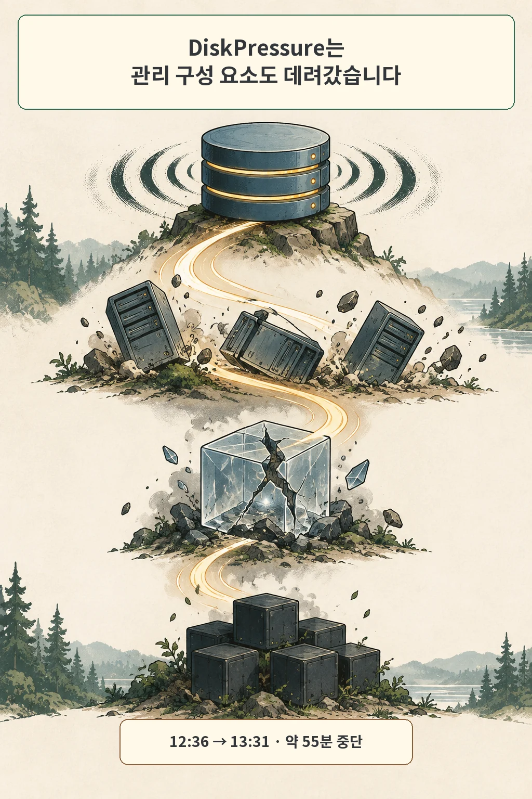
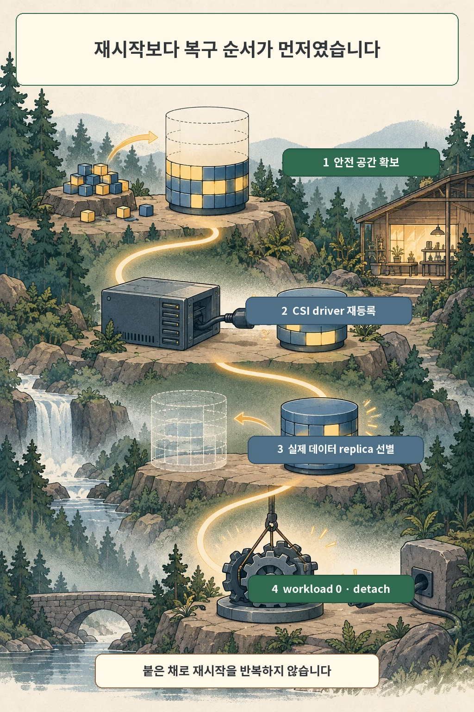
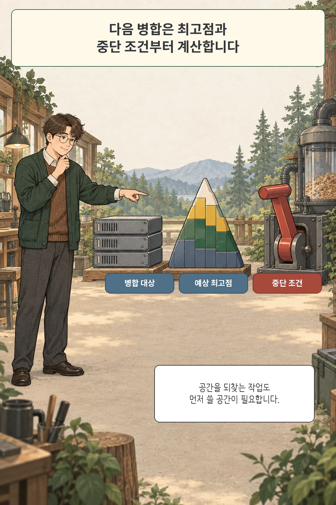

글·해설: 다메카솔

2026년 7월 20일, 여유 공간이 71GB 남은 노드에서 109.7GB와 70.7GB로 기록된 스냅숏 두 개의 정리를 시작했습니다. 약 180GB를 지우는 작업이니 공간이 늘어날 거라고 봤습니다. 하지만 병합 중 사용량은 오히려 약 45GB 늘었고 노드는 95%에 도달했습니다.

> 이 글은 2026년 7월 20일의 개인 인프라 변경 기록과 운영 노트를 2026년 10월 3일 Longhorn 1.13·Kubernetes 공식 문서와 다시 대조해 썼습니다. 용량은 당시 기록의 반올림 관측값이며 정확한 Longhorn 패치 버전과 kubelet eviction 설정은 보존되지 않았습니다. 실제 볼륨 이름, 사설 주소, 호스트명과 네임스페이스는 공개용 역할명으로 바꿨습니다.

## 지우면 줄어든다는 계산에는 중간 상태가 없었습니다

제가 처음 한 계산은 단순했습니다. 큰 스냅숏 두 개를 지우면 그만큼의 공간이 돌아온다는 계산이었습니다. 정리가 끝난 뒤의 상태만 봤고, 기존 레이어와 병합 결과가 한동안 함께 존재하는 작업 중 최고점은 넣지 않았습니다.

Longhorn 공식 문서는 snapshot 삭제와 purge가 단순한 메타데이터 삭제가 아니라고 설명합니다. snapshot 파일을 coalesce하는 동안 추가 공간이 필요하며, 상황에 따라 nominal volume size만큼의 여유가 필요할 수 있습니다. 고정 비율을 보장하는 설명이 아니라, 작업 전 임시 공간을 별도로 잡으라는 경고입니다.

당시 기록은 작업 중 약 45GB가 더 사용됐다고 남겼습니다. 이 숫자를 모든 Longhorn 환경의 병합 비율로 쓰면 안 됩니다. 데이터 배치, sparse file, replica 수, 엔진과 버전에 따라 최고점은 달라질 수 있습니다. 다만 이 사건에서는 71GB라는 시작 여유가 충분하지 않았다는 결론은 분명합니다.

## DiskPressure는 정리 작업만 멈추지 않았습니다

12시 37분, 노드는 DiskPressure 상태가 됐습니다. 변경 기록에는 Longhorn manager, instance manager, CSI plugin, engine image Pod가 퇴거 대상에 포함됐다고 남아 있습니다. 병합을 수행하고 볼륨을 붙이는 관리 구성 요소까지 함께 흔들렸습니다.

Kubernetes kubelet은 nodefs나 imagefs의 여유 공간·inode 신호가 임계값을 넘으면 먼저 노드 자원을 회수하고, 부족하면 Pod를 퇴거합니다. 공식 문서에는 기본 hard threshold가 있지만 실제 값은 kubelet 설정에 따라 달라집니다. 당시 정확한 설정이 남아 있지 않으므로 “사용률 95%가 Kubernetes의 고정 임계값”이라고 쓰지는 않습니다.

병합 중이던 볼륨은 faulted 상태가 됐고, 그 볼륨을 쓰던 오브젝트 스토리지는 12시 36분부터 13시 31분까지 약 55분 중단됐습니다. 백업과 아카이브 작업도 영향을 받았습니다. 한 노드의 용량 문제가 스토리지 제어면과 애플리케이션으로 번진 순서는 다음과 같았습니다.

1. snapshot merge가 임시 공간을 사용했습니다.
2. 노드가 DiskPressure에 들어갔습니다.
3. Longhorn 핵심 Pod가 퇴거됐습니다.
4. 병합 중 볼륨이 faulted가 됐습니다.
5. 오브젝트 스토리지 서비스가 중단됐습니다.

각 로그를 따로 보면 우연히 동시에 난 장애처럼 보입니다. 시작 시각, 노드 압박, Pod eviction, volume 상태, 서비스 실패를 한 시간축에 놓고서야 고장 사슬이 보였습니다.

## 공간을 만들었다고 바로 워크로드를 올리지 않았습니다

복구의 첫 단계는 안전한 여유를 만드는 일이었습니다. 죽은 Pod와 중복된 데이터를 정리해 약 10GB를 확보했고, 비상 조치로 ext4 reserved blocks를 5%에서 1%로 낮춰 약 19GB를 더 확보했습니다. reserved blocks 조정은 이 사건에서 root filesystem의 숨통을 틔운 응급 조치였지, 평상시 용량 계획을 대신하는 처방은 아닙니다.

여유가 생긴 뒤에도 바로 애플리케이션을 다시 올리지 않았습니다. `CSINode <node> does not contain driver driver.longhorn.io` 지문이 남아 있었기 때문입니다. CSINode의 driver 항목은 CSI node-driver registrar와 kubelet 등록 경로가 정상이어야 채워집니다. 관련 Longhorn manager와 CSI Pod를 다시 세우고 driver 등록부터 확인했습니다.

볼륨에는 실제 데이터가 없는 고스트 replica와 데이터가 남은 replica가 함께 보였습니다. 기록상 고스트 replica를 제거하고, 실제 데이터가 있던 replica의 `spec.failedAt`을 비운 뒤 salvage했습니다. 모든 replica가 faulted일 때의 salvage는 아무 replica나 되살리는 버튼이 아닙니다. 경로와 데이터가 남은 replica를 확인한 뒤 복구 후보로 선택해야 합니다.

마지막으로 workload를 0으로 내려 volume detach를 먼저 완결했습니다. 붙은 채로 재시작을 반복하면 attach 상태와 복구 작업이 다시 충돌할 수 있었습니다. detach를 확인한 뒤 workload를 다시 올렸고 파일시스템은 정상으로 돌아왔습니다.

## 다음 병합에는 최고점과 중단 조건을 적습니다

이후 이 홈랩에서는 큰 병합 전에 `여유 공간 ≥ 병합 대상 + 20%`를 로컬 stop rule로 두었습니다. 이 값은 2026년 7월 사건 뒤 정한 보수적 운영 휴리스틱입니다. Longhorn 공식 최소 비율이 아니며 다른 버전과 데이터 배치에 그대로 적용할 수 없습니다.

실제 preflight는 비율 하나보다 더 구체적입니다.

- 작은 cleanup으로 작업 중 증가량을 먼저 측정합니다.
- nodefs와 imagefs 중 어떤 신호가 압박을 만드는지 확인합니다.
- active backup, rebuild, expansion이 겹치지 않게 합니다.
- 시작 여유, 작업 중 최고점, 중단 임계값을 같은 시계열에 기록합니다.
- 최고점 여유가 부족하면 병합을 멈추고 디스크를 늘리거나 새 볼륨으로 파일시스템 수준 이사를 선택합니다.

공간을 되찾는 작업도 먼저 쓸 공간이 필요합니다. 삭제 뒤 숫자만 계산하지 않고, 작업 중 최고점이 어디까지 오를지와 어느 지점에서 멈출지를 함께 정해야 합니다.

## 함께 읽을 글

- [직접 만들지 않은 스냅숏이 쌓였습니다: Longhorn actualSize를 읽는 법](/posts/orphaned-snapshots-actual-size/): 이번 장애 직전, actualSize와 system snapshot을 어떻게 구분했는지 설명합니다.
- [애플리케이션 복제와 스토리지 복제는 무엇이 다른가](/posts/application-storage-replication-layers/): 볼륨과 애플리케이션의 복구 계층을 분리합니다.

## 출처

- 개인 인프라 변경 기록, 2026-07-20
- 개인 운영 노트 — Longhorn 병합과 DiskPressure
- [Longhorn 1.13: Volume Size](https://longhorn.io/docs/1.13.0/nodes-and-volumes/volumes/volume-size/)
- [Longhorn: Space Consumption Guidelines](https://longhorn.io/kb/space-consumption-guideline/)
- [Kubernetes: Node-pressure Eviction](https://kubernetes.io/docs/concepts/scheduling-eviction/node-pressure-eviction/)
- [Kubernetes API: CSINode v1](https://kubernetes.io/docs/reference/kubernetes-api/storage-resources/csi-node-v1/)
- [Longhorn 1.13: Recovering Volumes after Unexpected Detachment](https://longhorn.io/docs/1.13.0/high-availability/recover-volume/)

공식 문서는 2026년 10월 3일 다시 확인했습니다. 검증 환경은 2026년 7월의 k3s 3노드 홈랩과 Longhorn입니다. 다른 kubelet 설정과 스토리지 버전에서는 임계값과 복구 동작이 다를 수 있습니다.

이 글의 본문과 이미지는 생성형 AI로 제작했습니다. 기획과 편집 기준은 다메카솔이 정했습니다. 만화 이미지는 텍스트 없는 원화에 결정적 레터링을 합성해 만들었습니다. 공식 로고·UI·문서 도표 등 외부 이미지 자산은 사용하지 않았습니다.
