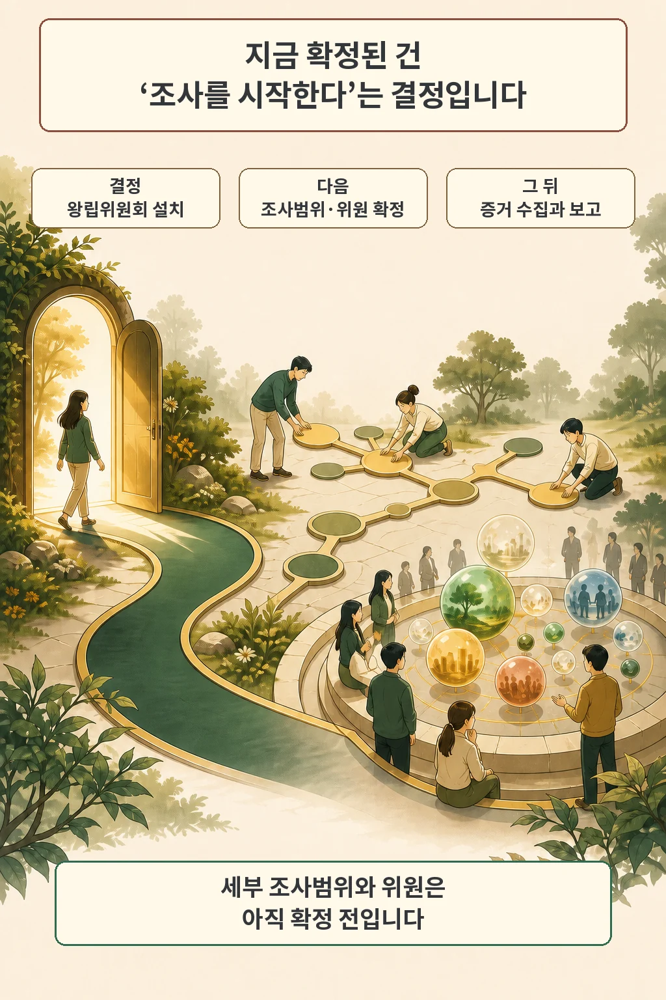
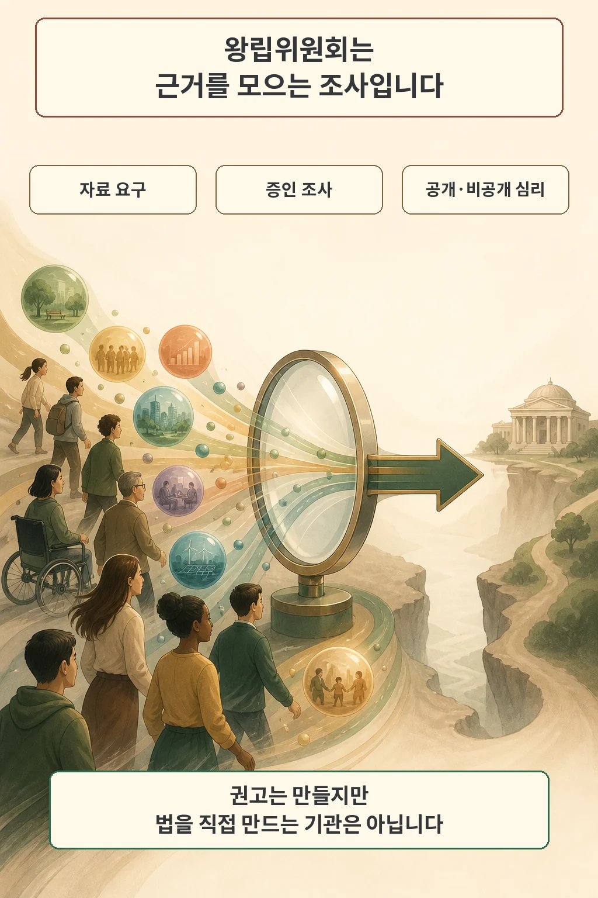
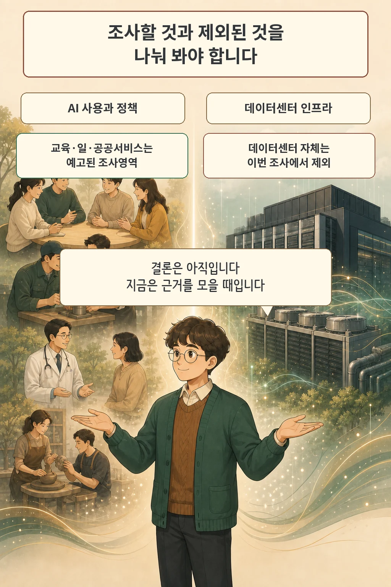

왕립위원회라는 말은 곧 새 규제가 시행된다는 인상을 줍니다. 이번 발표는 그보다 앞 단계입니다. 남호주 정부는 2026년 8월 10일 AI 기술의 사용과 관련 정책을 조사할 왕립위원회를 열겠다고 밝혔습니다.

글·해설: 다메카솔

## 남호주가 결정한 것은 조사입니다

8월 10일 발표로 확정된 것은 AI 왕립위원회를 설치한다는 결정입니다. 남호주 총리 Peter Malinauskas는 위원회가 2026년 10월 1일 시작해 2027년 7월 1일까지 정부에 보고서를 낼 것으로 예상한다고 말했습니다.

세부 조사범위와 위원은 다음 단계에서 정합니다. 정부는 앞으로 4~6주 안에 조사범위를 발표하고, 국제 검색을 거쳐 세 명의 위원을 선임하겠다고 밝혔습니다. 발표 시점의 확정 범위는 설치 결정까지입니다.

## 왕립위원회는 강한 조사 수단을 가집니다

남호주 법은 왕립위원회에 일반 자문기구보다 강한 조사 수단을 줍니다. `Royal Commissions Act 1917`에 따라 위원회는 공개 또는 비공개로 증거를 듣고, 증인의 출석과 자료 제출을 요구할 수 있습니다. 정해진 조사범위 안에서 사실관계와 이해관계자의 입장을 깊게 확인하는 절차입니다.

그 결과는 정부에 내는 보고서와 권고입니다. 권고가 공개됐다고 법이나 규제가 자동으로 생기지는 않습니다. 정부가 정책을 선택하고 의회가 필요한 법안을 다루는 별도 과정이 남습니다.

## 조사 대상과 제외 대상을 나눠야 합니다

정부가 예고한 조사영역은 AI가 쓰이는 사회 현장입니다. 교육과 기술 역량, 일자리, 보건을 포함한 공공서비스, 창작 산업, 전력망에 미치는 영향을 살피겠다고 했습니다. 기업, 노동조합, 산업단체, 기술회사와 연구자도 참여 대상으로 거론했습니다.

데이터센터 인프라 자체는 범위가 다릅니다. Malinauskas 총리는 이번 위원회가 AI를 떠받치는 시설보다 AI의 사용을 조사한다고 설명했습니다. 따라서 데이터센터의 물·전력·입지 규제까지 이번 발표로 결정됐다고 넓혀 읽을 근거는 없습니다.

## 현재 정책과 앞으로의 결론도 다릅니다

남호주에는 이미 정부용 AI 윤리 정책과 LLM 사용 지침이 있습니다. 반면 Office for AI는 책임 있는 AI 사용 정책을 현재 개발 중이라고 밝히고 있습니다. 기존 정책, 개발 중인 정책, 왕립위원회의 미래 권고는 상태가 서로 다릅니다.

저는 이번 발표를 AI 규제의 결론이라고 요약하지 않겠습니다. 중요한 변화는 정부가 교육·일·공공서비스의 영향에 대해 강한 조사 권한을 가진 절차를 열었다는 점입니다. 앞으로 확인할 것은 최종 조사범위, 선임된 위원, 공개 청문과 제출 자료, 그리고 권고 뒤 실제 정책 선택입니다.

## 출처

- [ABC News — Royal commission into artificial intelligence launched in South Australia](https://www.abc.net.au/news/2026-08-10/artificial-intelligence-royal-commission-announced-in-sa/107017502)
- [South Australian Legislation — Royal Commissions Act 1917](https://www.legislation.sa.gov.au/lz?path=%2Fc%2Fa%2Froyal+commissions+act+1917)
- [Office for AI — Policies, standards, and guidelines](https://ai.sa.gov.au/ai-knowledge-centre/policies%2C-standards-and-guidelines)

이 글의 본문과 이미지는 생성형 AI로 제작했습니다. 기획과 편집 기준은 다메카솔이 정했습니다.
