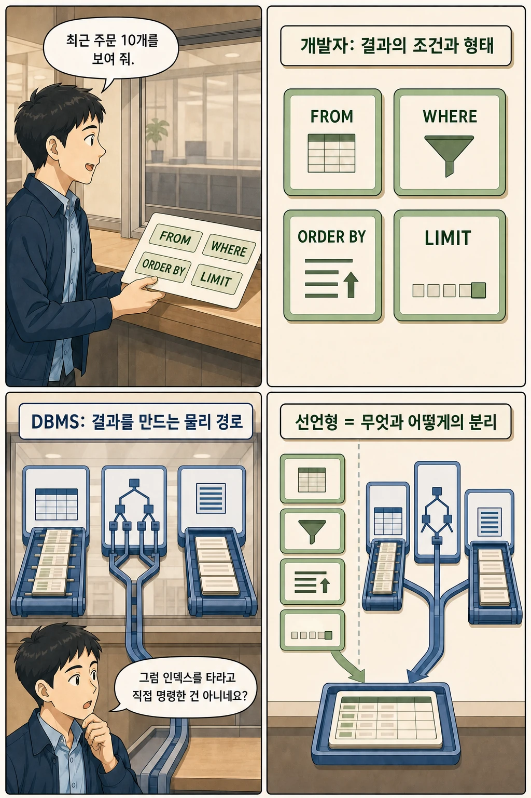

글·해설: 다메카솔

분명히 테이블에 인덱스를 걸어두었는데 쿼리 속도는 여전히 느리고, `EXPLAIN`으로 실행 계획을 뜯어보니 인덱스를 완전히 무시한 채 수천만 건의 테이블 전체를 풀 스캔(Seq Scan)하고 있던 경험이 있으신가요?

"내가 인덱스를 만들어 줬는데 DB 엔진이 왜 내 명령을 무시하지?"라고 생각하기 쉽습니다. 하지만 **SQL은 애초에 절차적 지시(Imperative Command)를 내리는 언어가 아닙니다.** 

SQL이 **선언형 언어(Declarative Language)**라는 것은, **개발자는 '어떤 데이터(What)'가 필요한지만 선언하고, 그 데이터를 실제로 '어떻게(How)' 가져올지는 데이터베이스의 옵티마이저(Optimizer)가 비용 기반으로 결정한다는 뜻**입니다.

이번 글에서는 옵티마이저가 실행 계획을 선택하는 메커니즘과, 인덱스가 무시되는 이유, 그리고 필터와 정렬을 동시에 해결하는 복합 인덱스 설계법을 살펴보겠습니다.

## 핵심 요약

- SQL 작성자는 필요한 데이터의 조건(`WHERE`), 정렬(`ORDER BY`), 개수(`LIMIT`) 등 **논리적 요구사항(What)**을 기술합니다.
- DBMS 옵티마이저는 데이터 통계와 카디널리티를 계산하여 풀 스캔, 인덱스 스캔, 해시 조인 등 **물리적 실행 계획(How)**을 스스로 선택합니다.
- 인덱스가 존재하더라도 조회 조건에 매칭되는 데이터 비율이 전체의 일정 수준 이상이면, 랜덤 I/O 비용 때문에 옵티마이저는 풀 테이블 스캔을 선택합니다.
- 선언형 언어라고 해서 성능이 자동으로 보장되는 것은 아닙니다. 쿼리 패턴에 맞는 복합 인덱스를 설계하고 `EXPLAIN`을 통해 실제 실행 계획을 검증하는 엔지니어링이 필수적입니다.

## 개발자가 선언하는 것 vs DBMS가 결정하는 것


우리가 평소에 작성하는 전형적인 페이징 쿼리를 예로 들어 보겠습니다:

```sql
SELECT *
FROM orders
WHERE member_id = 10
ORDER BY created_at DESC
LIMIT 10;
```



이 짧은 쿼리문 안에서 개발자가 명시한 것은 오직 '결과의 형태'뿐입니다:
- `FROM orders`: 주문 테이블에서 데이터를 가져온다.
- `WHERE member_id = 10`: 10번 회원의 주문만 필터링한다.
- `ORDER BY created_at DESC`: 최신순으로 정렬한다.
- `LIMIT 10`: 상위 10개만 반환한다.

여기에는 "디스크의 몇 번 블록부터 읽어라", "B-tree 인덱스 루트 노드부터 탐색해라" 같은 구체적인 물리 실행 절차가 일체 없습니다. 자바나 C++처럼 절차를 하나하나 명령하는 것이 아니라, **"내가 원하는 최종 데이터셋은 이것이다"라고 목적지만 선언**한 것입니다.

## 옵티마이저가 실행 계획을 세우는 내부 과정


SQL이 DBMS에 전달되면 옵티마이저는 다음 4단계를 거쳐 가장 저렴한(Cost-efficient) 실행 계획을 수립합니다:

```text
SQL 입력 ➡️ 구문 파싱(Parse) ➡️ 쿼리 재작성(Rewrite) ➡️ 비용 최적화(Optimize) ➡️ 실행(Execute)
```

옵티마이저는 내부적으로 수많은 경로 후보군을 시뮬레이션합니다:
- 테이블 전체를 순차적으로 긁어오는 비용 (Sequential Scan)
- 인덱스를 탄 뒤 실제 테이블 블록을 찾아가는 랜덤 I/O 비용 (Index Scan)
- 메모리에서 정렬을 수행하는 비용 (Sort Node)
- `LIMIT` 조건을 만나 중간에 스캔을 멈출 수 있는 조기 종료 가능성

옵티마이저는 수집된 **테이블 통계 정보(행 수, 컬럼별 고유값 분포, 카디널리티)**를 바탕으로 각 경로의 예상 I/O 비용을 계산하고, 가장 총비용이 낮은 1개의 실행 계획을 선택합니다.

## 인덱스가 있는데도 왜 풀 테이블 스캔을 탈까?


가장 흔한 오해 중 하나는 "인덱스를 걸었으니 당연히 인덱스를 타야 한다"는 생각입니다.

예를 들어 주문 상태가 결제 완료(`status = 'PAID'`)인 데이터를 조회한다고 해봅시다:

```sql
SELECT *
FROM orders
WHERE status = 'PAID';
```

- 만약 전체 100만 건 중 `PAID` 데이터가 **100건(0.01%)**에 불과하다면?  
  👉 인덱스를 통해 100건의 위치만 콕 집어 디스크를 읽는 **인덱스 스캔(Index Scan)**이 압도적으로 빠릅니다.
- 만약 전체 100만 건 중 `PAID` 데이터가 **90만 건(90%)**이라면?  
  👉 인덱스를 읽고 다시 테이블 본문 블록을 90만 번 찾아가는 **랜덤 액세스(Random I/O)** 오버헤드가 디스크를 처음부터 끝까지 한 번에 연속으로 읽는 **순차 I/O(Sequential Scan)**보다 훨씬 비쌉니다.

따라서 옵티마이저는 인덱스가 분명히 존재함에도 불구하고 **풀 테이블 스캔을 선택하는 것이 더 똑똑한 판단**이라고 결정하는 것입니다. 즉, 인덱스는 "무조건적인 실행 명령"이 아니라 "옵티마이저가 검토할 수 있는 여러 선택지 중 하나"일 뿐입니다.

## 복합 인덱스로 필터와 정렬을 한 방에 해결하기


쿼리 구조와 인덱스의 컬럼 순서가 완벽히 맞아떨어지면, 불필요한 디스크 I/O와 정렬(Sort) 연산을 획기적으로 줄일 수 있습니다.

앞서 살펴본 최근 주문 10개 조회 쿼리에 대해 다음 복합 인덱스를 구성한다고 가정해 보겠습니다:

```sql
CREATE INDEX idx_orders_member_created
ON orders (member_id, created_at DESC);
```

이 인덱스를 생성하면 3가지 거대한 최적화가 동시에 일어납니다:
1. **필터링 최소화**: 선두 컬럼인 `member_id = 10`에 해당하는 B-tree 구간으로 단번에 점프합니다.
2. **별도 Sort 제거**: 이미 B-tree 리프 노드에 `created_at DESC` 순서로 정렬되어 있으므로, 쿼리 엔진이 메모리나 디스크에 임시 공간을 잡고 `Sort` 연산을 돌릴 필요가 없습니다.
3. **조기 종료 (Early Exit)**: 인덱스를 위에서부터 딱 10개만 읽고 즉시 쿼리 실행을 멈춥니다(`LIMIT 10`).

## EXPLAIN으로 실행 계획 뜯어보기

PostgreSQL이나 MySQL에서는 `EXPLAIN` 명령어를 통해 옵티마이저가 선택한 실행 계획을 육안으로 확인할 수 있습니다:

```sql
EXPLAIN
SELECT *
FROM orders
WHERE member_id = 10
ORDER BY created_at DESC
LIMIT 10;
```

복합 인덱스가 의도대로 잘 동작한다면 다음과 같은 실행 계획이 출력됩니다:

```text
Limit  (cost=0.43..12.10 rows=10 width=64)
  ->  Index Scan using idx_orders_member_created on orders
        (cost=0.43..116.90 rows=100 width=64)
        Index Cond: (member_id = 10)
```

여기서 주목해야 할 핵심 포인트는 두 가지입니다:
- **`Sort` 노드가 사라졌는가?**: 인덱스의 정렬 순서를 활용해 불필요한 CPU 정렬 연산을 건너뛰었음을 뜻합니다.
- **`Limit`이 최상단에 걸려 있는가?**: 10건을 채우는 즉시 스캔을 중단하여 I/O를 최소화했음을 뜻합니다.

## 다메카솔의 해석: 선언형 추상화 뒤에 숨은 엔지니어링의 본질

SQL의 선언형 모델은 개발자를 복잡한 디스크 블록 관리와 알고리즘 구현의 고통에서 해방시켜 주었습니다. 하지만 **추상화가 잘 되어 있다고 해서 그 아래의 물리적 비용까지 사라지는 것은 아닙니다.**

시니어 백엔드 개발자로서 쿼리 성능을 다룰 때 다음 3가지를 명심해야 합니다:

1. **카디널리티와 데이터 분포 고려**: 단순히 `WHERE` 절에 들어간다고 인덱스를 다 거는 것이 아니라, 고유값 비율(선택도)이 높은 컬럼을 복합 인덱스의 선두에 배치해야 합니다.
2. **테이블 통계(Statistics)의 최신성 관리**: 대규모 데이터 이관이나 야간 배치 작업 직후에는 옵티마이저의 카디널리티 추정이 빗나가 엉뚱한 풀 스캔을 탈 수 있습니다. 주기적인 `ANALYZE`로 통계를 최신화해야 합니다.
3. **프로덕션 쿼리는 반드시 실행 계획으로 검증**: 로컬 환경에서 10건짜리 더미 데이터로 테스트하면 무조건 풀 스캔이 뜹니다. 데이터가 수백만 건 이상 쌓인 스테이징 환경에서 `EXPLAIN ANALYZE`로 실제 I/O 비용과 병목 지점을 확인해야 합니다.

## 함께 읽을 DB 핵심 원리

- [데이터베이스 정규화와 3대 이상 현상](/posts/database-normalization-anomalies/): 올바른 엔티티 분리와 데이터 무결성
- [트랜잭션 ACID와 Commit/Rollback의 내부 동작](/posts/transaction-acid-commit-rollback/): 동시성 제어와 WAL 로그

## 출처

- [PostgreSQL Documentation — Using EXPLAIN](https://www.postgresql.org/docs/current/using-explain.html)
- [PostgreSQL Documentation — Indexes and ORDER BY](https://www.postgresql.org/docs/current/indexes-ordering.html)
- [PostgreSQL Documentation — Multicolumn Indexes](https://www.postgresql.org/docs/current/indexes-multicolumn.html)

이 글의 본문과 이미지는 생성형 AI로 제작했습니다. 기획과 편집 기준은 다메카솔이 정했습니다.
