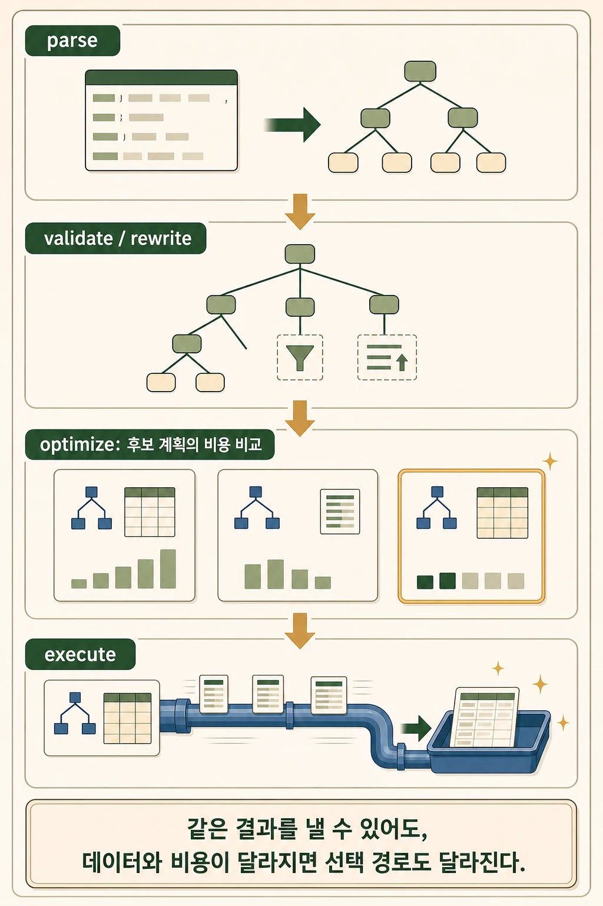
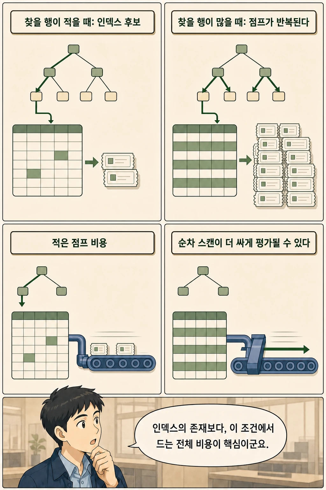
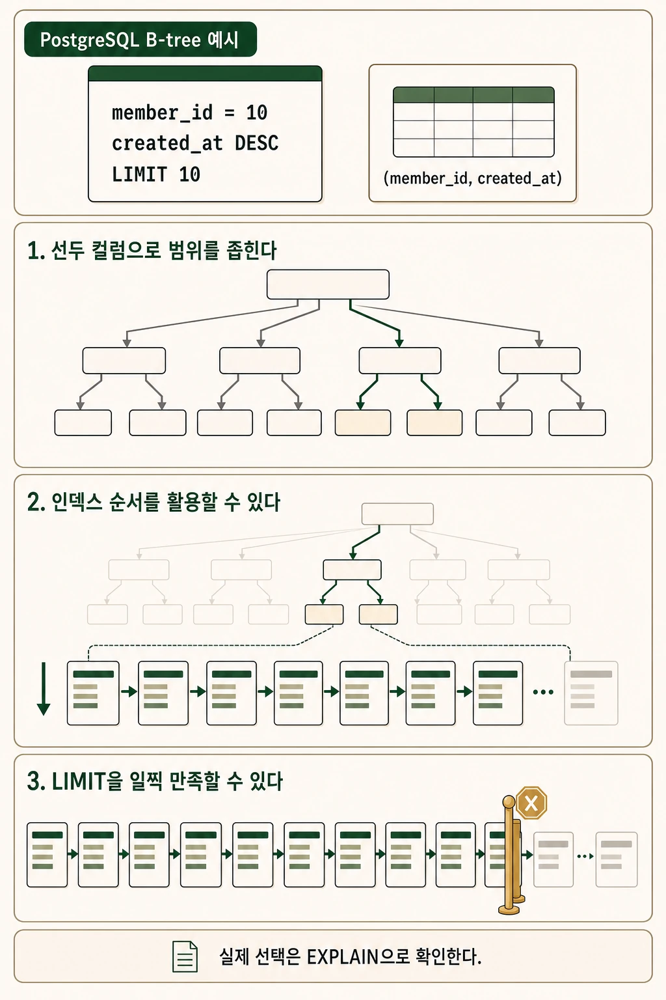
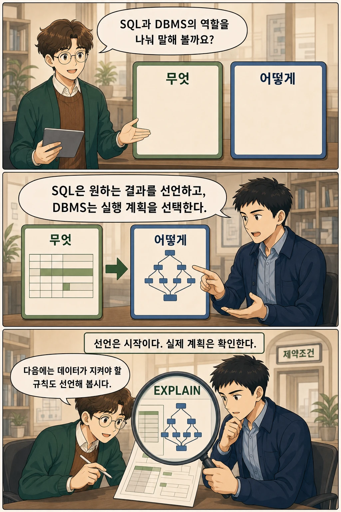

분명 인덱스를 만들었는데 쿼리는 여전히 느립니다. 실행 계획을 열어 보면 인덱스는 무시된 채 테이블 전체를 읽고 있습니다. 데이터베이스가 내 지시를 어긴 걸까요? 사실 SQL은 처음부터 "지시"가 아니었습니다.

SQL이 선언형 언어라는 말은 **개발자가 원하는 결과의 조건과 형태를 지정하고, 그 결과를 만드는 세부 실행 절차는 DBMS가 선택한다**는 뜻입니다. `WHERE`, `ORDER BY`, `LIMIT`으로 무엇을 얻을지는 표현하지만, 테이블을 어떤 순서로 읽고 어떤 인덱스를 사용할지까지 절차형 코드처럼 나열하지는 않습니다.

이 글은 카솔과 함께 개발자가 결정하는 것과 옵티마이저가 결정하는 것을 나누고, 인덱스가 무시되는 순간, 잘 맞는 복합 인덱스의 효과, `EXPLAIN`으로 실제 계획을 확인하는 방법까지 다룹니다.

## 핵심 내용

- SQL 작성자는 테이블, 컬럼, 필터, 정렬, 반환 개수 등 **논리적 결과**를 표현합니다.
- DBMS는 순차 스캔, 인덱스 스캔, 정렬, 조인 순서 등 **물리적 실행 계획**을 선택합니다.
- 인덱스가 존재해도 예상 결과 행이 많거나 row lookup 비용이 크면 순차 스캔이 선택될 수 있습니다.
- 쿼리와 잘 맞는 복합 인덱스는 필터와 정렬을 함께 돕고 `LIMIT`을 일찍 만족시킬 수 있습니다.
- 선언형이라는 사실은 성능 자동 보장을 뜻하지 않습니다. 실제 계획은 `EXPLAIN`과 실행 통계로 확인해야 합니다.

SQL은 목적지를 적은 주문서에 가깝습니다. 어떤 길로 목적지에 도착할지는 DBMS가 현재 조건을 보고 판단합니다.


## SQL에서 개발자가 선언하는 것


개발자가 작성한 하나의 SQL은 논리적 요구와 물리 실행 계획이라는 두 층으로 나누어 볼 수 있습니다. 다음 조회문을 예로 들어 보겠습니다.

```sql
SELECT *
FROM orders
WHERE member_id = 10
ORDER BY created_at DESC
LIMIT 10;
```

개발자가 SQL로 표현한 내용은 다음과 같습니다.

| SQL 절 | 개발자가 선언한 내용 |
|---|---|
| `FROM orders` | 논리적으로 어떤 테이블에서 찾을지 |
| `WHERE member_id = 10` | 어떤 조건을 만족하는 행이 필요한지 |
| `ORDER BY created_at DESC` | 결과를 어떤 순서로 볼지 |
| `LIMIT 10` | 최대 몇 행을 반환할지 |

여기에는 디스크 페이지를 읽는 순서나 B-tree를 탐색하는 절차가 없습니다. Oracle은 SQL을 원하는 결과를 지정하지만 그 결과를 얻는 방법은 지정하지 않는 선언형·비절차형 언어로 설명합니다. IBM Db2 문서도 SQL 작성자는 무엇을 원하는지 지정하고, 데이터베이스가 그 문장을 최적화된 연산 순서로 변환한다고 설명합니다.

## DBMS가 결정하는 실행 계획



옵티마이저는 가능한 실행 경로를 비교하고, 현재 정보로 비용이 낮다고 추정되는 계획을 선택합니다. 제품마다 구현 세부사항은 다르지만 큰 흐름은 다음과 같이 이해할 수 있습니다.

```text
SQL
→ parse
→ validate / rewrite
→ optimize
→ execute
→ rows
```

옵티마이저가 비교하는 후보에는 다음과 같은 요소가 포함될 수 있습니다.

- 테이블을 순서대로 읽는 sequential scan
- 인덱스로 위치를 찾는 index scan 또는 bitmap scan
- 인덱스 순서를 이용할지 별도 sort를 수행할지
- 여러 테이블을 어떤 순서와 방식으로 join할지
- `LIMIT` 때문에 전체 계획을 끝까지 실행하지 않고 멈출 수 있는지

PostgreSQL의 `EXPLAIN` 문서는 플래너가 쿼리 구조와 데이터 특성에 맞는 실행 계획을 만들고, 각 계획 노드의 추정 비용과 예상 행 수를 비교한다고 설명합니다. 이 추정치는 통계와 비용 설정에 의존하므로 실제 실행 시간과 항상 일치하지는 않습니다.

## 같은 SQL의 실행 계획이 달라지는 이유



인덱스는 존재 자체가 명령이 아닙니다. 조건과 데이터 분포에 따라 좋은 후보가 되기도 하고, 선택되지 않기도 합니다. 같은 SQL 텍스트라도 다음 조건이 달라지면 실행 계획이 바뀔 수 있습니다.

1. 테이블의 전체 행 수
2. 조건을 만족할 것으로 예상되는 행의 비율
3. 컬럼 값의 분포와 카디널리티
4. 통계의 최신성
5. 사용 가능한 인덱스와 컬럼 순서
6. 행 크기, 캐시 상태, 스토리지 비용 설정
7. 정렬, 조인, row lookup에 드는 예상 비용

예를 들어 다음 쿼리를 생각해 보겠습니다.

```sql
SELECT *
FROM orders
WHERE status = 'PAID';
```

`PAID` 행이 전체 중 소수라면 인덱스로 위치를 찾는 방법이 유리할 수 있습니다. 반대로 대부분의 행이 `PAID`라면 인덱스를 따라가며 테이블 행을 반복해서 가져오는 비용이 커집니다. 이때는 테이블을 순서대로 읽는 계획이 더 낮은 비용으로 평가될 수 있습니다.

따라서 “조건 결과가 몇 퍼센트면 반드시 순차 스캔” 같은 보편적인 임계값을 외우면 안 됩니다. 실제 판단은 DBMS, 데이터 분포, 행 크기, 통계, 캐시, 비용 설정에 따라 달라집니다.

## 인덱스가 있는데도 사용하지 않는 이유

인덱스는 명령이 아니라 옵티마이저가 선택할 수 있는 접근 경로입니다. 인덱스 스캔에는 대략 다음 비용이 따릅니다.

- 인덱스 페이지 탐색
- 조건에 맞는 인덱스 엔트리 확인
- 필요한 컬럼이 인덱스에 없을 때 테이블 행 접근
- 흩어진 행을 가져오는 random I/O
- 다수의 결과를 모으고 정렬하는 비용

찾을 행이 매우 많다면 이 비용을 반복하는 것보다 테이블을 연속적으로 읽는 편이 더 저렴할 수 있습니다. 반대로 찾을 행이 적고 조건이 인덱스 탐색에 잘 맞으면 인덱스가 강한 후보가 됩니다.

이 설명은 “인덱스는 느리다”는 뜻도 아닙니다. 핵심은 **현재 쿼리와 데이터에서 어느 경로의 전체 예상 비용이 낮은가**입니다.

## 복합 인덱스가 필터와 정렬을 함께 돕는 방법



쿼리 형태와 인덱스 컬럼 순서가 맞으면 검색 범위를 좁히고, 별도 정렬을 줄이고, 필요한 개수만 읽고 멈출 가능성이 생깁니다. 다시 최근 주문 10개 조회로 돌아가 보겠습니다.

```sql
SELECT *
FROM orders
WHERE member_id = 10
ORDER BY created_at DESC
LIMIT 10;
```

PostgreSQL B-tree를 기준으로 `(member_id, created_at)` 복합 인덱스는 좋은 후보가 될 수 있습니다.

```sql
CREATE INDEX idx_orders_member_created
ON orders (member_id, created_at DESC);
```

가능한 이점은 다음과 같습니다.

1. 선두 컬럼인 `member_id = 10`으로 탐색 범위를 좁힙니다.
2. 같은 회원 범위 안에서 `created_at` 순서를 활용할 수 있습니다.
3. 인덱스 순서가 `ORDER BY` 요구와 맞으면 별도 정렬을 줄이거나 피할 수 있습니다.
4. 최신 행 10개를 찾으면 나머지 범위를 모두 읽기 전에 멈출 수 있습니다.

PostgreSQL 공식 문서는 B-tree 인덱스가 정렬된 결과를 제공할 수 있으며, 특히 `ORDER BY`와 `LIMIT`을 함께 사용할 때 정렬 순서와 맞는 인덱스가 필요한 첫 `n`개 행을 직접 반환할 수 있다고 설명합니다. 또한 다중 컬럼 B-tree는 선두 컬럼의 조건이 있을 때 탐색 범위를 제한하는 데 가장 효율적이라고 설명합니다.

다만 이 인덱스가 항상 선택된다고 단정할 수는 없습니다. 선택 컬럼, 데이터 분포, NULL 정렬, 인덱스 크기, 테이블 접근 비용에 따라 다른 계획이 더 유리할 수 있습니다.

## EXPLAIN으로 무엇을 확인해야 하나

PostgreSQL에서는 다음과 같이 예상 실행 계획을 확인할 수 있습니다.

```sql
EXPLAIN
SELECT *
FROM orders
WHERE member_id = 10
ORDER BY created_at DESC
LIMIT 10;
```

앞의 복합 인덱스가 선택됐다면 계획은 대략 다음 형태로 나타납니다. 수치는 데이터와 환경에 따라 달라지는 예시입니다.

```text
Limit  (cost=0.43..12.10 rows=10 width=64)
  ->  Index Scan using idx_orders_member_created on orders
        (cost=0.43..116.90 rows=100 width=64)
        Index Cond: (member_id = 10)
```

여기서 읽을 점은 두 가지입니다. 별도 `Sort` 노드가 없다는 것 — 인덱스 순서가 `ORDER BY`를 대신했다는 뜻이고, `Limit`이 인덱스 스캔 바로 위에 있다는 것 — 10행을 찾는 즉시 멈출 수 있다는 뜻입니다.

실제 실행 통계까지 확인하려면 `EXPLAIN ANALYZE`를 사용할 수 있지만, 해당 쿼리는 실제로 실행됩니다. `INSERT`, `UPDATE`, `DELETE`처럼 데이터를 변경하는 문장에 사용할 때는 트랜잭션과 롤백을 포함한 안전한 검증 절차가 필요합니다.

계획에서는 다음 항목을 살펴봅니다.

- 어떤 스캔 방식이 선택됐는가
- 예상 행 수와 실제 행 수의 차이가 큰가
- 별도 `Sort` 노드가 있는가
- 인덱스 조건과 필터 조건이 어떻게 나뉘는가
- `LIMIT`이 상위 노드에서 얼마나 빨리 멈출 수 있는가
- 추정 비용과 실제 시간 사이에 큰 괴리가 있는가

계획을 확인하는 이유는 옵티마이저를 무조건 불신하기 위해서가 아닙니다. 통계가 현실을 잘 반영하는지, 우리가 제공한 인덱스가 쿼리 구조와 맞는지 확인하기 위해서입니다.

## 선언형 언어인데도 개발자가 성능을 알아야 하는 이유



핵심 문장을 다시 말해 보면 이렇습니다. **SQL은 원하는 결과를 선언하고, DBMS는 그 결과를 얻는 실행 계획을 선택합니다.** 선언형은 책임을 없애는 것이 아니라 나눕니다.

| 역할 | 책임 |
|---|---|
| SQL 작성자 | 필요한 결과를 정확하게 표현한다 |
| 스키마·인덱스 설계자 | 좋은 실행 후보와 데이터 불변조건을 제공한다 |
| DBMS 옵티마이저 | 현재 정보로 비용이 낮은 계획을 선택한다 |
| 운영자 | 실제 계획과 실행 통계를 관찰하고 추정 오류를 교정한다 |

개발자는 스캔 절차를 직접 코딩하지 않습니다. 대신 쿼리 형태, 인덱스, 통계, 데이터 분포가 옵티마이저의 선택에 어떤 영향을 주는지 알아야 합니다.

## 제약조건도 선언형으로 이해할 수 있다

선언형 관점은 조회문에서 끝나지 않습니다. `NOT NULL`, `UNIQUE`, `CHECK`, `FOREIGN KEY` 같은 제약조건은 애플리케이션의 검사 절차를 나열하는 대신 데이터가 반드시 만족해야 할 규칙을 DB에 선언합니다.

```sql
CREATE TABLE order_items (
    order_id BIGINT NOT NULL,
    product_id BIGINT NOT NULL,
    quantity INTEGER NOT NULL CHECK (quantity >= 1),
    UNIQUE (order_id, product_id)
);
```

이 예시는 `quantity`를 어떤 순서로 검사할지 설명하지 않습니다. 대신 저장되는 데이터가 만족해야 할 조건을 선언합니다. 다음 학습 챕터에서는 DB 제약조건이 애플리케이션 검증과 함께 불변조건을 지키는 방법을 다룰 수 있습니다.

## 자주 묻는 질문

### SQL은 완전히 비절차형인가요?

일반적인 SQL 질의는 원하는 결과를 표현하는 선언형 성격을 가집니다. 다만 제품별로 프로시저, 함수, 반복문, 조건문을 제공하는 PL/SQL이나 SQL PL 같은 절차형 확장이 존재합니다. SQL 생태계 전체에 절차적 요소가 전혀 없다는 뜻은 아닙니다.

### 인덱스 힌트를 사용하면 선언형이 아닌가요?

힌트는 옵티마이저 선택에 영향을 주는 제품별 기능입니다. 기본 SQL의 선언형 모델을 없애지는 않지만 물리 계획에 대한 개입을 늘립니다. 힌트의 지원 범위와 강제력은 DBMS마다 다르며, 데이터 변화 뒤에도 적절한지 지속적으로 검증해야 합니다.

### 선택도와 카디널리티는 같은 말인가요?

같지 않습니다. 선택도는 특정 조건이 전체 행 중 얼마나 좁은 결과를 만드는지를 보는 개념이고, 카디널리티는 문맥에 따라 컬럼의 고유 값 수 또는 연산 결과의 예상 행 수를 가리킵니다. DBMS 문서와 실행 계획에서 어떤 의미로 사용되는지 문맥을 확인해야 합니다.

### 인덱스를 만들면 ORDER BY가 항상 사라지나요?

아닙니다. 인덱스 종류, 컬럼 순서, 정렬 방향, NULL 정렬 방식, 필터 조건이 쿼리의 정렬 요구와 맞아야 합니다. 옵티마이저가 테이블 스캔 뒤 명시적 정렬을 더 싸다고 판단할 수도 있습니다.

## 1분 복습

1. SQL이 선언형 언어라는 말을 `orders` 조회문으로 설명해 보세요.
2. 개발자가 선언하는 것과 DBMS가 결정하는 것을 각각 세 가지 말해 보세요.
3. 인덱스가 있어도 순차 스캔이 선택될 수 있는 이유를 설명해 보세요.
4. `(member_id, created_at)` 인덱스가 필터·정렬·LIMIT에 어떻게 도움을 줄 수 있는지 말해 보세요.
5. 선언형 언어라는 사실이 왜 성능 자동 보장을 뜻하지 않는지 설명해 보세요.

## 출처

- Oracle, [About Structured Query Language](https://docs.oracle.com/database/121/TDDDG/tdddg_intro.htm)
- IBM Db2, [SQL: The language of Db2](https://www.ibm.com/docs/en/db2-for-zos/12.0.0?topic=db2-sql)
- PostgreSQL, [Using EXPLAIN](https://www.postgresql.org/docs/current/using-explain.html)
- PostgreSQL, [Indexes and ORDER BY](https://www.postgresql.org/docs/current/indexes-ordering.html)
- PostgreSQL, [Multicolumn Indexes](https://www.postgresql.org/docs/current/indexes-multicolumn.html)

글·해설: 다메카솔

이 글의 만화 이미지는 AI로 생성했습니다.
